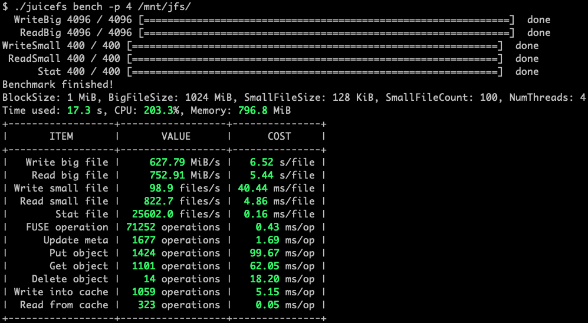
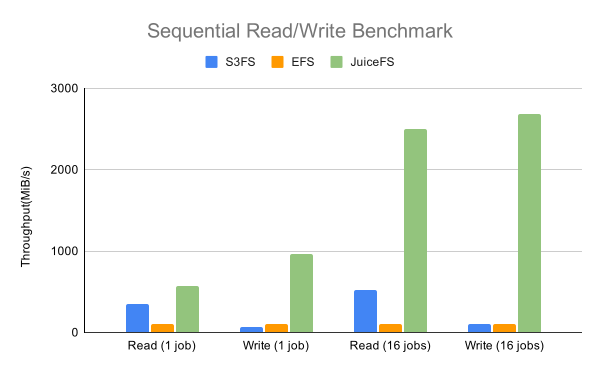

<p align="center"><a href="https://github.com/juicedata/juicefs"></a></p>
<p align="center">
    <a href="https://github.com/juicedata/juicefs/releases/latest"></a>
    <a href="https://github.com/juicedata/juicefs/actions/workflows/unittests.yml"></a>
    <a href="https://github.com/juicedata/juicefs/actions/workflows/integrationtests.yml"></a>
    <a href="https://goreportcard.com/report/github.com/juicedata/juicefs"></a>
    <a href="https://juicefs.com/docs/community/introduction"></a>
    <a href="https://go.juicefs.com/slack"></a>
</p>

**JuiceFS** is a high-performance [POSIX](https://en.wikipedia.org/wiki/POSIX) file system released under Apache License 2.0, particularly designed for the cloud-native environment. The data, stored via JuiceFS, will be persisted in Object Storage _(e.g. Amazon S3)_, and the corresponding metadata can be persisted in various compatible database engines such as Redis, MySQL, and TiKV based on the scenarios and requirements.

With JuiceFS, massive cloud storage can be directly connected to big data, machine learning, artificial intelligence, and various application platforms in production environments. Without modifying code, the massive cloud storage can be used as efficiently as local storage.

📖 **Document**: [Quick Start Guide](https://juicefs.com/docs/community/quick_start_guide)

## Highlighted Features

1. **Fully POSIX-compatible**: Use as a local file system, seamlessly docking with existing applications without breaking business workflow.
2. **Fully Hadoop-compatible**: JuiceFS' [Hadoop Java SDK](https://juicefs.com/docs/community/hadoop_java_sdk) is compatible with Hadoop 2.x and Hadoop 3.x as well as a variety of components in the Hadoop ecosystems.
3. **S3-compatible**:  JuiceFS' [S3 Gateway](https://juicefs.com/docs/community/s3_gateway) provides an S3-compatible interface.
4. **Cloud Native**: A [Kubernetes CSI Driver](https://juicefs.com/docs/community/how_to_use_on_kubernetes) is provided for easily using JuiceFS in Kubernetes.
5. **Shareable**: JuiceFS is a shared file storage that can be read and written by thousands of clients.
6. **Strong Consistency**: The confirmed modification will be immediately visible on all the servers mounted with the same file system.
7. **Outstanding Performance**: The latency can be as low as a few milliseconds, and the throughput can be expanded nearly unlimitedly _(depending on the size of the Object Storage)_. [Test results](https://juicefs.com/docs/community/benchmark)
8. **Data Encryption**: Supports data encryption in transit and at rest (please refer to [the guide](https://juicefs.com/docs/community/security/encrypt) for more information).
9. **Global File Locks**: JuiceFS supports both BSD locks (flock) and POSIX record locks (fcntl).
10. **Data Compression**: JuiceFS supports [LZ4](https://lz4.github.io/lz4) or [Zstandard](https://facebook.github.io/zstd) to compress all your data.

---

[Architecture](#architecture) | [Getting Started](#getting-started) | [Advanced Topics](#advanced-topics) | [POSIX Compatibility](#posix-compatibility) | [Performance Benchmark](#performance-benchmark) | [Supported Object Storage](#supported-object-storage) | [Who is using](#who-is-using) | [Roadmap](#roadmap) | [Reporting Issues](#reporting-issues) | [Contributing](#contributing) | [Community](#community) | [Usage Tracking](#usage-tracking) | [License](#license) | [Credits](#credits) | [FAQ](#faq)

---

## Architecture

JuiceFS consists of three parts:

1. **JuiceFS Client**: Coordinates Object Storage and metadata storage engine as well as implementation of file system interfaces such as POSIX, Hadoop, Kubernetes, and S3 gateway.
2. **Data Storage**: Stores data, with supports of a variety of data storage media, e.g., local disk, public or private cloud Object Storage, and HDFS.
3. **Metadata Engine**: Stores the corresponding metadata that contains information of file name, file size, permission group, creation and modification time and directory structure, etc., with supports of different metadata engines, e.g., Redis, MySQL, SQLite and TiKV.


JuiceFS can store the metadata of file system on different metadata engines, like Redis, which is a fast, open-source, in-memory key-value data storage, particularly suitable for storing metadata; meanwhile, all the data will be stored in Object Storage through JuiceFS client. [Learn more](https://juicefs.com/docs/community/architecture)


Each file stored in JuiceFS is split into **"Chunk"** s at a fixed size with the default upper limit of 64 MiB. Each Chunk is composed of one or more **"Slice"**(s), and the length of the slice varies depending on how the file is written. Each slice is composed of size-fixed **"Block"** s, which are 4 MiB by default. These blocks will be stored in Object Storage in the end; at the same time, the metadata information of the file and its Chunks, Slices, and Blocks will be stored in metadata engines via JuiceFS. [Learn more](https://juicefs.com/docs/community/architecture/#how-juicefs-store-files)


When using JuiceFS, files will eventually be split into Chunks, Slices and Blocks and stored in Object Storage. Therefore, the source files stored in JuiceFS cannot be found in the file browser of the Object Storage platform; instead, there are only a chunks directory and a bunch of digitally numbered directories and files in the bucket. Don't panic! This is just the secret of the high-performance operation of JuiceFS!

## Getting Started

Before you begin, make sure you have:

1. One supported metadata engine, see [How to Set Up Metadata Engine](https://juicefs.com/docs/community/databases_for_metadata)
2. One supported Object Storage for storing data blocks, see [Supported Object Storage](https://juicefs.com/docs/community/how_to_setup_object_storage)
3. [JuiceFS Client](https://juicefs.com/docs/community/installation) downloaded and installed

Please refer to [Quick Start Guide](https://juicefs.com/docs/community/quick_start_guide) to start using JuiceFS right away!

### Command Reference

Check out all the command line options in [command reference](https://juicefs.com/docs/community/command_reference).

### Containers

JuiceFS can be used as a persistent volume for Docker and Podman, please check [here](https://juicefs.com/docs/community/juicefs_on_docker) for details.

### Kubernetes

It is also very easy to use JuiceFS on Kubernetes. Please find more information [here](https://juicefs.com/docs/community/how_to_use_on_kubernetes).

### Hadoop Java SDK

If you wanna use JuiceFS in Hadoop, check [Hadoop Java SDK](https://juicefs.com/docs/community/hadoop_java_sdk).

## Advanced Topics

- [Redis Best Practices](https://juicefs.com/docs/community/redis_best_practices)
- [How to Setup Object Storage](https://juicefs.com/docs/community/how_to_setup_object_storage)
- [Cache](https://juicefs.com/docs/community/cache)
- [Fault Diagnosis and Analysis](https://juicefs.com/docs/community/fault_diagnosis_and_analysis)
- [FUSE Mount Options](https://juicefs.com/docs/community/fuse_mount_options)
- [Using JuiceFS on Windows](https://juicefs.com/docs/community/installation#windows)
- [S3 Gateway](https://juicefs.com/docs/community/s3_gateway)

Please refer to [JuiceFS Document Center](https://juicefs.com/docs/community/introduction) for more information.

## POSIX Compatibility

JuiceFS has passed all of the compatibility tests (8813 in total) in the latest [pjdfstest](https://github.com/pjd/pjdfstest) .

```
All tests successful.

Test Summary Report
-------------------
/root/soft/pjdfstest/tests/chown/00.t          (Wstat: 0 Tests: 1323 Failed: 0)
  TODO passed:   693, 697, 708-709, 714-715, 729, 733
Files=235, Tests=8813, 233 wallclock secs ( 2.77 usr  0.38 sys +  2.57 cusr  3.93 csys =  9.65 CPU)
Result: PASS
```

Aside from the POSIX features covered by pjdfstest, JuiceFS also provides:

- **Close-to-open consistency**. Once a file is written _and_ closed, it is guaranteed to view the written data in the following opens and reads from any client. Within the same mount point, all the written data can be read immediately.
- Rename and all other metadata operations are atomic, which are guaranteed by supported metadata engine transaction.
- Opened files remain accessible after unlink from same mount point.
- Mmap (tested with FSx).
- Fallocate with punch hole support.
- Extended attributes (xattr).
- BSD locks (flock).
- POSIX record locks (fcntl).

## Performance Benchmark

### Basic benchmark

JuiceFS provides a subcommand that can run a few basic benchmarks to help you understand how it works in your environment:



### Throughput

A sequential read/write benchmark has also been performed on JuiceFS, [EFS](https://aws.amazon.com/efs) and [S3FS](https://github.com/s3fs-fuse/s3fs-fuse) by [fio](https://github.com/axboe/fio).



Above result figure shows that JuiceFS can provide 10X more throughput than the other two (see [more details](https://juicefs.com/docs/community/fio)).

### Metadata IOPS

A simple mdtest benchmark has been performed on JuiceFS, [EFS](https://aws.amazon.com/efs) and [S3FS](https://github.com/s3fs-fuse/s3fs-fuse) by [mdtest](https://github.com/hpc/ior).


The result shows that JuiceFS can provide significantly more metadata IOPS than the other two (see [more details](https://juicefs.com/docs/community/mdtest)).

### Analyze performance

See [Real-Time Performance Monitoring](https://juicefs.com/docs/community/fault_diagnosis_and_analysis#performance-monitor) if you encountered performance issues.

## Supported Object Storage

- Amazon S3 _(and other S3 compatible Object Storage services)_
- Google Cloud Storage
- Azure Blob Storage
- Alibaba Cloud Object Storage Service (OSS)
- Tencent Cloud Object Storage (COS)
- Qiniu Cloud Object Storage (Kodo)
- QingStor Object Storage
- Ceph RGW
- MinIO
- Local disk
- Redis
- ...

JuiceFS supports numerous Object Storage services. [Learn more](https://juicefs.com/docs/community/how_to_setup_object_storage#supported-object-storage).

## Who is using

JuiceFS is production ready and used by thousands of machines in production. A list of users has been assembled and documented [here](https://juicefs.com/docs/community/adopters). In addition JuiceFS has several collaborative projects that integrate with other open source projects, which we have documented [here](https://juicefs.com/docs/community/integrations). If you are also using JuiceFS, please feel free to let us know, and you are welcome to share your specific experience with everyone.

The storage format is stable, and will be supported by all future releases.

## Roadmap

- User and group quotas
- Snapshots
- Write once read many (WORM)

## Reporting Issues

We use [GitHub Issues](https://github.com/juicedata/juicefs/issues) to track community reported issues. You can also [contact](#community) the community for any questions.

## Contributing

Thank you for your contribution! Please refer to the [JuiceFS Contributing Guide](https://juicefs.com/docs/community/development/contributing_guide) for more information.

## Community

Welcome to join the [Discussions](https://github.com/juicedata/juicefs/discussions) and the [Slack channel](https://go.juicefs.com/slack) to connect with JuiceFS team members and other users.

## Usage Tracking

JuiceFS collects **anonymous** usage data by default to help us better understand how the community is using JuiceFS. Only core metrics (e.g. version number) will be reported, and user data and any other sensitive data will not be included. The related code can be viewed [here](pkg/usage/usage.go).

You could also disable reporting easily by command line option `--no-usage-report`:

```bash
juicefs mount --no-usage-report
```

## License

JuiceFS is open-sourced under Apache License 2.0, see [LICENSE](LICENSE).

## Credits

The design of JuiceFS was inspired by [Google File System](https://research.google/pubs/pub51), [HDFS](https://hadoop.apache.org) and [MooseFS](https://moosefs.com). Thanks for their great work!

## FAQ

### Why doesn't JuiceFS support XXX Object Storage?

JuiceFS supports many Object Storage services. Please check out [this list](https://juicefs.com/docs/community/how_to_setup_object_storage#supported-object-storage) first. If the Object Storage you want to use is compatible with S3, you could treat it as S3. Otherwise, try reporting any issue.

### Can I use Redis Cluster as metadata engine?

Yes. Since [v1.0.0 Beta3](https://github.com/juicedata/juicefs/releases/tag/v1.0.0-beta3) JuiceFS supports the use of [Redis Cluster](https://redis.io/docs/manual/scaling) as the metadata engine, but it should be noted that Redis Cluster requires that the keys of all operations in a transaction must be in the same hash slot, so a JuiceFS file system can only use one hash slot.

See ["Redis Best Practices"](https://juicefs.com/docs/community/redis_best_practices) for more information.

### What's the difference between JuiceFS and XXX?

See ["Comparison with Others"](https://juicefs.com/docs/community/comparison/juicefs_vs_alluxio) for more information.

For more FAQs, please see the [full list](https://juicefs.com/docs/community/faq).

## Stargazers over time

[](https://star-history.com/#juicedata/juicefs&Date)
