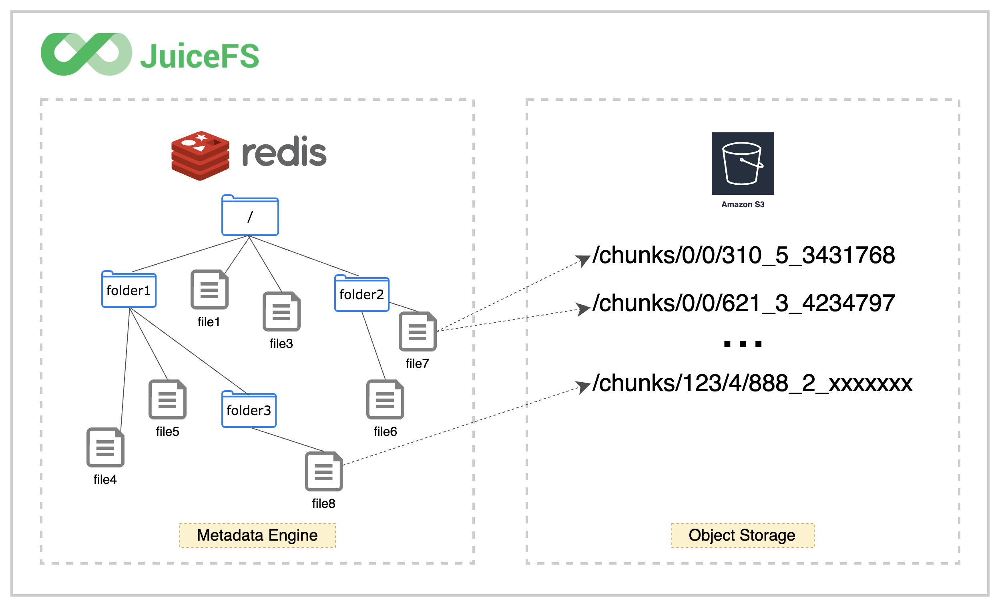

<p align="center"><a href="https://github.com/juicedata/juicefs"></a></p>
<p align="center">
    <a href="https://travis-ci.com/juicedata/juicefs"></a>
    <a href="https://join.slack.com/t/juicefs/shared_invite/zt-n9h5qdxh-0bJojPaql8cfFgwerDQJgA"></a>
    <a href="https://goreportcard.com/report/github.com/juicedata/juicefs"></a>
    <a href="README_CN.md"></a>
</p>

**JuiceFS** is a high-performance [POSIX](https://en.wikipedia.org/wiki/POSIX) file system released under GNU Affero General Public License v3.0. It is specially optimized for the cloud-native environment. Using the JuiceFS to store data, the data itself will be persisted in object storage (e.g. Amazon S3), and the metadata corresponding to the data can be persisted in various database engines such as Redis, MySQL, and SQLite according to the needs of the scene.

JuiceFS can simply and conveniently connect massive cloud storage directly to big data, machine learning, artificial intelligence, and various application platforms that have been put into production environment, without modifying the code, you can use massive cloud storage as efficiently as using local storage.

📺 **Video**: [What is JuiceFS?](https://www.youtube.com/watch?v=8RdZoBG-D6Y)

## Highlighted Features

1. **Fully POSIX-compatible**: Use like a local file system, seamlessly docking with existing applications, no business intrusion.
2. **Fully Hadoop-compatible**: JuiceFS [Hadoop Java SDK](docs/en/hadoop_java_sdk.md) is compatible with Hadoop 2.x and Hadoop 3.x. As well as variety of components in Hadoop ecosystem.
3. **S3-compatible**:  JuiceFS [S3 Gateway](docs/en/s3_gateway.md) provides S3-compatible interface.
4. **Cloud Native**: JuiceFS provides [Kubernetes CSI driver](docs/en/how_to_use_on_kubernetes.md) to help people who want to use JuiceFS in Kubernetes.
5. **Sharing**: JuiceFS is a shared file storage that can be read and written by thousands clients.
6. **Strong Consistency**: The confirmed modification will be immediately visible on all servers mounted with the same file system .
7. **Outstanding Performance**: The latency can be as low as a few milliseconds and the throughput can be expanded to nearly unlimited. [Test results](docs/en/benchmark.md)
8. **Data Encryption**: Supports data encryption in transit and at rest, read [the guide](docs/en/encrypt.md) for more information.
9. **Global File Locks**: JuiceFS supports both BSD locks (flock) and POSIX record locks (fcntl).
10. **Data Compression**: JuiceFS supports use [LZ4](https://lz4.github.io/lz4) or [Zstandard](https://facebook.github.io/zstd) to compress all your data.

---

[Architecture](#architecture) | [Getting Started](#getting-started) | [Advanced Topics](#advanced-topics) | [POSIX Compatibility](#posix-compatibility) | [Performance Benchmark](#performance-benchmark) | [Supported Object Storage](#supported-object-storage) | [Who is using](#who-is-using) | [Roadmap](#roadmap) | [Reporting Issues](#reporting-issues) | [Contributing](#contributing) | [Community](#community) | [Usage Tracking](#usage-tracking) | [License](#license) | [Credits](#credits) | [FAQ](#faq)

---

## Architecture

JuiceFS consists of three parts:

1. **JuiceFS Client**: Coordinate the implementation of object storage and metadata storage engines, as well as file system interfaces such as POSIX, Hadoop, Kubernetes, and S3 gateway.
2. **Data Storage**: Store the data itself, support local disk and object storage.
3. **Metadata Engine**: Metadata corresponding to the stored data, supporting multiple engines such as Redis, MySQL, and SQLite;


JuiceFS relies on Redis to store file system metadata. Redis is a fast, open-source, in-memory key-value data store and very suitable for storing the metadata. All the data will store into object storage through JuiceFS client. [Learn more](docs/en/architecture.md)


Any file stored in JuiceFS will be split into fixed-size **"Chunk"**, and the default upper limit is 64 MiB. Each Chunk is composed of one or more **"Slice"**. The length of the slice is not fixed, depending on the way the file is written. Each slice will be further split into fixed-size **"Block"**, which is 4 MiB by default. Finally, these blocks will be stored in the object storage. At the same time, JuiceFS will store each file and its Chunks, Slices, Blocks and other metadata information in metadata engines. [Learn more](docs/en/how_juicefs_store_files.md)



Using JuiceFS, files will eventually be split into Chunks, Slices and Blocks and stored in object storage. Therefore, you will find that the source files stored in JuiceFS cannot be found in the file browser of the object storage platform. There is a chunks directory and a bunch of digitally numbered directories and files in the bucket. Don't panic, this is the secret of the high-performance operation of the JuiceFS!

## Getting Started

To create a JuiceFS, you need the following 3 preparations:

1. Redis database for metadata storage
2. Object storage is used to store data blocks
3. JuiceFS Client

Please refer to [Quick Start Guide](docs/en/quick_start_guide.md) to start using JuiceFS immediately!

### Command Reference

There is a [command reference](docs/en/command_reference.md) to see all options of the subcommand.

### Kubernetes

[Using JuiceFS on Kubernetes](docs/en/how_to_use_on_kubernetes.md) is so easy, have a try.

### Hadoop Java SDK

If you wanna use JuiceFS in Hadoop, check [Hadoop Java SDK](docs/en/hadoop_java_sdk.md).

## Advanced Topics

- [Redis Best Practices](docs/en/redis_best_practices.md)
- [How to Setup Object Storage](docs/en/how_to_setup_object_storage.md)
- [Cache Management](docs/en/cache_management.md)
- [Fault Diagnosis and Analysis](docs/en/fault_diagnosis_and_analysis.md)
- [FUSE Mount Options](docs/en/fuse_mount_options.md)
- [Using JuiceFS on Windows](docs/en/juicefs_on_windows.md)
- [S3 Gateway](docs/en/s3_gateway.md)

Please refer to [JuiceFS User Manual](docs/en/README.md) for more information.

## POSIX Compatibility

JuiceFS passed all of the 8813 tests in latest [pjdfstest](https://github.com/pjd/pjdfstest).

```
All tests successful.

Test Summary Report
-------------------
/root/soft/pjdfstest/tests/chown/00.t          (Wstat: 0 Tests: 1323 Failed: 0)
  TODO passed:   693, 697, 708-709, 714-715, 729, 733
Files=235, Tests=8813, 233 wallclock secs ( 2.77 usr  0.38 sys +  2.57 cusr  3.93 csys =  9.65 CPU)
Result: PASS
```

Besides the things covered by pjdfstest, JuiceFS provides:

- Close-to-open consistency. Once a file is closed, the following open and read are guaranteed see the data written before close. Within same mount point, read can see all data written before it immediately.
- Rename and all other metadata operations are atomic guaranteed by Redis transaction.
- Open files remain accessible after unlink from same mount point.
- Mmap is supported (tested with FSx).
- Fallocate with punch hole support.
- Extended attributes (xattr).
- BSD locks (flock).
- POSIX record locks (fcntl).

## Performance Benchmark

### Basic benchmark

JuiceFS provides a subcommand to run a few basic benchmarks to understand how it works in your environment:


### Throughput

Performed a sequential read/write benchmark on JuiceFS, [EFS](https://aws.amazon.com/efs) and [S3FS](https://github.com/s3fs-fuse/s3fs-fuse) by [fio](https://github.com/axboe/fio), here is the result:


It shows JuiceFS can provide 10X more throughput than the other two, read [more details](docs/en/fio.md).

### Metadata IOPS

Performed a simple mdtest benchmark on JuiceFS, [EFS](https://aws.amazon.com/efs) and [S3FS](https://github.com/s3fs-fuse/s3fs-fuse) by [mdtest](https://github.com/hpc/ior), here is the result:


It shows JuiceFS can provide significantly more metadata IOPS than the other two, read [more details](docs/en/mdtest.md).

### Analyze performance

There is a virtual file called `.accesslog` in the root of JuiceFS to show all the operations and the time they takes, for example:

```bash
$ cat /jfs/.accesslog
2021.01.15 08:26:11.003330 [uid:0,gid:0,pid:4403] write (17669,8666,4993160): OK <0.000010>
2021.01.15 08:26:11.003473 [uid:0,gid:0,pid:4403] write (17675,198,997439): OK <0.000014>
2021.01.15 08:26:11.003616 [uid:0,gid:0,pid:4403] write (17666,390,951582): OK <0.000006>
```

The last number on each line is the time (in seconds) current operation takes. You can use this directly to debug and analyze performance issues, or try `./juicefs profile /jfs` to monitor real time statistics. Please run `./juicefs profile -h` or refer to [here](docs/en/operations_profiling.md) to learn more about this subcommand.

## Supported Object Storage

- Amazon S3
- Google Cloud Storage
- Azure Blob Storage
- Alibaba Cloud Object Storage Service (OSS)
- Tencent Cloud Object Storage (COS)
- QingStor Object Storage
- Ceph RGW
- MinIO
- Local disk
- Redis

JuiceFS supports almost all object storage services. [Learn more](docs/en/how_to_setup_object_storage.md#supported-object-storage).

## Who is using

It's considered as beta quality, the storage format is not stabilized yet. If you want to use it in a production environment, please do a careful and serious evaluation first. If you are interested in it, please test it as soon as possible and give us [feedback](https://github.com/juicedata/juicefs/discussions).

You are welcome to tell us after using JuiceFS and share your experience with everyone. We have also collected a summary list in [ADOPTERS.md](ADOPTERS.md), which also includes other open source projects used with JuiceFS.

## Roadmap

- Stabilize storage format
- Support FoundationDB as meta engine
- User and group quotas
- Directory quotas
- Snapshot
- Write once read many (WORM)
- Trash

## Reporting Issues

We use [GitHub Issues](https://github.com/juicedata/juicefs/issues) to track community reported issues. You can also [contact](#community) the community for getting answers.

## Contributing

Thank you for your contribution! Please refer to the [CONTRIBUTING.md](CONTRIBUTING.md) for more information.

## Community

Welcome to join the [Discussions](https://github.com/juicedata/juicefs/discussions) and the [Slack channel](https://join.slack.com/t/juicefs/shared_invite/zt-n9h5qdxh-0bJojPaql8cfFgwerDQJgA) to connect with JuiceFS team members and other users.

## Usage Tracking

JuiceFS by default collects **anonymous** usage data. It only collects core metrics (e.g. version number), no user or any sensitive data will be collected. You could review related code [here](pkg/usage/usage.go).

These data help us understand how the community is using this project. You could disable reporting easily by command line option `--no-usage-report`:

```bash
$ ./juicefs mount --no-usage-report
```

## License

JuiceFS is open-sourced under GNU AGPL v3.0, see [LICENSE](LICENSE).

## Credits

The design of JuiceFS was inspired by [Google File System](https://research.google/pubs/pub51), [HDFS](https://hadoop.apache.org) and [MooseFS](https://moosefs.com), thanks to their great work.

## FAQ

### Why doesn't JuiceFS support XXX object storage?

JuiceFS already supported many object storage, please check [the list](docs/en/how_to_setup_object_storage.md#supported-object-storage) first. If this object storage is compatible with S3, you could treat it as S3. Otherwise, try reporting issue.

### Can I use Redis cluster?

The simple answer is no. JuiceFS uses [transaction](https://redis.io/topics/transactions) to guarantee the atomicity of metadata operations, which is not well supported in cluster mode. Sentinal or other HA solution for Redis are needed.

See ["Redis Best Practices"](docs/en/redis_best_practices.md) for more information.

### What's the difference between JuiceFS and XXX?

See ["Comparison with Others"](docs/en/comparison_with_others.md) for more information.

For more FAQs, please see the [full list](docs/en/faq.md).
