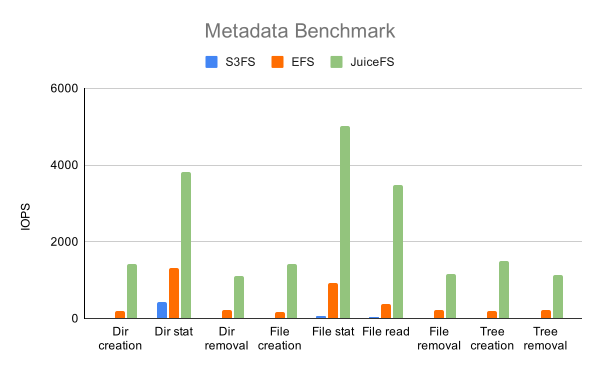

<p align="center"><a href="https://github.com/juicedata/juicefs"></a></p>
<p align="center">
    <a href="https://github.com/juicedata/juicefs/actions/workflows/unittests.yml"></a>
    <a href="https://github.com/juicedata/juicefs/actions/workflows/integrationtests.yml"></a>
    <a href="https://goreportcard.com/report/github.com/juicedata/juicefs"></a>
    <a href="https://juicefs.com/docs/zh/community/introduction"></a>
    <a href="https://go.juicefs.com/slack"></a>
</p>

JuiceFS 是一款高性能 [POSIX](https://en.wikipedia.org/wiki/POSIX) 文件系统，针对云原生环境特别优化设计，在 Apache 2.0 开源协议下发布。使用 JuiceFS 存储数据，数据本身会被持久化在对象存储（例如 Amazon S3），而数据所对应的元数据可以根据场景需求被持久化在 Redis、MySQL、TiKV 等多种数据库引擎中。

JuiceFS 可以简单便捷的将海量云存储直接接入已投入生产环境的大数据、机器学习、人工智能以及各种应用平台，无需修改代码即可像使用本地存储一样高效使用海量云端存储。

📺 **视频**：[什么是 JuiceFS?](https://www.bilibili.com/video/BV1HK4y197va)

📖 **文档**：[快速上手指南](https://juicefs.com/docs/zh/community/quick_start_guide)

## 核心特性

1. **POSIX 兼容**：像本地文件系统一样使用，无缝对接已有应用，无业务侵入性；
2. **HDFS 兼容**：完整兼容 [HDFS API](https://juicefs.com/docs/zh/community/hadoop_java_sdk)，提供更强的元数据性能；
3. **S3 兼容**：提供 [S3 网关](https://juicefs.com/docs/zh/community/s3_gateway) 实现 S3 协议兼容的访问接口；
4. **云原生**：通过 [Kubernetes CSI 驱动](https://juicefs.com/docs/zh/community/how_to_use_on_kubernetes) 可以很便捷地在 Kubernetes 中使用 JuiceFS；
5. **多端共享**：同一文件系统可在上千台服务器同时挂载，高性能并发读写，共享数据；
6. **强一致性**：确认的修改会在所有挂载了同一文件系统的服务器上立即可见，保证强一致性；
7. **强悍性能**：毫秒级的延迟，近乎无限的吞吐量（取决于对象存储规模），查看[性能测试结果](https://juicefs.com/docs/zh/community/benchmark)；
8. **数据安全**：支持传输中加密（encryption in transit）以及静态加密（encryption at rest），[查看详情](https://juicefs.com/docs/zh/community/security/encrypt)；
9. **文件锁**：支持 BSD 锁（flock）及 POSIX 锁（fcntl）；
10. **数据压缩**：支持使用 [LZ4](https://lz4.github.io/lz4) 或 [Zstandard](https://facebook.github.io/zstd) 压缩数据，节省存储空间。

---

[架构](#架构) | [开始使用](#开始使用) | [进阶主题](#进阶主题) | [POSIX 兼容性](#posix-兼容性测试) | [性能测试](#性能测试) | [支持的对象存储](#支持的对象存储) | [谁在使用](#谁在使用) | [产品路线图](#产品路线图) | [反馈问题](#反馈问题) | [贡献](#贡献) | [社区](#社区) | [使用量收集](#使用量收集) | [开源协议](#开源协议) | [致谢](#致谢) | [FAQ](#faq)

---

## 架构

JuiceFS 由三个部分组成：

1. **JuiceFS 客户端**：协调对象存储和元数据存储引擎，以及 POSIX、Hadoop、Kubernetes、S3 Gateway 等文件系统接口的实现；
2. **数据存储**：存储数据本身，支持本地磁盘、对象存储；
3. **元数据引擎**：存储数据对应的元数据，支持 Redis、MySQL、SQLite 等多种引擎；


JuiceFS 依靠 Redis 来存储文件的元数据。Redis 是基于内存的高性能的键值数据存储，非常适合存储元数据。与此同时，所有数据将通过 JuiceFS 客户端存储到对象存储中。[了解详情](https://juicefs.com/docs/zh/community/architecture)


任何存入 JuiceFS 的文件都会被拆分成固定大小的 **"Chunk"**，默认的容量上限是 64 MiB。每个 Chunk 由一个或多个 **"Slice"** 组成，Slice 的长度不固定，取决于文件写入的方式。每个 Slice 又会被进一步拆分成固定大小的 **"Block"**，默认为 4 MiB。最后，这些 Block 会被存储到对象存储。与此同时，JuiceFS 会将每个文件以及它的 Chunks、Slices、Blocks 等元数据信息存储在元数据引擎中。[了解详情](https://juicefs.com/docs/zh/community/architecture#%E5%A6%82%E4%BD%95%E5%AD%98%E5%82%A8%E6%96%87%E4%BB%B6)


使用 JuiceFS，文件最终会被拆分成 Chunks、Slices 和 Blocks 存储在对象存储。因此，你会发现在对象存储平台的文件浏览器中找不到存入 JuiceFS 的源文件，存储桶中只有一个 chunks 目录和一堆数字编号的目录和文件。不要惊慌，这正是 JuiceFS 高性能运作的秘诀！

## 开始使用

创建 JuiceFS，需要以下 3 个方面的准备：

1. 准备 Redis 数据库
2. 准备对象存储
3. 下载安装 [JuiceFS 客户端](https://juicefs.com/docs/zh/community/installation)

请参照 [快速上手指南](https://juicefs.com/docs/zh/community/quick_start_guide) 立即开始使用 JuiceFS！

### 命令索引

请点击 [这里](https://juicefs.com/docs/zh/community/command_reference) 查看所有子命令以及命令行参数。

### 容器

JuiceFS 可以为 Docker、Podman 等容器化技术提供持久化存储，请查阅 [文档](https://juicefs.com/docs/community/juicefs_on_docker) 了解详情。

### Kubernetes

在 Kubernetes 中使用 JuiceFS 非常便捷，请查看 [这个文档](https://juicefs.com/docs/zh/community/how_to_use_on_kubernetes) 了解更多信息。

### Hadoop Java SDK

JuiceFS 使用 [Hadoop Java SDK](https://juicefs.com/docs/zh/community/hadoop_java_sdk) 与 Hadoop 生态结合。

## 进阶主题

- [Redis 最佳实践](https://juicefs.com/docs/zh/community/redis_best_practices)
- [如何设置对象存储](https://juicefs.com/docs/zh/community/how_to_setup_object_storage)
- [缓存](https://juicefs.com/docs/zh/community/cache)
- [故障诊断和分析](https://juicefs.com/docs/zh/community/fault_diagnosis_and_analysis)
- [FUSE 挂载选项](https://juicefs.com/docs/zh/community/fuse_mount_options)
- [在 Windows 中使用 JuiceFS](https://juicefs.com/docs/zh/community/installation#windows-系统)
- [S3 网关](https://juicefs.com/docs/zh/community/s3_gateway)

请查阅 [JuiceFS 文档中心](https://juicefs.com/docs/zh/community/introduction) 了解更多信息。

## POSIX 兼容性测试

JuiceFS 通过了 [pjdfstest](https://github.com/pjd/pjdfstest) 最新版所有 8813 项兼容性测试。

```
All tests successful.

Test Summary Report
-------------------
/root/soft/pjdfstest/tests/chown/00.t          (Wstat: 0 Tests: 1323 Failed: 0)
  TODO passed:   693, 697, 708-709, 714-715, 729, 733
Files=235, Tests=8813, 233 wallclock secs ( 2.77 usr  0.38 sys +  2.57 cusr  3.93 csys =  9.65 CPU)
Result: PASS
```

除了 pjdfstest 覆盖的那些 POSIX 特性外，JuiceFS 还支持：

- 关闭再打开（close-to-open）一致性。一旦一个文件写入完成并关闭，之后的打开和读操作保证可以访问之前写入的数据。如果是在同一个挂载点，所有写入的数据都可以立即读。
- 重命名以及所有其他元数据操作都是原子的，由 Redis 的事务机制保证。
- 当文件被删除后，同一个挂载点上如果已经打开了，文件还可以继续访问。
- 支持 mmap
- 支持 fallocate 以及空洞
- 支持扩展属性
- 支持 BSD 锁（flock）
- 支持 POSIX 记录锁（fcntl）

## 性能测试

### 基础性能测试

JuiceFS 提供一个性能测试的子命令来帮助你了解它在你的环境中的性能表现：


### 顺序读写性能

使用 [fio](https://github.com/axboe/fio) 测试了 JuiceFS、[EFS](https://aws.amazon.com/efs) 和 [S3FS](https://github.com/s3fs-fuse/s3fs-fuse) 的顺序读写性能，结果如下：


上图显示 JuiceFS 可以比其他两者提供 10 倍以上的吞吐，详细结果请看[这里](https://juicefs.com/docs/zh/community/fio)。

### 元数据性能

使用 [mdtest](https://github.com/hpc/ior) 测试了 JuiceFS、[EFS](https://aws.amazon.com/efs) 和 [S3FS](https://github.com/s3fs-fuse/s3fs-fuse) 的元数据性能，结果如下：



上图显示 JuiceFS 的元数据性能显著优于其他两个，详细的测试报告请看[这里](https://juicefs.com/docs/zh/community/mdtest)。

### 性能分析

如遇性能问题，查看[「实时性能监控」](https://juicefs.com/docs/zh/community/fault_diagnosis_and_analysis#performance-monitor)。

## 支持的对象存储

- 亚马逊 S3
- 谷歌云存储
- 微软云存储
- 阿里云 OSS
- 腾讯云 COS
- 青云 QingStor 对象存储
- Ceph RGW
- MinIO
- 本地目录
- Redis
- ……

JuiceFS 支持几乎所有主流的对象存储服务，[查看详情](https://juicefs.com/docs/zh/community/how_to_setup_object_storage/#%E6%94%AF%E6%8C%81%E7%9A%84%E5%AD%98%E5%82%A8%E6%9C%8D%E5%8A%A1)。

## 谁在使用

JuiceFS 已经可以用于生产环境，目前有几千个节点在生产环境中使用它。我们收集汇总了一份使用者名单，记录在[这里](https://juicefs.com/docs/zh/community/adopters)。另外 JuiceFS 还有不少与其他开源项目进行集成的合作项目，我们将其记录在[这里](https://juicefs.com/docs/zh/community/integrations)。如果你也在使用 JuiceFS，请随时告知我们，也欢迎你向大家分享具体的使用经验。

JuiceFS 的存储格式已经稳定，会被后续发布的所有版本支持。

## 产品路线图

- 基于用户和组的配额
- 快照
- 一次写入多次读取（WORM）

## 反馈问题

我们使用 [GitHub Issues](https://github.com/juicedata/juicefs/issues) 来管理社区反馈的问题，你也可以通过其他[渠道](#社区)跟社区联系。

## 贡献

感谢你对 JuiceFS 社区的贡献！请参考 [JuiceFS 贡献指南](https://juicefs.com/docs/zh/community/development/contributing_guide) 了解更多信息。

## 社区

欢迎加入 [Discussions](https://github.com/juicedata/juicefs/discussions) 和 [Slack 频道](https://go.juicefs.com/slack) 跟我们的团队和其他社区成员交流。

## 使用量收集

JuiceFS 的客户端会收集 **匿名** 使用数据来帮助我们更好地了解大家如何使用它，它只上报诸如版本号等使用量数据，不包含任何用户信息，完整的代码在 [这里](pkg/usage/usage.go)。

你也可以通过下面的方式禁用它：

```bash
juicefs mount --no-usage-report
```

## 开源协议

使用 Apache License 2.0 开源，详见 [LICENSE](LICENSE)。

## 致谢

JuiceFS 的设计参考了 [Google File System](https://research.google/pubs/pub51)、[HDFS](https://hadoop.apache.org) 以及 [MooseFS](https://moosefs.com)，感谢他们的杰出工作。

## FAQ

### 为什么不支持某个对象存储？

已经支持了绝大部分对象存储，参考这个[列表](https://juicefs.com/docs/zh/community/how_to_setup_object_storage#支持的存储服务)。如果它跟 S3 兼容的话，也可以当成 S3 来使用。否则，请创建一个 issue 来增加支持。

### 是否可以使用 Redis 集群版作为元数据引擎？

可以。自 [v1.0.0 Beta3](https://github.com/juicedata/juicefs/releases/tag/v1.0.0-beta3) 版本开始 JuiceFS 支持使用 [Redis 集群版](https://redis.io/docs/manual/scaling)作为元数据引擎，不过需要注意的是 Redis 集群版要求一个事务中所有操作的 key 必须在同一个 hash slot 中，因此一个 JuiceFS 文件系统只能使用一个 hash slot。

请查看[「Redis 最佳实践」](https://juicefs.com/docs/zh/community/redis_best_practices)了解更多信息。

### JuiceFS 与 XXX 的区别是什么？

请查看[「同类技术对比」](https://juicefs.com/docs/zh/community/comparison/juicefs_vs_alluxio)文档了解更多信息。

更多 FAQ 请查看[完整列表](https://juicefs.com/docs/zh/community/faq)。

## 历史加星

[](https://starchart.cc/juicedata/juicefs)
