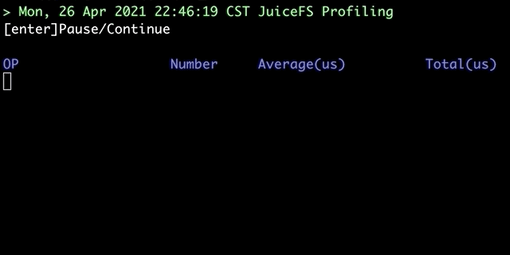
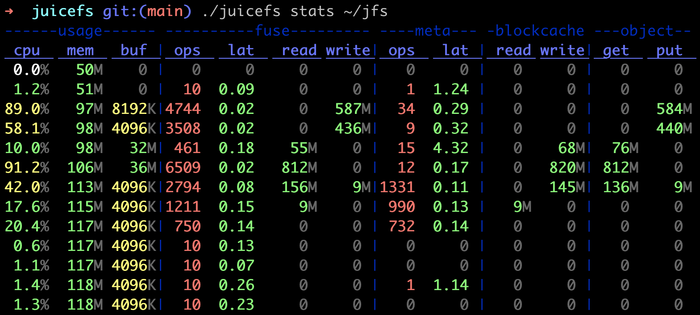
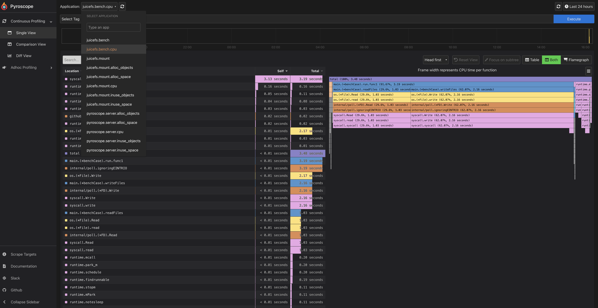

import Tabs from '@theme/Tabs';
import TabItem from '@theme/TabItem';

## Client log {#client-log}

JuiceFS client will output logs for troubleshooting while running. The level of logs in terms of fatality follows DEBUG < INFO < WARNING < ERROR < FATAL. Since DEBUG logs are not printed by default, you need to explicitly enable it if needed, e.g. by adding the `--debug` option when running the JuiceFS client.

Different JuiceFS clients print logs in different ways, which are described as follows.

### Mount point

When a JuiceFS file system is mounted with the [`-d` option](../reference/command_reference.mdx#mount) (indicating running in the background), it will print logs to the system log file and local log file simultaneously. Depending on which user is running when mounting the file system, the paths of the local log files are slightly different. For root, the local log file locates at `/var/log/juicefs.log`, while it locates at `$HOME/.juicefs/juicefs.log` for non-root users. Please refer to [`--log` option](../reference/command_reference.mdx#mount) for details.

Depending on the operating system, there are different commands to retrieve system logs or read local log files directly.

<Tabs>
  <TabItem value="local-log-file" label="Local log file">

```bash
tail -n 100 /var/log/juicefs.log
```

  </TabItem>
  <TabItem value="macos-syslog" label="macOS system log">

```bash
syslog | grep 'juicefs'
```

  </TabItem>
  <TabItem value="debian-syslog" label="Debian system log">

```bash
cat /var/log/syslog | grep 'juicefs'
```

  </TabItem>
  <TabItem value="centos-syslog" label="CentOS system log">

```bash
cat /var/log/messages | grep 'juicefs'
```

  </TabItem>
</Tabs>

You can use the `grep` command to filter different levels of logs for performance analysis or troubleshooting:

```shell
cat /var/log/syslog | grep 'juicefs' | grep '<ERROR>'
```

### Kubernetes CSI Driver

Depending on the version of the JuiceFS CSI Driver, there are different ways to retrieve logs. Please refer to [CSI Driver documentation](https://juicefs.com/docs/csi/troubleshooting) for details.

### S3 Gateway

The S3 gateway can only run in the foreground, so client logs are output directly to the terminal. If you deploys the S3 gateway in Kubernetes, you can get logs from the corresponding pods.

### Hadoop Java SDK

The JuiceFS client logs will be mixed into the logs of processes using JuiceFS Hadoop Java SDK, e.g. Spark executor. Thus, you need to use keywords, e.g. `juicefs` (case-insensitive), to filter out the logs you do not want.

## Access log {#access-log}

Each JuiceFS client has an access log that records all operations on the file system in detail, such as operation type, user ID, group ID, file inodes and time cost. Access logs can be used for various purposes such as performance analysis, auditing, and troubleshooting.

### Access log format

An example format of an access log is as follows:

```
2021.01.15 08:26:11.003330 [uid:0,gid:0,pid:4403] write (17669,8666,4993160): OK <0.000010>
```

The meaning of each column is:

- `2021.01.15 08:26:11.003330`: The time of the current operation
- `[uid:0,gid:0,pid:4403]`: User ID, group ID, process ID of the current operation
- `write`: Operation type
- `(17669,8666,4993160)`: The input parameters of the current operation type. For example, the input parameters of the `write` operation in the example are the inode of the written file, the size of the written data, and the offset of the written file. Different operation types have different parameters. For details, please refer to the [`vfs.go`](https://github.com/juicedata/juicefs/blob/main/pkg/vfs/vfs.go) file.
- `OK`: Indicate the current operation is successful or not. If it is unsuccessful, specific failure information will be output.
- `<0.000010>`: The time (in seconds) that the current operation takes.

Access logs tend to get very large and difficult for human to process directly, use [`juicefs profile`](#profile) to quickly visualize performance data based on these logs.

Different JuiceFS clients obtain access log in different ways, which are described below.

### Mount point

There is a virtual file named `.accesslog` in the root directory of the JuiceFS file system mount point, the contents of which can be viewed by the `cat` command (the command will not exit), for example (assuming the root directory of the mount point is `/jfs`):

```bash
cat /jfs/.accesslog
```

```output
2021.01.15 08:26:11.003330 [uid:0,gid:0,pid:4403] write (17669,8666,4993160): OK <0.000010>
2021.01.15 08:26:11.003473 [uid:0,gid:0,pid:4403] write (17675,198,997439): OK <0.000014>
2021.01.15 08:26:11.003616 [uid:0,gid:0,pid:4403] write (17666,390,951582): OK <0.000006>
```

### Kubernetes CSI Driver

Please refer to [CSI Driver documentation](https://juicefs.com/docs/csi/troubleshooting) to find the mount pod or CSI Driver pod depending on the version of JuiceFS CSI Driver you are using, and the `.accesslog` file can be viewed in the root directory of the JuiceFS file system mount point in the pod. The mount point path in the pod is `/jfs/<pv_volumeHandle>`. Assuming there is a mount pod named as `juicefs-1.2.3.4-pvc-d4b8fb4f-2c0b-48e8-a2dc-530799435373`, in which `pvc-d4b8fb4f-2c0b-48e8-a2dc-530799435373` is  `<pv_volumeHandle>`, you can then use the following command to view the `.accesslog` file:

```bash
kubectl -n kube-system exec juicefs-chaos-k8s-002-pvc-d4b8fb4f-2c0b-48e8-a2dc-530799435373 -- cat /jfs/pvc-d4b8fb4f-2c0b-48e8-a2dc-530799435373/.accesslog
```

### S3 Gateway

You need to add the [`--access-log` option](../reference/command_reference.mdx#gateway) when starting the S3 gateway to specify the path to output the access log. By default, the S3 gateway does not output the access log.

### Hadoop Java SDK

You need to add the `juicefs.access-log` configuration item in the [client configurations](../deployment/hadoop_java_sdk.md#other-configurations) of the JuiceFS Hadoop Java SDK to specify the path of the access log output, and the access log is not output by default.

## Collect Various Information Using the `debug` Subcommand {#debug}

The `juicefs debug` subcommand can help you automatically collect various information about a specified mount point, facilitating troubleshooting and diagnosis.

```shell
juicefs debug <mountpoint>
```

This command collects the following information:

1. JuiceFS version
2. Operating system version and kernel version
3. Contents of the JuiceFS `.config` internal file
4. Contents of the `.stat` internal file in JuiceFS and recorded again after 5 seconds
5. Command-line parameters used for mounting
6. Go pprof information
7. JuiceFS logs (defaulting to the last 5000 lines)

By default, a `debug` directory is created in the current directory, and the collected information is saved in that directory. Here's an example:

```shell
$ juicefs debug /tmp/mountpoint

$ tree ./debug
./debug
├── tmp-test1-20230609104324
│   ├── config.txt
│   ├── juicefs.log
│   ├── pprof
│   │   ├── juicefs.allocs.pb.gz
│   │   ├── juicefs.block.pb.gz
│   │   ├── juicefs.cmdline.txt
│   │   ├── juicefs.goroutine.pb.gz
│   │   ├── juicefs.goroutine.stack.txt
│   │   ├── juicefs.heap.pb.gz
│   │   ├── juicefs.mutex.pb.gz
│   │   ├── juicefs.profile.30s.pb.gz
│   │   ├── juicefs.threadcreate.pb.gz
│   │   └── juicefs.trace.5s.pb.gz
│   ├── stats.5s.txt
│   ├── stats.txt
│   └── system-info.log
└── tmp-test1-20230609104324.zip
```

## Real-time performance monitoring {#performance-monitor}

JuiceFS provides the `profile` and `stats` subcommands to visualize real-time performance data, the `profile` command is based on the [file system access log](#access-log), while the `stats` command uses [Real-time statistics](../administration/monitoring.md).

### `juicefs profile` {#profile}

[`juicefs profile`](../reference/command_reference.mdx#profile) will collect data from [file system access log](#access-log), run the `juicefs profile MOUNTPOINT` command, you can see the real-time statistics of each file system operation based on the latest access log:



Apart from real-time mode, this command also provides a play-back mode, which performs the same visualization on existing access log files:

```shell
# Collect access logs in advance
cat /jfs/.accesslog > /tmp/juicefs.accesslog

# After performance issue is reproduced, re-play this log file to find system bottleneck
juicefs profile -f /tmp/juicefs.accesslog
```

If the replay speed is too fast, pause anytime using <kbd>Enter/Return</kbd>, and continue by pressing it again. If too slow, use `--interval 0` and it will replay the whole log file as fast as possible, and directly show the final result.

If you're only interested in a certain user or process, you can set filters:

```bash
juicefs profile /tmp/juicefs.accesslog --uid 12345
```

### `juicefs stats` {#stats}

The [`juicefs stats`](../reference/command_reference.mdx#stats) command reads JuiceFS Client internal metrics data, and output performance data in a format similar to `dstat`:



Metrics description:

#### `usage`

- `cpu`: CPU usage of the process.
- `mem`: Physical memory used by the process.
- `buf`: Current [buffer size](../guide/cache.md#buffer-size), if this value is constantly close to (or even exceeds) the configured [`--buffer-size`](../reference/command_reference.mdx#mount-data-cache-options), you should increase buffer size or decrease application workload.
- `cache`: Internal metric, ignore this.

#### `fuse`

- `ops`/`lat`: Operations processed by FUSE per second, and their average latency (in milliseconds).
- `read`/`write`: Read/write bandwidth usage of FUSE.

#### `meta`

- `ops`/`lat`: Metadata operations processed per second, and their average latency (in milliseconds). Please note that, operations returned directly from cache are not counted in, in order to show a more accurate latency of clients actually interacting with metadata engine.
- `txn`/`lat`: Write transactions per second processed by the metadata engine and their average latency (in milliseconds). Read-only requests such as `getattr` are only counted as `ops` but not `txn`.
- `retry`: Write transactions per second that the metadata engine retries.

#### `blockcache`

The `blockcache` stands for local cache data, if read requests are already handled by kernel page cache, they won't be counted into the `blockcache` read metric. If there's consistent `blockcache` read traffic while you are conducting repeated read on a fixed file, this means read requests never enter page cache, and you should probably troubleshoot in this direction (e.g. not enough memory).

- `read`/`write`: Read/write bandwidth of client local data cache

#### `object`

The `object` stands for object storage related metrics, when cache is enabled, penetration to object storage will significantly hinder read performance, use these metrics to check if data has been fully cached. On the other hand, you can also compare `object.get` and `fuse.read` traffic to get a rough idea of the current [read amplification](./troubleshooting.md#read-amplification) status.

- `get`/`get_c`/`lat`: Bandwidth, requests per second, and their average latency (in milliseconds) for object storage processing read requests.
- `put`/`put_c`/`lat`: Bandwidth, requests per second, and their average latency (in milliseconds) for object storage processing write requests.
- `del_c`/`lat`: Delete requests per second the object storage can process, and the average latency (in milliseconds).

## Get runtime information using pprof {#runtime-information}

By default, JuiceFS clients will listen to a TCP port locally via [pprof](https://pkg.go.dev/net/http/pprof) to get runtime information such as Goroutine stack information, CPU performance statistics, memory allocation statistics. You can view the specific port number that the current JuiceFS client is listening to through the `.config` file under the mount point:

```bash
# Assume the mount point is /jfs
$ cat /jfs/.config | grep 'DebugAgent'
  "DebugAgent": "127.0.0.1:6064",
```

The default port number range that pprof listens to starts from 6060 and ends at 6099. From the above example, you can see that the actual port number is 6064. Once you get the listening port number, you can view all the available runtime information by accessing `http://localhost:<port>/debug/pprof`, and some important runtime information will be shown as follows:

- Goroutine stack information: `http://localhost:<port>/debug/pprof/goroutine?debug=1`
- CPU performance statistics: `http://localhost:<port>/debug/pprof/profile?seconds=30`
- Memory allocation statistics: `http://localhost:<port>/debug/pprof/heap`

To make it easier to analyze this runtime information, you can save it locally, e.g.:

```bash
curl 'http://localhost:<port>/debug/pprof/goroutine?debug=1' > juicefs.goroutine.txt
```

```bash
curl 'http://localhost:<port>/debug/pprof/profile?seconds=30' > juicefs.cpu.pb.gz
```

```bash
curl 'http://localhost:<port>/debug/pprof/heap' > juicefs.heap.pb.gz
```

:::tip
You can also use the `juicefs debug` command to automatically collect these runtime information and save it locally. By default, it is saved to the `debug` directory under the current directory, for example:

```bash
juicefs debug /mnt/jfs
```

For more information about the `juicefs debug` command, see [command reference](../reference/command_reference.mdx#debug).
:::

If you have the `go` command installed, you can analyze it directly with the `go tool pprof` command. For example to analyze CPU performance statistics:

```bash
$ go tool pprof 'http://localhost:<port>/debug/pprof/profile?seconds=30'
Fetching profile over HTTP from http://localhost:<port>/debug/pprof/profile?seconds=30
Saved profile in /Users/xxx/pprof/pprof.samples.cpu.001.pb.gz
Type: cpu
Time: Dec 17, 2021 at 1:41pm (CST)
Duration: 30.12s, Total samples = 32.06s (106.42%)
Entering interactive mode (type "help" for commands, "o" for options)
(pprof) top
Showing nodes accounting for 30.57s, 95.35% of 32.06s total
Dropped 285 nodes (cum <= 0.16s)
Showing top 10 nodes out of 192
      flat  flat%   sum%        cum   cum%
    14.73s 45.95% 45.95%     14.74s 45.98%  runtime.cgocall
     7.39s 23.05% 69.00%      7.41s 23.11%  syscall.syscall
     2.92s  9.11% 78.10%      2.92s  9.11%  runtime.pthread_cond_wait
     2.35s  7.33% 85.43%      2.35s  7.33%  runtime.pthread_cond_signal
     1.13s  3.52% 88.96%      1.14s  3.56%  runtime.nanotime1
     0.77s  2.40% 91.36%      0.77s  2.40%  syscall.Syscall
     0.49s  1.53% 92.89%      0.49s  1.53%  runtime.memmove
     0.31s  0.97% 93.86%      0.31s  0.97%  runtime.kevent
     0.27s  0.84% 94.70%      0.27s  0.84%  runtime.usleep
     0.21s  0.66% 95.35%      0.21s  0.66%  runtime.madvise
```

Runtime information can also be exported to visual charts for a more intuitive analysis. The visual charts can be exported to various formats such as HTML, PDF, SVG, PNG, etc. For example, the command to export memory allocation statistics as a PDF file is as follows:

:::note
The export to visual chart function relies on [Graphviz](https://graphviz.org), so please install it first.
:::

```bash
go tool pprof -pdf 'http://localhost:<port>/debug/pprof/heap' > juicefs.heap.pdf
```

For more information about pprof, please see the [official documentation](https://github.com/google/pprof/blob/main/doc/README.md).

### Profiling with the Pyroscope {#use-pyroscope}



[Pyroscope](https://github.com/pyroscope-io/pyroscope) is an open source continuous profiling platform. It will help you:

+ Find performance issues and bottlenecks in your code
+ Resolve issues of high CPU utilization
+ Understand the call tree of your application
+ Track changes over time

JuiceFS supports using the `--pyroscope` option to pass in the pyroscope server address, and metrics are pushed to the server every 10 seconds. If permission verification is enabled on the server, the verification information API Key can be passed in by the environment variable `PYROSCOPE_AUTH_TOKEN`:

```bash
export PYROSCOPE_AUTH_TOKEN=xxxxxxxxxxxxxxxx
juicefs mount --pyroscope http://localhost:4040 redis://localhost /mnt/jfs
juicefs dump --pyroscope http://localhost:4040 redis://localhost dump.json
```
