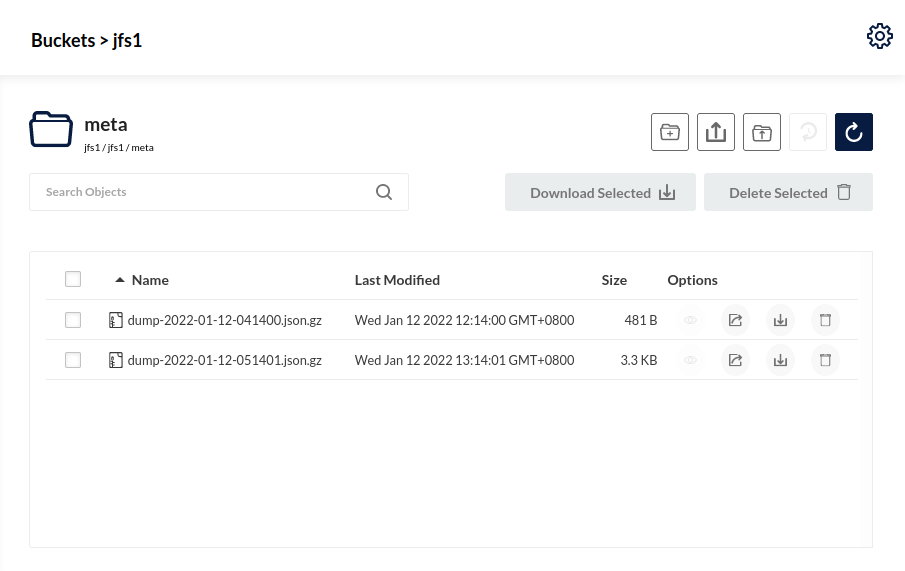

:::tip

- JuiceFS v1.0.0 starts to support automatic metadata backup.
- JuiceFS v1.0.4 starts to support importing an encrypted backup.
:::

JuiceFS supports [multiple metadata engines](../reference/how_to_set_up_metadata_engine.md), and each engine stores and manages data in a different format internally. JuiceFS provides the [`dump`](../reference/command_reference.mdx#dump) command to export metadata in a uniform JSON format, also there's the [`load`](../reference/command_reference.mdx#load) command to restore or migrate backups to any metadata storage engine. This dump / load process can also be used to migrate a community edition file system to enterprise edition (read [enterprise docs](https://juicefs.com/docs/cloud/administration/metadata_dump_load) for more), and vice versa.

## Metadata backup {#backup}

:::note

* `juicefs dump` does not provide snapshot consistency. If files are modified during the export, the final backup file will contain information from different points in time, which might prove unusable for some applications (like databases). If you have higher standards for consistency, you should suspend all writes to the system before exporting.
* For large scale file systems, dumping directly from online database may prove risks to system reliability, use with caution.
:::

### Manual backup {#backup-manually}

Using the `dump` command provided by JuiceFS client, you can export metadata to a JSON file, for example:

```shell
juicefs dump redis://192.168.1.6:6379 meta-dump.json
```

The JSON file exported by using the `dump` command provided by the JuiceFS client can have any filename and extension that you prefer, as shown in the example above. In particular, if the file extension is `.gz` (e.g. `meta-dump.json.gz`), the exported data will be compressed using the Gzip algorithm.

By default, the `dump` command starts from the root directory `/` and iterates recursively through all the files in the directory tree, and writes the metadata of each file to a JSON output. The object storage credentials will be omitted for data security, but it can be preserved using the `--keep-secret-key` option.

The value of `juicefs dump` is that it can export complete metadata information in a uniform JSON format for easy management and preservation, and it can be recognized and imported by different metadata storage engines.

In practice, the `dump` command should be used in conjunction with the backup tool that comes with the database to complement each other, such as [Redis RDB](https://redis.io/topics/persistence#backing-up-redis-data) and [`mysqldump`](https://dev.mysql.com/doc/mysql-backup-excerpt/5.7/en/mysqldump-sql-format.html), etc.

### Automatic backup {#backup-automatically}

Starting with JuiceFS v1.0.0, the client automatically backs up metadata and copies it to the object storage every hour, regardless of whether the file system is mounted via the `mount` command or accessed via the JuiceFS S3 gateway and Hadoop Java SDK.

The backup files are stored in the `meta` directory of the object storage. It is a separate directory from the data store and not visible in the mount point and does not interact with the data store, and the directory can be viewed and managed using the file browser of the object storage.



By default, the JuiceFS client backs up metadata once an hour. The frequency of automatic backups can be adjusted by the `--backup-meta` option when mounting the filesystem, for example, to set the auto-backup to be performed every 8 hours.

```shell
juicefs mount -d --backup-meta 8h redis://127.0.0.1:6379/1 /mnt
```

The backup frequency can be accurate to the second and it supports the following units.

- `h`: accurate to the hour, e.g. `1h`.
- `m`: accurate to the minute, e.g. `30m`, `1h30m`.
- `s`: accurate to the second, such as `50s`, `30m50s`, `1h30m50s`;

It is worth mentioning that the time cost of backup will increase with the number of files in the filesystem. Hence, when the number is too large (by default 1 million) with the automatic backup frequency 1 hour (by default), JuiceFS will automatically skip backup and print the corresponding warning log. At this point you may mount a new client with a bigger `--backup-meta` option value to re-enable automatic backups.

For reference, when using Redis as the metadata engine, backing up the metadata for one million files takes about 1 minute and consumes about 1GB of memory.

:::caution
   When using `--read-only` mount, metadata will not be automatically backed up.
:::

#### Automatic backup policy

Although automatic metadata backup becomes a default action for clients, backup conflicts do not occur when multiple hosts share the same file system mount.

JuiceFS maintains a global timestamp to ensure that only one client performs the backup operation at the same time. When different backup periods are set between clients, then it will back up based on the shortest period setting.

#### Backup cleanup policy

JuiceFS periodically cleans up backups according to the following rules.

- Keep all backups up to 2 days.
- For backups older than 2 days and less than 2 weeks, keep 1 backup for each day.
- For backups older than 2 weeks and less than 2 months, keep 1 backup for each week.
- For backups older than 2 months, keep 1 backup for each month.

## Metadata recovery and migration {#recovery-and-migration}

Use the [`load`](../reference/command_reference.mdx#load) command to restore the metadata dump file into an empty database, for example:

```shell
juicefs load redis://192.168.1.6:6379 meta-dump.json
```

Once imported, JuiceFS will recalculate the file system statistics including space usage, inode counters, and eventually generates a globally consistent metadata in the database. If you have a deep understanding of the metadata design of JuiceFS, you can also modify the metadata backup file before restoring to debug.

The dump file is written in an uniform format, which can be recognized and imported by all metadata engines, making it easy to migrate to other types of metadata engines.

For instance, to migrate from a Redis database to MySQL:

1. Exporting metadata backup from Redis:

   ```shell
   juicefs dump redis://192.168.1.6:6379 meta-dump.json
   ```

1. Restoring metadata to a new MySQL database:

   ```shell
   juicefs load mysql://user:password@(192.168.1.6:3306)/juicefs meta-dump.json
   ```

It is also possible to migrate directly through the system's pipe:

```shell
juicefs dump redis://192.168.1.6:6379 | juicefs load mysql://user:password@(192.168.1.6:3306)/juicefs
```

Note that since the API access key for object storage is excluded by default from the backup, when loading metadata, you need to use the [`juicefs config`](../reference/command_reference.mdx#config) command to reconfigure the object storage credentials. For example:

```shell
juicefs config --secret-key xxxxx mysql://user:password@(192.168.1.6:3306)/juicefs
```

### Encrypted file system {#encrypted-file-system}

For [encrypted file system](../security/encryption.md), all data is encrypted before uploading to the object storage, including automatic metadata backups. This is different from the `dump` command, which only output metadata in plain text.

For an encrypted file system, it is necessary to additionally set the `JFS_RSA_PASSPHRASE` environment variable and specify the RSA private key and encryption algorithm when restoring the automatically backed-up metadata:

```shell
export JFS_RSA_PASSPHRASE=xxxxxx
juicefs load \
  --encrypt-rsa-key my-private.pem \
  --encrypt-algo aes256gcm-rsa \
  redis://192.168.1.6:6379/1 \
  dump-2023-03-16-090750.json.gz
```

## Metadata inspection {#inspection}

In addition to completely exporting metadata, you can also export specific subdirectories. You can intuitively inspect the metadata in the directory tree.

```shell
juicefs dump redis://192.168.1.6:6379 meta-dump.json --subdir /path/in/juicefs
```

Using tools like `jq` to analyze the exported file is also an option.
