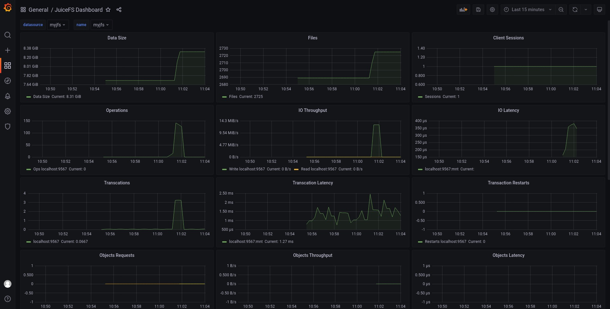

# Monitoring and Data Visualization

As a distributed file system hosting massive data storage, it is important for users to directly view the status changes of the entire system in terms of capacity, files, CPU load, disk IO, cache, etc. JuiceFS provides real-time status data externally through the Prometheus-oriented API to achieve the visualization of JuiceFS monitoring with ease, and you only need to expose it to your own Prometheus Server to visualize time series data with tools like Grafana.

## Get started

It is assumed here that Prometheus Server, Grafana and JuiceFS clients are all running on the same host, in which

- **Prometheus Server**: Scrapes and stores the time series data of various metrics. For installation, please refer to the [official documentation](https://prometheus.io/docs/introduction/first_steps/).
- **Grafana**: Loads and visualizes the time series data from Prometheus. For installation, please refer to the [official documentation](https://grafana.com/docs/grafana/latest/installation/).

### Ⅰ. Access to real-time data

JuiceFS outputs metrics data via a [Prometheus](https://prometheus.io)-oriented API. After the file system is mounted, the real-time monitoring data output from the client can be obtained from the default address `http://localhost:9567/metrics`.


### Ⅱ. Add API to Prometheus Server

Edit the [configuration file](https://prometheus.io/docs/prometheus/latest/configuration/configuration) of Prometheus, add a new job and point it to the API address of JuiceFS, e.g.

```yaml {20-22}
global:
  scrape_interval: 15s
  evaluation_interval: 15s

alerting:
  alertmanagers:
    - static_configs:
        - targets:
          # - alertmanager:9093

rule_files:
  # - "first_rules.yml"
  # - "second_rules.yml"

scrape_configs:
  - job_name: "prometheus"
    static_configs:
      - targets: ["localhost:9090"]

  - job_name: "juicefs"
    static_configs:
      - targets: ["localhost:9567"]
```

Assuming a configuration file named `prometheus.yml`, load this configuration to start the service:

```shell
./prometheus --config.file=prometheus.yml
```

Visit `http://localhost:9090` to see the Prometheus interface.

### Ⅲ. Visualize Prometheus data via Grafana

As shown in the figure below, a new Data Source is created.

- **Name**: For identification purposes, you can fill it in with the name of the file system.
- **URL**: Data interface for Prometheus, which defaults to `http://localhost:9090`


Then, create a dashboard using [`grafana_template.json`](https://github.com/juicedata/juicefs/blob/main/docs/en/grafana_template.json), and you will see a visual chart of the file system when visiting the dashboard.



## Collecting monitoring metrics

There are different ways to collect monitoring metrics depending on how JuiceFS is deployed, which are described below.

### Mount point

When the JuiceFS file system is mounted via the [`juicefs mount`](../reference/command_reference.md#juicefs-mount) command, you can collect monitoring metrics via the address `http://localhost:9567/metrics`, or you can customize it via the `--metrics` option. For example:

```shell
juicefs mount --metrics localhost:9567 ...
```

You can view these monitoring metrics using the command line tool:

```shell
curl http://localhost:9567/metrics
```

In addition, the root directory of each JuiceFS file system has a hidden file called `.stats`, through which you can also view monitoring metrics. For example (assuming here that the path to the mount point is `/jfs`):

```shell
cat /jfs/.stats
```

### Kubernetes

The [JuiceFS CSI Driver](../deployment/how_to_use_on_kubernetes.md) will provide monitoring metrics on the `9567` port of the mount pod by default, or you can customize it by adding the `metrics` option to the `mountOptions` (please refer to the [CSI Driver documentation](https://juicefs.com/docs/csi/examples/mount-options) for how to modify `mountOptions`), e.g.:

```yaml
apiVersion: v1
kind: PersistentVolume
metadata:
  name: juicefs-pv
  labels:
    juicefs-name: ten-pb-fs
spec:
  ...
  mountOptions:
    - metrics=0.0.0.0:9567
```

Add a crawl job to `prometheus.yml` to collect monitoring metrics:

```yaml
scrape_configs:
  - job_name: 'juicefs'
    kubernetes_sd_configs:
    - role: pod
    relabel_configs:
    - source_labels: [__meta_kubernetes_pod_label_app_kubernetes_io_name]
      action: keep
      regex: juicefs-mount
    - source_labels: [__address__]
      action: replace
      regex: ([^:]+)(:\d+)?
      replacement: $1:9567
      target_label: __address__
    - source_labels: [__meta_kubernetes_pod_node_name]
      target_label: node
      action: replace
```

Here, it is assumed that the Prometheus server is running inside Kubernetes cluster. If your Prometheus server is running outside Kubernetes cluster, make sure Kubernetes cluster nodes are reachable by Prometheus server. Please refer to [this issue](https://github.com/prometheus/prometheus/issues/4633) to add the `api_server` and `tls_config` client auth to the above configuration as follows:

```yaml
scrape_configs:
  - job_name: 'juicefs'
    kubernetes_sd_configs:
    - api_server: <Kubernetes API Server>
      role: pod
      tls_config:
        ca_file: <...>
        cert_file: <...>
        key_file: <...>
        insecure_skip_verify: false
    relabel_configs:
    ...
```

### S3 Gateway

:::note
This feature needs to run JuiceFS client version 0.17.1 and above.
:::

The [JuiceFS S3 Gateway](../deployment/s3_gateway.md) will provide monitoring metrics at the address `http://localhost:9567/metrics` by default, or you can customize it with the `-metrics` option. For example:

```shell
juicefs gateway --metrics localhost:9567 ...
```

If you are deploying JuiceFS S3 Gateway in Kubernetes, you can refer to the Prometheus configuration in the [Kubernetes](#kubernetes) section to collect monitoring metrics (the difference is mainly in the regular expression for the label `__meta_kubernetes_pod_label_app_kubernetes_io_name`), e.g.:

```yaml
scrape_configs:
  - job_name: 'juicefs-s3-gateway'
    kubernetes_sd_configs:
      - role: pod
    relabel_configs:
      - source_labels: [__meta_kubernetes_pod_label_app_kubernetes_io_name]
        action: keep
        regex: juicefs-s3-gateway
      - source_labels: [__address__]
        action: replace
        regex: ([^:]+)(:\d+)?
        replacement: $1:9567
        target_label: __address__
      - source_labels: [__meta_kubernetes_pod_node_name]
        target_label: node
        action: replace
```

#### Collected via Prometheus Operator

[Prometheus Operator](https://github.com/prometheus-operator/prometheus-operator) enables users to quickly deploy and manage Prometheus in Kubernetes. With the `ServiceMonitor` CRD provided by Prometheus Operator, scrape configuration can be automatically generated. For example (assuming that the `Service` of the JuiceFS S3 Gateway is deployed in the `kube-system` namespace):

```yaml
apiVersion: monitoring.coreos.com/v1
kind: ServiceMonitor
metadata:
  name: juicefs-s3-gateway
spec:
  namespaceSelector:
    matchNames:
      - kube-system
  selector:
    matchLabels:
      app.kubernetes.io/name: juicefs-s3-gateway
  endpoints:
    - port: metrics
```

For more information about Prometheus Operator, please check [official document](https://github.com/prometheus-operator/prometheus-operator/blob/main/Documentation/user-guides/getting-started.md).

### Hadoop

The [JuiceFS Hadoop Java SDK](../deployment/hadoop_java_sdk.md) supports reporting monitoring metrics to [Pushgateway](https://github.com/prometheus/pushgateway) and [Graphite](https://graphiteapp.org).

#### Pushgateway

Report metrics to Pushgateway:

```xml
<property>
  <name>juicefs.push-gateway</name>
  <value>host:port</value>
</property>
```

At the same time, the frequency of reporting metrics can be modified through the `juicefs.push-interval` configuration. The default is to report once every 10 seconds.

:::info
According to the suggestion of [Pushgateway official document](https://github.com/prometheus/pushgateway/blob/master/README.md#configure-the-pushgateway-as-a-target-to-scrape), it is required to set `honor_labels: true` in the Prometheus's [scrape configuration](https://prometheus.io/docs/prometheus/latest/configuration/configuration/#scrape_config).

It is important to note that the timestamp of the metrics scraped by Prometheus from Pushgateway is not the time when the JuiceFS Hadoop Java SDK reported it, but the time when it scraped. For details, please refer to [Pushgateway official document](https://github.com/prometheus/pushgateway/blob/master/README.md#about-timestamps).

By default, Pushgateway will only save metrics in memory. If you need to persist metrics to disk, you can specify the file path for saving by the `--persistence.file` option and the frequency of saving to the file with the `--persistence.interval` option (by default, the metrics will be saved every 5 minutes).
:::

:::note
Each process using JuiceFS Hadoop Java SDK will have a unique metric, and Pushgateway will always remember all the collected metrics. This may cause the continuous accumulation of metrics and taking up too much memory, and it will also make Prometheus scraping metrics slow. Therefore, it is recommended to clean up metrics on Pushgateway regularly.

For this, the following command can help. Clearing the metrics will not affect the running JuiceFS Hadoop Java SDK to continuously report data. **Note that the `--web.enable-admin-api` option must be specified when Pushgateway is started, and the following command will clear all monitoring metrics in Pushgateway.**

```bash
curl -X PUT http://host:9091/api/v1/admin/wipe
```
:::

For more information about Pushgateway, please check [official document](https://github.com/prometheus/pushgateway/blob/master/README.md).

#### Graphite

Report metrics to Graphite:

```xml
<property>
  <name>juicefs.push-graphite</name>
  <value>host:port</value>
</property>
```

At the same time, the frequency of reporting metrics can be modified through the `juicefs.push-interval` configuration. The default is to report every 10 seconds.

For all configurations supported by JuiceFS Hadoop Java SDK, please refer to [documentation](../deployment/hadoop_java_sdk.md#client-configurations).

### Use Consul as registration center

:::note
This feature needs to run JuiceFS client version 1.0.0 and above.
:::

JuiceFS support to use Consul as registration center for metrics API. The default Consul address is `127.0.0.1:8500`. You could customize the address through `--consul` option, e.g.:

```shell
juicefs mount --consul 1.2.3.4:8500 ...
```

When the Consul address is configured, the configuration of the `--metrics` option is not needed, and JuiceFS will automatically configure metrics URL according to its own network and port conditions. If `--metrics` is set at the same time, it will first try to listen on the configured metrics URL.

For each instance registered to Consul, its `serviceName` is `juicefs`, and the format of `serviceId` is `<IP>:<mount-point>`, for example: `127.0.0.1:/tmp/jfs`.

The meta of each instance contains two aspects: `hostname` and `mountpoint`. When `mountpoint` is `s3gateway`, it means that the instance is an S3 gateway.

## Visualize monitoring metrics

### Grafana dashboard template

JuiceFS provides some dashboard templates for Grafana, which can be imported to show the collected metrics in Prometheus. The dashboard templates currently available are:

| Name                                                                                                            | Description                                                                                             |
| ----                                                                                                            | -----------                                                                                             |
| [`grafana_template.json`](https://github.com/juicedata/juicefs/blob/main/docs/en/grafana_template.json)         | For show metrics collected from mount point, S3 gateway (non-Kubernetes deployment) and Hadoop Java SDK |
| [`grafana_template_k8s.json`](https://github.com/juicedata/juicefs/blob/main/docs/en/grafana_template_k8s.json) | For show metrics collected from Kubernetes CSI Driver and S3 gateway (Kubernetes deployment)            |

A sample Grafana dashboard looks like this:


## Monitoring metrics reference

Please refer to the ["JuiceFS Metrics"](../reference/p8s_metrics.md) document.
