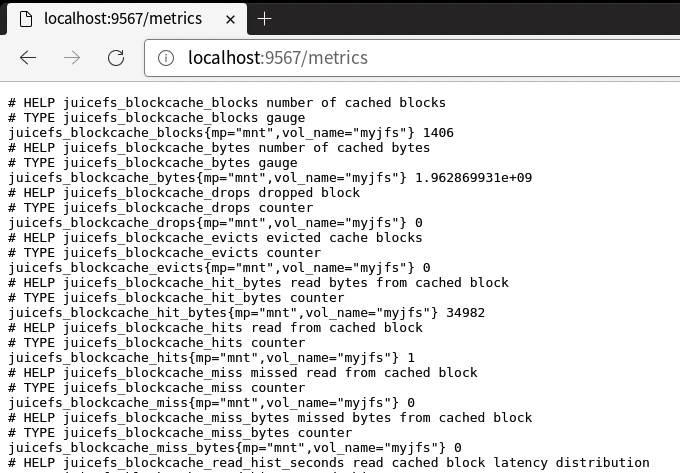
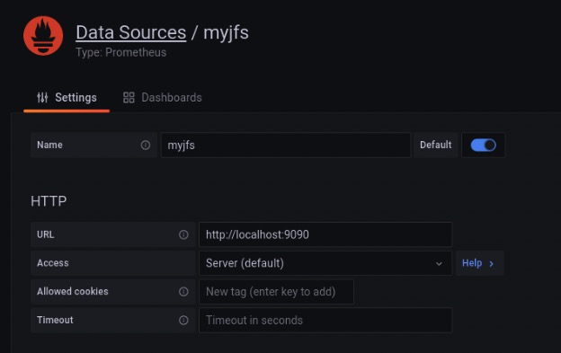

JuiceFS offers a suite of monitoring metrics, and this document outlines how to collect these metrics and visualize them with a monitoring system similar to the one depicted in the following image using Prometheus and Grafana.


The setup process is as follows:

1. Configure Prometheus to scrape JuiceFS monitoring metrics.
2. Configure Grafana to read the monitoring data from Prometheus.
3. Use the official JuiceFS Grafana dashboard template to display the monitoring metrics.

:::tip
This document uses open-source versions of Grafana and Prometheus for examples.
:::

## 1. Configuring Prometheus to Scrape JuiceFS Monitoring Metrics {#add-scrape-config}

After mounting JuiceFS, it will automatically expose Prometheus-formatted metrics at `http://localhost:9567/metrics`. To observe the state changes of various metrics over a time range, you'll need to set up Prometheus and configure it to periodically scrape and save these metrics.



The process for collecting metrics may vary slightly depending on the mount method or access type (such as FUSE mount, CSI Driver, S3 Gateway, Hadoop SDK, etc.). For detailed instructions, see [Collecting Monitoring metrics data](#collect-metrics).

For example, here's how you might configure Prometheus for a common FUSE mount: If you haven't already set up Prometheus, follow the [official documentation](https://prometheus.io/docs/prometheus/latest/installation).

Edit your `prometheus.yml` configuration file and add a new scrape configuration under `scrape_configs`. Define the JuiceFS client metrics address:

```yaml {20-22}
global:
  scrape_interval: 15s
  evaluation_interval: 15s

alerting:
  alertmanagers:
    - static_configs:
        - targets:
          # - alertmanager:9093

rule_files:
  # - "rules.yml"

scrape_configs:
  - job_name: "prometheus"
    static_configs:
      - targets: ["localhost:9090"]

  - job_name: "juicefs"
    static_configs:
      - targets: ["localhost:9567"]
```

Start the Prometheus service:

```shell
./prometheus --config.file=prometheus.yml
```

Visit `http://localhost:9090` to see the Prometheus interface.

## 2. Configuring Grafana to Read from Prometheus {#grafana}

Once Prometheus begins scraping JuiceFS metrics, the next step is to set up Grafana to read from Prometheus.

If you haven't yet installed Grafana, follow the [official documentation](https://grafana.com/docs/grafana/latest/installation).

In Grafana, create a new data source of type Prometheus:

- **Name**: A name that helps you identify the data source, such as the name of the file system.
- **URL**: The Prometheus data API endpoint, typically `http://localhost:9090`.



## 3. Using the Official JuiceFS Grafana Dashboard Template {#grafana-dashboard}

JuiceFS's official Grafana dashboard templates can be found in the Grafana Dashboard repository and can be imported directly into Grafana via the URL `https://grafana.com/grafana/dashboards/20794/` or by using the ID `20794`.

Here's what the official JuiceFS Grafana dashboard might look like:


## Collecting metrics data {#collect-metrics}

For different types of JuiceFS Client, metrics data is handled slightly differently.

### Mount point {#mount-point}

When the JuiceFS file system is mounted via the [`juicefs mount`](../reference/command_reference.mdx#mount) command, you can collect monitoring metrics via the address `http://localhost:9567/metrics`, or you can customize it via the `--metrics` option. For example:

```shell
juicefs mount --metrics localhost:9567 ...
```

You can view these monitoring metrics using the command line tool:

```shell
curl http://localhost:9567/metrics
```

In addition, the root directory of each JuiceFS file system has a hidden file called `.stats`, through which you can also view monitoring metrics. For example (assuming here that the path to the mount point is `/jfs`):

```shell
cat /jfs/.stats
```

:::tip
If you want to view the metrics in real-time, you can use the [`juicefs stats`](../administration/fault_diagnosis_and_analysis.md#stats) command.
:::

### Kubernetes {#kubernetes}

See [CSI Driver documentation](https://juicefs.com/docs/csi/administration/going-production#monitoring).

### S3 Gateway {#s3-gateway}

:::note
This feature needs to run JuiceFS client version 0.17.1 and above.
:::

The [JuiceFS S3 Gateway](../guide/gateway.md) will provide monitoring metrics at the address `http://localhost:9567/metrics` by default, or you can customize it with the `-metrics` option. For example:

```shell
juicefs gateway --metrics localhost:9567 ...
```

If you are deploying JuiceFS S3 Gateway [in Kubernetes](../guide/gateway.md#deploy-in-kubernetes), you can refer to the Prometheus configuration in the [Kubernetes](#kubernetes) section to collect monitoring metrics (the difference is mainly in the regular expression for the label `__meta_kubernetes_pod_label_app_kubernetes_io_name`), e.g.:

```yaml {6-8}
scrape_configs:
  - job_name: 'juicefs-s3-gateway'
    kubernetes_sd_configs:
      - role: pod
    relabel_configs:
      - source_labels: [__meta_kubernetes_pod_label_app_kubernetes_io_name]
        action: keep
        regex: juicefs-s3-gateway
      - source_labels: [__address__]
        action: replace
        regex: ([^:]+)(:\d+)?
        replacement: $1:9567
        target_label: __address__
      - source_labels: [__meta_kubernetes_pod_node_name]
        target_label: node
        action: replace
```

#### Collected via Prometheus Operator {#prometheus-operator}

[Prometheus Operator](https://github.com/prometheus-operator/prometheus-operator) enables users to quickly deploy and manage Prometheus in Kubernetes. With the `ServiceMonitor` CRD provided by Prometheus Operator, scrape configuration can be automatically generated. For example (assuming that the `Service` of the JuiceFS S3 Gateway is deployed in the `kube-system` namespace):

```yaml
apiVersion: monitoring.coreos.com/v1
kind: ServiceMonitor
metadata:
  name: juicefs-s3-gateway
spec:
  namespaceSelector:
    matchNames:
      - kube-system
  selector:
    matchLabels:
      app.kubernetes.io/name: juicefs-s3-gateway
  endpoints:
    - port: metrics
```

For more information on Prometheus Operator, please refer to the [official documentation](https://prometheus-operator.dev/docs/user-guides/getting-started).

### Hadoop Java SDK {#hadoop}

[JuiceFS Hadoop Java SDK](../deployment/hadoop_java_sdk.md) supports reporting monitoring metrics to [Pushgateway](https://github.com/prometheus/pushgateway) and [Graphite](https://graphiteapp.org).

#### Pushgateway

Report metrics to Pushgateway:

```xml
<property>
  <name>juicefs.push-gateway</name>
  <value>host:port</value>
</property>
```

At the same time, the frequency of reporting metrics can be modified through the `juicefs.push-interval` configuration. The default is to report once every 10 seconds.

:::info
According to the suggestion of [Pushgateway official document](https://github.com/prometheus/pushgateway/blob/master/README.md#configure-the-pushgateway-as-a-target-to-scrape), it is required to set `honor_labels: true` in the Prometheus's [scrape configuration](https://prometheus.io/docs/prometheus/latest/configuration/configuration/#scrape_config).

It is important to note that the timestamp of the metrics scraped by Prometheus from Pushgateway is not the time when the JuiceFS Hadoop Java SDK reported it, but the time when it scraped. For details, please refer to [Pushgateway official document](https://github.com/prometheus/pushgateway/blob/master/README.md#about-timestamps).

By default, Pushgateway will only save metrics in memory. If you need to persist metrics to disk, you can specify the file path for saving by the `--persistence.file` option and the frequency of saving to the file with the `--persistence.interval` option (by default, the metrics will be saved every 5 minutes).
:::

:::note
Each process using JuiceFS Hadoop Java SDK will have a unique metric, and Pushgateway will always remember all the collected metrics. This may cause the continuous accumulation of metrics and taking up too much memory, and it will also make Prometheus scraping metrics slow. Therefore, it is recommended to clean up metrics on Pushgateway regularly.

For this, the following command can help. Clearing the metrics will not affect the running JuiceFS Hadoop Java SDK to continuously report data. **Note that the `--web.enable-admin-api` option must be specified when Pushgateway is started, and the following command will clear all monitoring metrics in Pushgateway.**

```bash
curl -X PUT http://host:9091/api/v1/admin/wipe
```

:::

For more information about Pushgateway, please check [official document](https://github.com/prometheus/pushgateway/blob/master/README.md).

#### Graphite

Report metrics to Graphite:

```xml
<property>
  <name>juicefs.push-graphite</name>
  <value>host:port</value>
</property>
```

At the same time, the frequency of reporting metrics can be modified through the `juicefs.push-interval` configuration. The default is to report every 10 seconds.

For all configurations supported by JuiceFS Hadoop Java SDK, please refer to [documentation](../deployment/hadoop_java_sdk.md#client-configurations).

### Use Consul as registration center {#use-consul}

:::note
This feature needs to run JuiceFS client version 1.0.0 and above.
:::

JuiceFS support to use Consul as registration center for metrics API. The default Consul address is `127.0.0.1:8500`. You could customize the address through `--consul` option, e.g.:

```shell
juicefs mount --consul 1.2.3.4:8500 ...
```

When the Consul address is configured, the configuration of the `--metrics` option is not needed, and JuiceFS will automatically configure metrics URL according to its own network and port conditions. If `--metrics` is set at the same time, it will first try to listen on the configured metrics URL.

For each service registered to Consul, the [service name](https://developer.hashicorp.com/consul/docs/services/configuration/services-configuration-reference#name) is always `juicefs`, and the format of [service ID](https://developer.hashicorp.com/consul/docs/services/configuration/services-configuration-reference#id) is `<IP>:<mount-point>`, for example: `127.0.0.1:/tmp/jfs`.

The [`meta`](https://developer.hashicorp.com/consul/docs/services/configuration/services-configuration-reference#meta) of each service contains two keys `hostname` and `mountpoint`, the corresponding values ​​represent the host name and path of the mount point respectively. In particular, the `mountpoint` value for the S3 Gateway is always `s3gateway`.

After successfully registering with Consul, you need to add a new [`consul_sd_config`](https://prometheus.io/docs/prometheus/latest/configuration/configuration/#consul_sd_config) configuration to `prometheus.yml` and fill in the `services` with `juicefs`.

## Monitoring metrics reference {#metrics-reference}

Refer to [JuiceFS Metrics](../reference/p8s_metrics.md).
