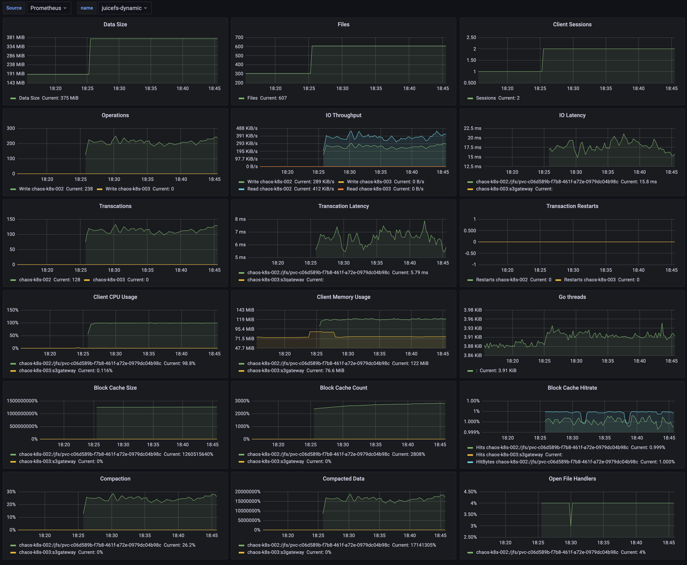

JuiceFS Client exposes performance data using metrics API, configure your Prometheus instance to scrape data, and then visualize using Grafana.

- **Prometheus Server**: Scrapes and stores the time series data of various metrics. Refer to its [official documentation](https://prometheus.io/docs/introduction/first_steps).
- **Grafana**: Loads and visualizes the time series data from Prometheus. Refer to its [official documentation](https://grafana.com/docs/grafana/latest/installation).

### Add scrape config

After JuiceFS is mounted on a host, you can access its metrics API using `http://localhost:9567/metrics`, other types of JuiceFS Client (S3 Gateway, Hadoop SDK) is slightly different in this regard, see [Collecting metrics data for other types of clients](#collect-metrics).


Edit [`prometheus.yml`](https://prometheus.io/docs/prometheus/latest/configuration/configuration) to add a new scrape config:

```yaml {20-22}
global:
  scrape_interval: 15s
  evaluation_interval: 15s

alerting:
  alertmanagers:
    - static_configs:
        - targets:
          # - alertmanager:9093

rule_files:
  # - "first_rules.yml"
  # - "second_rules.yml"

scrape_configs:
  - job_name: "prometheus"
    static_configs:
      - targets: ["localhost:9090"]

  - job_name: "juicefs"
    static_configs:
      - targets: ["localhost:9567"]
```

Start the service:

```shell
./prometheus --config.file=prometheus.yml
```

Visit `http://localhost:9090` to see the Prometheus interface.

### Grafana visualization {#grafana}

Create a new Data Source:

- **Name**: For identification purposes, you can fill it in with the name of the file system.
- **URL**: Data interface for Prometheus, which defaults to `http://localhost:9090`.


JuiceFS provides some dashboard templates for Grafana, which can be imported to show the collected metrics in Prometheus:

| Name                                                                                                            | Description                                                                                             |
| ----                                                                                                            | -----------                                                                                             |
| [`grafana_template.json`](https://github.com/juicedata/juicefs/blob/main/docs/en/grafana_template.json)         | For show metrics collected from mount point, S3 gateway (non-Kubernetes deployment) and Hadoop Java SDK |
| [`grafana_template_k8s.json`](https://github.com/juicedata/juicefs/blob/main/docs/en/grafana_template_k8s.json) | For show metrics collected from Kubernetes CSI Driver and S3 gateway (Kubernetes deployment)            |

Our Grafana dashboard looks like this:



## Collecting metrics data for other types of clients {#collect-metrics}

For different types of JuiceFS Client, metrics data is handled slightly differently.

### Mount point

When the JuiceFS file system is mounted via the [`juicefs mount`](../reference/command_reference.md#mount) command, you can collect monitoring metrics via the address `http://localhost:9567/metrics`, or you can customize it via the `--metrics` option. For example:

```shell
juicefs mount --metrics localhost:9567 ...
```

You can view these monitoring metrics using the command line tool:

```shell
curl http://localhost:9567/metrics
```

In addition, the root directory of each JuiceFS file system has a hidden file called `.stats`, through which you can also view monitoring metrics. For example (assuming here that the path to the mount point is `/jfs`):

```shell
cat /jfs/.stats
```

### Kubernetes

See [CSI Driver documentation](https://juicefs.com/docs/csi/administration/going-production#monitoring).

### S3 Gateway

:::note
This feature needs to run JuiceFS client version 0.17.1 and above.
:::

The [JuiceFS S3 Gateway](../deployment/s3_gateway.md) will provide monitoring metrics at the address `http://localhost:9567/metrics` by default, or you can customize it with the `-metrics` option. For example:

```shell
juicefs gateway --metrics localhost:9567 ...
```

If you are deploying JuiceFS S3 Gateway in Kubernetes, you can refer to the Prometheus configuration in the [Kubernetes](#kubernetes) section to collect monitoring metrics (the difference is mainly in the regular expression for the label `__meta_kubernetes_pod_label_app_kubernetes_io_name`), e.g.:

```yaml
scrape_configs:
  - job_name: 'juicefs-s3-gateway'
    kubernetes_sd_configs:
      - role: pod
    relabel_configs:
      - source_labels: [__meta_kubernetes_pod_label_app_kubernetes_io_name]
        action: keep
        regex: juicefs-s3-gateway
      - source_labels: [__address__]
        action: replace
        regex: ([^:]+)(:\d+)?
        replacement: $1:9567
        target_label: __address__
      - source_labels: [__meta_kubernetes_pod_node_name]
        target_label: node
        action: replace
```

### Hadoop

The [JuiceFS Hadoop Java SDK](../deployment/hadoop_java_sdk.md) supports reporting monitoring metrics to [Pushgateway](https://github.com/prometheus/pushgateway) and [Graphite](https://graphiteapp.org).

#### Pushgateway

Report metrics to Pushgateway:

```xml
<property>
  <name>juicefs.push-gateway</name>
  <value>host:port</value>
</property>
```

At the same time, the frequency of reporting metrics can be modified through the `juicefs.push-interval` configuration. The default is to report once every 10 seconds.

:::info
According to the suggestion of [Pushgateway official document](https://github.com/prometheus/pushgateway/blob/master/README.md#configure-the-pushgateway-as-a-target-to-scrape), it is required to set `honor_labels: true` in the Prometheus's [scrape configuration](https://prometheus.io/docs/prometheus/latest/configuration/configuration/#scrape_config).

It is important to note that the timestamp of the metrics scraped by Prometheus from Pushgateway is not the time when the JuiceFS Hadoop Java SDK reported it, but the time when it scraped. For details, please refer to [Pushgateway official document](https://github.com/prometheus/pushgateway/blob/master/README.md#about-timestamps).

By default, Pushgateway will only save metrics in memory. If you need to persist metrics to disk, you can specify the file path for saving by the `--persistence.file` option and the frequency of saving to the file with the `--persistence.interval` option (by default, the metrics will be saved every 5 minutes).
:::

:::note
Each process using JuiceFS Hadoop Java SDK will have a unique metric, and Pushgateway will always remember all the collected metrics. This may cause the continuous accumulation of metrics and taking up too much memory, and it will also make Prometheus scraping metrics slow. Therefore, it is recommended to clean up metrics on Pushgateway regularly.

For this, the following command can help. Clearing the metrics will not affect the running JuiceFS Hadoop Java SDK to continuously report data. **Note that the `--web.enable-admin-api` option must be specified when Pushgateway is started, and the following command will clear all monitoring metrics in Pushgateway.**

```bash
curl -X PUT http://host:9091/api/v1/admin/wipe
```

:::

For more information about Pushgateway, please check [official document](https://github.com/prometheus/pushgateway/blob/master/README.md).

#### Graphite

Report metrics to Graphite:

```xml
<property>
  <name>juicefs.push-graphite</name>
  <value>host:port</value>
</property>
```

At the same time, the frequency of reporting metrics can be modified through the `juicefs.push-interval` configuration. The default is to report every 10 seconds.

For all configurations supported by JuiceFS Hadoop Java SDK, please refer to [documentation](../deployment/hadoop_java_sdk.md#client-configurations).

### Use Consul as registration center

:::note
This feature needs to run JuiceFS client version 1.0.0 and above.
:::

JuiceFS support to use Consul as registration center for metrics API. The default Consul address is `127.0.0.1:8500`. You could customize the address through `--consul` option, e.g.:

```shell
juicefs mount --consul 1.2.3.4:8500 ...
```

When the Consul address is configured, the configuration of the `--metrics` option is not needed, and JuiceFS will automatically configure metrics URL according to its own network and port conditions. If `--metrics` is set at the same time, it will first try to listen on the configured metrics URL.

For each instance registered to Consul, its `serviceName` is `juicefs`, and the format of `serviceId` is `<IP>:<mount-point>`, for example: `127.0.0.1:/tmp/jfs`.

The meta of each instance contains two aspects: `hostname` and `mountpoint`. When `mountpoint` is `s3gateway`, it means that the instance is an S3 gateway.

## Monitoring metrics reference

Refer to [JuiceFS Metrics](../reference/p8s_metrics.md).
