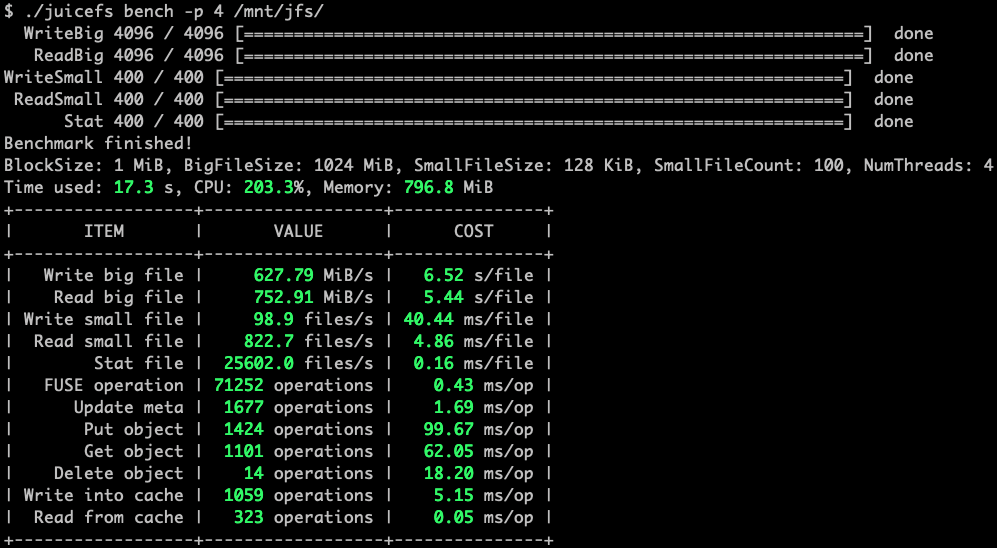

Redis is used as Metadata Engine in this benchmark. Under this test condition, JuiceFS performs 10x better than [Amazon EFS](https://aws.amazon.com/efs) and [S3FS](https://github.com/s3fs-fuse/s3fs-fuse).

## Basic benchmark

JuiceFS provides a subcommand `bench` to run a few basic benchmarks to evaluate how it works in your environment:

## Throughput

Performed sequential read/write benchmarks on JuiceFS, [EFS](https://aws.amazon.com/efs) and [S3FS](https://github.com/s3fs-fuse/s3fs-fuse) by [fio](https://github.com/axboe/fio). Here is the result:

It shows JuiceFS can provide 10X more throughput than the other two. Read [more details](fio.md).

## Metadata IOPS

Performed a simple [mdtest](https://github.com/hpc/ior) benchmark on JuiceFS, [EFS](https://aws.amazon.com/efs) and [S3FS](https://github.com/s3fs-fuse/s3fs-fuse) by [mdtest](https://github.com/hpc/ior). Here is the result:

It shows JuiceFS can provide significantly more metadata IOPS than the other two. Read [more details](mdtest.md).

## Analyze performance

See [Real-Time Performance Monitoring](../administration/fault_diagnosis_and_analysis.md#performance-monitor) if you encounter performance issues.
