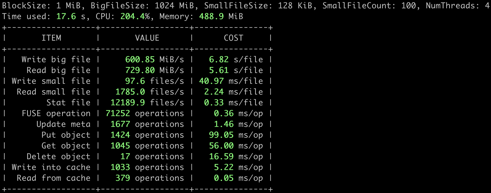
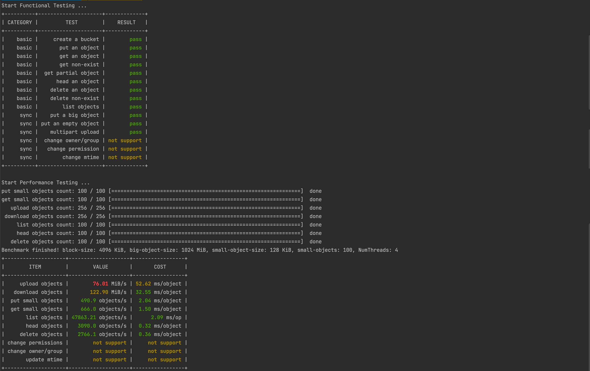
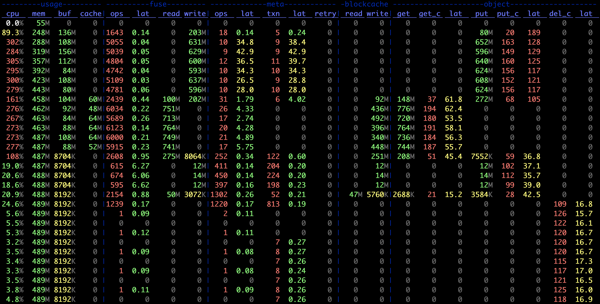
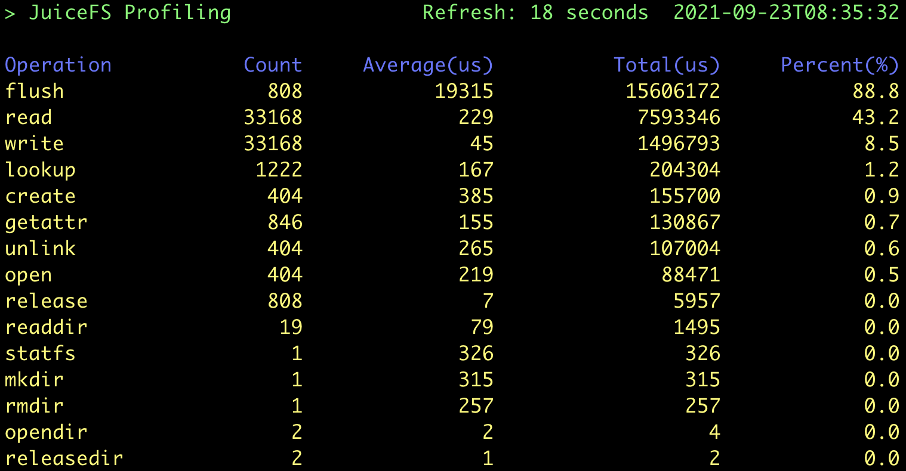

Before starting performance testing, it is a good idea to write down a general description of usage scenario, including:

1. What is the application for? For example, Apache Spark, PyTorch, or a program you developed yourself
2. The requisite resource for running the application, including CPU, memory, network, and node size
3. The estimated data size, including the number of files and their volume
4. The file size and access mode (large or small files, sequential or random reads and writes)
5. Performance requirements, such as the amount of data to be written or read per second, QPS, operation latency, etc.

The clearer and more detailed the above description is, the easier it will be to prepare a suitable test plan and find the performance indicators that need to be focused on. Clear plans and good performance indicators are helpful for evaluating the application requirements from various aspects of the storage system, including JuiceFS metadata configuration, network bandwidth requirements, configuration parameters, etc. It is surely not easy to have all details in mind at the beginning, and some of the content can be clarified gradually during the testing process. Still, **it is essential to make the usage scenario descriptions mentioned above and the corresponding test methods, test data, and test results complete at the end of a full test**.

Even if the above is not yet clear, it does not matter. JuiceFS built-in test tools can get the core indicators of benchmark performance of the standalone machine just by a one-line command. This article also introduces two more JuiceFS built-in performance analysis tools, which provide a simple and clear way for more complex tests.

## Performance Testing Quick Start

An example of the basic usage of the JuiceFS built-in `bench` tool is shown below.

### Working Environment

- Host: Amazon EC2 c5.xlarge one
- OS: Ubuntu 20.04.1 LTS (Kernel `5.4.0-1029-aws`)
- Metadata Engine: Redis 6.2.3, storage (dir) configured on system disk
- Object Storage: Amazon S3
- JuiceFS Version: 0.17-dev (2021-09-23 2ec2badf)

### Attention

JuiceFS v1.0+ has Trash enabled by default, which means the benchmark tools will create and delete temporary files in the file system. These files will eventually be dumped to the `.trash` folder which consumes storage space. To avoid this, you can disable the Trash before benchmarking by running `juicefs config META-URL --trash-days 0`. See [trash](../security/trash.md) for details.

### `juicefs bench`

The [`juicefs bench`](../reference/command_reference.mdx#bench) command can help you do a quick performance test on a standalone machine. With the test results, it is easy to evaluate if your environment configuration and JuiceFS performance are normal. Assuming you have mounted JuiceFS to `/mnt/jfs` on your server, execute the following command for this test (the `-p` option is recommended to set to the number of CPU cores on the server). If you need help with initializing or mounting JuiceFS, please refer to [Create a File System](../getting-started/standalone.md#juicefs-format).

```bash
juicefs bench /mnt/jfs -p 4
```

The test results are presented in a table format, where `ITEM` represents the tested item, `VALUE` represents the processing capacity per second (throughput, number of files, number of operations, etc.), and `COST` represents the time required for each file or operation.

The results will be displayed in green, yellow, or red to differentiate performance. If there are red indicators in your results, please check the relevant configurations first. Feel free to post any problems you encountered in detail on [GitHub Discussions](https://github.com/juicedata/juicefs/discussions).



The detailed `juicefs bench` performance test flows are shown below (The logic behind is very simple. Please take a look at the [source code](https://github.com/juicedata/juicefs/blob/main/cmd/bench.go) if you are interested).

1. N concurrent `write`, each to a large file of 1 GiB with IO size of 1 MiB
2. N concurrent `read`, each from the large file of 1 GiB previously written, with IO size of 1 MiB
3. N concurrent `write`, each to 100 small files of 128 KiB, with IO size of 128 KiB
4. N concurrent `read`, each from the 100 small files of 128 KiB previously written, with IO size of 128 KiB
5. N concurrent `stat`, each on the 100 small files of 128 KiB previously written
6. clean up the temporary directory for testing

The concurrency scale N could be provided through the `-p` option of the `bench` command.

Here's a performance comparison using a few common storage types provided by AWS.

- EFS with 1TiB capacity performs 150MiB/s of `read` and 50MiB/s of `write` at a cost of $0.08/GB-month.
- EBS st1 is a throughput-optimized HDD with a maximum throughput of 500MiB/s, a maximum IOPS (1MiB I/O) of 500, and a maximum capacity of 16TiB, priced at $0.045/GB-month.
- EBS gp2 is a universal SSD with a maximum throughput of 250MiB/s, maximum IOPS (16KiB I/O) of 16,000, and a maximum capacity of 16TiB, priced at $0.10/GB-month.

The above tests clearly show that JuiceFS performs much better than AWS EFS in terms of sequential read and write capabilities and than the commonly used EBS regarding throughput. However, the JuiceFS performance is not that outstanding when writing small files because each file written needs to be persisted to S3 and there is typically a fixed overhead of 10-30ms on calling the object storage API.

:::note
The performance of Amazon EFS is linearly related to capacity ([refer to the official documentation](https://docs.aws.amazon.com/efs/latest/ug/performance.html#performancemodes)), which makes it unsuitable for being used in high throughput scenarios with small data sizes.
:::

:::note
Prices refer to [AWS US East, Ohio Region](https://aws.amazon.com/ebs/pricing/?nc1=h_ls), differing slightly among regions.
:::

:::note
The data above is from [AWS official documentation](https://docs.aws.amazon.com/AWSEC2/latest/UserGuide/ebs-volume-types.html), and the performance metrics are their maximum values. The actual performance of EBS is related to its volume capacity and instance type of mounted EC2. In general, the larger the volume and the higher the specification of EC2, the better the EBS performance will be, but not exceeding the maximum value mentioned above.
:::

### `juicefs objbench`

The [`juicefs objbench`](../reference/command_reference.mdx#objbench) command can run some tests on object storage to evaluate how well it performs as a backend storage for JuiceFS. Take testing Amazon S3 as an example:

```bash
juicefs objbench \
    --storage s3 \
    --access-key myAccessKey \
    --secret-key mySecretKey \
    https://mybucket.s3.us-east-2.amazonaws.com
```

The test results are shown in the figure below:



Among them, the result `not support` indicates that the tested object storage does not support this feature.

#### Test flow

First perform object storage function test, the following are test cases:

1. Create bucket
2. Upload an object
3. Download an object
4. Download non-existent object
5. Get object part content
6. Get an object metadata
7. Delete an object
8. Delete non-existent object
9. List objects
10. Upload a large object
11. Upload a empty object
12. Multipart upload
13. Change the owner/group of a file (requires `root` permission)
14. Change permission
15. Change mtime (last modified time)

And then perform performance testing:

1. Upload `--small-objects` objects of `--small-object-size` size with `--threads` concurrency
2. Download the objects uploaded in step 1 and check the contents
3. Split the `--big-object-size` object of size according to the size of `--block-size` and upload it concurrently with `--threads`
4. Download the objects uploaded in step 3 and check the content, then clean up all objects uploaded to the object store in step 3
5. List all objects in the object store 100 times with `--threads` concurrency
6. Get meta information of all objects uploaded in step 1 with `--threads` concurrency
7. Change mtime (last modified time) of all objects uploaded in step 1 by `--threads` concurrency
8. Change permission of all objects uploaded in step 1 by `--threads` concurrency
9. Change owner/group of all objects uploaded in step 1 by `--threads` concurrency (requires `root` permission)
10. Remove all objects uploaded in step 1 with `--threads` concurrency

Finally clean up the test files.

## Performance Observation and Analysis Tools

The next two performance observation and analysis tools are essential tools for testing, using, and tuning JuiceFS.

### `juicefs stats`

The [`juicefs stats`](../administration/fault_diagnosis_and_analysis.md#stats) command is a tool for real-time statistics of JuiceFS performance metrics, similar to the `dstat` command on Linux systems. It can display changes of metrics for JuiceFS clients in real-time. For this, create a new session and execute the following command when the `juicefs bench` is running:

```bash
juicefs stats /mnt/jfs --verbosity 1
```

The results are shown below, which would be easier to understand when combing with the `bench` performance test flows described above.



Learn the meaning of indicators in [`juicefs stats`](../administration/fault_diagnosis_and_analysis.md#stats).

### `juicefs profile`

The [`juicefs profile`](../administration/fault_diagnosis_and_analysis.md#profile) command is used to output all [access logs](../administration/fault_diagnosis_and_analysis.md#access-log) of the JuiceFS client in real time, including information about each request. It can also be used to play back and count JuiceFS access logs, and visualize the JuiceFS running status. To run the JuiceFS profile, execute the following command in another session while the `juicefs bench` command is running.

```bash
cat /mnt/jfs/.accesslog > juicefs.accesslog
```

The `.accessslog` is a virtual file for JuiceFS access logs. It does not produce any data until it is read (e.g. by executing `cat`). Press <kbd>Ctrl</kbd> + <kbd>C</kbd> to terminate the `cat` command and run the following one.

```bash
juicefs profile juicefs.accesslog --interval 0
```

The `---interval` parameter sets the sampling interval for accessing the log. 0 means quickly replay the log file to generate statistics, as shown in the following figure.



Based on the bench performance test flows as described above, a total of `(1 + 100) * 4 = 404` files were created during this test, and each file went through the process of "Create → Write → Close → Open → Read → Close → Delete". So there are a total of:

- 404 `create`, `open` and `unlink` requests
- 808 `flush` requests: `flush` is automatically invoked whenever a file is closed
- 33168 `write`/`read` requests: each large file takes 1024 1 MiB IOs on write, while the maximum size of a request at the FUSE level is 128 KiB by default. It means that each application IO is split into 8 FUSE requests, so there are `(1024 * 8 + 100) * 4 = 33168` requests. The read IOs work in a similar way, and so does its counting.

All these values correspond exactly to the results of `profile`. In addition, the test result shows that the average latency for the `write` operations is extremely low (45 μs). This is because JuiceFS `write` writes to a memory buffer first by default and then calls `flush` to upload data to the object storage when the file is closed, as expected.

## Other Test Tool Configuration Examples

:::tip
JuiceFS v1.0+ has Trash enabled by default. The benchmark process will create and delete temporary files in the file system, and these files will eventually be dumped to the `.trash` folder which consumes storage space. To avoid this, you can disable Trash before benchmarking by running `juicefs config META-URL --trash-days 0`. See [trash](../security/trash.md) for details.
:::

### Fio Standalone Performance Test

Fio is a common performance testing tool that can be used to do more complex performance tests after completing the JuiceFS bench.

#### Working Environment

Consistent with the JuiceFS Bench test environment described above.

#### Testing tasks

Perform the following 4 Fio tasks for sequential write, sequential read, random write, and random read tests.

Sequential write

```shell
fio --name=jfs-test --directory=/mnt/jfs --ioengine=libaio --rw=write --bs=1m --size=1g --numjobs=4 --direct=1 --group_reporting
```

Sequential read

```bash
fio --name=jfs-test --directory=/mnt/jfs --ioengine=libaio --rw=read --bs=1m --size=1g --numjobs=4 --direct=1 --group_reporting
```

Random write

```shell
fio --name=jfs-test --directory=/mnt/jfs --ioengine=libaio --rw=randwrite --bs=1m --size=1g --numjobs=4 --direct=1 --group_reporting
```

Random read

```shell
fio --name=jfs-test --directory=/mnt/jfs --ioengine=libaio --rw=randread --bs=1m --size=1g --numjobs=4 --direct=1 --group_reporting
```

Options explanation:

- `--name`: user-specified test name, which affects the test file name
- `--directory`: test directory
- `--ioengine`: the way to send IO when testing; usually `libaio` is used
- `--rw`: commonly used options are read, write, randread and randwrite, which stand for sequential read/write and random read/write, respectively
- `--bs`: the size of each IO
- `--size`: the total size of IO per thread; usually equal to the size of the test file
- `--numjobs`: number of concurrent test threads; each thread runs with an individual test file by default
- `--direct`: add the `O_DIRECT` flag bit on opening a file to disable system buffering, which can make the test results more stable and accurate

The results are as follows:

```bash
# Sequential
WRITE: bw=703MiB/s (737MB/s), 703MiB/s-703MiB/s (737MB/s-737MB/s), io=4096MiB (4295MB), run=5825-5825msec
READ: bw=817MiB/s (856MB/s), 817MiB/s-817MiB/s (856MB/s-856MB/s), io=4096MiB (4295MB), run=5015-5015msec

# Random
WRITE: bw=285MiB/s (298MB/s), 285MiB/s-285MiB/s (298MB/s-298MB/s), io=4096MiB (4295MB), run=14395-14395msec
READ: bw=93.6MiB/s (98.1MB/s), 93.6MiB/s-93.6MiB/s (98.1MB/s-98.1MB/s), io=4096MiB (4295MB), run=43773-43773msec
```

### Vdbench Multi-machine Performance Test

Vdbench is a commonly used file system evaluation tool, and supports multi-machine concurrent testing well.

#### Working Environment

Similar to the JuiceFS Bench test environment, but with two more hosts (three in total) with the same hardware specifications.

#### Preparation

vdbench needs to be installed under the same path on each node:

1. Download version 50406 from the [Official Website](https://www.oracle.com/downloads/server-storage/vdbench-downloads.html)
2. Install Java: `apt-get install openjdk-8-jre`
3. Verify that vdbench is installed successfully: `./vdbench -t`

Assuming the names of the three nodes are `node0`, `node1` and `node2`, you need to create a configuration file on `node0` as follows (to test reading and writing a large number of small files):

```bash
$ cat jfs-test
hd=default,vdbench=/root/vdbench50406,user=root
hd=h0,system=node0
hd=h1,system=node1
hd=h2,system=node2

fsd=fsd1,anchor=/mnt/jfs/vdbench,depth=1,width=100,files=3000,size=128k,shared=yes

fwd=default,fsd=fsd1,operation=read,xfersize=128k,fileio=random,fileselect=random,threads=4
fwd=fwd1,host=h0
fwd=fwd2,host=h1
fwd=fwd3,host=h2

rd=rd1,fwd=fwd*,fwdrate=max,format=yes,elapsed=300,interval=1
```

Parameters description:

- `vdbench=/root/vdbench50406`: specifies the path where the vdbench tool is installed
- `anchor=/mnt/jfs/vdbench`: specifies the path to run test tasks on each node
- `depth=1,width=100,files=3000,size=128k`: defines the file tree structure of the test task, creating 100 more directories under the test directory, each contains 3000 files of 128 KiB, 300,000 files in total
- `operation=read,xfersize=128k,fileio=random,fileselect=random`: defines the actual test task, which randomly selects files to send 128 KiB size read requests

The results are as follows:

```
FILE_CREATES        Files created:                              300,000        498/sec
READ_OPENS          Files opened for read activity:             188,317        627/sec
```

The overall rate of 128 KiB file creating is 498 (files/s), while file reading rate is 627.

#### More References

Here are some profiles available for simple local evaluation of file system performance. The specific test set size and number of concurrencies can be adjusted according to the actual situation.

##### Sequential reading and writing of large files

All files are 1GiB in size, where `fwd1` is a large file for sequential writing, and `fwd2` is a large file for sequential reading.

```bash
$ cat local-big
fsd=fsd1,anchor=/mnt/jfs/local-big,depth=1,width=1,files=4,size=1g,openflags=o_direct

fwd=fwd1,fsd=fsd1,operation=write,xfersize=1m,fileio=sequential,fileselect=sequential,threads=4
fwd=fwd2,fsd=fsd1,operation=read,xfersize=1m,fileio=sequential,fileselect=sequential,threads=4

rd=rd1,fwd=fwd1,fwdrate=max,format=restart,elapsed=120,interval=1
rd=rd2,fwd=fwd2,fwdrate=max,format=restart,elapsed=120,interval=1
```

##### Random reading and writing of small files

All files are 128KiB in size, where `fwd1` is a small file for random writing, `fwd2` is a small file for random reading, and `fwd3` is a small file for random mixed reading/writing (ratio read/write = 7:3).

```bash
$ cat local-small
fsd=fsd1,anchor=/mnt/jfs/local-small,depth=1,width=20,files=2000,size=128k,openflags=o_direct

fwd=fwd1,fsd=fsd1,operation=write,xfersize=128k,fileio=random,fileselect=random,threads=4
fwd=fwd2,fsd=fsd1,operation=read,xfersize=128k,fileio=random,fileselect=random,threads=4
fwd=fwd3,fsd=fsd1,rdpct=70,xfersize=128k,fileio=random,fileselect=random,threads=4

rd=rd1,fwd=fwd1,fwdrate=max,format=restart,elapsed=120,interval=1
rd=rd2,fwd=fwd2,fwdrate=max,format=restart,elapsed=120,interval=1
rd=rd3,fwd=fwd3,fwdrate=max,format=restart,elapsed=120,interval=1
```
