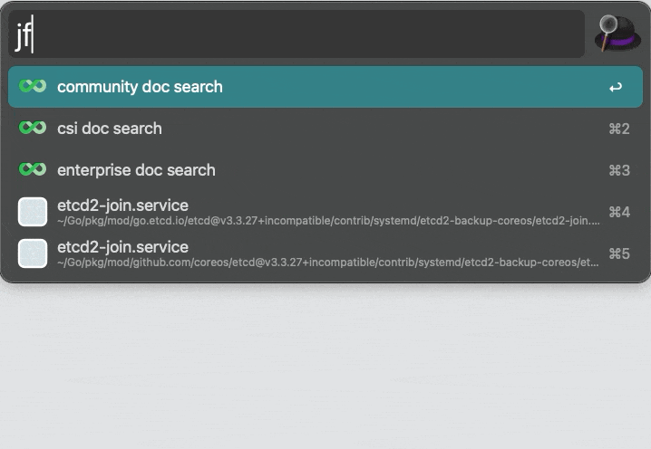

# Community Integrations

## SDK

- [Megvii](https://en.megvii.com) team contributed [Python SDK](https://github.com/megvii-research/juicefs-python).

## AI

- [UniSound](https://www.unisound.com) team participated in the development of [Fluid](https://github.com/fluid-cloudnative/fluid) JuiceFSRuntime cache engine, please refer to [this document](https://github.com/fluid-cloudnative/fluid/blob/master/docs/en/samples/juicefs_runtime.md).
- [PaddlePaddle](https://github.com/paddlepaddle/paddle) team has integrated JuiceFS into [Paddle Operator](https://github.com/PaddleFlow/paddle-operator), please refer to [the document](https://github.com/PaddleFlow/paddle-operator/blob/sampleset/docs/en/ext-overview.md).
- Build a distributed [Milvus](https://milvus.io) cluster based on JuiceFS, the Milvus team wrote a [case sharing](https://zilliz.com/blog/building-a-milvus-cluster-based-on-juicefs) and [tutorial](https://tutorials.milvus.io/en-juicefs/index.html?index=..%2F..index#0).

## Big data

- [Apache Kylin 4.0](http://kylin.apache.org) that is a OLAP engine could deploy with the JuiceFS in dissaggregated storage and compute architecture on every public cloud platform, there is [the video sharing](https://www.bilibili.com/video/BV1c54y1W72S) (in Chinese) and [the post](https://juicefs.com/en/blog/optimize-kylin-on-juicefs) for this use case.
- [Apache Hudi](https://hudi.apache.org) supports JuiceFS since v0.10.0, you can refer to [official documentation](https://hudi.apache.org/docs/jfs_hoodie) to learn how to configure JuiceFS.

## DevOps

- [Terraform Provider for JuiceFS](https://github.com/toowoxx/terraform-provider-juicefs) by Toowoxx IT GmbH, an IT service company from Germany

## Alfred

JuiceFS documents offers an Alfred workflow to search documents of JuiceFS with instant results


Simply type your keyword into Alfred (default: jfs) and provide a query to see instant search results from JuiceFS documents.

### Install

Workflow of Alfred 5 version: [Latest Download](https://github.com/zwwhdls/juicefs-alfred-workflow/releases/download/v0.1.0/JuiceFS.Search.alfredworkflow)

### Usage

Search all documents of JuiceFS, including community, enterprise and CSI:

```
# JuiceFS community documents
jfs ce <search>
# JuiceFS enterprise documents
jfs ee <search>
# JuiceFS csi documents
jfs csi <search>
```



## Workflow Variables

- `API_KEY`: API key for algolia which JuiceFS documents uses. Default value is ok.
- `LANGUAGE`: Language of JuiceFS documents to search. Default is `en`.
- `HITS_PER_PAGE`: Hits of each search. Default is `10`.


