# Beike: OceanBase's Practice on AI Storage

About the author: Tianqing Wang is the head of the container engine team in the computing storage direction of Beike. His current work focuses on the architectural design and construction implementation of cloud native and AI infrastructure, providing companies with efficient and reliable infrastructure and helping large models to be quickly implemented within the enterprise.

> Introduction: From the explosion of AI big models to becoming a new application direction in the field of technology, many companies have included AI in their strategic planning. As a leading digital service platform for the residential industry in China, Beike has also increased its investment in AI technology facilities. Its underlying database product uses OceanBase, a single-machine distributed integrated database independently developed by Ant Group. So, what core role can the database play in the construction of AI infrastructure? This article discusses this topic by sharing Beike's practice in the AI ​​storage base.

## Background of Beike’s AI Infrastructure Construction

Beike is China's largest residential service platform, with businesses including second-hand housing transactions, new housing transactions, leasing, home decoration, home furnishings, and home services. As a digital service platform for the residential industry, Beike is one of the first companies to apply new technologies such as VR and AI to residential services. It is committed to promoting the digitalization and intelligentization of the residential service industry.

Since the AI ​​big model became popular, Beike has quickly increased its investment in AI. At present, our team has three major modules dedicated to the development of AI: the first is the machine learning platform, which helps algorithm engineers to do model training and model reasoning; the second is two sets of internal infrastructure under the machine learning platform to provide high-performance storage services; the third is the internal cloud native infrastructure.

In the process of AI infrastructure construction, due to the rapid growth of data and the continuous adjustment of computing power, the storage architecture continues to evolve and faces different challenges at each stage.

## Evolution of Tiered Storage Architecture

The construction of Beike's AI infrastructure began a few years ago. Affected by the rapid changes in the development trend of AI technology, it has gone through four stages of evolution so far.

In the non-large model era, it was very simple for algorithm engineers to train models. They only needed a GPU and a hard disk, that is, a single machine and a single card. The training model gradually became larger and exceeded the range that a single machine could carry. Then there appeared a scenario of multiple machines and multiple cards. In essence, it would not leave the computer room, but in this scenario, a single disk could no longer be used to solve the problem, and network shared storage was required. At that time, the commonly used open source shared storage solution was based on NFS.

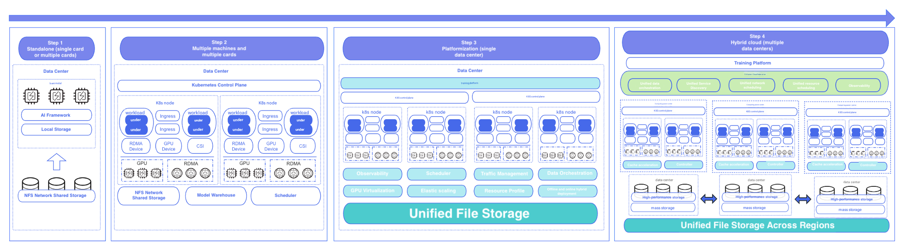

The emergence of large models in 2023 has led to a huge change in the demand for GPU computing power and resource usage for model training. We have also changed from a multi-machine, multi-card, single-computer room structure to a platform-based delivery method, which is completely cloud-native. The underlying layer also uses a unified file system to store hundreds of billions of small files and unify the data center.

As computing resources become scarce due to supply and demand, we have to adjust the existing computing resources to a multi-region, multi-computer room, and multi-cluster application architecture. Our computing power is deployed in Beijing, Tianjin, Shanghai, and other places. At the same time, the forms of GPU computing power are becoming more and more diverse, and computing power supply also exists in multi-cloud and multi-region scenarios, which brings more challenges to data set and model management.

From a general perspective, the challenges of storage bases can be summarized into two categories. One is the performance bottleneck of model training. As the number of parameters of AI models increases, the CPU is required to process data extremely quickly, and the storage base is required to have high concurrency and high throughput capabilities. The other is cross-regional data management. For large model engineering systems, data sets run through the entire life cycle. In traditional scenarios, different scenarios have independent storage media to meet business scenarios, but in the iteration process of large models, the flow of data brings huge technical challenges to storage solutions.

The data flow cycle involves the entire Beike AI project, from user-side data collection to data processing, and then to conversion into data sets, and finally to the GPU to support model training. The most ideal form of this process is to mount it in the form of a file system. For example, when the user streams in data, it is mounted on a network disk for data processing, data set flow into the CPU, and other operations. In this way, completing the closed loop of data on a network disk can greatly improve the efficiency of AI projects.

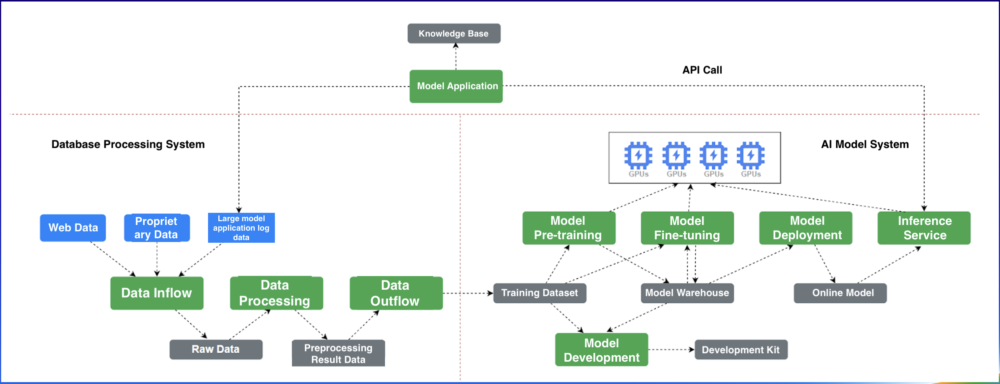

## Tiered Storage Technology Selection

The tiered storage architecture is divided into the storage architecture and the storage base. We chose the open source Fluid as the storage architecture, which has cloud-native data orchestration capabilities.

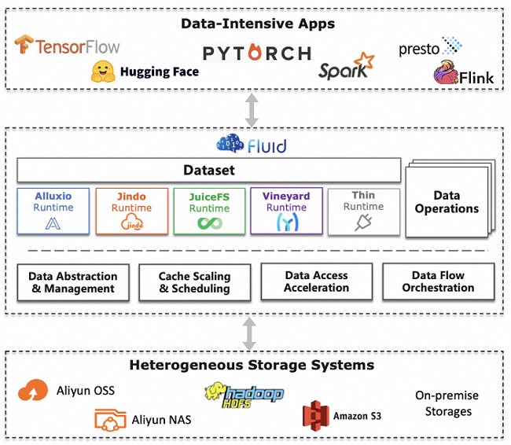

The underlying file storage uses the open source distributed file system JuiceFS, as shown in the figure below. This is the final hierarchical storage architecture of Beike.

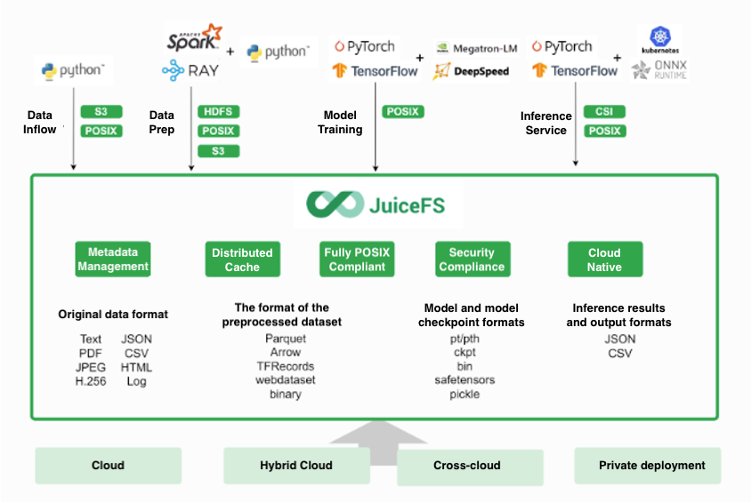

The first layer, which is the bottom layer of multimodal training tasks, is the access layer. Access forms include cloud native, hybrid cloud, cross-cloud, and file systems, all of which can be accessed in the form of multiple protocols.
The second layer is the data orchestration layer, which solves the cross-regional data flow. Because the data may be generated in the Beijing-Tianjin area and consumed in Shanghai, the data needs to be transmitted to the place with the closest computing power, which requires the use of data orchestration capabilities.
The third layer, the top layer, is the real data processing center, based on JuiceFS. JuiceFS relies on metadata and object storage, which requires us to configure an efficient metadata engine and self-developed high-performance object storage to hold data.
However, the technical selection of the metadata engine is very difficult. If it is based on high-performance Redis, there is a risk of data loss, which may be a disaster for the file system, which we cannot tolerate. If it is entirely based on self-development, the cycle and cost are very high. Solving the problem of metadata synchronization across regions means too high a cost for our team and even the entire company. After comprehensive consideration, we determined that the primary requirement is stability and no data loss, and the second is to carry our data flow and cross-regional needs.

## Using OceanBase as the Storage Base for AI Infrastructure

After investigating the current big data, database and other storage systems on the market, we finally chose OceanBase as the technical solution and storage base for the metadata engine. The main reasons are as follows:
1. For the entire data flow system, OceanBase can provide high availability and disaster recovery capabilities and solve the problem of cross-regional data synchronization during data flow.
   * Each data shard in OceanBase has multiple copies, distributed on different physical nodes. When a node fails, the system can automatically switch to other copies to ensure service continuity.
   * By configuring the storage location of data copies, rack-level, computer room-level, and city-level disaster recovery can be achieved, helping financial institutions cope with disaster recovery challenges.
2. We have many computer rooms, and computing power is dispersed in different areas. We need to make full use of data, so metadata needs to be able to float in different areas. Reading metadata in the area closest to computing power can ensure the reading efficiency of the file system. OceanBase's multi-active capability can solve this problem.
3. We are a team that builds cloud-native and AI infrastructure, and we are not very good at database operation and maintenance. As mentioned above, data flow involves multiple business modules of the entire enterprise, so we need the storage base to have resource isolation capabilities and high operability and manageability. OceanBase provides a powerful operation and maintenance management platform OCP to monitor the database 24 hours a day, 7 days a week, which is safe and reliable.
4. OceanBase's native multi-tenant architecture and tenant-level resource isolation capabilities can meet our needs. At the same time, its performance is balanced and can support tens to hundreds of billions of data.

For example, the following figure shows the architecture solution for metadata transmission between the Beijing-Tianjin Computing Center and the Shanghai Computing Center. It can be seen that the overall computing resources are divided into IDC and public cloud, and there are multiple public cloud providers. We use the multi-zone capability of OceanBase in the IDC, especially in the computer room in the same district, and convert them into different copies through OBProxy. For cross-cloud and even cross-region scenarios, taking Tencent Cloud as an example, we cleverly use the capabilities of Tencent Cloud MySQL. When the IDC data floats in Shanghai, the data is first synchronized to the database of Tencent Cloud in the Beijing-Tianjin District based on OMS, and then synchronized to the database in the Shanghai District through the DTS tool on the cloud. The database in the Shanghai District provides metadata processing capabilities.

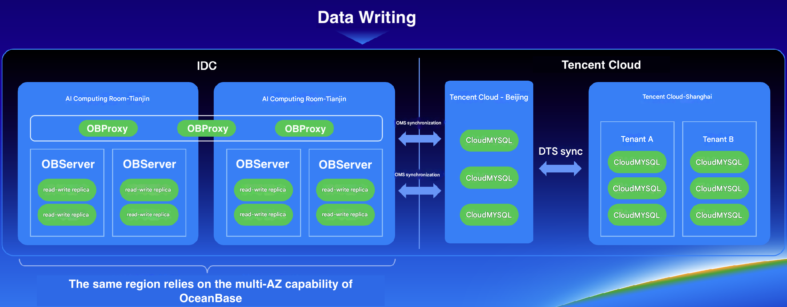

Why is there such a complex architecture instead of using OceanBase to synchronize the entire Shanghai region?

This is due to physical limitations. We have tested some scenarios. If OceanBase synchronizes data in the Shanghai region, there will be extremely high synchronization delays due to cloud networking and bandwidth. The current solution can guarantee the lowest data delay. We only need to solve the problem of data flow from Beijing and Tianjin to Shanghai region within seconds at 2w TPS. This speed can meet the needs of most business scenarios in the overall data production process. In addition, IDC and other computing centers are basically under the multi-zone management mode of OceanBase, and the data flow speed is faster.
On the file system side, because JuiceFS was previously used as a metadata engine, which led to file system performance degradation, a single-threaded approach was adopted. The following figure shows the performance of JuiceFS in a single-machine single-client process when the number of files is about 20 million, and obvious jitter can be seen.

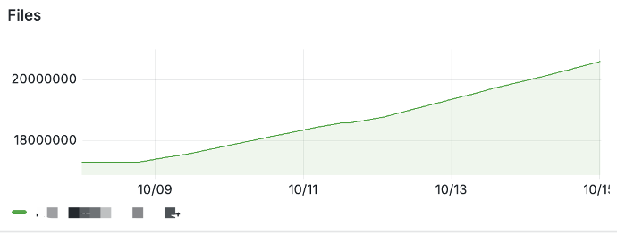

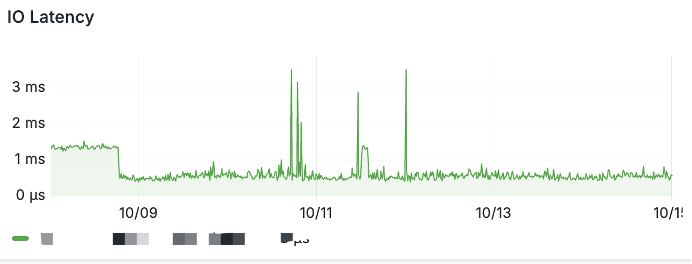

After switching to OceanBase, the entire response time can be controlled between 1ms and 2ms. Jitter will only occur in scenarios with a large number of small files, taking between 2ms and 10ms.

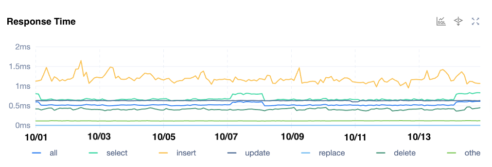

In response to this phenomenon, we made a second technical architecture upgrade. Beike has developed an object storage service internally, which was originally used to accelerate the underlying data for JuiceFS. Since cross-region data reading is very slow, but it is difficult to avoid the need to read data from Shanghai when the data is in Beijing and Tianjin, we hope to be able to make a cross-region or even cross-cloud object storage service to meet the demand for fast data reading speed between file systems.
The object storage service developed by Beike is not a real persistence service, but a proxy layer. Because all data is on Tencent Cloud, the object storage system only solves one problem - acceleration. The deployment form of the object storage system is to deploy our KOS service in the Beijing-Tianjin and Shanghai regions, and through the cross-region replication capability, ensure the real-time synchronization of KOS file replication between Shanghai and Beijing-Tianjin regions.

Object storage itself has metadata. If you only accelerate the database without accelerating the metadata, then such acceleration is meaningless, especially when there are a large number of lists in the file system, the performance will still be seriously degraded. Therefore, we use OceanBase as the metadata base to promote the acceleration of the entire object storage service. As shown in the following figure, the object storage system is divided into three components:

* KOS-Proxy Protocol Proxy Layer: mainly used to implement the S3 interface protocol. This component is a completely stateless service, and metadata is mainly obtained from the KOS control plane.
* KOS-Cache Data Cache Layer: Its main function is to cache data from the underlying real object storage to the local disk, and it can be deployed in a distributed manner to form a cache cluster to improve the throughput of object storage.
* KOS-Meta Metadata Layer: mainly provides metadata capabilities for object storage services, using OceanBase as the underlying metadata engine, and provides the ability to obtain object storage metadata information nearby.

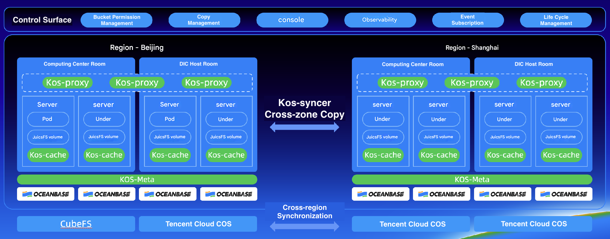

In this process, for file reading, it will first determine whether the file has data cache enabled. If there is a cache, data will be read from the cache node KOS-Cache first, otherwise it will be downgraded to the remote object storage for reading. In order to ensure data consistency, all cache nodes belonging to the same group will be distributed in the form of a hash ring. Each cache service will share its token information and location information in the ring through etcd. Data reading and writing will be written to the specified node through a consistent hash algorithm to ensure data consistency. The principle of metadata acceleration is to generate the metadata corresponding to the file and write it to OceanBase during the life cycle of the object storage file through the S3 protocol. At the same time, OceanBase provides synchronization support for multiple AZs and multiple regions. At this time, OceanBase can implement object storage services that support massive data.

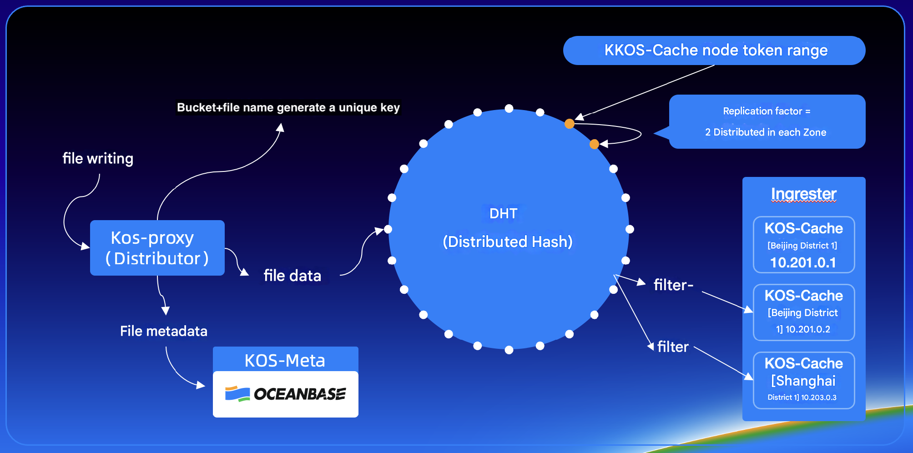

With object storage capabilities, all access to object storage on the cloud will be converted to object storage accessed in the local data center, achieving acceleration. It is very efficient when accessing the file system. The following figure shows the performance comparison data between local access and cloud access.

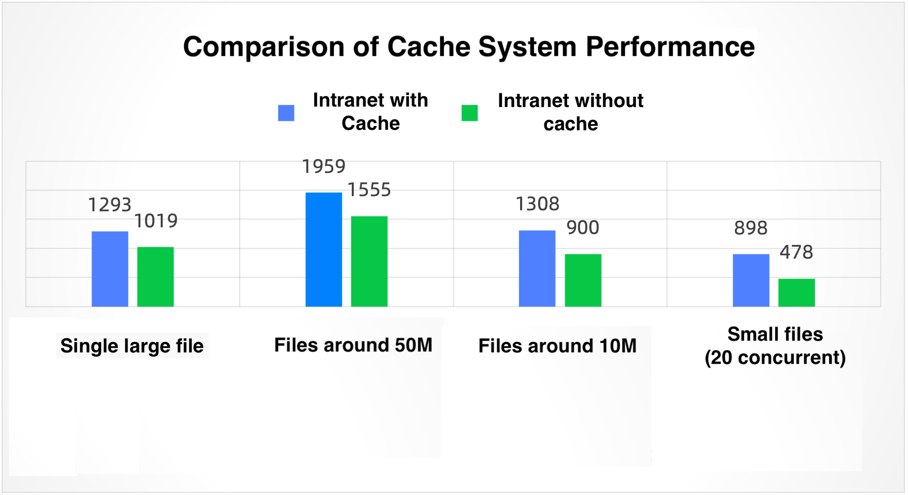

As can be seen from the figure, the acceleration effect is more obvious for a large number of small files, which strongly relies on the powerful performance provided by OceanBase. In the cross-data center scenario, the performance improvement is more obvious, effectively improving the throughput limit in the read scenario. However, this solution does not have a significant effect on the write scenario of object storage.

After optimizing the object storage service, we considered how to use JuiceFS. On the user side, data must first be calculated in the Beijing-Tianjin area and then copied to the Shanghai area, and then data is pulled from the Shanghai area for training. In this process, there are either problems with low bandwidth and expensive dedicated lines, or problems with high latency due to difficulty in optimizing throughput in some small file scenarios.

One optimization idea is to create a mirror file system. First, the user creates a common volume in the Beijing-Tianjin area. The automatic access of the volume will connect to the metadata engine and object storage service in the Beijing-Tianjin area. Then the user creates a mirror volume of the Beijing-Tianjin area volume in the Shanghai area. When the user uses the volume, the automatic access will automatically identify and connect to the metadata engine and object storage service in the Shanghai area. This idea reduces the time of data circulation, from traditional data production to data cleaning, data replication, training, to optimization to data production, data cleaning, and retraining, which can reduce the time cost of data replication. It can be completed in seconds when the amount of data is small. For situations where all data does not need to be written in multiple regions, the ability of the mirror file system can also be used to preheat across regions and synchronize data to other regions. The file block size of JuiceFS is more friendly to data synchronization of public cloud object storage, and the synchronization efficiency will be higher. It can also help reduce costs, as there’s a consensus in AI that idle CPUs are costly. To avoid unnecessary expenses, it’s crucial to ensure data synchronization keeps pace with computational power.

## Exploration of OceanBase Application Scenarios

In addition to using OceanBase as the storage base for AI infrastructure, we have also explored the application of OceanBase in other scenarios.

### Scenario 1: Observable Operation and Maintenance

When maintaining thousands of servers and KOS clusters, the biggest challenge we face is observability. Traditional objective observation operation and maintenance systems, such as log collection and Prometheus, are a nuisance to operation and maintenance personnel because they receive hundreds of alarms every day. The key is that the alarm accuracy is extremely low, and many alarm contents are irrelevant and can be ignored. Therefore, we built an observable operation and maintenance system based on cloud native standards and combined with the capabilities of OceanBase.

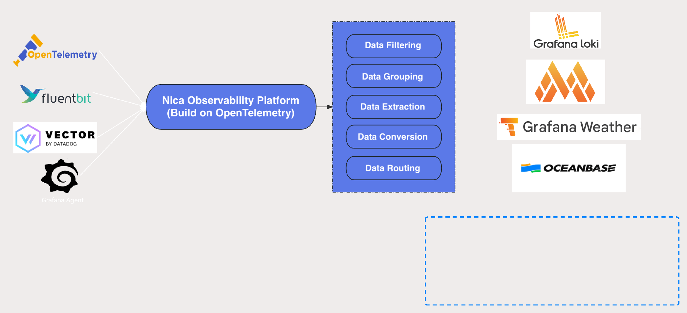

The core of this system is to filter, group, extract, transform and route data, aggregate it into a cheap storage system, and then flow it into OceanBase after cleaning the data and indicators to locate anomalies. Taking the domain name scenario as an example, when an alarm occurs, we will face additional risks, such as external attacks, crawlers, etc. We need to quickly identify the source of the risky IP and the growth trend of each IP. OceanBase's OLAP capabilities can help us quickly locate anomalies and increase the efficiency of alarm resolution.

### Scenario 2: Exploring OBKV as a metadata engine

Finally, let me briefly share what Shell has explored in the future about OB. This is relatively simple because we have recently started trying this out based on OBKV at the file system level. We have only implemented the first version of the data engine based on OBKV internally, switching from the engine to OBKV as a whole. Our file system does not essentially require the entire parsing process. Our table structure is very simple, and the file system's table structure is very simple. The file metadata is not very complex, so we have higher requirements for the overall performance of the file. The KV format is the most friendly to us, so we have made some attempts and explorations.

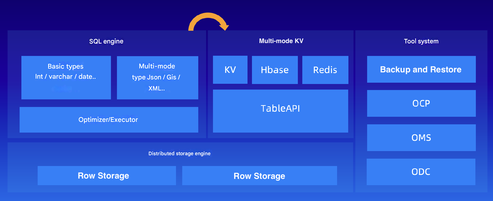

Recently, we conducted stress testing on this exploration and found that the overall effect is very ideal. In the OBKV scenario, the response time for reading and writing millions of files has increased by 2 to 4 times, from the original 2 to 10ms to 1ms or even lower, and occasionally stabilized at around 5ms under jitter conditions. OBKV has one less layer of SQL parsing and higher theoretical performance. In addition, because OceanBase has multi-mode KV capabilities, supports HBase and Redis protocols, and has a rich tool system, we can directly reuse OceanBase's operation and maintenance capabilities.

The above is the application and experience of OceanBase in the AI ​​direction of Beike. We will continue to explore other capabilities of OceanBase in the future. You are welcome to leave a message for communication.
