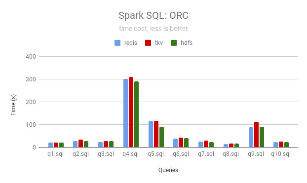
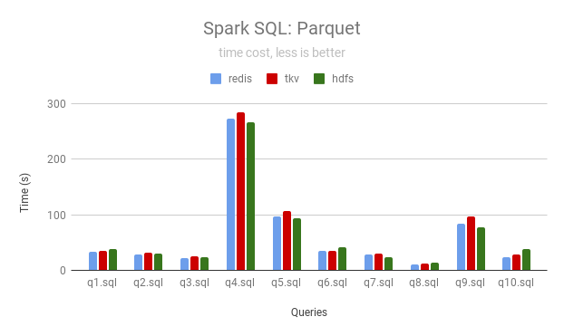

import Tabs from '@theme/Tabs';
import TabItem from '@theme/TabItem';

JuiceFS provides [Hadoop-compatible File System](https://hadoop.apache.org/docs/current/hadoop-project-dist/hadoop-common/filesystem/introduction.html) by Hadoop Java SDK. Various applications in the Hadoop ecosystem can smoothly use JuiceFS to store data without changing the code.

## Requirements

### 1. Hadoop and related components

JuiceFS Hadoop Java SDK is compatible with Hadoop 2.x and Hadoop 3.x. As well as variety of components in Hadoop ecosystem.

### 2. User permissions

JuiceFS uses local "User/UID" and "Group/GID" mappings by default, and when used in a distributed environment, to avoid permission issues, please refer to [documentation](../administration/sync_accounts_between_multiple_hosts.md) synchronizes the "User/UID" and "Group/GID" that needs to be used to all Hadoop nodes. It is also possible to define a global user and group file to make all nodes in the cluster share the permission configuration. Please see [here](#other-configurations) for related configurations.

### 3. File system

You should first create at least one JuiceFS file system to provide storage for components related to the Hadoop ecosystem through the JuiceFS Java SDK. When deploying the Java SDK, specify the metadata engine address of the created file system in the configuration file.

To create a file system, please refer to [our quick start](../getting-started/standalone.md).

:::note
If you want to use JuiceFS in a distributed environment, when creating a file system, please plan the object storage and database to be used reasonably to ensure that they can be accessed by each node in the cluster.
:::

### 4. Memory

Depending on the read and write load of computing tasks (such as Spark executor), JuiceFS Hadoop Java SDK may require an additional 4 * [`juicefs.memory-size`](#io-configurations) off-heap memory to speed up read and write performance. By default, it is recommended to configure at least 1.2GB of off-heap memory for compute tasks.

### 5. Java runtime version

JuiceFS Hadoop Java SDK is compiled with JDK 8 by default. If it needs to be used in a higher version of Java runtime (such as Java 17), the following options need to be added to the JVM parameters to allow the use of reflection API:

```shell
--add-exports=java.base/sun.nio.ch=ALL-UNNAMED
```

For more information on the above option, please refer to [official documentation](https://docs.oracle.com/en/java/javase/17/migrate/migrating-jdk-8-later-jdk-releases.html#GUID-7BB28E4D-99B3-4078-BDC4-FC24180CE82B).

## Install and compile the client

### Install the pre-compiled client

Please refer to the ["Installation"](../getting-started/installation.md#install-the-pre-compiled-client) document to learn how to download the precompiled JuiceFS Hadoop Java SDK.

### Compile the client manually

:::note
No matter which system environment the client is compiled for, the compiled JAR file has the same name and can only be deployed in the matching system environment. For example, when compiled in Linux, it can only be used in the Linux environment. In addition, since the compiled package depends on glibc, it is recommended to compile with a lower version system to ensure better compatibility.
:::

Compilation depends on the following tools:

- [Go](https://golang.org) 1.20+
- JDK 8+
- [Maven](https://maven.apache.org) 3.3+
- Git
- make
- GCC 5.4+

#### Linux and macOS

Clone the repository:

```shell
git clone https://github.com/juicedata/juicefs.git
```

Enter the directory and compile:

```shell
cd juicefs/sdk/java
make
```

:::note
If Ceph RADOS is used to store data, you need to install `librados-dev` first and [build `libjfs.so`]`.
:::

```shell
cd juicefs/sdk/java
make ceph
```

After the compilation, you can find the compiled `JAR` file in the `sdk/java/target` directory, including two versions:

- Contains third-party dependent packages: `juicefs-hadoop-X.Y.Z.jar`
- Does not include third-party dependent packages: `original-juicefs-hadoop-X.Y.Z.jar`

It is recommended to use a version that includes third-party dependencies.

#### Windows

The client used in the Windows environment needs to be obtained through cross-compilation on Linux or macOS. The compilation depends on [mingw-w64](https://www.mingw-w64.org), which needs to be installed first.

The steps are the same as compiling on Linux or macOS. For example, on the Ubuntu system, install the `mingw-w64` package first to solve the dependency problem:

```shell
sudo apt install mingw-w64
```

Clone and enter the JuiceFS source code directory, execute the following code to compile:

```shell
cd juicefs/sdk/java
```

```shell
make win
```

## Deploy the client

To enable each component of the Hadoop ecosystem to correctly identify JuiceFS, the following configurations are required:

1. Place the compiled JAR file and `$JAVA_HOME/lib/tools.jar` into the `classpath` of the component. The installation paths of common big data platforms and components are shown in the table below.
2. Put JuiceFS configurations into the configuration file of each Hadoop ecosystem component (usually `core-site.xml`), see [Client Configurations](#client-configurations) for details.

It is recommended to place the JAR file in a fixed location, and the other locations are called it through symbolic links.

### Big Data Platforms

| Name              | Installing Paths                                                                                                                                                                                                                                                                                                                               |
|-------------------|------------------------------------------------------------------------------------------------------------------------------------------------------------------------------------------------------------------------------------------------------------------------------------------------------------------------------------------------|
| CDH               | `/opt/cloudera/parcels/CDH/lib/hadoop/lib`<br></br>`/opt/cloudera/parcels/CDH/spark/jars`<br></br>`/var/lib/impala`                                                                                                                                                                                                                            |
| HDP               | `/usr/hdp/current/hadoop-client/lib`<br></br>`/usr/hdp/current/hive-client/auxlib`<br></br>`/usr/hdp/current/spark2-client/jars`                                                                                                                                                                                                               |
| Amazon EMR        | `/usr/lib/hadoop/lib`<br></br>`/usr/lib/spark/jars`<br></br>`/usr/lib/hive/auxlib`                                                                                                                                                                                                                                                             |
| Alibaba Cloud EMR | `/opt/apps/ecm/service/hadoop/*/package/hadoop*/share/hadoop/common/lib`<br></br>`/opt/apps/ecm/service/spark/*/package/spark*/jars`<br></br>`/opt/apps/ecm/service/presto/*/package/presto*/plugin/hive-hadoop2`<br></br>`/opt/apps/ecm/service/hive/*/package/apache-hive*/lib`<br></br>`/opt/apps/ecm/service/impala/*/package/impala*/lib` |
| Tencent Cloud EMR | `/usr/local/service/hadoop/share/hadoop/common/lib`<br></br>`/usr/local/service/presto/plugin/hive-hadoop2`<br></br>`/usr/local/service/spark/jars`<br></br>`/usr/local/service/hive/auxlib`                                                                                                                                                   |
| UCloud UHadoop    | `/home/hadoop/share/hadoop/common/lib`<br></br>`/home/hadoop/hive/auxlib`<br></br>`/home/hadoop/spark/jars`<br></br>`/home/hadoop/presto/plugin/hive-hadoop2`                                                                                                                                                                                  |
| Baidu Cloud EMR   | `/opt/bmr/hadoop/share/hadoop/common/lib`<br></br>`/opt/bmr/hive/auxlib`<br></br>`/opt/bmr/spark2/jars`                                                                                                                                                                                                                                        |

### Community Components

| Name      | Installing Paths                                                                        |
|-----------|-----------------------------------------------------------------------------------------|
| Hadoop    | `${HADOOP_HOME}/share/hadoop/common/lib/`, `${HADOOP_HOME}/share/hadoop/mapreduce/lib/` |
| Spark     | `${SPARK_HOME}/jars`                                                                    |
| Presto    | `${PRESTO_HOME}/plugin/hive-hadoop2`                                                    |
| Trino     | `${TRINO_HOME}/plugin/hive`                                                             |
| Flink     | `${FLINK_HOME}/lib`                                                                     |
| StarRocks | `${StarRocks_HOME}/fe/lib/`, `${StarRocks_HOME}/be/lib/hadoop/common/lib`               |

### Client Configurations

Please refer to the following table to set the relevant parameters of the JuiceFS file system and write it into the configuration file, which is generally `core-site.xml`.

#### Core Configurations

| Configuration                    | Default Value                | Description                                                                                                                                                                                                                                                                                  |
|----------------------------------|------------------------------|----------------------------------------------------------------------------------------------------------------------------------------------------------------------------------------------------------------------------------------------------------------------------------------------|
| `fs.jfs.impl`                    | `io.juicefs.JuiceFileSystem` | Specify the storage implementation to be used. By default, `jfs://` scheme is used. If you want to use different scheme (e.g. `cfs://`), just modify it to `fs.cfs.impl`. No matter what scheme you use, it is always access the data in JuiceFS.                                             |
| `fs.AbstractFileSystem.jfs.impl` | `io.juicefs.JuiceFS`         | Specify the storage implementation to be used. By default, `jfs://` scheme is used. If you want to use different scheme (e.g. `cfs://`), just modify it to `fs.AbstractFileSystem.cfs.impl`. No matter what scheme you use, it is always access the data in JuiceFS.                          |
| `juicefs.meta`                   |                              | Specify the metadata engine address of the pre-created JuiceFS file system. You can configure multiple file systems for the client at the same time through the format of `juicefs.{vol_name}.meta`. Refer to ["Multiple file systems configuration"](#multiple-file-systems-configuration). |

#### Cache Configurations

| Configuration                | Default Value | Description                                                                                                                                                                                                                                                                                                                                                                                                                                                                                                 |
|------------------------------|---------------|-------------------------------------------------------------------------------------------------------------------------------------------------------------------------------------------------------------------------------------------------------------------------------------------------------------------------------------------------------------------------------------------------------------------------------------------------------------------------------------------------------------|
| `juicefs.cache-dir`          |               | Directory paths of local cache. Use colon to separate multiple paths. Also support wildcard in path. **It's recommended create these directories manually and set `0777` permission so that different applications could share the cache data.**                                                                                                                                                                                                                                                            |
| `juicefs.cache-size`         | 0             | Maximum size of local cache in MiB. The default value is 0, which means that caching is disabled. It's the total size when set multiple cache directories.                                                                                                                                                                                                                                                                                                                                                  |
| `juicefs.cache-full-block`   | `true`        | Whether cache every read blocks, `false` means only cache random/small read blocks.                                                                                                                                                                                                                                                                                                                                                                                                                         |
| `juicefs.free-space`         | 0.1           | Min free space ratio of cache directory                                                                                                                                                                                                                                                                                                                                                                                                                                                                     |
| `juicefs.open-cache`         | 0             | Open files cache timeout in seconds (0 means disable this feature)                                                                                                                                                                                                                                                                                                                                                                                                                                          |
| `juicefs.attr-cache`         | 0             | Expire of attributes cache in seconds                                                                                                                                                                                                                                                                                                                                                                                                                                                                       |
| `juicefs.entry-cache`        | 0             | Expire of file entry cache in seconds                                                                                                                                                                                                                                                                                                                                                                                                                                                                       |
| `juicefs.dir-entry-cache`    | 0             | Expire of directory entry cache in seconds                                                                                                                                                                                                                                                                                                                                                                                                                                                                  |
| `juicefs.discover-nodes-url` |               | Specify the node discovery API, the node list will be refreshed every 10 minutes. <br/><br/><ul><li>YARN: `yarn`</li><li>Spark Standalone: `http://spark-master:web-ui-port/json/`</li><li>Spark ThriftServer: `http://thrift-server:4040/api/v1/applications/`</li><li>Presto: `http://coordinator:discovery-uri-port/v1/service/presto/`</li><li>File system: `jfs://{VOLUME}/etc/nodes`, you need to create this file manually, and write the hostname of the node into this file line by line</li></ul> |

#### I/O Configurations

| Configuration            | Default Value | Description                                     |
|--------------------------|---------------|-------------------------------------------------|
| `juicefs.max-uploads`    | 20            | The max number of connections to upload         |
| `juicefs.max-deletes`    | 10            | The max number of connections to delete         |
| `juicefs.get-timeout`    | 5             | The max number of seconds to download an object |
| `juicefs.put-timeout`    | 60            | The max number of seconds to upload an object   |
| `juicefs.memory-size`    | 300           | Total read/write buffering in MiB               |
| `juicefs.prefetch`       | 1             | Prefetch N blocks in parallel                   |
| `juicefs.upload-limit`   | 0             | Bandwidth limit for upload in Mbps              |
| `juicefs.download-limit` | 0             | Bandwidth limit for download in Mbps            |
| `juicefs.io-retries`     | 10            | Number of retries after network failure         |
| `juicefs.writeback`      | `false`       | Upload objects in background                    |

#### Other Configurations

| Configuration           | Default Value | Description                                                                                                                                                                 |
|-------------------------|---------------|-----------------------------------------------------------------------------------------------------------------------------------------------------------------------------|
| `juicefs.bucket`        |               | Specify a different endpoint for object storage                                                                                                                             |
| `juicefs.debug`         | `false`       | Whether enable debug log                                                                                                                                                    |
| `juicefs.access-log`    |               | Access log path. Ensure Hadoop application has write permission, e.g. `/tmp/juicefs.access.log`. The log file will rotate  automatically to keep at most 7 files.           |
| `juicefs.superuser`     | `hdfs`        | The super user                                                                                                                                                              |
| `juicefs.supergroup`    | `supergroup`  | The super user group                                                                                                                                                        |
| `juicefs.users`         | `null`        | The path of username and UID list file, e.g. `jfs://name/etc/users`. The file format is `<username>:<UID>`, one user per line.                                              |
| `juicefs.groups`        | `null`        | The path of group name, GID and group members list file, e.g. `jfs://name/etc/groups`. The file format is `<group-name>:<GID>:<username1>,<username2>`, one group per line. |
| `juicefs.umask`         | `null`        | The umask used when creating files and directories (e.g. `0022`), default value is `fs.permissions.umask-mode`.                                                             |
| `juicefs.push-gateway`  |               | [Prometheus Pushgateway](https://github.com/prometheus/pushgateway) address, format is `<host>:<port>`.                                                                     |
| `juicefs.push-auth`     |               | [Prometheus basic auth](https://prometheus.io/docs/guides/basic-auth) information, format is `<username>:<password>`.                                                       |
| `juicefs.push-graphite` |               | [Graphite](https://graphiteapp.org) address, format is `<host>:<port>`.                                                                                                     |
| `juicefs.push-interval` | 10            | Metric push interval (in seconds)                                                                                                                                           |
| `juicefs.push-labels`   |               | Metric labels, format is `key1:value1;key2:value2`.                                                                                                                         |
| `juicefs.fast-resolve`  | `true`        | Whether enable faster metadata lookup using Redis Lua script                                                                                                                |
| `juicefs.no-usage-report` | `false`       | Whether disable usage reporting. JuiceFS only collects anonymous usage data (e.g. version number), no user or any sensitive data will be collected.                         |
| `juicefs.no-bgjob`      | `false`       | Disable background jobs (clean-up, backup, etc.)                                                                                                                            |
| `juicefs.backup-meta`   | 3600          | Interval (in seconds) to automatically backup metadata in the object storage (0 means disable backup)                                                                       |
| `juicefs.backup-skip-trash` | `false`       | Skip files and directories in trash when backup metadata.                                                                                                                   |
| `juicefs.heartbeat`     | 12            | Heartbeat interval (in seconds) between client and metadata engine. It's recommended that all clients use the same value.                                                   |
| `juicefs.skip-dir-mtime`              | 100ms         | Minimal duration to modify parent dir mtime.                                                                                                                                |

#### Multiple file systems configuration

When multiple JuiceFS file systems need to be used at the same time, all the above configuration items can be specified for a specific file system. You only need to put the file system name in the middle of the configuration item, such as `jfs1` and `jfs2` in the following example:

```xml
<property>
  <name>juicefs.jfs1.meta</name>
  <value>redis://jfs1.host:port/1</value>
</property>
<property>
  <name>juicefs.jfs2.meta</name>
  <value>redis://jfs2.host:port/1</value>
</property>
```

#### Configuration Example

The following is a commonly used configuration example. Please replace the `{HOST}`, `{PORT}` and `{DB}` variables in the `juicefs.meta` configuration with actual values.

```xml
<property>
  <name>fs.jfs.impl</name>
  <value>io.juicefs.JuiceFileSystem</value>
</property>
<property>
  <name>fs.AbstractFileSystem.jfs.impl</name>
  <value>io.juicefs.JuiceFS</value>
</property>
<property>
  <name>juicefs.meta</name>
  <value>redis://{HOST}:{PORT}/{DB}</value>
</property>
<property>
  <name>juicefs.cache-dir</name>
  <value>/data*/jfs</value>
</property>
<property>
  <name>juicefs.cache-size</name>
  <value>1024</value>
</property>
<property>
  <name>juicefs.access-log</name>
  <value>/tmp/juicefs.access.log</value>
</property>
```

## Configuration in Hadoop

Please refer to the aforementioned configuration tables and add configuration parameters to the Hadoop configuration file `core-site.xml`.

### CDH6

If you are using CDH 6, in addition to modifying `core-site`, you also need to modify `mapreduce.application.classpath` through the YARN service interface, adding:

```shell
$HADOOP_COMMON_HOME/lib/juicefs-hadoop.jar
```

### HDP

In addition to modifying `core-site`, you also need to modify the configuration `mapreduce.application.classpath` through the MapReduce2 service interface and add it at the end (variables do not need to be replaced):

```shell
/usr/hdp/${hdp.version}/hadoop/lib/juicefs-hadoop.jar
```

### Flink

Add configuration parameters to `conf/flink-conf.yaml`. If you only use JuiceFS in Flink, you don't need to configure JuiceFS in the Hadoop environment, you only need to configure the Flink client.

### Hudi

:::note
Hudi supports JuiceFS since v0.10.0, please make sure you are using the correct version.
:::

Please refer to ["Hudi Official Documentation"](https://hudi.apache.org/docs/jfs_hoodie) to learn how to configure JuiceFS.

### Kafka Connect

It is possible to use Kafka Connect and HDFS Sink Connector（[HDFS 2](https://docs.confluent.io/kafka-connect-hdfs/current/overview.html) and [HDFS 3](https://docs.confluent.io/kafka-connect-hdfs3-sink/current/overview.html)）to store data on JuiceFS.

First you need to add JuiceFS SDK to `classpath` in Kafka Connect, e.g., `/usr/share/java/confluentinc-kafka-connect-hdfs/lib`.

While creating a Connect Sink task, configuration needs to be set up as follows:

- Specify `hadoop.conf.dir` as the directory that contains the configuration file `core-site.xml`. If it is not running in Hadoop environment, you can create a separate directory such as `/usr/local/juicefs/hadoop`, and then add the JuiceFS related configurations to `core-site.xml`.
- Specify `store.url` as a path starting with `jfs://`.

For example:

```ini
# Other configuration items are omitted.
hadoop.conf.dir=/path/to/hadoop-conf
store.url=jfs://path/to/store
```

### HBase

JuiceFS can be used by HBase for HFile, but is not fast (low latency) enough for Write Ahead Log (WAL), because it take much longer time to persist data into object storage than memory of DataNode.

It is recommended to deploy a small HDFS cluster to store WAL and HFile files to be stored on JuiceFS.

#### Create a new HBase cluster

Modify `hbase-site.xml`:

```xml title="hbase-site.xml"
<property>
  <name>hbase.rootdir</name>
  <value>jfs://{vol_name}/hbase</value>
</property>
<property>
  <name>hbase.wal.dir</name>
  <value>hdfs://{ns}/hbase-wal</value>
</property>
```

#### Modify existing HBase cluster

In addition to modifying the above configurations, since the HBase cluster has already stored some data in ZooKeeper, in order to avoid conflicts, there are two solutions:

1. Delete the old cluster

   Delete the znode (default `/hbase`) configured by `zookeeper.znode.parent` via the ZooKeeper client.

   :::note
   This operation will delete all data on this HBase cluster.
   :::

2. Use a new znode

   Keep the znode of the original HBase cluster so that it can be recovered later. Then configure a new value for `zookeeper.znode.parent`:

   ```xml title="hbase-site.xml"
   <property>
     <name>zookeeper.znode.parent</name>
     <value>/hbase-jfs</value>
   </property>
   ```

### Restart Services

When the following components need to access JuiceFS, they should be restarted.

:::note
Before restart, you need to confirm JuiceFS related configuration has been written to the configuration file of each component, usually you can find them in `core-site.xml` on the machine where the service of the component was deployed.
:::

| Components | Services                   |
| ---------- | -------------------------- |
| Hive       | HiveServer<br />Metastore  |
| Spark      | ThriftServer               |
| Presto     | Coordinator<br />Worker    |
| Impala     | Catalog Server<br />Daemon |
| HBase      | Master<br />RegionServer   |

HDFS, Hue, ZooKeeper and other services don't need to be restarted.

When `Class io.juicefs.JuiceFileSystem not found` or `No FilesSystem for scheme: jfs` exceptions was occurred after restart, reference [FAQ](#faq).

### Trash

JuiceFS Hadoop Java SDK also has the same trash function as HDFS, which needs to be enabled by setting `fs.trash.interval` and `fs.trash.checkpoint.interval`, please refer to [HDFS documentation](https://hadoop.apache.org/docs/stable/hadoop-project-dist/hadoop-hdfs/HdfsDesign.html#File_Deletes_and_Undeletes) for more information.

## Environmental Verification

After the deployment of the JuiceFS Java SDK, the following methods can be used to verify the success of the deployment.

### Hadoop CLI

```bash
hadoop fs -ls jfs://{JFS_NAME}/
```

:::info
The `JFS_NAME` is the volume name when you format JuiceFS file system.
:::

### Hive

```sql
CREATE TABLE IF NOT EXISTS person
(
  name STRING,
  age INT
) LOCATION 'jfs://{JFS_NAME}/tmp/person';
```

### Java/Scala project

1. Add Maven or Gradle dependencies:

   <Tabs>
     <TabItem value="maven" label="Maven">

   ```xml
   <dependency>
       <groupId>org.apache.hadoop</groupId>
       <artifactId>hadoop-common</artifactId>
       <version>{HADOOP_VERSION}</version>
       <scope>provided</scope>
   </dependency>
   <dependency>
       <groupId>io.juicefs</groupId>
       <artifactId>juicefs-hadoop</artifactId>
       <version>{JUICEFS_HADOOP_VERSION}</version>
       <scope>provided</scope>
   </dependency>
   ```

     </TabItem>
     <TabItem value="gradle" label="Gradle">

   ```groovy
   dependencies {
     implementation 'org.apache.hadoop:hadoop-common:${hadoopVersion}'
     implementation 'io.juicefs:juicefs-hadoop:${juicefsHadoopVersion}'
   }
   ```

     </TabItem>
   </Tabs>

2. Use the following sample code to verify:

<!-- autocorrect: false -->
   ```java
   package demo;

   import org.apache.hadoop.conf.Configuration;
   import org.apache.hadoop.fs.FileStatus;
   import org.apache.hadoop.fs.FileSystem;
   import org.apache.hadoop.fs.Path;

   public class JuiceFSDemo {
       public static void main(String[] args) throws Exception {
           Configuration conf = new Configuration();
           conf.set("fs.jfs.impl", "io.juicefs.JuiceFileSystem");
           conf.set("juicefs.meta", "redis://127.0.0.1:6379/0");  // JuiceFS metadata engine URL
           Path p = new Path("jfs://{JFS_NAME}/");  // Please replace "{JFS_NAME}" with the correct value
           FileSystem jfs = p.getFileSystem(conf);
           FileStatus[] fileStatuses = jfs.listStatus(p);
           // Traverse JuiceFS file system and print file paths
           for (FileStatus status : fileStatuses) {
               System.out.println(status.getPath());
           }
       }
   }
   ```
<!-- autocorrect: true -->

## Monitoring metrics collection

Please see the ["Monitoring"](../administration/monitoring.md) documentation to learn how to collect and display JuiceFS monitoring metrics.

## Benchmark

Here are a series of methods to use the built-in stress testing tool of the JuiceFS client to test the performance of the client environment that has been successfully deployed.

### 1. Local Benchmark

#### Metadata

- **create**

  ```shell
  hadoop jar juicefs-hadoop.jar nnbench create -files 10000 -baseDir jfs://{JFS_NAME}/tmp/benchmarks/NNBench -local
  ```

  This command will create 10000 empty files

- **open**

  ```shell
  hadoop jar juicefs-hadoop.jar nnbench open -files 10000 -baseDir jfs://{JFS_NAME}/tmp/benchmarks/NNBench -local
  ```

  This command will open 10000 files without reading data

- **rename**

  ```shell
  hadoop jar juicefs-hadoop.jar nnbench rename -files 10000 -baseDir jfs://{JFS_NAME}/tmp/benchmarks/NNBench -local
  ```

- **delete**

  ```shell
  hadoop jar juicefs-hadoop.jar nnbench delete -files 10000 -baseDir jfs://{JFS_NAME}/tmp/benchmarks/NNBench -local
  ```

- **For reference**

  | Operation | TPS  | Latency (ms) |
  | --------- | ---- | ------------ |
  | create    | 644  | 1.55         |
  | open      | 3467 | 0.29         |
  | rename    | 483  | 2.07         |
  | delete    | 506  | 1.97         |

#### I/O Performance

- **sequential write**

  ```shell
  hadoop jar juicefs-hadoop.jar dfsio -write -size 20000 -baseDir jfs://{JFS_NAME}/tmp/benchmarks/DFSIO -local
  ```

- **sequential read**

  ```shell
  hadoop jar juicefs-hadoop.jar dfsio -read -size 20000 -baseDir jfs://{JFS_NAME}/tmp/benchmarks/DFSIO -local
  ```

  When run the cmd for the second time, the result may be much better than the first run. It's because the data was cached in memory, just clean the local disk cache.

- **For reference**

  | Operation | Throughput (MB/s) |
  | --------- | ----------------- |
  | write     | 647               |
  | read      | 111               |

If the network bandwidth of the machine is relatively low, it can generally reach the network bandwidth bottleneck.

### 2. Distributed Benchmark

The following command will start the MapReduce distributed task to test the metadata and IO performance. During the test, it is necessary to ensure that the cluster has sufficient resources to start the required map tasks.

Computing resources used in this test:

- **Server**: 4 cores and 32 GB memory, burst bandwidth 5Gbit/s x 3
- **Database**: Alibaba Cloud Redis 5.0 Community 4G Master-Slave Edition

#### Metadata

- **create**

  ```shell
  hadoop jar juicefs-hadoop.jar nnbench create -maps 10 -threads 10 -files 1000 -baseDir jfs://{JFS_NAME}/tmp/benchmarks/NNBench
  ```

  10 map task, each has 10 threads, each thread create 1000 empty file. 100000 files in total

- **open**

  ```shell
  hadoop jar juicefs-hadoop.jar nnbench open -maps 10 -threads 10 -files 1000 -baseDir jfs://{JFS_NAME}/tmp/benchmarks/NNBench
  ```

  10 map task, each has 10 threads, each thread open 1000 file. 100000 files in total

- **rename**

  ```shell
  hadoop jar juicefs-hadoop.jar nnbench rename -maps 10 -threads 10 -files 1000 -baseDir jfs://{JFS_NAME}/tmp/benchmarks/NNBench
  ```

  10 map task, each has 10 threads, each thread rename 1000 file. 100000 files in total

- **delete**

  ```shell
  hadoop jar juicefs-hadoop.jar nnbench delete -maps 10 -threads 10 -files 1000 -baseDir jfs://{JFS_NAME}/tmp/benchmarks/NNBench
  ```

  10 map task, each has 10 threads, each thread delete 1000 file. 100000 files in total

- **For reference**

  - 10 threads

    | Operation | IOPS | Latency (ms) |
    | --------- | ---- | ------------ |
    | create    | 4178 | 2.2          |
    | open      | 9407 | 0.8          |
    | rename    | 3197 | 2.9          |
    | delete    | 3060 | 3.0          |

  - 100 threads

    | Operation | IOPS  | Latency (ms) |
    | --------- | ----  | ------------ |
    | create    | 11773 | 7.9          |
    | open      | 34083 | 2.4          |
    | rename    | 8995  | 10.8         |
    | delete    | 7191  | 13.6         |

#### I/O Performance

- **sequential write**

  ```shell
  hadoop jar juicefs-hadoop.jar dfsio -write -maps 10 -size 10000 -baseDir jfs://{JFS_NAME}/tmp/benchmarks/DFSIO
  ```

  10 map task, each task write 10000MB random data sequentially

- **sequential read**

  ```shell
  hadoop jar juicefs-hadoop.jar dfsio -read -maps 10 -size 10000 -baseDir jfs://{JFS_NAME}/tmp/benchmarks/DFSIO
  ```

  10 map task, each task read 10000MB random data sequentially

- **For reference**

  | Operation | Average throughput (MB/s) | Total Throughput (MB/s) |
  | --------- | ------------------------- | ----------------------- |
  | write     | 198                       | 1835                    |
  | read      | 124                       | 1234                    |

### 3. TPC-DS

The test dataset is 100GB in size, and both Parquet and ORC file formats are tested.

This test only tests the first 10 queries.

Spark Thrift JDBC/ODBC Server is used to start the Spark resident process and then submit the task via Beeline connection.

#### Test Hardware

| Node Category | Instance Type               | CPU | Memory | Disk                                                      | Number |
| ------------- | -------------               | --- | ------ | ----                                                      | ------ |
| Master        | Alibaba Cloud ecs.r6.xlarge | 4   | 32GiB  | System Disk: 100GiB                                       | 1      |
| Core          | Alibaba Cloud ecs.r6.xlarge | 4   | 32GiB  | System Disk: 100GiB<br />Data Disk: 500GiB Ultra Disk x 2 | 3      |

#### Software Configuration

##### Spark Thrift JDBC/ODBC Server

```shell
${SPARK_HOME}/sbin/start-thriftserver.sh \
  --master yarn \
  --driver-memory 8g \
  --executor-memory 10g \
  --executor-cores 3 \
  --num-executors 3 \
  --conf spark.locality.wait=100 \
  --conf spark.sql.crossJoin.enabled=true \
  --hiveconf hive.server2.thrift.port=10001
```

##### JuiceFS Cache Configurations

The 2 data disks of Core node are mounted in the `/data01` and `/data02` directories, and `core-site.xml` is configured as follows:

```xml
<property>
  <name>juicefs.cache-size</name>
  <value>200000</value>
</property>
<property>
  <name>juicefs.cache-dir</name>
  <value>/data*/jfscache</value>
</property>
<property>
  <name>juicefs.cache-full-block</name>
  <value>false</value>
</property>
<property>
  <name>juicefs.discover-nodes-url</name>
  <value>yarn</value>
</property>
<property>
  <name>juicefs.attr-cache</name>
  <value>3</value>
</property>
<property>
  <name>juicefs.entry-cache</name>
  <value>3</value>
</property>
<property>
  <name>juicefs.dir-entry-cache</name>
  <value>3</value>
</property>
```

#### Test

The task submission command is as follows:

```shell
${SPARK_HOME}/bin/beeline -u jdbc:hive2://localhost:10001/${DATABASE} \
  -n hadoop \
  -f query{i}.sql
```

#### Results

JuiceFS can use local disk as a cache to accelerate data access, the following data is the result (in seconds) after 4 runs using Redis and TiKV as the metadata engine of JuiceFS respectively.

##### ORC

| Queries | JuiceFS (Redis) | JuiceFS (TiKV) | HDFS |
| ------- | --------------- | -------------- | ---- |
| q1      | 20              | 20             | 20   |
| q2      | 28              | 33             | 26   |
| q3      | 24              | 27             | 28   |
| q4      | 300             | 309            | 290  |
| q5      | 116             | 117            | 91   |
| q6      | 37              | 42             | 41   |
| q7      | 24              | 28             | 23   |
| q8      | 13              | 15             | 16   |
| q9      | 87              | 112            | 89   |
| q10     | 23              | 24             | 22   |



##### Parquet

| Queries | JuiceFS (Redis) | JuiceFS (TiKV) | HDFS |
| ------- | --------------- | -------------- | ---- |
| q1      | 33              | 35             | 39   |
| q2      | 28              | 32             | 31   |
| q3      | 23              | 25             | 24   |
| q4      | 273             | 284            | 266  |
| q5      | 96              | 107            | 94   |
| q6      | 36              | 35             | 42   |
| q7      | 28              | 30             | 24   |
| q8      | 11              | 12             | 14   |
| q9      | 85              | 97             | 77   |
| q10     | 24              | 28             | 38   |



## Permission control by Apache Ranger

JuiceFS currently supports path permission control by integrating with Apache Ranger's HDFS module.

### 1. Configurations

| Configuration                     | Default Value | Description                                                                                                                                                                                                                                                                                                                                                                        |
|-----------------------------------|---------------|------------------------------------------------------------------------------------------------------------------------------------------------------------------------------------------------------------------------------------------------------------------------------------------------------------------------------------------------------------------------------------|
| `juicefs.ranger-rest-url`         |               | `ranger`'s HTTP link url. Not configured means not using this feature.                                                                                                                                                                                                                                                                                                             |
| `juicefs.ranger-service-name`     |               | `ranger`'s `service name` in `HDFS` module, required                                                                                                                                                                                                                                                                                                                               |
| `juicefs.ranger-poll-interval-ms` | `30000`       | `ranger`'s interval to refresh cache, default is 30s                                                                                                                                                                                                                                                                                                                               |

### 2. Dependencies

Considering the complexity of the authentication environment and the possibility of dependency conflicts, the JAR packages related to Ranger authentication (such as `ranger-plugins-common-2.3.0.jar`, `ranger-plugins-audit-2.3.0.jar`, etc.) and their dependencies have not been included in the JuiceFS SDK.

If occurred the `ClassNotFound` error when use, it is recommended to import it into the relevant directory (such as `$SPARK-HOME/jars`)

Some dependencies may need：

```shell
ranger-plugins-common-2.3.0.jar
ranger-plugins-audit-2.3.0.jar
gethostname4j-1.0.0.jar
jackson-jaxrs-1.9.13.jar
jersey-client-1.19.jar
jersey-core-1.19.jar
jna-5.7.0.jar
```

### 3. Tips

#### 3.1 Ranger version

The code is tested on `Ranger2.3` and `Ranger2.4`. As no other features are used except for `HDFS` module authentication, theoretically all other versions are applicable.

#### 3.2 Ranger Audit

Currently, only support authentication function, and the `Ranger Audit` is disabled.

#### 3.3 Ranger's other parameters

To improve usage efficiency, currently only support some **CORE** parameters of Ranger.

#### 3.4 Security tips

Due to the complete open source of the project, it is unavoidable for users to disrupt permission control by replacing parameters such as `juicefs.ranger.rest-url`. If stricter control is required, it is recommended to compile the code independently and solve the problem by encrypting relevant security parameters.

## FAQ

### 1. `Class io.juicefs.JuiceFileSystem not found` exception

It means JAR file was not loaded, you can verify it by `lsof -p {pid} | grep juicefs`.

You should check whether the JAR file was located properly, or other users have the read permission.

Some Hadoop distribution also need to modify `mapred-site.xml` and put the JAR file location path to the end of the parameter `mapreduce.application.classpath`.

### 2. `No FilesSystem for scheme: jfs` exception

It means JuiceFS Hadoop Java SDK was not configured properly, you need to check whether there is JuiceFS related configuration in the `core-site.xml` of the component configuration.

### 3. What are the similarities and differences between user permission management in JuiceFS and HDFS?

JuiceFS also uses the "User/Group" method to manage file permissions, using local users and groups by default. In order to ensure the unified permissions of different nodes during distributed computing, you can configure global "User/UID" and "Group/GID" mappings through `juicefs.users` and `juicefs.groups` configurations.

### 4. After the data is deleted, it is directly stored in the `.trash` directory of JuiceFS. Although the files are all there, it is difficult to restore the data through the `mv` command as easily as HDFS. Is there any way to achieve a similar effect of HDFS trash?

In the Hadoop application scenario, the functions similar to the HDFS trash are still retained. It needs to be explicitly enabled by `fs.trash.interval` and `fs.trash.checkpoint.interval` configurations, please refer to [document](#trash) for more information.

### 5. What are the benefits of setting the `juicefs.discover-nodes-url` configuration?

In HDFS, each data block will have [`BlockLocation`](https://hadoop.apache.org/docs/current/api/org/apache/hadoop/fs/BlockLocation.html) information, which the computing engine uses to schedule the computing tasks as much as possible to the nodes where the data is stored. JuiceFS will calculate the corresponding `BlockLocation` for each data block through the consistent hashing algorithm, so that when the same data is read for the second time, the computing engine may schedule the computing task to the same node, and the data cached on the local disk during the first computing can be used to accelerate data access.

This algorithm needs to know all the computing node information in advance. The `juicefs.discover-nodes-url` configuration is used to obtain these computing node information.

### 6. Does the community version of JuiceFS currently support a Kerberos-authenticated CDH cluster?

Not supported. JuiceFS does not verify the validity of Kerberos users, but can use Kerberos-authenticated username.
