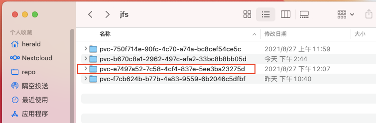

# Use JuiceFS on Kubernetes

JuiceFS is ideal for use as a storage layer for Kubernetes clusters, and currently has two common uses.

## JuiceFS CSI Driver

:::tip
It is recommended to use the deployment method of the JuiceFS CSI Driver in Kubernetes. For more information about the JuiceFS CSI Driver, please visit [project homepage](https://juicefs.com/docs/csi/introduction).
:::

[JuiceFS CSI Driver](https://github.com/juicedata/juicefs-csi-driver) follows the [CSI](https://github.com/container-storage-interface/spec/blob/master/spec.md) specification, implements the interface between the container orchestration system and the JuiceFS file system, and supports dynamic configured JuiceFS volumes for use by Pod.

### Prerequisites

- Kubernetes 1.14+

### Installation

There are two ways to install JuiceFS CSI Driver.

#### 1. Install via Helm

##### Prerequisites

- Helm 3.1.0+

##### Install Helm

Helm is a tool for managing Kubernetes charts. Charts are packages of pre-configured Kubernetes resources.

To install Helm, refer to the [Helm Installation Guide](https://helm.sh/docs/intro/install) and ensure that the `helm` binary is in the `PATH` of your shell.

##### Using Helm To Deploy

1. Prepare a YAML file

   Create a configuration file, for example: `values.yaml`, copy and complete the following configuration information. Among them, the `backend` part is the information related to the JuiceFS file system, you can refer to ["JuiceFS Quick Start Guide"](../getting-started/README.md) for more information. If you are using a JuiceFS volume that has been created, you only need to fill in the two items `name` and `metaurl`. The `mountPod` part can specify CPU/memory limits and requests of mount pod for pods using this driver. Unneeded items should be deleted, or its value should be left blank.

   :::info
   Please refer to [documentation](https://github.com/juicedata/charts/blob/main/charts/juicefs-csi-driver/README.md#values) for all configuration items supported by Helm chart of JuiceFS CSI Driver
   :::

   ```yaml title="values.yaml"
   storageClasses:
   - name: juicefs-sc
     enabled: true
     reclaimPolicy: Retain
     backend:
       name: "<name>"
       metaurl: "<meta-url>"
       storage: "<storage-type>"
       accessKey: "<access-key>"
       secretKey: "<secret-key>"
       bucket: "<bucket>"
       # If you need to set the time zone of the JuiceFS Mount Pod, please uncomment the next line, the default is UTC time.
       # envs: "{TZ: Asia/Shanghai}"
     mountPod:
       resources:
         limits:
           cpu: "<cpu-limit>"
           memory: "<memory-limit>"
         requests:
           cpu: "<cpu-request>"
           memory: "<memory-request>"
   ```

2. Check and update kubelet root directory

   Execute the following command.

   ```shell
   ps -ef | grep kubelet | grep root-dir
   ```

   If the result is not empty, it means that the root directory (`--root-dir`) of kubelet is not the default value (`/var/lib/kubelet`) and you need to set `kubeletDir` to the current root directly of kubelet in the configuration file `values.yaml` prepared in the first step.

   ```yaml
   kubeletDir: <kubelet-dir>
   ```

3. Deploy

   Execute the following three commands in sequence to deploy the JuiceFS CSI Driver through Helm.

   ```sh
   helm repo add juicefs-csi-driver https://juicedata.github.io/charts/
   helm repo update
   helm install juicefs-csi-driver juicefs-csi-driver/juicefs-csi-driver -n kube-system -f ./values.yaml
   ```

4. Check the deployment

   - **Check pods are running**: the deployment will launch a `StatefulSet` named `juicefs-csi-controller` with replica `1` and a `DaemonSet` named `juicefs-csi-node`, so run `kubectl -n kube-system get pods -l app.kubernetes.io/name=juicefs-csi-driver` should see `n+1` (where `n` is the number of worker nodes of the Kubernetes cluster) pods is running. For example:

     ```sh
     $ kubectl -n kube-system get pods -l app.kubernetes.io/name=juicefs-csi-driver
     NAME                       READY   STATUS    RESTARTS   AGE
     juicefs-csi-controller-0   3/3     Running   0          22m
     juicefs-csi-node-v9tzb     3/3     Running   0          14m
     ```

   - **Check secret**: `kubectl -n kube-system describe secret juicefs-sc-secret` will show the secret with above `backend` fields in `values.yaml`:

     ```
     Name:         juicefs-sc-secret
     Namespace:    kube-system
     Labels:       app.kubernetes.io/instance=juicefs-csi-driver
                   app.kubernetes.io/managed-by=Helm
                   app.kubernetes.io/name=juicefs-csi-driver
                   app.kubernetes.io/version=0.7.0
                   helm.sh/chart=juicefs-csi-driver-0.1.0
     Annotations:  meta.helm.sh/release-name: juicefs-csi-driver
                   meta.helm.sh/release-namespace: default

     Type:  Opaque

     Data
     ====
     access-key:  0 bytes
     bucket:      47 bytes
     metaurl:     54 bytes
     name:        4 bytes
     secret-key:  0 bytes
     storage:     2 bytes
     ```

   - **Check storage class**: `kubectl get sc juicefs-sc` will show the storage class like this:

     ```
     NAME         PROVISIONER       RECLAIMPOLICY   VOLUMEBINDINGMODE   ALLOWVOLUMEEXPANSION   AGE
     juicefs-sc   csi.juicefs.com   Retain          Immediate           false                  69m
     ```

#### 2. Install via kubectl

Since Kubernetes will deprecate some old APIs when a new version is released, you need to choose the appropriate deployment configuration file.

1. Check the root directory path of kubelet

   Execute the following command on any non-Master node in the Kubernetes cluster.

   ```shell
   ps -ef | grep kubelet | grep root-dir
   ```

2. Deploy

   - **If the check command returns a non-empty result**, it means that the root directory (`--root-dir`) of the kubelet is not the default (`/var/lib/kubelet`), so you need to update the `kubeletDir` path in the CSI Driver's deployment file and deploy.

     :::note
     Please replace `{{KUBELET_DIR}}` in the below command with the actual root directory path of kubelet.
     :::

     ```shell
     # Kubernetes version >= v1.18
     curl -sSL https://raw.githubusercontent.com/juicedata/juicefs-csi-driver/master/deploy/k8s.yaml | sed 's@/var/lib/kubelet@{{KUBELET_DIR}}@g' | kubectl apply -f -
     ```

     ```shell
     # Kubernetes version < v1.18
     curl -sSL https://raw.githubusercontent.com/juicedata/juicefs-csi-driver/master/deploy/k8s_before_v1_18.yaml | sed 's@/var/lib/kubelet@{{KUBELET_DIR}}@g' | kubectl apply -f -
     ```

   - **If the check command returns an empty result**, you can deploy directly without modifying the configuration:

     ```shell
     # Kubernetes version >= v1.18
     kubectl apply -f https://raw.githubusercontent.com/juicedata/juicefs-csi-driver/master/deploy/k8s.yaml
     ```

     ```shell
     # Kubernetes version < v1.18
     kubectl apply -f https://raw.githubusercontent.com/juicedata/juicefs-csi-driver/master/deploy/k8s_before_v1_18.yaml
     ```

3. Create storage class

   Create a configuration file with reference to the following content, for example: `juicefs-sc.yaml`, fill in the configuration information of the JuiceFS file system in the `stringData` section:

   ```yaml title="juicefs-sc.yaml" {7-15}
   apiVersion: v1
   kind: Secret
   metadata:
     name: juicefs-sc-secret
     namespace: kube-system
   type: Opaque
   stringData:
     name: "test"
     metaurl: "redis://juicefs.afyq4z.0001.use1.cache.amazonaws.com/3"
     storage: "s3"
     bucket: "https://juicefs-test.s3.us-east-1.amazonaws.com"
     access-key: ""
     secret-key: ""
     # If you need to set the time zone of the JuiceFS Mount Pod, please uncomment the next line, the default is UTC time.
     # envs: "{TZ: Asia/Shanghai}"
   ---
   apiVersion: storage.k8s.io/v1
   kind: StorageClass
   metadata:
     name: juicefs-sc
   provisioner: csi.juicefs.com
   reclaimPolicy: Retain
   volumeBindingMode: Immediate
   parameters:
     csi.storage.k8s.io/node-publish-secret-name: juicefs-sc-secret
     csi.storage.k8s.io/node-publish-secret-namespace: kube-system
     csi.storage.k8s.io/provisioner-secret-name: juicefs-sc-secret
     csi.storage.k8s.io/provisioner-secret-namespace: kube-system
   ```

   Execute the command to deploy the storage class:

   ```shell
   kubectl apply -f ./juicefs-sc.yaml
   ```

   In addition, you can also extract the `Secret` part from the configuration file above, and append them as command line options of `kubectl`:

   ```bash
   kubectl -n kube-system create secret generic juicefs-sc-secret \
     --from-literal=name=test \
     --from-literal=metaurl=redis://juicefs.afyq4z.0001.use1.cache.amazonaws.com/3 \
     --from-literal=storage=s3 \
     --from-literal=bucket=https://juicefs-test.s3.us-east-1.amazonaws.com \
     --from-literal=access-key="" \
     --from-literal=secret-key=""
   ```

   In this way, the storage class configuration file `juicefs-sc.yaml` should look like the following:

   ```yaml title="juicefs-sc.yaml"
   apiVersion: storage.k8s.io/v1
   kind: StorageClass
   metadata:
     name: juicefs-sc
   provisioner: csi.juicefs.com
   reclaimPolicy: Retain
   parameters:
     csi.storage.k8s.io/node-publish-secret-name: juicefs-sc-secret
     csi.storage.k8s.io/node-publish-secret-namespace: kube-system
     csi.storage.k8s.io/provisioner-secret-name: juicefs-sc-secret
     csi.storage.k8s.io/provisioner-secret-namespace: kube-system
   ```

   Then deploy the storage class with `kubectl apply`:

   ```shell
   kubectl apply -f ./juicefs-sc.yaml
   ```

### Use JuiceFS to provide storage for Pods

JuiceFS CSI Driver supports both static and dynamic PersistentVolume (PV). You can either manually assign the PV created previously to Pods, or dynamically create volumes by using PersistentVolumeClaim (PVC) when Pods are deployed.

For example, you can use the following configuration to create a configuration file named `development.yaml`, which creates a PersistentVolume for the Nginx container by using PersistentVolumeClaim and mounts it to the directory `/config` of the container:

```yaml title="development.yaml"
apiVersion: v1
kind: PersistentVolumeClaim
metadata:
  name: web-pvc
spec:
  accessModes:
    - ReadWriteMany
  resources:
    requests:
      storage: 10Pi
  storageClassName: juicefs-sc
---
apiVersion: apps/v1
kind: Deployment
metadata:
  name: nginx-run
spec:
  selector:
    matchLabels:
      app: nginx
  template:
    metadata:
      labels:
        app: nginx
    spec:
      containers:
        - name: nginx
          image: linuxserver/nginx
          ports:
            - containerPort: 80
          volumeMounts:
            - mountPath: /config
              name: web-data
      volumes:
        - name: web-data
          persistentVolumeClaim:
            claimName: web-pvc
```

Deploy Pods with command `kubectl apply`:

```
kubectl apply -f ./development.yaml
```

After the deployment succeeds, check the pods status:

```shell
$ kubectl get pods
NAME                         READY   STATUS    RESTARTS   AGE
nginx-run-7d6fb7d6df-cfsvp   1/1     Running   0          21m
```

You can simply use the `kubectl exec` command to view the file system mount status in the container:

```shell
$ kubectl exec nginx-run-7d6fb7d6df-cfsvp -- df -Th
Filesystem     Type          Size  Used Avail Use% Mounted on
overlay        overlay        40G  7.0G   34G  18% /
tmpfs          tmpfs          64M     0   64M   0% /dev
tmpfs          tmpfs         3.8G     0  3.8G   0% /sys/fs/cgroup
JuiceFS:jfs    fuse.juicefs  1.0P  180M  1.0P   1% /config
...
```

From the results returned from the container, you can see that it is in full compliance with expectations, and the JuiceFS volume has been mounted to the `/config` directory you specified.

When a PersistentVolume is dynamically created using PersistentVolumeClaim as above, JuiceFS will create a directory with the same name as the PersistentVolume in the root directory of the file system and mount it to the container. Execute the following command to view all PersistentVolumes in the cluster:

```shell
$ kubectl get pv -A
NAME                                       CAPACITY   ACCESS MODES   RECLAIM POLICY   STATUS   CLAIM             STORAGECLASS   REASON   AGE
pvc-b670c8a1-2962-497c-afa2-33bc8b8bb05d   10Pi       RWX            Retain           Bound    default/web-pvc   juicefs-sc              34m
```

Mount the same JuiceFS storage from an external host, and you can see the PersistentVolumes currently in use and the PersistentVolumes that have been created.



### Create more JuiceFS storage classes

You can repeat the previous steps to create as many storage classes as needed by using JuiceFS CSI Driver. Don't forget to modify the name of the storage class and the configuration information of the JuiceFS file system to avoid conflicts with the previously created storage classes. For example, when using Helm, you can create a configuration file named `juicefs-sc2.yaml`:

```yaml title="juicefs-sc2.yaml"
storageClasses:
- name: juicefs-sc2
  enabled: true
  reclaimPolicy: Retain
  backend:
    name: "jfs-2"
    metaurl: "redis://example.abc.0001.use1.cache.amazonaws.com/3"
    storage: "s3"
    accessKey: ""
    secretKey: ""
    bucket: "https://jfs2.s3.us-east-1.amazonaws.com"
```

Execute the Helm command to deploy:

```shell
helm repo add juicefs-csi-driver https://juicedata.github.io/charts/
helm repo update
helm upgrade juicefs-csi-driver juicefs-csi-driver/juicefs-csi-driver --install -f ./juicefs-sc2.yaml
```

View the storage classes in the cluster:

```shell
$ kubectl get sc
NAME                 PROVISIONER                RECLAIMPOLICY   VOLUMEBINDINGMODE   ALLOWVOLUMEEXPANSION   AGE
juicefs-sc           csi.juicefs.com            Retain          Immediate           false                  88m
juicefs-sc2          csi.juicefs.com            Retain          Immediate           false                  13m
standard (default)   k8s.io/minikube-hostpath   Delete          Immediate           false                  128m
```

### Monitoring

Please refer to ["Monitoring"](../administration/monitoring.md) to learn how to collect and show JuiceFS monitoring metrics.

### Learn more

To learn more about the JuiceFS CSI Driver, please visit the [project homepage](https://juicefs.com/docs/csi/introduction).

## Mount JuiceFS in the container

In some cases, you may need to mount JuiceFS volume directly in the container, which requires the use of the JuiceFS client in the container. You can refer to the following `Dockerfile` example to integrate the JuiceFS client into your application image:

```dockerfile title="Dockerfile"
FROM alpine:latest
LABEL maintainer="Juicedata <https://juicefs.com>"

# Install JuiceFS client
RUN apk add --no-cache curl && \
  JFS_LATEST_TAG=$(curl -s https://api.github.com/repos/juicedata/juicefs/releases/latest | grep 'tag_name' | cut -d '"' -f 4 | tr -d 'v') && \
  wget "https://github.com/juicedata/juicefs/releases/download/v${JFS_LATEST_TAG}/juicefs-${JFS_LATEST_TAG}-linux-amd64.tar.gz" && \
  tar -zxf "juicefs-${JFS_LATEST_TAG}-linux-amd64.tar.gz" && \
  install juicefs /usr/bin && \
  rm juicefs "juicefs-${JFS_LATEST_TAG}-linux-amd64.tar.gz" && \
  rm -rf /var/cache/apk/* && \
  apk del curl

ENTRYPOINT ["/usr/bin/juicefs", "mount"]
```

Since JuiceFS needs to use the FUSE device to mount the file system, it is necessary to allow the container to run in privileged mode when creating a Pod:

```yaml {19-20}
apiVersion: apps/v1
kind: Deployment
metadata:
  name: nginx-run
spec:
  selector:
    matchLabels:
      app: nginx
  template:
    metadata:
      labels:
        app: nginx
    spec:
      containers:
        - name: nginx
          image: linuxserver/nginx
          ports:
            - containerPort: 80
          securityContext:
            privileged: true
```

:::caution
With the privileged mode being enabled by `privileged: true`, the container has access to all devices of the host, that is, it has full control of the host's kernel. Improper uses will bring serious safety hazards. Please conduct a thorough safety assessment before using it.
:::
