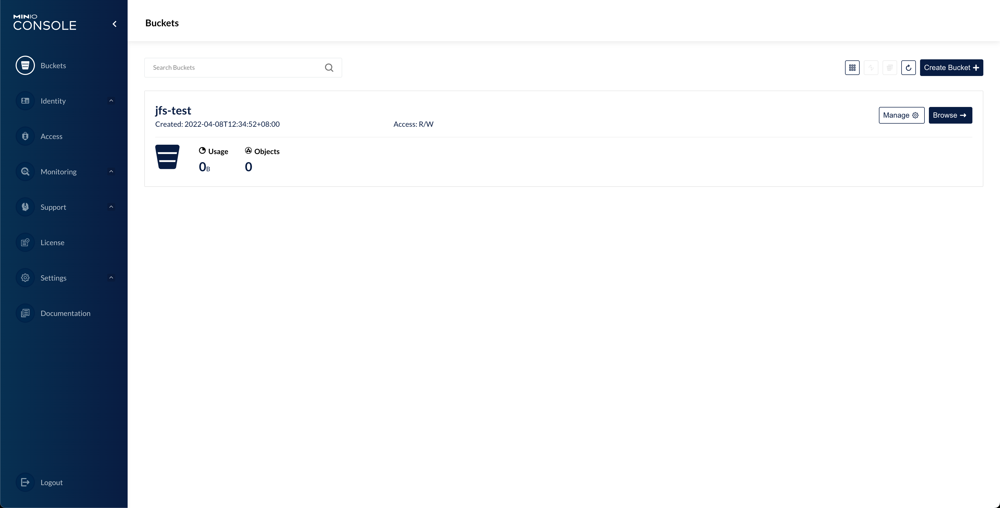

# Deploy JuiceFS S3 Gateway

JuiceFS has introduced S3 gateway since v0.11. The feature is implemented based on the [MinIO S3 Gateway](https://docs.min.io/docs/minio-gateway-for-s3.html). It provides an S3-compatible RESTful API for files on JuiceFS, enabling the management of files stored on JuiceFS with tools such as s3cmd, AWS CLI, and MinIO Client (mc) in cases where mounting is not convenient. In addition, S3 gateway also provides a web-based file manager that allows users to manage files in web browsers.

Since JuiceFS stores files in chunks, the files cannot be accessed directly through the interfaces of the underlying object storage. The S3 gateway accesses the underlying object storage in a similar way, shown in the following architecture diagram.


## Prerequisites

The S3 gateway is a feature built on top of the JuiceFS file system. If you do not have a JuiceFS file system, please refer to the [quick start guide](../getting-started/README.md) to create one first.

JuiceFS S3 gateway is a feature introduced since v0.11. Please make sure you have the latest version of JuiceFS.

## Quickstart

The S3 gateway can be enabled on the current host using the `gateway` subcommand of JuiceFS. Before enabling the feature, you need to set the environment variables `MINIO_ROOT_USER` and `MINIO_ROOT_PASSWORD`. These are the Access Key and Secret Key for authenticating when accessing the S3 API, and can be simply considered as the username and password of the S3 gateway. For example.

```shell
export MINIO_ROOT_USER=admin
export MINIO_ROOT_PASSWORD=12345678
```

```shell
juicefs gateway redis://localhost:6379 localhost:9000
```

The first two commands of the above three are used to set environment variables. Note that the length of `MINIO_ROOT_USER` is at least 3 characters, and the length of `MINIO_ROOT_PASSWORD` is at least 8 characters. If you are a Windows user, replace `export` with `set` in the above commands to set the environment variable. i.e., `set MINIO_ROOT_USER=admin`.

The last command is used to enable the S3 gateway. The `gateway` subcommand requires at least two parameters. The first is the URL of the database where the metadata is stored, and the second is the address and port on which the S3 gateway is listening. You can add [other options](../reference/command_reference.md#juicefs-gateway) to the `gateway` subcommand to optimize the S3 gateway as needed, for example, to set the default local cache to 20 GiB.

```shell
juicefs gateway --cache-size 20480 redis://localhost:6379 localhost:9000
```

In this example, we assume that the JuiceFS file system is using a local Redis database. When the S3 gateway is enabled, the administrative interface of the S3 gateway can be accessed from the **current host** using the address `http://localhost:9000`.


If you want to access the S3 gateway from other hosts on the LAN or over the Internet, you need to change the listening address, e.g.

```shell
juicefs gateway redis://localhost:6379 0.0.0.0:9000
```

In this way, the S3 gateway will accept all network requests by default. S3 clients in different locations can access the S3 gateway using different addresses, e.g.

- A third-party client in the host where the S3 gateway is located can use `http://127.0.0.1:9000` or `http://localhost:9000` for access.
- A third-party client on the same LAN as the host where the S3 gateway is located can access it using `http://192.168.1.8:9000` (assuming the intranet IP address of the S3 gateway-enabled host is 192.168.1.8).
- The S3 gateway can be accessed over the Internet using `http://110.220.110.220:9000` (assuming that the public IP address of the S3 gateway-enabled host is 110.220.110.220).

## Configure S3 Gaterway as Daemon Service

The S3 gateway can be configured as a `daemon service` with `systemd`.

```shell
cat > /lib/systemd/system/juicefs-gateway.service<<EOF
[Unit]
Description=Juicefs S3 Gateway
Requires=network.target
After=multi-user.target
StartLimitIntervalSec=0

[Service]
Type=simple
User=root
Environment="MINIO_ROOT_USER=admin"
Environment="MINIO_ROOT_PASSWORD=12345678"
ExecStart=/usr/local/bin/juicefs gateway redis://localhost:6379 localhost:9000
Restart=on-failure
RestartSec=60

[Install]
WantedBy=multi-user.target
EOF
```

To enable the service at starup

```shell
sudo systemctl daemon-reload
sudo systemctl enable juicefs-gateway --now
sudo systemctl status juicefs-gateway
```

To inspect logs

```bash
sudo journalctl -xefu juicefs-gateway.service
```

## Access S3 Gateway

The JuiceFS S3 gateway can be accessed by various clients, desktop applications, web applications, etc. that support the S3 API. Please note the address and port that the S3 gateway listens on when using it.

:::tip
The following examples are for using a third-party client to access the S3 gateway running on the local host. In specific scenarios, please adjust the address to access the S3 gateway according to the actual situation.
:::

### Use the AWS CLI

Download and install the AWS CLI from [https://aws.amazon.com/cli](https://aws.amazon.com/cli), then configure:

```bash
$ aws configure
AWS Access Key ID [None]: admin
AWS Secret Access Key [None]: 12345678
Default region name [None]:
Default output format [None]:
```

The program will guide you interactively to add the new configuration, where `Access Key ID` and `Secret Access Key` are the same as `MINIO_ROOT_USER` and `MINIO_ROOT_PASSWORD`, respectively. The region name and output format should be left blank.

After that, you can access the JuiceFS storage using the `aws s3` command, for example:

```bash
# List buckets
aws --endpoint-url http://localhost:9000 s3 ls

# List objects in bucket
aws --endpoint-url http://localhost:9000 s3 ls s3://<bucket>
```

### Use the MinIO client

First install `mc` by referring to the [MinIO download page](https://min.io/download), then add a new alias:

```bash
mc alias set juicefs http://localhost:9000 admin 12345678 --api S3v4
```

Following the mc command format, the above command creates a configuration with the alias `juicefs`. Note that the API version `-api S3v4` must be specified in the command.

Then, you can freely manage files and folders by copying, moving, adding and deleting between your local disk and JuiceFS storage as well as other cloud storage via the mc client.

```shell
$ mc ls juicefs/jfs
[2021-10-20 11:59:00 CST] 130KiB avatar-2191932_1920.png
[2021-10-20 11:59:00 CST] 4.9KiB box-1297327.svg
[2021-10-20 11:59:00 CST]  21KiB cloud-4273197.svg
[2021-10-20 11:59:05 CST]  17KiB hero.svg
[2021-10-20 11:59:06 CST] 1.7MiB hugo-rocha-qFpnvZ_j9HU-unsplash.jpg
[2021-10-20 11:59:06 CST]  16KiB man-1352025.svg
[2021-10-20 11:59:06 CST] 1.3MiB man-1459246.ai
[2021-10-20 11:59:08 CST]  19KiB sign-up-accent-left.07ab168.svg
[2021-10-20 11:59:10 CST]  11MiB work-4997565.svg
```

## Deploy JuiceFS S3 Gateway in Kubernetes

### Install via kubectl

Create a secret (take Amazon S3 as an example):

```shell
export NAMESPACE=default
```

```shell
kubectl -n ${NAMESPACE} create secret generic juicefs-secret \
    --from-literal=name=<NAME> \
    --from-literal=metaurl=redis://[:<PASSWORD>]@<HOST>:6379[/<DB>] \
    --from-literal=storage=s3 \
    --from-literal=bucket=https://<BUCKET>.s3.<REGION>.amazonaws.com \
    --from-literal=access-key=<ACCESS_KEY> \
    --from-literal=secret-key=<SECRET_KEY>
```

Here we have:

- `name`: name of the JuiceFS file system.
- `metaurl`: URL of the metadata engine (e.g. Redis). Read [this document](../guide/how_to_set_up_metadata_engine.md) for more information.
- `storage`: Object storage type, such as `s3`, `gs`, `oss`. Read [this document](../guide/how_to_set_up_object_storage.md) to find all supported object storages.
- `bucket`: Bucket URL. Read [this document](../guide/how_to_set_up_object_storage.md) to learn how to set up different object storage.
- `access-key`: Access key of object storage. Read [this document](../guide/how_to_set_up_object_storage.md) for more information.
- `secret-key`: Secret key of object storage. Read [this document](../guide/how_to_set_up_object_storage.md) for more information.

Then download the S3 gateway [deployment YAML](https://github.com/juicedata/juicefs/blob/main/deploy/juicefs-s3-gateway.yaml) and create the `Deployment` and `Service` resources with `kubectl`. The following points require special attention:

- Please replace `${NAMESPACE}` in the following command with the Kubernetes namespace of the actual S3 gateway deployment, which defaults to `kube-system`.
- The `replicas` for `Deployment` defaults to 1. Please adjust as needed.
- The latest version of `juicedata/juicefs-csi-driver` image is used by default, which has already integrated the latest version of JuiceFS client. Please check [here](https://github.com/juicedata/juicefs-csi-driver/releases) for the specific integrated JuiceFS client version.
- The `initContainers` of `Deployment` will first try to format the JuiceFS file system, if you have already formatted it in advance, this step will not affect the existing JuiceFS file system.
  - The default port number that the S3 gateway listens on is 9000
- The [startup options](../reference/command_reference.md#juicefs-gateway) of S3 gateway will use default values if not specified.
- The value of `MINIO_ROOT_USER` environment variable is `access-key` in Secret, and the value of `MINIO_ROOT_PASSWORD` environment variable is `secret-key` in Secret.

```shell
curl -sSL https://raw.githubusercontent.com/juicedata/juicefs/main/deploy/juicefs-s3-gateway.yaml | sed "s@kube-system@${NAMESPACE}@g" | kubectl apply -f -
```

Check if it's deployed successfully:

```shell
$ kubectl -n $NAMESPACE get po -o wide -l app.kubernetes.io/name=juicefs-s3-gateway
juicefs-s3-gateway-5c7d65c77f-gj69l         1/1     Running   0          37m     10.244.2.238   kube-node-3   <none>           <none>
```

```shell
$ kubectl -n $NAMESPACE get svc -l app.kubernetes.io/name=juicefs-s3-gateway
NAME                 TYPE        CLUSTER-IP      EXTERNAL-IP   PORT(S)    AGE
juicefs-s3-gateway   ClusterIP   10.101.108.42   <none>        9000/TCP   142m
```

You can use `juicefs-s3-gateway.${NAMESPACE}.svc.cluster.local:9000` or pod IP and port number of `juicefs-s3-gateway` (e.g. `10.244.2.238:9000`) in the application pod to access JuiceFS S3 Gateway.

If you want to access through Ingress, you need to ensure that the Ingress Controller has been deployed in the cluster. Refer to [Ingress Controller Deployment Document](https://kubernetes.github.io/ingress-nginx/deploy/). Then create an `Ingress` resource:

```yaml
kubectl apply -f - <<EOF
apiVersion: networking.k8s.io/v1
kind: Ingress
metadata:
  name: juicefs-s3-gateway
  namespace: ${NAMESPACE}
spec:
  ingressClassName: nginx
  rules:
  - http:
      paths:
      - path: /
        pathType: Prefix
        backend:
          service:
            name: juicefs-s3-gateway
            port:
              number: 9000
EOF
```

The S3 gateway can be accessed through `<external IP>` of ingress controller as follows (no need to include the 9000 port number):

```shell
kubectl get services -n ingress-nginx
```

There are some differences between the various versions of Ingress. For more usage methods, please refer to [Ingress Controller Usage Document](https://kubernetes.github.io/ingress-nginx/user-guide/basic-usage/).

### Install via Helm

1. Prepare a YAML file

   Create a configuration file, for example: `values.yaml`. Copy and fill in the following configuration information. Among them, the `secret` part is the information related to the JuiceFS file system, and you can refer to [JuiceFS Quick Start Guide](../getting-started/README.md) for more information.

   ```yaml title="values.yaml"
   secret:
     name: "<name>"
     metaurl: "<meta-url>"
     storage: "<storage-type>"
     accessKey: "<access-key>"
     secretKey: "<secret-key>"
     bucket: "<bucket>"
   ```

   If you want to deploy Ingress, add the following snippet into `values.yaml`:

   ```yaml title="values.yaml"
   ingress:
     enables: true
   ```

2. Deploy

   Execute the following three commands in sequence to deploy the JuiceFS S3 gateway with Helm (note that the following example is deployed to the `kube-system` namespace).

   ```sh
   helm repo add juicefs-s3-gateway https://juicedata.github.io/charts/
   helm repo update
   helm install juicefs-s3-gateway juicefs-s3-gateway/juicefs-s3-gateway -n kube-system -f ./values.yaml
   ```

3. Check the deployment

   - **Check pods are running**: the deployment will launch a `Deployment` named `juicefs-s3-gateway`, so run `kubectl -n kube-system get po -l app.kubernetes.io/name=juicefs-s3-gateway` should see all running pods. For example:

     ```sh
     $ kubectl -n kube-system get po -l app.kubernetes.io/name=juicefs-s3-gateway
     NAME                                  READY   STATUS    RESTARTS   AGE
     juicefs-s3-gateway-5c69d574cc-t92b6   1/1     Running   0          136m
     ```

   - **Check Service**: run `kubectl -n kube-system get svc -l app.kubernetes.io/name=juicefs-s3-gateway` to check Service:

     ```shell
     $ kubectl -n kube-system get svc -l app.kubernetes.io/name=juicefs-s3-gateway
     NAME                 TYPE        CLUSTER-IP      EXTERNAL-IP   PORT(S)    AGE
     juicefs-s3-gateway   ClusterIP   10.101.108.42   <none>        9000/TCP   142m
     ```

## Monitoring

Please see the ["Monitoring"](../administration/monitoring.md) documentation to learn how to collect and display JuiceFS monitoring metrics.

## Use a full-featured S3 gateway

If you need to use some advanced features of the MinIO S3 gateway, you can pull [the gateway branch of this repository](https://github.com/juicedata/minio/tree/gateway) and compile MinIO yourself. This branch is developed based on [MinIO RELEASE.2022-03-05T06-32-39Z](https://github.com/minio/minio/tree/RELEASE.2022-03-05T06-32-39Z) with JuiceFS gateway supported, which supports full functionality of MinIO gateways such as [multi-user management](https://docs.min.io/docs/minio-multi-user-quickstart-guide.html) while using JuiceFS as a backend.

### Compile

:::tip
This branch relies on a newer version of JuiceFS. Please refer to the [`go.mod`](https://github.com/juicedata/minio/blob/gateway/go.mod) file for the specific JuiceFS version.

Similar to [manually compiling JuiceFS client](../getting-started/installation.md#manually-compiling), you need to install some dependencies in advance to compile S3 gateway.
:::

```shell
git clone -b gateway git@github.com:juicedata/minio.git && cd minio
```

```shell
# Will generate a binary named minio
make build
```

### Usage

The usage of this version of MinIO gateway is exactly the same as that of the native MinIO gateway. For the usage of native functions, please refer to MinIO's [document](https://docs.min.io/docs/minio-gateway-for-s3.html), while JuiceFS's own configuration options can be passed in via the command line. You can use `minio gateway juicefs -h` to see all currently supported options.

Similar to the S3 gateway integrated with JuiceFS, the gateway service can be started with the following command:

```shell
export MINIO_ROOT_USER=admin
export MINIO_ROOT_PASSWORD=12345678
```

```shell
./minio gateway juicefs --console-address ':59001' redis://localhost:6379
```

The port number of the S3 gateway console is explicitly specified here as 59001. If not specified, a port will be randomly assigned. According to the command line prompt, open the address [http://127.0.0.1:59001](http://127.0.0.1:59001) in the browser to access the console, as shown in the following snapshot:


