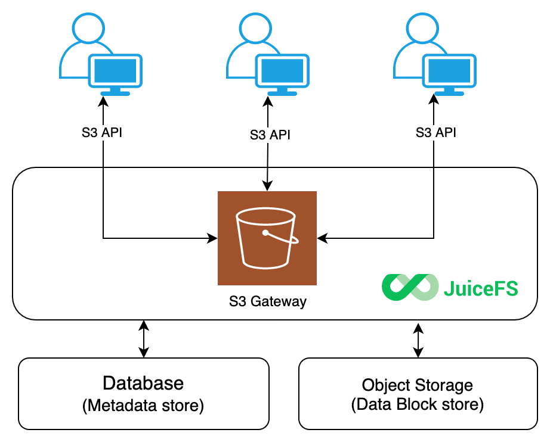

JuiceFS [splits and upload files to the underlying object storage](../introduction/architecture.md#how-juicefs-store-files), applications often use the exposed POSIX API. But if you ever need to use S3-compatible API to access JuiceFS files, S3 Gateway comes in handy, its architecture:



JuiceFS Gateway implements its functionalities through [MinIO S3 Gateway](https://github.com/minio/minio/tree/ea1803417f80a743fc6c7bb261d864c38628cf8d/docs/gateway). By implementing its [object interface](https://github.com/minio/minio/blob/d46386246fb6db5f823df54d932b6f7274d46059/cmd/object-api-interface.go#L88) and using the JuiceFS file system as the backend storage for its server, JuiceFS has achieved a use experience almost the same as using native MinIO and inherited many advanced features from MinIO. In this architecture, JuiceFS acts as a local disk for MinIO's server command, similar to `minio server /data1` in principle.

Common application scenarios for JuiceFS Gateway include:

* Expose S3 API for JuiceFS file system, so that applications may access JuiceFS via S3 SDK
* Use tools like s3cmd, AWS CLI and MinIO Client to access and modify files stored in JuiceFS
* S3 gateway also provides a file manager that allows users to manage JuiceFS file system directly in web browsers
* When transferring data across regions, use S3 Gateway as an unified data export endpoint, this eliminates metadata latency and improve performance. See [Sync across regions using S3 Gateway](../guide/sync.md#sync-across-region)

## Quick Start

The S3 gateway can be enabled on the current host using the `gateway` subcommand of JuiceFS. Before enabling the feature, you need to set the environment variables `MINIO_ROOT_USER` and `MINIO_ROOT_PASSWORD`. These are the Access Key and Secret Key for authenticating when accessing the S3 API, and can be simply considered as the username and password of the S3 gateway. For example.

```shell
export MINIO_ROOT_USER=admin
export MINIO_ROOT_PASSWORD=12345678
```

```shell
juicefs gateway redis://localhost:6379 localhost:9000
```

The first two commands of the above three are used to set environment variables. Note that the length of `MINIO_ROOT_USER` is at least 3 characters, and the length of `MINIO_ROOT_PASSWORD` is at least 8 characters. If you are a Windows user, replace `export` with `set` in the above commands to set the environment variable. i.e., `set MINIO_ROOT_USER=admin`.

The last command is used to enable the S3 gateway. The `gateway` subcommand requires at least two parameters. The first is the URL of the database where the metadata is stored, and the second is the address and port on which the S3 gateway is listening. You can add [other options](../reference/command_reference.md#gateway) to the `gateway` subcommand to optimize the S3 gateway as needed, for example, to set the default local cache to 20 GiB.

```shell
juicefs gateway --cache-size 20480 redis://localhost:6379 localhost:9000
```

In this example, we assume that the JuiceFS file system is using a local Redis database. When the S3 gateway is enabled, the administrative interface of the S3 gateway can be accessed from the **current host** using the address `http://localhost:9000`.


If you want to access the S3 gateway from other hosts on the LAN or over the Internet, you need to change the listening address, e.g.

```shell
juicefs gateway redis://localhost:6379 0.0.0.0:9000
```

In this way, the S3 gateway will accept all network requests by default. S3 clients in different locations can access the S3 gateway using different addresses, e.g.

- A third-party client in the host where the S3 gateway is located can use `http://127.0.0.1:9000` or `http://localhost:9000` for access.
- A third-party client on the same LAN as the host where the S3 gateway is located can access it using `http://192.168.1.8:9000` (assuming the intranet IP address of the S3 gateway-enabled host is 192.168.1.8).
- The S3 gateway can be accessed over the Internet using `http://110.220.110.220:9000` (assuming that the public IP address of the S3 gateway-enabled host is 110.220.110.220).

## Run in the background

Starting from version 1.2, JuiceFS Gateway supports running in the background. Simply add the `-d`` parameter when starting:

```
juicefs gateway redis://localhost:6379 localhost:9000 -d
```

When running in the background, you can specify the log output file path using `--log`.

## Run as a daemon service

The S3 gateway can be configured as a `daemon service` with `systemd`.

```shell
cat > /lib/systemd/system/juicefs-gateway.service<<EOF
[Unit]
Description=Juicefs S3 Gateway
Requires=network.target
After=multi-user.target
StartLimitIntervalSec=0

[Service]
Type=simple
User=root
Environment="MINIO_ROOT_USER=admin"
Environment="MINIO_ROOT_PASSWORD=12345678"
ExecStart=/usr/local/bin/juicefs gateway redis://localhost:6379 localhost:9000
Restart=on-failure
RestartSec=60

[Install]
WantedBy=multi-user.target
EOF
```

To enable the service at startup

```shell
sudo systemctl daemon-reload
sudo systemctl enable juicefs-gateway --now
sudo systemctl status juicefs-gateway
```

To inspect logs

```bash
sudo journalctl -xefu juicefs-gateway.service
```

## Deploy JuiceFS Gateway in Kubernetes {#deploy-in-kubernetes}

### Install via kubectl

Create a secret (take Amazon S3 as an example):

```shell
export NAMESPACE=default
```

```shell
kubectl -n ${NAMESPACE} create secret generic juicefs-secret \
    --from-literal=name=<NAME> \
    --from-literal=metaurl=redis://[:<PASSWORD>]@<HOST>:6379[/<DB>] \
    --from-literal=storage=s3 \
    --from-literal=bucket=https://<BUCKET>.s3.<REGION>.amazonaws.com \
    --from-literal=access-key=<ACCESS_KEY> \
    --from-literal=secret-key=<SECRET_KEY>
```

Here we have:

- `name`: name of the JuiceFS file system.
- `metaurl`: URL of the metadata engine (e.g. Redis). Read [this document](../reference/how_to_set_up_metadata_engine.md) for more information.
- `storage`: Object storage type, such as `s3`, `gs`, `oss`. Read [this document](../reference/how_to_set_up_object_storage.md) to find all supported object storages.
- `bucket`: Bucket URL. Read [this document](../reference/how_to_set_up_object_storage.md) to learn how to set up different object storage.
- `access-key`: Access key of object storage. Read [this document](../reference/how_to_set_up_object_storage.md) for more information.
- `secret-key`: Secret key of object storage. Read [this document](../reference/how_to_set_up_object_storage.md) for more information.

Then download the S3 gateway [deployment YAML](https://github.com/juicedata/juicefs/blob/main/deploy/juicefs-s3-gateway.yaml) and create the `Deployment` and `Service` resources with `kubectl`. The following points require special attention:

- Please replace `${NAMESPACE}` in the following command with the Kubernetes namespace of the actual S3 gateway deployment, which defaults to `kube-system`.
- The `replicas` for `Deployment` defaults to 1. Please adjust as needed.
- The latest version of `juicedata/juicefs-csi-driver` image is used by default, which has already integrated the latest version of JuiceFS client. Please check [here](https://github.com/juicedata/juicefs-csi-driver/releases) for the specific integrated JuiceFS client version.
- The `initContainers` of `Deployment` will first try to format the JuiceFS file system, if you have already formatted it in advance, this step will not affect the existing JuiceFS file system.
  - The default port number that the S3 gateway listens on is 9000
- The [startup options](../reference/command_reference.md#gateway) of S3 gateway will use default values if not specified.
- The value of `MINIO_ROOT_USER` environment variable is `access-key` in Secret, and the value of `MINIO_ROOT_PASSWORD` environment variable is `secret-key` in Secret.

```shell
curl -sSL https://raw.githubusercontent.com/juicedata/juicefs/main/deploy/juicefs-s3-gateway.yaml | sed "s@kube-system@${NAMESPACE}@g" | kubectl apply -f -
```

Check if it's deployed successfully:

```shell
$ kubectl -n $NAMESPACE get po -o wide -l app.kubernetes.io/name=juicefs-s3-gateway
juicefs-s3-gateway-5c7d65c77f-gj69l         1/1     Running   0          37m     10.244.2.238   kube-node-3   <none>           <none>
```

```shell
$ kubectl -n $NAMESPACE get svc -l app.kubernetes.io/name=juicefs-s3-gateway
NAME                 TYPE        CLUSTER-IP      EXTERNAL-IP   PORT(S)    AGE
juicefs-s3-gateway   ClusterIP   10.101.108.42   <none>        9000/TCP   142m
```

You can use `juicefs-s3-gateway.${NAMESPACE}.svc.cluster.local:9000` or pod IP and port number of `juicefs-s3-gateway` (e.g. `10.244.2.238:9000`) in the application pod to access JuiceFS S3 Gateway.

If you want to access through Ingress, you need to ensure that the Ingress Controller has been deployed in the cluster. Refer to [Ingress Controller Deployment Document](https://kubernetes.github.io/ingress-nginx/deploy). Then create an `Ingress` resource:

```yaml
kubectl apply -f - <<EOF
apiVersion: networking.k8s.io/v1
kind: Ingress
metadata:
  name: juicefs-s3-gateway
  namespace: ${NAMESPACE}
spec:
  ingressClassName: nginx
  rules:
  - http:
      paths:
      - path: /
        pathType: Prefix
        backend:
          service:
            name: juicefs-s3-gateway
            port:
              number: 9000
EOF
```

The S3 gateway can be accessed through `<external IP>` of ingress controller as follows (no need to include the 9000 port number):

```shell
kubectl get services -n ingress-nginx
```

There are some differences between the various versions of Ingress. For more usage methods, please refer to [Ingress Controller Usage Document](https://kubernetes.github.io/ingress-nginx/user-guide/basic-usage).

### Install via Helm

1. Prepare a YAML file

   Create a configuration file, for example: `values.yaml`. Copy and fill in the following configuration information. Among them, the `secret` part is the information related to the JuiceFS file system, and you can refer to [JuiceFS Quick Start Guide](../getting-started/standalone.md) for more information.

   ```yaml title="values.yaml"
   secret:
     name: "<name>"
     metaurl: "<meta-url>"
     storage: "<storage-type>"
     accessKey: "<access-key>"
     secretKey: "<secret-key>"
     bucket: "<bucket>"
   ```

   If you want to deploy Ingress, add the following snippet into `values.yaml`:

   ```yaml title="values.yaml"
   ingress:
     enabled: true
   ```

2. Deploy

   Execute the following three commands in sequence to deploy the JuiceFS S3 gateway with Helm (note that the following example is deployed to the `kube-system` namespace).

   ```sh
   helm repo add juicefs-s3-gateway https://juicedata.github.io/charts/
   helm repo update
   helm install juicefs-s3-gateway juicefs-s3-gateway/juicefs-s3-gateway -n kube-system -f ./values.yaml
   ```

3. Check the deployment

   - **Check pods are running**: the deployment will launch a `Deployment` named `juicefs-s3-gateway`, so run `kubectl -n kube-system get po -l app.kubernetes.io/name=juicefs-s3-gateway` should see all running pods. For example:

     ```sh
     $ kubectl -n kube-system get po -l app.kubernetes.io/name=juicefs-s3-gateway
     NAME                                  READY   STATUS    RESTARTS   AGE
     juicefs-s3-gateway-5c69d574cc-t92b6   1/1     Running   0          136m
     ```

   - **Check Service**: run `kubectl -n kube-system get svc -l app.kubernetes.io/name=juicefs-s3-gateway` to check Service:

     ```shell
     $ kubectl -n kube-system get svc -l app.kubernetes.io/name=juicefs-s3-gateway
     NAME                 TYPE        CLUSTER-IP      EXTERNAL-IP   PORT(S)    AGE
     juicefs-s3-gateway   ClusterIP   10.101.108.42   <none>        9000/TCP   142m
     ```

## Monitoring

Please see the ["Monitoring"](../administration/monitoring.md) documentation to learn how to collect and display JuiceFS monitoring metrics.
