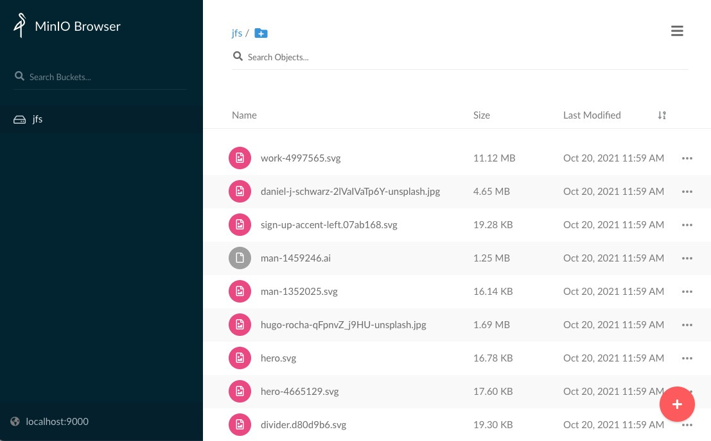

# Deploy JuiceFS S3 Gateway

JuiceFS has introduced S3 gateway since v0.11, a feature implemented through the [MinIO S3 Gateway](https://docs.min.io/docs/minio-gateway-for-s3.html). It provides an S3-compatible RESTful API for files on JuiceFS, enabling the management of files stored on JuiceFS with tools such as s3cmd, AWS CLI, MinIO Client (mc), etc. in cases where mounting is not convenient. In addition, S3 gateway also provides a web-based file manager that allows users to use a browser to manage the files on JuiceFS.

Because JuiceFS stores files in chunks, the files cannot be accessed directly using the interface of the underlying object storage. The S3 gateway provides similar access to the underlying object storage, with the following architecture diagram.


## Prerequisites

The S3 gateway is a feature built on top of the JuiceFS file system. If you do not have a JuiceFS file system, please refer to the [quick start guide](../getting-started/quick_start_guide.md) to create one first.

JuiceFS S3 gateway is a feature introduced in v0.11, please make sure you have the latest version of JuiceFS.

## Quickstart

The S3 gateway can be enabled on the current host using the `gateway` subcommand of JuiceFS. Before enabling the feature, you need to set `MINIO_ROOT_USER` and `MINIO_ROOT_PASSWORD` environment variables, which are the Access Key and Secret Key used to authenticate when accessing the S3 API, and can be simply considered as the username and password of the S3 gateway. For example.

```shell
$ export MINIO_ROOT_USER=admin
$ export MINIO_ROOT_PASSWORD=12345678
$ juicefs gateway redis://localhost:6379 localhost:9000
```

Among the above three commands, the first two commands are used to set environment variables. Note that the length of `MINIO_ROOT_USER` is at least 3 characters, and the length of `MINIO_ROOT_PASSWORD` is at least 8 characters (Windows users should set the environment variable with the `set` command instead, e.g., `set MINIO_ROOT_USER=admin`).

The last command is used to enable the S3 gateway. The `gateway` subcommand requires at least two parameters, the first is the URL of the database where the metadata is stored, and the second is the address and port on which the S3 gateway is listening. You can add [other options](command_reference.md#juicefs-gateway) to the `gateway` subcommand to optimize the S3 gateway as needed, for example, to set the default local cache to 20 GiB.

```shell
$ juicefs gateway --cache-size 20480 redis://localhost:6379 localhost:9000
```

In this example, we assume that the JuiceFS file system is using a local Redis database. When the S3 gateway is enabled, the administrative interface of the S3 gateway can be accessed on the **current host** using the address `http://localhost:9000`.



If you want to access the S3 gateway through other hosts on the LAN or the Internet, you need to adjust the listening address, e.g.

```shell
$ juicefs gateway redis://localhost:6379 0.0.0.0:9000
```

In this way, the S3 gateway will accept all network requests by default. S3 clients in different locations can access the S3 gateway using different addresses, e.g.

- Third-party clients in the host where the S3 gateway is located can use `http://127.0.0.1:9000` or `http://localhost:9000` for access.
- A third-party client on the same LAN as the host where the S3 gateway is located can access it using `http://192.168.1.8:9000` (assuming the intranet IP address of the S3 gateway-enabled host is 192.168.1.8).
- The S3 gateway can be accessed via the Internet using `http://110.220.110.220:9000` (assuming that the public IP address of the S3 gateway-enabled host is 110.220.110.220).

## Accessing S3 gateway

The JuiceFS S3 gateway can be accessed by various clients, desktop applications, web applications, etc. that support the S3 API. Please note the address and port that the S3 gateway listens on when using it.

> **Tip**: The following examples are for using a third-party client to access the S3 gateway running on the local host. In specific scenarios, please adjust the address to access the S3 gateway according to the actual situation.

### Using the AWS CLI

```bash
$ aws configure
AWS Access Key ID [None]: admin
AWS Secret Access Key [None]: 12345678
Default region name [None]:
Default output format [None]:
```

The program will guide you through adding the new configuration interactively, where `Access Key ID` is the same as `MINIO_ROOT_USER` and `Secret Access Key` is the same as `MINIO_ROOT_PASSWORD`, leave the region name and output format blank.

After that, you can access the JuiceFS storage using the `aws s3` command, for example:

```bash
# List buckets
$ aws --endpoint-url http://localhost:9000 s3 ls

# List objects in bucket
$ aws --endpoint-url http://localhost:9000 s3 ls s3://<bucket>
```

### Using the MinIO client

First install `mc` by referring to the [MinIO download page](https://min.io/download), then add a new alias:

```bash
$ mc alias set juicefs http://localhost:9000 admin 12345678 --api S3v4
```

Following the mc command format, the above command creates a configuration with the alias `juicefs`. In particular, note that the API version must be specified in the command, `-api "s3v4"`.

Then, you can freely manage the copying, moving, adding and deleting of files and folders between your local disk and JuiceFS storage as well as other cloud storage via the mc client.

```shell
$ mc ls juicefs/jfs
[2021-10-20 11:59:00 CST] 130KiB avatar-2191932_1920.png
[2021-10-20 11:59:00 CST] 4.9KiB box-1297327.svg
[2021-10-20 11:59:00 CST]  21KiB cloud-4273197.svg
[2021-10-20 11:59:05 CST]  17KiB hero.svg
[2021-10-20 11:59:06 CST] 1.7MiB hugo-rocha-qFpnvZ_j9HU-unsplash.jpg
[2021-10-20 11:59:06 CST]  16KiB man-1352025.svg
[2021-10-20 11:59:06 CST] 1.3MiB man-1459246.ai
[2021-10-20 11:59:08 CST]  19KiB sign-up-accent-left.07ab168.svg
[2021-10-20 11:59:10 CST]  11MiB work-4997565.svg
```

## Monitoring metrics collection

> **Note**: This feature needs to run JuiceFS client version 0.17.1 and above.

JuiceFS S3 gateway provides a Prometheus API for collecting monitoring metrics, the default address is `http://localhost:9567/metrics`. More information please check the ["JuiceFS Metrics"](p8s_metrics.md) document.
