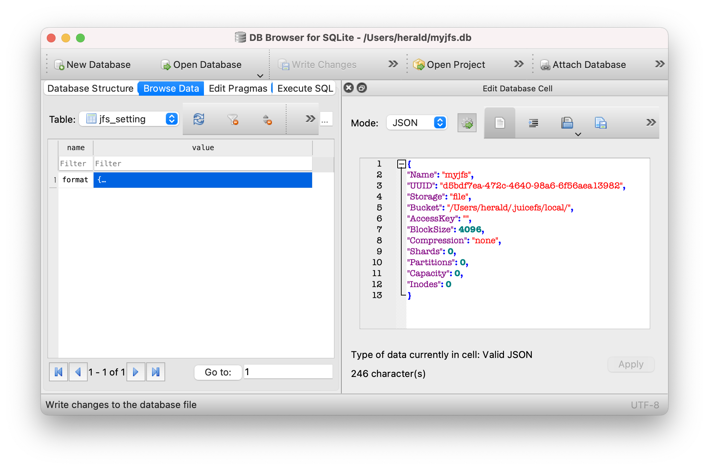

# Quick Start Guide for Standalone Mode

The JuiceFS file system is driven by both ["Object Storage"](../guide/how_to_set_up_object_storage.md) and ["Database"](../guide/how_to_set_up_metadata_engine.md). In addition to object storage, it also supports to use local disk, WebDAV and HDFS, etc., as underlying storage. Therefore, you can create a standalone file system using local disks and SQLite database to get a quick overview of how JuiceFS works.

## Install Client

For Linux distributions and macOS users, the JuiceFS client can be quickly installed using a one-click installation script:

```shell
curl -sSL https://d.juicefs.com/install | sh -
```

Other operating systems and installation methods, please refer to ["Installation"](installation.md).

A help message will return after executing `juicefs` in terminal once the JuiceFS client is successfully installed regardless of operating system.

## Creating a File System {#juicefs-format}

### Basic Concept

JuiceFS client provides a command [`format`](../reference/command_reference.md#format) to create a file system as follows.

```shell
juicefs format [command options] META-URL NAME
```

As you can see, 3 types of information are required to format a file system.

1. **[command options]**: used to set up the storage medium for the file system; **local disk** will be used by default, and default path is `"$HOME/.juicefs/local"`, `"/var/jfs"` or `"C:/jfs/local"`.
2. **META-URL**: used to set up the metadata engine, usually a URL or the file path of a database.
3. **NAME**: the name of the file system.

:::tip
JuiceFS supports a wide range of storage media and metadata storage engines. See [JuiceFS supported storage media](../guide/how_to_set_up_object_storage.md) and [JuiceFS supported metadata storage engines](../guide/how_to_set_up_metadata_engine.md).
:::

### Hands-on Practice

As an example of on a Linux system, the following command creates a file system named `myjfs`.

```shell
juicefs format sqlite3://myjfs.db myjfs
```

An output similar to the following will return if the file system creation is completed.

```shell {1,4}
2021/12/14 18:26:37.666618 juicefs[40362] <INFO>: Meta address: sqlite3://myjfs.db
[xorm] [info]  2021/12/14 18:26:37.667504 PING DATABASE sqlite3
2021/12/14 18:26:37.674147 juicefs[40362] <WARNING>: The latency to database is too high: 7.257333ms
2021/12/14 18:26:37.675713 juicefs[40362] <INFO>: Data use file:///Users/herald/.juicefs/local/myjfs/
2021/12/14 18:26:37.689683 juicefs[40362] <INFO>: Volume is formatted as {Name:myjfs UUID:d5bdf7ea-472c-4640-98a6-6f56aea13982 Storage:file Bucket:/Users/herald/.juicefs/local/ AccessKey: SecretKey: BlockSize:4096 Compression:none Shards:0 Partitions:0 Capacity:0 Inodes:0 EncryptKey:}
```

As you can see from the output, the file system uses SQLite as the metadata storage engine. The database file is located in the current directory with the file name `myjfs.db`, which creates a table to store all the metadata of the file system `myjfs`.



Since no storage-related options are specified in this example, the local disk is used as the storage medium by default. According to the output, the file system storage path is `file:///Users/herald/.juicefs/local/myjfs/`.

## Mounting the File System

### Basic Concept

JuiceFS client provides a command [`mount`](../reference/command_reference.md#mount) to mount file systems in the following format.

```shell
juicefs mount [command options] META-URL MOUNTPOINT
```

Similar to the command of creating a file system, the following information is also required to mount a file system.

1. `[command options]`: used to specify file system-related options, e.g. `-d` enables background mounts.
2. `META-URL`: used to set up the metadata storage, usually a URL or file path of a database.
3. `MOUNTPOINT`: used to specific a mount point of the file system.

:::tip
The mount point (`MOUNTPOINT`) on Windows systems should use a disk letter that is not yet occupied, e.g. `Z:`, `Y:`.
:::

### Hands-on Practice

:::note
As SQLite is a single-file database, please pay attention to the path of the database file when mounting it. JuiceFS supports both relative and absolute paths.
:::

The following command mounts the `myjfs` file system to the `~/jfs` folder:

```shell
juicefs mount sqlite3://myjfs.db ~/jfs
```


The client mounts the file system in the foreground by default. As you can see in the above image, the program keeps running in the current terminal. To unmount the file system, press <kbd>Ctrl</kbd> + <kbd>C</kbd> or close the terminal window.

In order to keep the file system mounted in the background, you can specify the `-d` or `--background` option when mounting, i.e. to mount the file system in the daemon:

```shell
juicefs mount sqlite3://myjfs.db ~/jfs -d
```

Next, any files stored in the mount point `~/jfs` will be split into specific blocks according to [How JuiceFS Stores Files](../introduction/architecture.md#how-juicefs-store-files), and stored in `$HOME/.juicefs/local/myjfs` directory; the corresponding metadata will be stored in the `myjfs.db` database.

In the end, the mount point `~/jfs` can be unmounted by executing the following command.

```shell
juicefs umount ~/jfs
```

## Go Further

The above exercise only helps you to have a quick experience with JuiceFS locally and gives you a basic overview of how JuiceFS works. To make the example more practical, we can take a step further by using SQLite to store metadata as above but replacing the local storage with "object storage".

### Object Storage

Object Storage is a web storage service based on the HTTP protocol that offers simple APIs for access. It has a flat structure, and is easy to scale and relatively inexpensive, particularly suitable for storing large amounts of unstructured data. Almost all mainstream cloud computing platforms provide object storage services, such as Amazon S3, Alibaba Cloud OSS, and Backblaze B2.

JuiceFS supports almost all object storage services, see [JuiceFS supported storage medias](../guide/how_to_set_up_object_storage.md).

In general, only 2 steps are required to create an object storage:

1. Create a **Bucket** and get the Endpoint address.
2. Create the **Access Key ID** and **Access Key Secret**, i.e., the access keys for the Object Storage API.

Taking AWS S3 as an example, a resource that has been created would be like below.

- **Bucket Endpoint**: `https://myjfs.s3.us-west-1.amazonaws.com`
- **Access Key ID**: `ABCDEFGHIJKLMNopqXYZ`
- **Access Key Secret**: `ZYXwvutsrqpoNMLkJiHgfeDCBA`

:::note
The process of creating an object storage may vary slightly from platform to platform, so it is recommended to check the help manual of the corresponding cloud platform. In addition, some platforms may provide different Endpoint addresses for internal and external networks. Please choose the external network access for your application, and this document is to access the object storage from local as an example.
:::

### Hands-on Practice

Next, create a JuiceFS file system using SQLite and Amazon S3 object storage.

:::note
If the `myjfs.db` file already exists, delete it first and then execute the following command.
:::

```shell
# Replace relevant options with the actual object storage being used
juicefs format --storage s3 \
    --bucket https://myjfs.s3.us-west-1.amazonaws.com \
    --access-key ABCDEFGHIJKLMNopqXYZ \
    --secret-key ZYXwvutsrqpoNMLkJiHgfeDCBA \
    sqlite3://myjfs.db myjfs
```

The command above creates a file system using the same database name and file system name with the object storage options provided.

- `--storage`: Used to set the storage type, e.g. `oss`, `s3`, etc.
- `--bucket`: Used to set the Endpoint address of the object storage.
- `--access-key`: Used to set the Object Storage Access Key ID.
- `--secret-key`: Used to set the Object Storage Access Key Secret.

You can mount the file system once it is created.

```shell
juicefs mount sqlite3://myjfs.db ~/jfs
```

As you can see, the mount command is exactly the same as using the local storage because JuiceFS has already written the metadata of the object storage to the `myjfs.db` database, so there is no need to provide it again when mounting.

Compared with using local disks, the combination of SQLite and object storage is more practical. From an application perspective, this approach is equivalent to plugging an object storage with almost unlimited capacity into your local computer, allowing you to use cloud storage as a local disk.

Further, all the data of the file system is stored in the cloud-based object storage, so the `myjfs.db` database can be copied to other computers where JuiceFS clients are installed for mounting, reading and writing. That is, any computer that can read the metadata database can mount and read/write the file system.

Obviously, it is difficult for a single file database like SQLite to be accessed by multiple computers at the same time. If SQLite is replaced by Redis, PostgreSQL, MySQL, etc., which can be accessed by multiple computers at the same time through the network, then it is possible to achieve distributed read and write on the JuiceFS file system.
