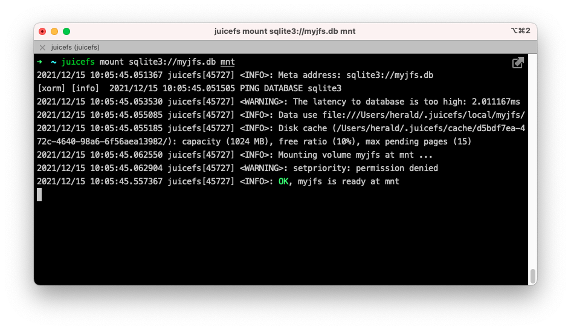

# JuiceFS Quick Start Guide for Standalone Mode

The JuiceFS file system consists of ["Object Storage"](../reference/how_to_setup_object_storage.md) and ["Database"](../reference/how_to_setup_object_storage.md) are jointly driven. In addition to object storage, it also supports the use of local disk, WebDAV and HDFS, and so on as the underlying storage. Therefore, you can quickly create a standalone file system using local disks and SQLite database to understand and experience JuiceFS.

## Install Client

For details, please refer to [Installation & Upgrade](installation.md)。

Regardless of the operating system you are using, when you execute `juicefs` in the terminal and it returns the help message of the program, it means that you have successfully installed the JuiceFS client.

## Creating a File System

### Basic Concept

To create a file system use the [`format`](../reference/command_reference.md#juicefs-format) command provided by the client, generally in the following format.

```shell
juicefs format [command options] META-URL NAME
```

As you can see, there are 3 types of information required to format a file system.

1. **[command options]**: Sets the storage media for the file system, if nothing is specified then **default to local disk** as the storage media, default path is `"$HOME/.juicefs/local"` or `"/var/jfs"`.
2. **META-URL**: used to set the metadata engine, usually the URL or file path to the database.
3. **NAME**: the name of the file system.

:::tip
JuiceFS supports a wide range of storage media and metadata storage engines, see [JuiceFS supported storage medias](../reference/how_to_setup_object_storage.md) and [JuiceFS supported metadata storage engines](../reference/how_to_setup_metadata_engine.md)。
:::

### Hands-on Practice

On a Linux system, for example, the following command creates a file system named `myjfs`.

```shell
juicefs format sqlite3://myjfs.db myjfs
```

Completion of the creation will return an output similar to the following.

```shell {1,4}
2021/12/14 18:26:37.666618 juicefs[40362] <INFO>: Meta address: sqlite3://myjfs.db
[xorm] [info]  2021/12/14 18:26:37.667504 PING DATABASE sqlite3
2021/12/14 18:26:37.674147 juicefs[40362] <WARNING>: The latency to database is too high: 7.257333ms
2021/12/14 18:26:37.675713 juicefs[40362] <INFO>: Data use file:///Users/herald/.juicefs/local/myjfs/
2021/12/14 18:26:37.689683 juicefs[40362] <INFO>: Volume is formatted as {Name:myjfs UUID:d5bdf7ea-472c-4640-98a6-6f56aea13982 Storage:file Bucket:/Users/herald/.juicefs/local/ AccessKey: SecretKey: BlockSize:4096 Compression:none Shards:0 Partitions:0 Capacity:0 Inodes:0 EncryptKey:}
```

As you can see from the output, the file system uses SQLite as the metadata storage engine and the database file is located in the current directory with the file name `myjfs.db`, which stores all the information of the `myjfs` file system. It has been constructed with a complete table structure that will be used as a storage for all the meta information of the data.


Since no storage-related options are specified, the client uses the local disk as the storage medium by default. According to the output, the file system storage path is `file:///Users/herald/.juicefs/local/myjfs/`.

## Mounting the File System

### Basic Concept

To mount a file system use the client-provided [`mount`](../reference/command_reference.md#juicefs-mount) command, generally in the following format

```shell
juicefs mount [command options] META-URL MOUNTPOINT
```

Similar to the command to create a file system, the following information is required to mount a file system.

1. **[command options]**: used to specify file system-related options, e.g. `-d` enables background mounts.
2. **META-URL**: used to set up metadata storage, usually the URL or file path to the database.
3. **MOUNTPOINT**: the name of the file system.

### Hands-on Practice

:::note
As SQLite is a single file database, you should pay attention to the path of the database file when mounting it, JuiceFS supports both relative and absolute paths.
:::

The following command mounts the `myjfs` file system to the `mnt` folder in the current directory.

```shell
juicefs mount sqlite3://myjfs.db mnt
```



By default, the client mounts the file system in the foreground. As you can see in the image above, the program will always run in the current terminal process, and the file system will be unmounted using the <kbd>Ctrl</kbd> + <kbd>C</kbd> key combination or by closing the terminal window.

In order to allow the file system to remain mounted in the background, you can specify the `-d` or `--background` option when mounting, i.e. to allow the client to mount the file system in the daemon.

```shell
juicefs mount sqlite3://myjfs.db mnt -d
```

Next, any files stored on mount point `mnt` will be split into specific blocks according to [How JuiceFS Stores Files](../introduction/architecture.md#how-juicefs-stores-files) and stored in `$HOME/.juicefs/local/myjfs` directory, and the corresponding metadata will be stored in the `myjfs.db` database.

Finally, the mount point `mnt` can be unmounted by executing the following command.

```shell
juicefs umount mnt
```

## Go Further

The previous content is only suitable to quickly help you experience and understand how JucieFS works. We can take the previous content a step further by still using SQLite to store metadata and replace the local storage with "object storage" for a more useful solution.

### Object Storage

Object Storage is a web storage service based on the HTTP protocol that offers simple API for access. It has a flat structure, easy to scale, relatively inexpensive, and is ideal for storing large amounts of unstructured data. Almost all major cloud computing platforms provide object storage services, such as Amazon S3, Alibaba Cloud OSS, Backblaze B2, etc.

JuiceFS supports almost all object storage services, see [JuiceFS supported storage medias](../reference/how_to_setup_object_storage.md).

In general, creating an object store usually requires only 2 parts.

1. Create a `Bucket` and get the Endpoint address.
2. Create the `Access Key ID` and `Access Key Secret`, the access keys for the Object Storage API.

Using AWS S3 as an example, a created resource would look something like the following.

- **Bucket Endpoint**: `https://myjfs.s3.us-west-1.amazonaws.com`
- **Access Key ID**: `ABCDEFGHIJKLMNopqXYZ`
- **Access Key Secret**: `ZYXwvutsrqpoNMLkJiHgfeDCBA`

:::note
The process of creating an object store may vary slightly from platform to platform, so it is recommended to check the help manual of the cloud platform. In addition, some platforms may provide different Endpoint addresses for internal and external networks, so please choose to use the address for external network access since this article is to access the object store from local.
:::

### Hands-on Practice

Next, create a JuiceFS file system using SQLite and Amazon S3 object storage.

:::note
If the `myjfs.db` file already exists, delete it first and then execute the following command.
:::

```shell
juicefs format --storage oss \
    --bucket https://myjfs.s3.us-west-1.amazonaws.com \
    --access-key ABCDEFGHIJKLMNopqXYZ \
    --secret-key ZYXwvutsrqpoNMLkJiHgfeDCBA \
    sqlite3://myjfs.db myjfs
```

In the above command, the database and file system names remain the same and the following information related to object storage is added.

- `--storage`: Used to set the storage type, e.g. oss, s3, etc.
- `--bucket`: Used to set the Endpoint address of the object store.
- `--access-key`: Used to set the Object Storage Access Key ID.
- `--secret-key`: Used to set the Object Storage Access Key Secret.

:::note
Please replace the information in the above command with your own object storage information.
:::

Once created, you can mount it.

```shell
juicefs mount sqlite3://myjfs.db mnt
```

As you can see, the mount command is exactly the same as when using local storage, because JuiceFS has already written the information about the object storage to the `myjfs.db` database, so there is no need to provide it again when mounting.

The combination of SQLite and object storage has a higher utility value than using local disks. From an application perspective, this type of approach is equivalent to plugging an object storage with almost unlimited capacity into your local computer, allowing you to use cloud storage as a local disk.

Further, all the data of the file system is stored in the cloud-based object storage, so the `myjfs.db` database can be copied to other computers where JuiceFS clients are installed for mounting, reading and writing. That is, any computer that can read the database with the metadata stored on it can mount and read/write to the file system.

Obviously, it is difficult for a single file database like SQLite to be accessed by multiple computers at the same time. If SQLite is replaced by Redis, PostgreSQL, MySQL, etc., which can be accessed by multiple computers at the same time through the network, then it is possible to achieve distributed read and write on the JuiceFS file system.
