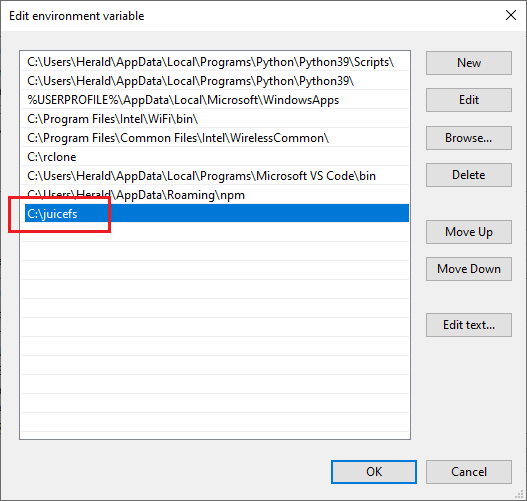

JuiceFS has good cross-platform capability and supports various operating systems across almost all major architectures, including but not limited to Linux, macOS, and Windows.

The JuiceFS client has only one binary file. You can either download the pre-compiled version to unzip it and use it directly, or manually compile it from the provided source code.

## One-click installation {#one-click-installation}

The one-click installation script is available for Linux and macOS systems. It automatically downloads and installs the latest version of the JuiceFS client based on your hardware architecture. Here is how to use it:

```shell
# default installation path is /usr/local/bin
curl -sSL https://d.juicefs.com/install | sh -
```

```shell
# install to /tmp directory
curl -sSL https://d.juicefs.com/install | sh -s /tmp
```

## Install the pre-compiled client {#install-the-pre-compiled-client}

You can download the latest version of the client at [GitHub](https://github.com/juicedata/juicefs/releases). Pre-compiled versions for different CPU architectures and operating systems are available in the download list of each client version. Please select the version that best suits your application. For example:

| File Name                            | Description                                                                                  |
|--------------------------------------|----------------------------------------------------------------------------------------------|
| `juicefs-x.y.z-darwin-amd64.tar.gz`  | For macOS systems with Intel chips                                                           |
| `juicefs-x.y.z-darwin-arm64.tar.gz`  | For macOS systems with M1 series chips                                                       |
| `juicefs-x.y.z-linux-amd64.tar.gz`   | For Linux distributions on x86 architecture                                                  |
| `juicefs-x.y.z-linux-arm64.tar.gz`   | For Linux distributions on ARM architecture                                                  |
| `juicefs-x.y.z-windows-amd64.tar.gz` | For Windows on x86 architecture                                                              |
| `juicefs-hadoop-x.y.z.jar`           | Hadoop Java SDK on x86 and ARM architectures (supports Linux, macOS, and Windows systems) |

### Linux {#linux}

For Linux systems with x86 architecture, download the file with the file name `linux-amd64` and execute the following commands in the terminal.

1. Get the latest version number:

   ```shell
   JFS_LATEST_TAG=$(curl -s https://api.github.com/repos/juicedata/juicefs/releases/latest | grep 'tag_name' | cut -d '"' -f 4 | tr -d 'v')
   ```

2. Download the client to the current directory:

   ```shell
   wget "https://github.com/juicedata/juicefs/releases/download/v${JFS_LATEST_TAG}/juicefs-${JFS_LATEST_TAG}-linux-amd64.tar.gz"
   ```

3. Unzip the installation package:

   ```shell
   tar -zxf "juicefs-${JFS_LATEST_TAG}-linux-amd64.tar.gz"
   ```

4. Install the client:

   ```shell
   sudo install juicefs /usr/local/bin
   ```

After completing the above 4 steps, execute the `juicefs` command in the terminal. If the client installation is successful, a help message will be returned.

:::info
If the terminal prompts `command not found`, it is probably because `/usr/local/bin` is not in your system's `PATH` environment variable. You can execute `echo $PATH` to see which executable paths are set in your system. Based on the returned result, select an appropriate path, adjust, and re-execute the installation command in step 4.
:::

#### Ubuntu PPA

JuiceFS also provides a [PPA](https://launchpad.net/~juicefs) repository, which makes it easy to install the latest version of the client on Ubuntu systems. Choose the corresponding PPA repository based on your CPU architecture:

- **x86 architecture**：`ppa:juicefs/ppa`
- **ARM architecture**：`ppa:juicefs/arm64`

For example, on a Ubuntu 22.04 system with x86 architecture, execute the following commands:

```shell
sudo add-apt-repository ppa:juicefs/ppa
sudo apt-get update
sudo apt-get install juicefs
```

#### Fedora Copr

JuiceFS also provides a [Copr](https://copr.fedorainfracloud.org/coprs/juicedata/juicefs) repository, which allows for easy installation of the latest version of the client on Red Hat and its derivatives. The supported systems currently include:

- **Amazonlinux 2023**
- **CentOS 8, 9**
- **Fedora 37, 38, 39, rawhide**
- **RHEL 7, 8, 9**

Taking Fedora 38 as an example, execute the following commands to install the client:

```shell
# Enable the Copr repository
sudo dnf copr enable -y juicedata/juicefs
# Install the client
sudo dnf install juicefs
```

#### Snapcraft

We have also packaged and released the [Snap version of the JuiceFS client](https://github.com/juicedata/juicefs-snapcraft) on the [Canonical Snapcraft](https://snapcraft.io) platform. For Ubuntu 16.04 and above and other operating systems that support Snap, you can install it using the following commands:

```shell
sudo snap install juicefs
# Since Snap is a closed sandbox environment, it may affect
# the client's FUSE mount. You can remove the restriction by
# executing the following command. If you only need to use
# WebDAV and Gateway, there is no need to execute.
sudo ln -s -f /snap/juicefs/current/juicefs /snap/bin/juicefs
```

When there is a new version, execute the following command to update the client:

```shell
sudo snap refresh juicefs
```

#### AUR (Arch User Repository) {#aur}

JuiceFS also provides an [AUR](https://aur.archlinux.org/packages/juicefs) repository, which makes it convenient to install the latest version of the client on Arch Linux and its derivatives.

For systems using the Yay package manager, execute the following command to install the client:

```shell
yay -S juicefs
```

:::info
There are multiple JuiceFS client packages available on AUR. The following are versions officially maintained by JuiceFS:

- [`aur/juicefs`](https://aur.archlinux.org/packages/juicefs): A stable compiled version that fetches the latest stable source code and compiles it during installation.
- [`aur/juicefs-bin`](https://aur.archlinux.org/packages/juicefs-bin): A stable pre-compiled version that directly downloads and installs the latest stable pre-compiled program.
- [`aur/juicefs-git`](https://aur.archlinux.org/packages/juicefs-git): A development version that fetches the latest development source code and compiles it during installation.
:::

Additionally, you can manually compile and install using `makepkg`, as shown for an Arch Linux system:

```shell
# Install dependencies
sudo pacman -S base-devel git go
# Clone the AUR repository to be packaged
git clone https://aur.archlinux.org/juicefs.git
# Navigate to the repository directory
cd juicefs
# Compile and install
makepkg -si
```

### Windows {#windows}

There are three ways to use JuiceFS on Windows systems.

- [Using the pre-compiled Windows client](#using-the-pre-compiled-windows-client)
- [Using Scoop](#scoop)
- [Using the Linux client in WSL](#using-the-linux-client-in-wsl)

#### Using the pre-compiled Windows client

The Windows client of JuiceFS is also a standalone binary. After you download and extract it, you can run it right away.

1. Install dependencies.

   Since Windows does not natively support the FUSE interface, you need to download and install [WinFsp](https://winfsp.dev) first in order to implement FUSE support.

   :::tip
   **[WinFsp](https://github.com/winfsp/winfsp)** is an open source Windows file system agent. It provides a FUSE emulation layer that allows JuiceFS clients to mount file systems on Windows systems for use.
   :::

2. Install the client.

   Take the Windows 10 system as an example, download the file with the file name `windows-amd64`, unzip it, and get `juicefs.exe` which is the JuiceFS client binary.

   To make it easier to use, it is recommended to create a folder named `juicefs` in the root directory of the `C:\` disk and extract `juicefs.exe` to that folder. Then add `C:\juicefs` to the environment variables of your system and restart the system to let the settings take effect. Lastly, you can run `juicefs` commands directly using the "Command Prompt" or "PowerShell" terminal that comes with your system.

   

#### Using Scoop {#scoop}

If you have [Scoop](https://scoop.sh) installed in your Windows system, you can use the following command to install the latest version of the JuiceFS client:

```shell
scoop install juicefs
```

#### Using the Linux client in WSL

[WSL](https://docs.microsoft.com/en-us/windows/wsl/about) is short for Windows Subsystem for Linux, which is supported from Windows 10 version 2004 onwards or Windows 11. It allows you to run most of the command-line tools, utilities, and applications of GNU/Linux natively on a Windows system without incurring the overhead of a traditional virtual machine or dual-boot setup.

For details, see [Using JuiceFS on WSL](../tutorials/juicefs_on_wsl.md).

### macOS {#macos}

Since macOS does not support the FUSE interface by default, you need to install [macFUSE](https://osxfuse.github.io) first to implement the support for FUSE.

:::tip
[macFUSE](https://github.com/osxfuse/osxfuse) is an open source file system enhancement tool that allows macOS to mount third-party file systems. It enables JuiceFS clients to mount file systems on macOS systems.
:::

#### Homebrew

If you have the [Homebrew](https://brew.sh) package manager installed on your system, you can install the JuiceFS client by executing the following command:

```shell
brew install juicefs
```

*For more information about this command, please refer to [Homebrew Formulae](https://formulae.brew.sh/formula/juicefs#default) page.*

#### Pre-compiled binary

You can also download the binary with the file name `darwin-amd64`. After downloading, unzip the file and install the program to any executable path on your system using the `install` command, for example:

```shell
sudo install juicefs /usr/local/bin
```

### Docker {#docker}

For those interested in using JuiceFS in a Docker container, a `Dockerfile` for building a JuiceFS client image is provided below. It can be used as a base to build a JuiceFS client image alone or packaged together with other applications.

```dockerfile
FROM ubuntu:20.04

RUN apt update && apt install -y curl fuse && \
    apt-get autoremove && \
    apt-get clean && \
    rm -rf \
    /tmp/* \
    /var/lib/apt/lists/* \
    /var/tmp/*

RUN set -x && \
    mkdir /juicefs && \
    cd /juicefs && \
    JFS_LATEST_TAG=$(curl -s https://api.github.com/repos/juicedata/juicefs/releases/latest | grep 'tag_name' | cut -d '"' -f 4 | tr -d 'v') && \
    curl -s -L "https://github.com/juicedata/juicefs/releases/download/v${JFS_LATEST_TAG}/juicefs-${JFS_LATEST_TAG}-linux-amd64.tar.gz" \
    | tar -zx && \
    install juicefs /usr/bin && \
    cd .. && \
    rm -rf /juicefs

CMD [ "juicefs" ]
```

## Manually compiling {#manually-compiling}

If there is no pre-compiled client versions that are suitable for your operating system, such as FreeBSD, you can manually compile the JuiceFS client.

One advantage of manual compilation is that you have priority access to various new features in JuiceFS development, but it requires some basic knowledge of software compilation.

:::tip
For users in China, in order to speed up the acquisition of Go modules, it is recommended to set the `GOPROXY` environment variable to the domestic mirror server by executing `go env -w GOPROXY=https://goproxy.cn,direct`. For details, see [Goproxy China](https://github.com/goproxy/goproxy.cn).
:::

### Unix-like client

Compiling clients for Linux, macOS, BSD and other Unix-like systems requires the following dependencies:

- [Go](https://golang.org) 1.20+
- GCC 5.4+

1. Clone the source code:

   ```shell
   git clone https://github.com/juicedata/juicefs.git
   ```

2. Enter the source code directory:

   ```shell
   cd juicefs
   ```

3. Switch to the desired branch, such as release v1.0.0:

   The source code uses the `main` branch by default. You can switch to any official release, for example, to the release `v1.0.0`:

   ```shell
   git checkout v1.0.0
   ```

   :::caution
   The development branch often involves large changes, so do not use the clients compiled in the "development branch" for the production environment.
   :::

4. Compile:

   ```shell
   make
   ```

   The compiled `juicefs` binary is located in the current directory.

### Compiling on Windows

To compile the JuiceFS client on Windows systems, you need to install the following dependencies:

- [WinFsp](https://github.com/winfsp/winfsp)
- [Go](https://golang.org) 1.20+
- GCC 5.4+

Among them, WinFsp and Go can be downloaded and installed directly. GCC needs to use a version provided by a third party, which can use [MinGW-w64](https://www.mingw-w64.org) or [Cygwin](https://www.cygwin.com). Here we take MinGW-w64 as an example.

On the [MinGW-w64 download page](https://www.mingw-w64.org/downloads), select a precompiled version for Windows, such as [mingw-builds-binaries](https://github.com/niXman/mingw-builds-binaries/releases). After downloading, extract it to the root directory of the `C` drive, then find PATH in the system environment variable settings and add the `C:\mingw64\bin` directory. After restarting the system, execute the `gcc -v` command in the command prompt or PowerShell. If you can see version information, it means that MingGW-w64 is successfully installed, and you can start compiling.

1. Clone and enter the project directory:

   ```shell
   git clone https://github.com/juicedata/juicefs.git && cd juicefs
   ```

2. Copy WinFsp headers:

   ```shell
   mkdir "C:\WinFsp\inc\fuse"
   ```

   ```shell
   copy .\hack\winfsp_headers\* C:\WinFsp\inc\fuse\
   ```

   ```shell
   dir "C:\WinFsp\inc\fuse"
   ```

   ```shell
   set CGO_CFLAGS=-IC:/WinFsp/inc/fuse
   ```

   ```shell
   go env -w CGO_CFLAGS=-IC:/WinFsp/inc/fuse
   ```

3. Compile the client:

   ```shell
   go build -ldflags="-s -w" -o juicefs.exe .
   ```

The compiled `juicefs.exe` binary program is located in the current directory. For convenience, it can be moved to the `C:\Windows\System32` directory, so that the `juicefs.exe` command can be used directly anywhere.

### Cross-compiling Windows clients on Linux

Compiling a specific version of the client for Windows is essentially the same as [Unix-like Client](#unix-like-client) and can be done directly on a Linux system. However, in addition to `go` and `gcc`, you also need to install [MinGW-w64](https://www.mingw-w64.org/downloads).

The latest version can be installed from software repositories on many Linux distributions. For example, on Ubuntu 20.04+, you can install `mingw-w64` with the following command:

```shell
sudo apt install mingw-w64
```

Compile the Windows client:

```shell
make juicefs.exe
```

The compiled client is a binary file named `juicefs.exe`, located in the current directory.

### Cross-compiling Linux clients on macOS

1. Clone and enter the project directory:

   ```shell
   git clone https://github.com/juicedata/juicefs.git && cd juicefs
   ```

2. Install dependencies:

   ```shell
   brew install FiloSottile/musl-cross/musl-cross
   ```

3. Compile the client:

   ```shell
   make juicefs.linux
   ```

## Uninstall {#uninstall}

The JuiceFS client has only one binary file, so it can be easily deleted once you find the location of the program. For example, to uninstall the client that is installed on the Linux system as described above, you only need to execute the following command:

```shell
sudo rm /usr/local/bin/juicefs
```

You can also check where the program is located by using the `which` command:

```shell
which juicefs
```

The path returned by the command is the location where the JuiceFS client is installed on your system. The uninstallation of the JuiceFS client on other operating systems follows the same way.
