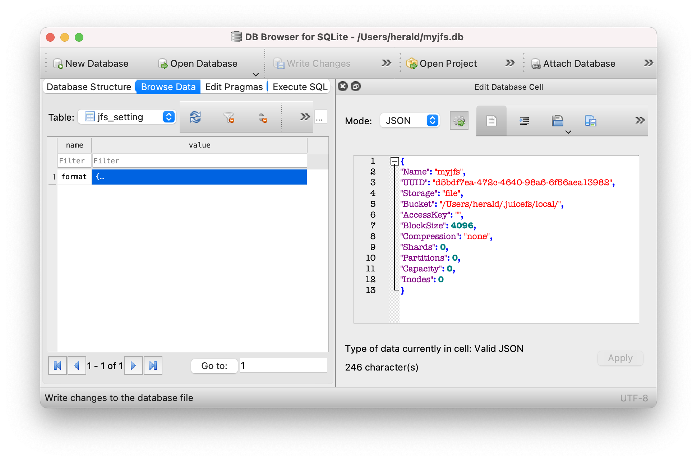
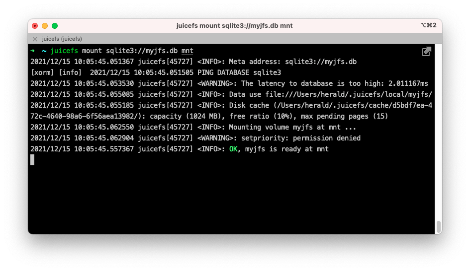

# Standalone Mode

The JuiceFS file system is driven by both ["Object Storage"](../reference/how_to_set_up_object_storage.md) and ["Database"](../reference/how_to_set_up_metadata_engine.md). In addition to object storage, it also supports using local disks, WebDAV, and HDFS as underlying storage options. Therefore, you can create a standalone file system using local disks and SQLite database to get a quick overview of how JuiceFS works.

## Install the client

For Linux distributions and macOS users, you can quickly install the JuiceFS client using a one-click installation script:

```shell
curl -sSL https://d.juicefs.com/install | sh -
```

For other operating systems and installation methods, refer to [Installation](installation.md).

Once installed successfully, executing the `juicefs` command in the terminal will return a help message regardless of the operating system.

## Create a file system {#juicefs-format}

### Basic concepts

The JuiceFS client provides the [`format`](../reference/command_reference.mdx#format) command to create a file system as follows:

```shell
juicefs format [command options] META-URL NAME
```

To format a file system, three types of information are required:

- **[command options]**: Specifies the storage medium for the file system. By default, the **local disk** is used with the path set to `"$HOME/.juicefs/local"`(on darwin/macOS), `"/var/jfs"`(on Linux), or `"C:/jfs/local"`(on Windows).
- **META-URL**: Defines the metadata engine, typically a URL or the file path of a database.
- **NAME**: The name of the file system.

:::tip
JuiceFS supports a wide range of storage media and metadata storage engines. For more details, see [JuiceFS supported storage media](../reference/how_to_set_up_object_storage.md) and [JuiceFS supported metadata storage engines](../reference/how_to_set_up_metadata_engine.md).
:::

### Hands-on practice

For example, on a Linux system, you can create a file system named `myjfs` with the following command:

```shell
juicefs format sqlite3://myjfs.db myjfs
```

After executing the command, you will receive an output similar to the following:

```shell {1,4}
2021/12/14 18:26:37.666618 juicefs[40362] <INFO>: Meta address: sqlite3://myjfs.db
[xorm] [info]  2021/12/14 18:26:37.667504 PING DATABASE sqlite3
2021/12/14 18:26:37.674147 juicefs[40362] <WARNING>: The latency to database is too high: 7.257333ms
2021/12/14 18:26:37.675713 juicefs[40362] <INFO>: Data use file:///Users/herald/.juicefs/local/myjfs/
2021/12/14 18:26:37.689683 juicefs[40362] <INFO>: Volume is formatted as {Name:myjfs UUID:d5bdf7ea-472c-4640-98a6-6f56aea13982 Storage:file Bucket:/Users/herald/.juicefs/local/ AccessKey: SecretKey: BlockSize:4096 Compression:none Shards:0 Partitions:0 Capacity:0 Inodes:0 EncryptKey:}
```

This output shows that SQLite is being used as the metadata storage engine. The database file named `myjfs.db` is located in the current directory. It creates a table to store all the metadata for the `myjfs` file system.



Since no storage-related options were specified, the file system uses the local disk by default, with the storage path set to `file:///Users/herald/.juicefs/local/myjfs/`.

## Mount the file system

### Basic concepts

The JuiceFS client provides the [`mount`](../reference/command_reference.mdx#mount) command to mount file systems in the following format:

```shell
juicefs mount [command options] META-URL MOUNTPOINT
```

Similar to the command of creating a file system, the following information is also required to mount a file system:

- `[command options]`: Specifies file system-related options. For example, `-d` enables background mounting.
- `META-URL`: Defines the metadata storage, typically a URL or file path of a database.
- `MOUNTPOINT`: Specifies a mount point of the file system.

:::tip
The mount point (`MOUNTPOINT`) on Windows systems should be an unused drive letter, such as `Z:` or `Y:`.
:::

### Hands-on practice

:::note
As SQLite is a single-file database, please pay attention to the path of the database file when mounting it. JuiceFS supports both relative and absolute paths.
:::

To mount the `myjfs` file system to the `~/jfs` folder, use the following command:

```shell
juicefs mount sqlite3://myjfs.db ~/jfs
```



The client mounts the file system in the foreground by default. As you can see in the above image, the program keeps running in the current terminal. To unmount the file system, press <kbd>Ctrl</kbd> + <kbd>C</kbd> or close the terminal window.

To keep the file system mounted in the background, specify the `-d` or `--background` option when mounting. This allows you to mount the file system in the daemon:

```shell
juicefs mount sqlite3://myjfs.db ~/jfs -d
```

Next, any files stored in the `~/jfs` mount point will be split into specific blocks according to [How JuiceFS Stores Files](../introduction/architecture.md#how-juicefs-store-files) and stored in the `$HOME/.juicefs/local/myjfs` directory; the corresponding metadata will be stored in the `myjfs.db` database.

To unmount `~/jfs`, execute the following command:

```shell
juicefs umount ~/jfs
```

## Further exploration

The example above offers a quick local experience with JuiceFS and a basic understanding of its operation. For a more practical use case, you can use SQLite for metadata storage while replacing local storage with "object storage."

### Object storage

Object storage is a web storage service based on the HTTP protocol that offers simple APIs for access. It has a flat structure and is easy to scale and cost-effective, particularly suitable for storing large amounts of unstructured data. Almost all mainstream cloud computing platforms provide object storage services, such as Amazon S3, Alibaba Cloud OSS, and Backblaze B2.

JuiceFS supports almost all object storage services, see [JuiceFS supported storage media](../reference/how_to_set_up_object_storage.md).

To set up object storage:

1. Create a **Bucket** and get the Endpoint address.
2. Create the **Access Key ID** and **Access Key Secret**, which serve as the access keys for the Object Storage API.

Taking AWS S3 as an example, the created resources would look like the following:

- **Bucket Endpoint**: `https://myjfs.s3.us-west-1.amazonaws.com`
- **Access Key ID**: `ABCDEFGHIJKLMNopqXYZ`
- **Access Key Secret**: `ZYXwvutsrqpoNMLkJiHgfeDCBA`

:::note
The process of creating object storage may vary slightly from platform to platform. It is recommended to check the help manual of the corresponding cloud platform. In addition, some platforms may provide different Endpoint addresses for internal and external networks. Please choose the external network access for your application. This document illustrates accessing object storage from a local environment.
:::

### Hands-on practice

To create a JuiceFS file system using SQLite and Amazon S3 object storage:

:::note
If the `myjfs.db` file already exists, delete it first and then execute the following command.
:::

```shell
# Replace relevant options with the actual object storage being used
juicefs format --storage s3 \
    --bucket https://myjfs.s3.us-west-1.amazonaws.com \
    --access-key ABCDEFGHIJKLMNopqXYZ \
    --secret-key ZYXwvutsrqpoNMLkJiHgfeDCBA \
    sqlite3://myjfs.db myjfs
```

The command above creates a file system using the same database name and file system name with the object storage options provided.

- `--storage`: Specifies the storage type, such as `oss` or `s3`.
- `--bucket`: Specifies the Endpoint address of the object storage.
- `--access-key`: Specifies the Object Storage Access Key ID.
- `--secret-key`: Specifies the Object Storage Access Key Secret.

Once created, you can mount the file system:

```shell
juicefs mount sqlite3://myjfs.db ~/jfs
```

The mount command is exactly the same as using the local storage because JuiceFS has already written the metadata of the object storage to the `myjfs.db` database. Therefore, you do not need to provide it again when mounting.

Compared with using local disks, the combination of SQLite and object storage is more practical. From an application perspective, this approach is equivalent to plugging an object storage with almost unlimited capacity into your local computer, allowing you to use cloud storage as a local disk.

Further, all the data of the file system is stored in the cloud-based object storage. Therefore, the `myjfs.db` database can be copied to other computers where JuiceFS clients are installed for mounting, reading, and writing. That is, any computer that can read the metadata database can mount and read/write the file system.

Obviously, it is difficult for a single file database like SQLite to be accessed by multiple computers at the same time. If SQLite is replaced by databases like Redis, PostgreSQL, and MySQL, which can be accessed by multiple computers at the same time through the network, it is possible to achieve distributed reads and writes on the JuiceFS file system.
