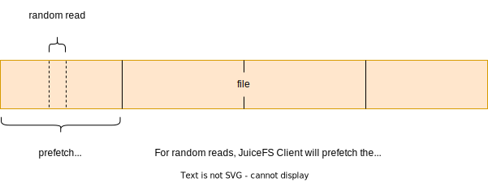
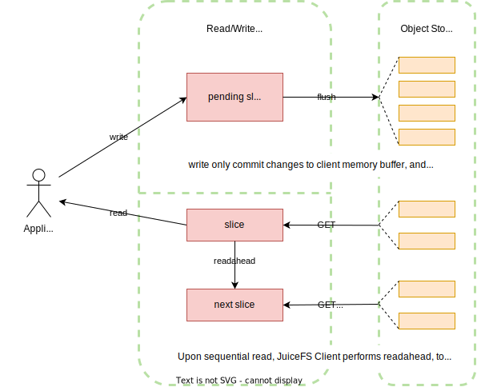
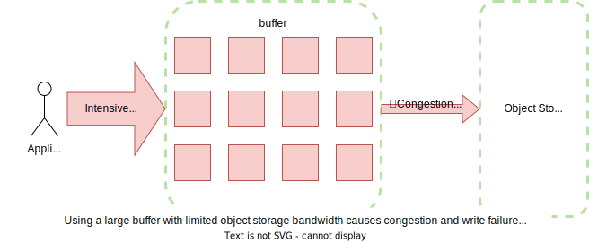

For a file system driven by a combination of object storage and database, cache is an important medium for interacting efficiently between the local client and the remote service. Read and write data can be loaded into the cache in advance or asynchronously, and then the client uploads to or prefetches from the remote service in the background. The use of caching technology can significantly reduce the latency of storage operations and increase data throughput compared to interacting with remote services directly.

JuiceFS provides various caching mechanisms including metadata caching, data read/write caching, etc.

:::tip Does my application really need cache?
Data caching will effectively improve the performance of random reads. For applications that require high random read performance (e.g. Elasticsearch, ClickHouse), it is recommended to use faster storage medium and allocate more space for cache.

Meanwhile, cache improve performance only when application needs to repeatedly read files, so if you know for sure you're in a scenario where data is only accessed once (e.g. data cleansing during ETL), you can safely turn off cache to prevent overhead.
:::

## Consistency {#consistency}

Distributed systems often need to make tradeoffs between cache and consistency. Due to the decoupled architecture of JuiceFS, think consistency problems in terms of metadata, file data (in object storage), and file data local cache.

For [metadata](#metadata-cache), the default configuration offers a "close-to-open" consistency guarantee, i.e. after a client modified and closed a file, other clients will see the latest state when they open this file again. Also, default mount option uses 1s of kernel metadata cache which provides decent performance for the usual cases. If your scenario demands higher level of cache performance, learn how to tune cache settings in below sections. In particular, the client (mount point) initiating file modifications will enjoy a stronger consistency, read [consistency exceptions](#consistency-exceptions) for more.

As for object storage, JuiceFS clients split files into data blocks (default 4MiB), each is assigned an unique ID and uploaded to object storage. Subsequent modifications on the file are carried out on new data blocks, and the original blocks remain unchanged. This guarantees consistency of the object storage data, because once the file is modified, clients will then read from the new data blocks, while the stale ones which will be deleted through [Trash](../security/trash.md) or compaction.

[Local file data cache](#client-read-cache) is object storage blocks downloaded into local disks. So consistency depends on the reliability of the disks, if data are tempered, clients will read bad data. To resolve this concern, choose an appropriate [`--verify-cache-checksum`](../reference/command_reference.mdx#mount-data-cache-options) strategy to ensure data integrity.

## Metadata cache {#metadata-cache}

As a userspace filesystem, JuiceFS metadata cache is both managed as kernel cache (via FUSE API), and maintained in client memory space.

### Metadata cache in kernel {#kernel-metadata-cache}

JuiceFS Client controls these kinds of metadata as kernel cache: attribute (file name, size, permission, mtime, etc.), entry (inode, name, and type. The word "entry" and "dir-entry" is used in parameter names, to further distinguish between file and directory). Use the following parameters to control TTL through FUSE:

```
# File attribute cache TTL in seconds, default to 1, improves getattr performance
--attr-cache=1

# File entry cache TTL in seconds, default to 1, improves lookup performance
--entry-cache=1

# Directory entry cache TTL in seconds, default to 1, improves lookup performance
--dir-entry-cache=1
```

Caching these metadata in kernel for 1 second really speeds up `lookup` and `getattr` calls.

Do note that `entry` cache is gradually built upon file access and may not contain a complete file list under directory, so `readdir` calls or `ls` command cannot utilize this cache, that's why `entry` cache only improves `lookup` performance. The meaning of `direntry` here is different from [kernel directory entry](https://www.kernel.org/doc/html/latest/filesystems/ext4/directory.html), `direntry` does not tell you the files under a directory, but rather, it's the same concept as `entry`, just distinguished based on whether it's a directory.

Real world scenarios scarcely require setting different values for `--entry-cache` and `--dir-entry-cache`, these options exist for theoretical possibilities like when directories seldom change while files change a lot, in that situation, you can use a higher `--dir-entry-cache` than `--entry-cache`.

### Metadata cache in client memory {#client-memory-metadata-cache}

When JuiceFS Client `open` a file, its file attributes are cached in client memory, this attribute cache includes not only the kernel cached file attributes like size, mtime, but also information specific to JuiceFS like [the relationship between file and chunks and slices](../introduction/architecture.md#how-juicefs-store-files).

To maintain the default close-to-open consistency, `open` calls will always query metadata service, bypassing local cache, modifications done by client A isn't guaranteed available immediately for client B, but once A closes file, all other clients (across different nodes) will see the latest state. File attribute cache isn't necessarily obtained through `open`, for example `tail -f` will periodically query attributes, in this case, latest state is fetched without reopening the file.

To utilize the memory metadata cache, use [`--open-cache`](../reference/command_reference.mdx#mount-metadata-cache-options) to specify its TTL, so that before cache expiration, `getattr` and `open` calls directly uses the slice information in client memory. These cached information avoids the overhead of querying metadata service on every call.

With `--open-cache` enabled, JuiceFS no longer operates under close-to-open consistency, but similar to kernel metadata cache, the client initiating the modifications can also actively invalidate client memory metadata cache, while other clients can only wait for expiration. That's why in order to maintain semantics, `--open-cache` is disabled by default. For read intensive (or read-only) scenarios, such as AI model training, it is recommended to set `--open-cache` according to the situation to further improve the read performance.

In comparison, JuiceFS Enterprise Edition provides richer functionalities around memory metadata cache (supports active invalidation). Read [Enterprise Edition documentation](https://juicefs.com/docs/cloud/guide/cache/#client-memory-metadata-cache) for more.

### Consistency exceptions {#consistency-exceptions}

The metadata cache in discussed above really only pertain to multi-client situations, which can be deemed as a "minimum consistency guarantee". But for the client initiating file changes, it's not hard to imagine that due to changes happening "locally", the client initiating changes will enjoy a higher level of consistency:

* For the mount point initiating changes, kernel cache is automatically invalidated upon modification. But when different mount points access and modify the same file, active kernel cache invalidation is only effective on the client initiating the modifications, other clients can only wait for expiration.
* When a `write` call completes, the mount point itself will immediately see the resulting file length change (e.g. use `ls -al` to verify that file size is growing)——but this doesn't mean the changes have been committed, before `flush` finishes, these modifications will not be reflected onto the object storage, and other mount points cannot see the latest writes. Using methods like `fsync, fdatasync, close` will all result in `flush` calls that will persist the file changes and make them visible to other clients.
* As an extreme case of the previous situation, if you `write` successfully and have observed file size change in the current mount point, but the eventual `flush` fails for some reason, for example file system usage exceeds global quota, then the previously growing file size will suddenly be reduced, for example, dropped from 10M to 0, this often leads to misunderstanding that JuiceFS just emptied your files, while the reality is that the files haven't been successfully written from the beginning, the file size change that's only available to the current mount point is simply a preview of things, not an actual committed state.
* The mount point initiating changes have access to file change events, and can use tools like [`fswatch`](https://emcrisostomo.github.io/fswatch/) or [`Watchdog`](https://python-watchdog.readthedocs.io/en/stable). But the scope is obviously limited to the files changed within the mount point itself, i.e. files modified by A cannot be monitored by mount point B.
* Due to the fact that FUSE doesn't yet support inotify API, if you'd like to monitor file change events using libraries like [Watchdog](https://python-watchdog.readthedocs.io/en/stable), you can only achieve this via polling (e.g. [`PollingObserver`](https://python-watchdog.readthedocs.io/en/stable/_modules/watchdog/observers/polling.html#PollingObserver)).

## Read/Write buffer {#buffer-size}

The Read/Write buffer is a memory space allocated to the JuiceFS Client, size controlled by [`--buffer-size`](../reference/command_reference.mdx#mount-data-cache-options) which defaults to 300 (in MiB). Read/Write data all pass through this buffer, making it crucial for all I/O operations, that's why under large scale scenarios, increase buffer size is often used as a first step of optimization.

### Readahead and prefetch {#readahead-prefetch}

:::tip
To accurately describe the internal mechanism of JuiceFS Client, we use the term "readahead" and "prefetch" to refer to the two different behaviors that both download data ahead of time to increase read performance.
:::

When a file is sequentially read, JuiceFS Client performs what's called "readahead", which involves downloading data ahead of the current read offset. In fact, the similar behavior is already being built into the [Linux Kernel](https://www.halolinux.us/kernel-architecture/page-cache-readahead.html): when reading files, kernel dynamically settles on a readahead window based on the actual read behavior, and load file into the page cache. With JuiceFS being a network file system, the classic kernel readahead mechanism is simply not enough to bring the desired performance increase, that's why JuiceFS performs its own readahead on top of kernel readahead, using algorithm to "guess" the size of the readahead window (more aggressive than kernel's), and then download the object storage data in advance.


Apparently readahead is only good for sequential reads, that's why there's another similar mechanism called "prefetch": when a block is randomly read by a small offset range, the whole block is scheduled for download asynchronously.



This mechanism assumes that if a file is randomly read at a given range, then its adjacent content is also more likely to get read momentarily. This isn't necessarily true for various different types of applications, for example, if an application decides to read read a huge file in a very sparse fashion, i.e. read offsets are far from each other. In such case, prefetch isn't really useful and can cause serious read amplification, so if you are already familiar with the file system access pattern of your application, and concluded that prefetch isn't really needed, you can disable by using [`--prefetch=0`](../reference/command_reference.mdx#mount-data-cache-options).

Readahead and prefetch effectively increase sequential read and random read performance, but it also comes with read amplification, read ["Read amplification"](../administration/troubleshooting.md#read-amplification) for more information.

### Write {#buffer-write}

A successful `write` does not mean data is persisted: that's actually `flush`'s job. This is true for both local file systems, and JuiceFS file systems. In JuiceFS, `write` only commits changes to the buffer, from the writing mount point's POV, you may notice that file size is changing, but do not mistake this for persistence (this behavior is also covered in detail in [consistency exceptions](#consistency-exceptions)). To sum up, before `flush` actually finishes, changes are only kept inside the client buffer. Applications may explicitly invoke `flush`, but even without this, `flush` is automatically triggered when a pending slice's size exceed its chunk border, or have waited in the buffer for a certain amount of time.

Together with the previously introduced readahead mechanism, buffer function can be described in below diagram:



Buffer is shared by both read & write, obviously write is treated with higher priority, this implies the possibility of write getting in the way of read. For instance, if object storage bandwidth isn't enough to support write load, there'll be congestion:



As illustrated above, a high write load puts too much pending slices inside the buffer, leaving little buffer space for readahead, file read will hence slow down. Due to a low upload speed, write may also fail due to `flush` timeouts.

### Observation and optimization {#buffer-observation}

Buffer is crucial to both read & write, as is already introduced in above sections, making `--buffer-size` the first optimization target when faced with large scale scenarios. But simply increasing buffer size is not enough and might cause other problems (like buffer congestion, illustrated in the above section). The size of the buffer should be smartly decided along with other performance options.

Before making any adjustments, we recommend running a [`juicefs stats`](../administration/fault_diagnosis_and_analysis.md#stats) command to check the current buffer usage, and read below content to guide your tuning.

If you wish to improve sequential read speed, use a larger `--buffer-size` to expand the readahead window, all data blocks within the window will be concurrently fetched from object storage. Also keep in mind that, reading a single large file will never consume the full buffer, the space reserved for readahead is between 1/4 to 1/2 of the total buffer size. So if you noticed that `juicefs stats` indicates `buf` is already half full, while performing sequential read on a single large file, then it's time to increase `--buffer-size` to set a larger readahead window.

If you wish to improve write speed, and have already increased [`--max-uploads`](../reference/command_reference.mdx#mount-data-storage-options) for more upload concurrency, with no noticeable increase in upload traffic, consider also increasing `--buffer-size` so that concurrent threads may easier allocate memory for data uploads. This also works in the opposite direction: if tuning up `--buffer-size` didn't bring out an increase in upload traffic, you should probably increase `--max-uploads` as well.

The `--buffer-size` also controls the data upload size for each `flush` operation, this means for clients working in a low bandwidth environment, you may need to use a lower `--buffer-size` to avoid `flush` timeouts. Refer to ["Connection problems with object storage"](../administration/troubleshooting.md#io-error-object-storage) for troubleshooting under low internet speed.

## Data cache {#data-cache}

To improve performance, JuiceFS also provides various caching mechanisms for data, including page cache in the kernel, local file system cache in client host, and read/write buffer in client process itself. Read requests will try the kernel page cache, the client process buffer, and the local disk cache in turn. If the data requested is not found in any level of the cache, it will be read from the object storage, and also be written into every level of the cache asynchronously to improve the performance of the next access.


### Kernel page cache {#kernel-data-cache}

Kernel will build page cache for opened files. If this file is not updated (i.e. `mtime` doesn't change) afterwards, it will be read directly from the page cache to achieve the best performance.

JuiceFS Client tracks a list of recently opened files. If file is opened again, client will check if file has been modified to decide whether the kernel page cache is valid, if file is already modified, all relevant page cache is invalidated on the next open, this ensures that the client can always read the latest data.

Repeated reads of the same file in JuiceFS can be extremely fast, with latencies as low as a few microseconds and throughput up to several GiBs per second.

### Kernel writeback-cache mode {#fuse-writeback-cache}

Starting from Linux kernel 3.15, FUSE supports [writeback-cache](https://www.kernel.org/doc/Documentation/filesystems/fuse-io.txt) mode, the kernel will consolidate high-frequency random small (10-100 bytes) write requests to significantly improve its performance, but this comes with a side effect: sequential writes are also turned into random writes, hence sequential write performance is hindered, so only use it on intensive random write scenarios.

To enable writeback-cache mode, use the [`-o writeback_cache`](../reference/fuse_mount_options.md#writeback_cache) option when you [mount JuiceFS](../reference/command_reference.mdx#mount). Note that writeback-cache mode is not the same as [Client write data cache](#client-write-cache), the former is a kernel implementation while the latter happens inside the JuiceFS Client, read the corresponding section to learn their intended scenarios.

### Read cache in client {#client-read-cache}

The client will perform prefetch and cache automatically to improve sequence read performance according to the read mode in the application. Data will be cached in local file system, which can be any local storage device like HDD, SSD or even memory.

Data downloaded from object storage, as well as small data (smaller than a single block) uploaded to object storage will be cached by JuiceFS Client, without compression or encryption. To achieve better performance on application's first read, use [`juicefs warmup`](../reference/command_reference.mdx#warmup) to cache data in advance.

When '--write-back' is not enabled, if the file system where the cache directory is located is not working properly, the JuiceFS client can return an error and downgrade to direct access to object storage. In the case of enable '--write-back', if the file system where the cache directory is located is abnormal and the read operation is stuck (such as some kernel-mode network file system), then JuiceFS will also get stuck together. This requires you to tune the underlying file system behavior of the cache directory to fail fast.

Below are some important options for cache configuration (see [`juicefs mount`](../reference/command_reference.mdx#mount) for complete reference):

* `--prefetch`

  Concurrent prefetch of N (1 by default) blocks. Prefetching refers to randomly reading a segment of a file's block, and the client asynchronously downloads the entire object storage block. Prefetching can often improve the performance of random reads. However, if the file access pattern in your scenario cannot effectively utilize the prefetched data (for example, reading large files randomly and sparsely), prefetching may lead to noticeable read amplification. In such cases, you can set it to 0 to disable the prefetch feature.

  JuiceFS is equipped with another internal similar mechanism called "readahead": when doing sequential reads, client will download nearby blocks in advance, improving sequential performance. The concurrency of readahead is affected by the size of ["Read/Write Buffer"](#buffer-size), the larger the read-write buffer, the higher the concurrency.

* `--cache-dir`

  Cache directory, default to `/var/jfsCache` or `$HOME/.juicefs/cache`. Please read ["Cache directory"](#cache-dir) for more information.

  If you are in urgent need to free up disk space, you can manually delete data under the cache directory, which is `<cache-dir>/<UUID>/raw/`.

* `--cache-size` and `--free-space-ratio`

  Cache size (in MiB, default to 102400) and minimum ratio of free size (default 0.1). Both parameters is able to control cache size, if any of the two criteria is met, JuiceFS Client will expire cache usage using an algorithm similar to LRU, i.e. remove older and less used blocks.

  Actual cache size may exceed configured value, because it is difficult to calculate the exact disk space taken by cache. Currently, JuiceFS takes the sum of all cached objects sizes using a minimum 4 KiB size, which is often different from the result of `du`.

* `--cache-partial-only`

  Only cache small files and random small reads, do not cache whole block. This applies to conditions where object storage throughput is higher than the local cache device. Default value is false.

  There are two main read patterns, sequential read and random read. Sequential read usually demands higher throughput while random reads needs lower latency. When local disk throughput is lower than object storage, consider enable `--cache-partial-only` so that sequential reads do not cache the whole block, but rather, only small reads (like footer of Parquet / ORC file) are cached. This allows JuiceFS to take advantage of low latency provided by local disk, and high throughput provided by object storage, at the same time.

### Client write data cache {#client-write-cache}

Enabling client write cache can improve performance when writing large amount of small files. Read this section to learn about client write cache.

Client write cache is disabled by default, data writes will be held in the [read/write buffer](#buffer-size) (in memory), and is uploaded to object storage when a chunk is filled full, or forced by application with `close()`/`fsync()` calls. To ensure data security, client will not commit file writes to the Metadata Service until data is uploaded to object storage.

You can see how the default "upload first, then commit" write process will not perform well when writing large amount of small files. After the client write cache is enabled, the write process becomes "commit first, then upload asynchronously", file writes will not be blocked by data uploads, instead it will be written to the local cache directory and committed to the metadata service, and then returned immediately. The file data in the cache directory will be asynchronously uploaded to the object storage.

If you need to use JuiceFS as a temporary storage, which doesn't require persistence and distributed access, use [`--upload-delay`](../reference/command_reference.mdx#mount-data-cache-options) to delay data upload, this saves the upload process if files are deleted during the delay. Meanwhile, compared with a local disk, JuiceFS uploads files automatically when the cache directory is running out of space, which keeps the applications away from unexpected failures.

Add `--writeback` to the mount command to enable client write cache, but this mode comes with some risks and caveats:

* Disk reliability is crucial to data integrity, if write cache data suffers loss before upload is complete, file data is lost forever. Use with caution when data reliability is critical.
* Write cache data by default is stored in `/var/jfsCache/<UUID>/rawstaging/`, do not delete files under this directory or data will be lost.
* Write cache size is controlled by [`--free-space-ratio`](#client-read-cache). By default, if the write cache is not enabled, the JuiceFS client uses up to 90% of the disk space of the cache directory (the calculation rule is `(1 - <free-space-ratio>) * 100`). After the write cache is enabled, a certain percentage of disk space will be overused. The calculation rule is `(1 - (<free-space-ratio> / 2)) * 100`, that is, by default, up to 95% of the disk space of the cache directory will be used.
* Write cache and read cache share cache disk space, so they affect each other. For example, if the write cache takes up too much disk space, the size of the read cache will be limited, and vice versa.
* If local disk write speed is lower than object storage upload speed, enabling `--writeback` will only result in worse write performance.
* If the file system of the cache directory raises error, client will fallback and write synchronously to object storage, which is the same behavior as [Read Cache in Client](#client-read-cache).
* If object storage upload speed is too slow (low bandwidth), local write cache can take forever to upload, meanwhile reads from other nodes will result in timeout error (I/O error). See [Connection problems with object storage](../administration/troubleshooting.md#io-error-object-storage).

Improper usage of client write cache can easily cause problems, that's why only recommend to temporarily enable this when writing large number of small files (e.g. extracting a compressed file containing a large number of small files).

When `--writeback` is enabled, apart from checking `/var/jfsCache/<UUID>/rawstaging/` directly, you can also view upload progress using:

```shell
# Assuming mount point is /jfs
$ cd /jfs
$ cat .stats | grep "staging"
juicefs_staging_block_bytes 1621127168  # The size of the data blocks to be uploaded
juicefs_staging_block_delay_seconds 46116860185.95535
juicefs_staging_blocks 394  # The number of data blocks to be uploaded
```

### Cache directory {#cache-dir}

Depending on the operating system, the default cache path for JuiceFS is as follows:

- **Linux**: `/var/jfsCache`
- **macOS**: `$HOME/.juicefs/cache`
- **Windows**: `%USERPROFILE%\.juicefs\cache`

For Linux, note that the default cache path requires administrator privileges and that normal users need to be granted to use `sudo` to set it up, e.g.:

```shell
sudo juicefs mount redis://127.0.0.1:6379/1 /mnt/myjfs
```

Alternatively, the `--cache-dir` option can be set to any storage path accessible to the current system when mounting the filesystem. For normal users who do not have permission to access the `/var` directory, the cache can be set in the user's `HOME` directory, e.g.:

```shell
juicefs mount --cache-dir ~/jfscache redis://127.0.0.1:6379/1 /mnt/myjfs
```

:::tip
It is recommended to use a high performance dedicated disk as the cache directory, avoid using the system disk, and do not share it with other applications. Sharing not only affects the performance of each other, but may also cause errors in other applications (such as insufficient disk space left). If it is unavoidable to share, you must estimate the disk capacity required by other applications, limit the size of the cache space (see below for details), and avoid JuiceFS's read cache or write cache takes up too much space.
:::

#### RAM disk

If a higher file read performance is required, you can set up the cache into the RAM disk. For Linux systems, check the `tmpfs` file system with the `df` command.

```shell
$ df -Th | grep tmpfs
tmpfs          tmpfs     362M  2.0M  360M    1% /run
tmpfs          tmpfs     3.8G     0  3.8G    0% /dev/shm
tmpfs          tmpfs     5.0M  4.0K  5.0M    1% /run/lock
```

Where `/dev/shm` is a typical memory disk that can be used as a cache path for JuiceFS, it is typically half the capacity of memory and can be manually adjusted as needed, for example, to 32GB.

```shell
sudo mount -o size=32000M -o remount /dev/shm
```

Then, using that path as a cache, mount the filesystem.

```shell
juicefs mount --cache-dir /dev/shm/jfscache redis://127.0.0.1:6379/1 /mnt/myjfs
```

Another way to use memory for cache is set `--cache-dir` option to `memory`, this puts cache directly in client process memory, which is simpler compared to `/dev/shm`, but obviously cache will be lost after process restart, use this for tests and evaluations.

#### Shared folders

Shared directories created via SMB or NFS can also be used as cache for JuiceFS. For the case where multiple devices on the LAN mount the same JuiceFS file system, using shared directories on the LAN as cache paths can effectively relieve the bandwidth pressure of duplicate caches for multiple devices.

But special attention needs to be paid. Usually, when the file system where the cache directory is located fails to work properly, the JuiceFS client can immediately return an error and downgrade to direct access to object storage. If the abnormality of the shared directory shows that the read operation is stuck (such as some network file system in kernel mode), then JuiceFS will also be stuck together. This requires you to tune the underlying file system behavior of the shared directory to achieve rapid failure.

Using SMB/CIFS as an example, mount the shared directories on the LAN by using the tools provided by the `cifs-utils` package.

```shell
sudo mount.cifs //192.168.1.18/public /mnt/jfscache
```

Using shared directories as JuiceFS caches:

```shell
sudo juicefs mount --cache-dir /mnt/jfscache redis://127.0.0.1:6379/1 /mnt/myjfs
```

#### Multiple cache directories

JuiceFS supports setting multiple cache directories at the same time, thus avoiding the problem of insufficient cache space by separating multiple paths using `:` (Linux, macOS) or `;` (Windows), e.g.:

```shell
sudo juicefs mount --cache-dir ~/jfscache:/mnt/jfscache:/dev/shm/jfscache redis://127.0.0.1:6379/1 /mnt/myjfs
```

When multiple cache directories are set, or multiple devices are used as cache disks, the `--cache-size` option represents the total size of data in all cache directories. The client will use the hash strategy to evenly write data to each cache path, and cannot perform special tuning for multiple cache disks with different capacities or performances.

Therefore, it is recommended that the available space of different cache directories/cache disks be consistent, otherwise it may cause the situation that the space of a certain cache directory cannot be fully utilized. For example, `--cache-dir` is `/data1:/data2`, where `/data1` has a free space of 1GiB, `/data2` has a free space of 2GiB, `--cache-size` is 3GiB, `--free-space-ratio` is 0.1. Because the cache write strategy is to write evenly, the maximum space allocated to each cache directory is `3GiB / 2 = 1.5GiB`, resulting in a maximum of 1.5GiB cache space in the `/data2` directory instead of `2GiB * 0.9 = 1.8GiB`.
