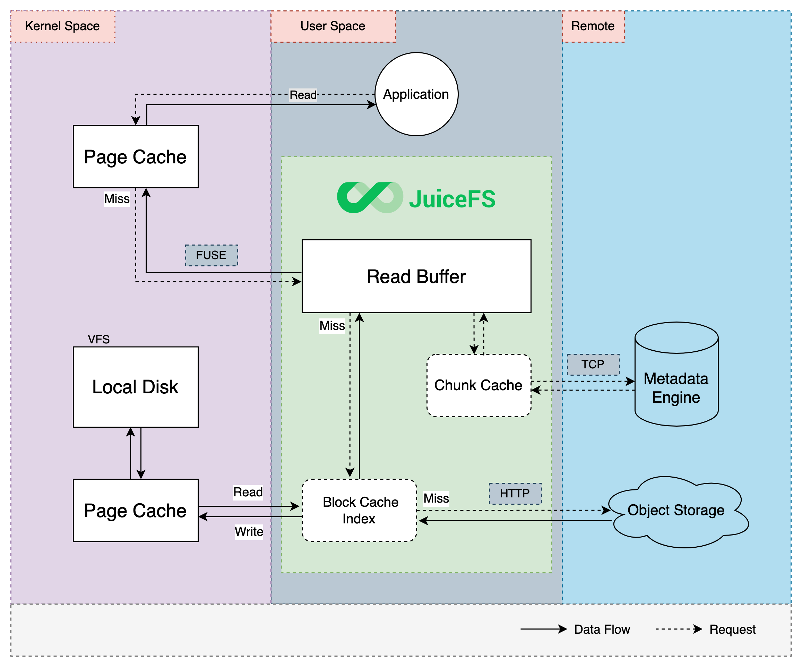

# Cache

For a file system driven by a combination of object storage and database, the cache is an important medium for interacting efficiently between the local client and the remote service. Read and write data can be loaded into the cache in advance or asynchronously, and then the client uploads to or prefetches from the remote service in the background. The use of caching technology can significantly reduce the latency of storage operations and increase data throughput compared to interacting with remote services directly.

JuiceFS provides various caching mechanisms including metadata caching, data read/write caching, etc.

## Data consistency

JuiceFS provides a "close-to-open" consistency guarantee, which means that when two or more clients read and write the same file at the same time, the changes made by client A may not be immediately visible to client B. However, once the file is closed by client A, any client re-opened it afterwards is guaranteed to see the latest data, no matter it is on the same node with A or not.

"Close-to-open" is the minimum consistency guarantee provided by JuiceFS, and in some cases it may not be necessary to reopen the file to access the latest written data. For example, multiple applications use the same JuiceFS client to access the same file (where file changes are immediately visible), or to view the latest data on different nodes with the `tail -f` command.

## Cache read mechanism

JuiceFS provides a multi-level cache to improve the performance of frequently accessed data. Read requests will try the kernel page cache, the pre-read buffer of the JuiceFS process, and the local disk cache in turn. If the data requested is not found in any level of the cache, it will be read from the object storage, and also be written into every level of the cache asynchronously to improve the performance of the next access. 



## Metadata cache

JuiceFS supports caching metadata both in kernel and in client memory (i.e. JuiceFS processes) to improve metadata access performance.

### Kernel metadata cache

There are three kinds of metadata which can be cached in kernel: **attribute**, **entry** and **directory**. The TTL of them can be specified by the following [mount options](../reference/command_reference.md#juicefs-mount):

```
--attr-cache value       attributes cache TTL in seconds (default: 1)
--entry-cache value      file entry cache TTL in seconds (default: 1)
--dir-entry-cache value  dir entry cache TTL in seconds (default: 1)
```

JuiceFS caches attributes, file entries, and directory entries in kernel for 1 second by default to improve the performance of `lookup` and `getattr`. When clients on multiple nodes are sharing the same file system, the metadata cached in kernel will only expire due to TTL exceeding. That is, in an edge case, it may happen that the metadata modification (e.g., `chown`) on node A cannot be seen immediately on node B. Of course, all nodes will eventually be able to see the changes made by A after the expiry of the cache.

### In-memory client metadata cache

:::note
This feature requires JuiceFS >= 0.15.2
:::

When a JuiceFS client `open()` a file, the attributes of the file are automatically cached in client memory. If the [`--open-cache`](../reference/command_reference.md#juicefs-mount) option is set to a value greater than 0 when mounting the file system, subsequent `getattr()` and `open()` operations will return the result from the in-memory cache immediately, as long as the cache has not expired.

When dong `read()` on a file, the chunk and slice information of the file is automatically cached in the client memory. Reading the chunk again during the cache lifetime will return the slice information from the in-memory cache immediately.

:::tip
You can check ["How JuiceFS Stores Files"](../reference/how_juicefs_store_files.md) to know what chunk and slice are.
:::

By default, if there is a file whose metadata has been cached in memory and not been accessed by any process for more than 1 hour, all its metadata cache will be automatically deleted.

## Data cache

JuiceFS also provides various kinds of data cache, including page cache in the kernel and local cache on the client host, to improve performance.

### Kernel data cache

:::note
This feature requires JuiceFS >= 0.15.2
:::

For a file that has already been read, the kernel automatically caches its content. If this file is not updated (i.e. its `mtime` doesn't change) in the further accessings, it will be read directly from the kernel cache to obtain better performance.

Thanks to the kernel cache, repeated reads of the same file in JuiceFS can be extremely fast, with latencies as low as a few microseconds and throughputs up to several GiBs per second.

JuiceFS clients currently do not have kernel write caching enabled by default. Starting with [Linux kernel 3.15](https://github.com/torvalds/linux/commit/4d99ff8f12e), FUSE supports ["writeback-cache mode"]( https://www.kernel.org/doc/Documentation/filesystems/fuse-io.txt), which means that the `write()` system call can be done very quickly. You can set the [`-o writeback_cache`](../reference/fuse_mount_options.md#writeback_cache) option at [mounting file system](../reference/command_reference.md#juicefs-mount) to enable writeback-cache mode. It is recommended to enable this mount option when very small data (e.g. around 100 bytes) needs to be written frequently.

### Client read data cache

The JuiceFS client automatically prefetches data into the cache based on the read pattern, thus improving sequential read performance. By default, it prefetches 1 block concurrently and caches it locally when reading. The local cache can be set up on any local file system based on HDD, SSD or memory.

:::tip Hint
You can check ["How JuiceFS Stores Files"](../reference/how_juicefs_store_files.md) to learn what a block is.
:::

The local cache can be adjusted at [mounting file system](../reference/command_reference.md#juicefs-mount) with the following options.

```
--cache-dir value         directory paths of local cache, use colon to separate multiple paths (default: "$HOME/.juicefs/cache" or "/var/jfsCache")
--cache-size value        size of cached objects in MiB (default: 102400)
--free-space-ratio value  minimum free space (ratio) (default: 0.1)
--cache-partial-only      cache only random/small read (default: false)
```

Specifically, there are two ways to store the local cache of JuiceFS in memory, i.e., setting `--cache-dir` to `memory` or `/dev/shm/<cache-dir>`. The difference between these two approaches is that the former deletes the cache data after remounting the JuiceFS file system, while the latter retains the cache data. Still, there is not much difference in performance between them.

The JuiceFS client writes data downloaded from the object storage (including new uploaded data containing less than 1 block) to the cache directory as fast as possible, without compression or encryption. **Because JuiceFS generates unique names for all block objects written to the object storage, and all block objects are not modified, there is no need to worry about the invalidation of the cached data when the file content is updated.**

Data caching can effectively improve the performance of random reads. For applications like Elasticsearch, ClickHouse, etc. that require higher random read performance, it is recommended to point the cache path to a faster storage medium and allocate more cache space.

#### Cache life cycle

When the cache usage space reaches the upper limit (that is, the cache size is greater than or equal to `--cache-size`) or the disk is almost full (that is, the free disk space ratio is less than `--free-space-ratio`), the JuiceFS client will automatically clean the cache.

JuiceFS allocates 100GiB cache space by default, but this does not mean that you have to have a disk with a capacity more than that. This value represents the maximum capacity that a JuiceFS client may use if the disk capacity allows. When the remaining space on the disk is less than 100GiB, ensure that the remaining space is not less than 10% by default.

For example, if you set `--cache-dir` to a partition with a capacity of 50GiB, then if `--cache-size` is set to 100GiB, JuiceFS will always keep the cache capacity around 45GiB, which means that more than 10% of the partition is reserved.

When the cache is full, the JuiceFS client cleans the cache using LRU-like algorithm, i.e., it tries to clean the oldest and least-used data.

### Client write data cache

When writing data, the JuiceFS client caches the data in memory until it is uploaded to the object storage when a chunk is written or when the operation is forced by `close()` or `fsync()`. When `fsync()` or `close()` is called, the client waits for data to be written to the object storage and notifies the metadata service before returning, thus ensuring data integrity.

When local storage is reliable and its write performance is significantly better than network writes (e.g. SSD disks), write performance can be improved by enabling asynchronous upload of data. In this way, the `close()` operation does not have to wait for data to be written into the object storage, but returns as soon as the data is written to the local cache directory.

The asynchronous upload feature is disabled by default and can be enabled with the following option.

```
--writeback  upload objects in background (default: false)
```

When writing a large number of small files in a short period of time, it is recommended to mount the file system with the `--writeback` parameter to improve write performance, and consider re-mounting without the option after the write is complete to make subsequent writes more reliable. It is also recommended to enable `--writeback` for scenarios that require a lot of random writes, such as incremental backups of MySQL.

:::caution
When asynchronous upload is enabled, i.e. `--writeback` is specified when mounting the file system, do not delete the contents in `<cache-dir>/<UUID>/rawstaging` directory, as this will result in data loss.
:::

When the cache disk is almost full, it will pause writing data and change to uploading data directly to the object storage (i.e., the client write cache feature is turned off).

When the asynchronous upload function is enabled, the reliability of the cache itself is directly related to the reliability of data writing. Thus, this function should be used with caution for scenarios requiring high data reliability.

## Cache warm-up

JuiceFS cache warm-up is an active caching means to improve the efficiency of file reading and writing by pre-caching frequently used data locally.

Use the `warmup` subcommand to warm up the cache.

```shell
juicefs warmup [command options] [PATH ...]
```

Command options:

- `--file` or `-f`: file containing a list of paths
- `--threads` or `-p`: number of concurrent workers (default: 50)
- `--background` or `-b`: run in background

:::tip
Only files in the mounted file system can be warmed up, i.e. the path to be warmed up must be on the local mount point.
:::

### Warm up a directory

For example, to cache the `dataset-1` directory in a filesystem mount point locally.

```shell
juicefs warmup /mnt/jfs/dataset-1
```

### Warm up multiple directories or files

When you need to warm up the cache of multiple directories or files at the same time, you can write all the paths in a text file. For example, create a text file named `warm.txt` with one mount point path per line.

```
/mnt/jfs/dataset-1
/mnt/jfs/dataset-2
/mnt/jfs/pics
```

Then run the warm up command.

```shell
juicefs warmup -f warm.txt
```

## Cache directory

Depending on the operating system, the default cache path for JuiceFS is as follows:

- **Linux**: `/var/jfsCache`
- **macOS**: `$HOME/.juicefs/cache`
- **Windows**: `%USERPROFILE%\.juicefs\cache`

For Linux, note that the default cache path requires administrator privileges and that normal users need to be granted to use `sudo` to set it up, e.g.:

```shell
sudo juicefs mount redis://127.0.0.1:6379/1 /mnt/myjfs
```

Alternatively, the `--cache-dir` option can be set to any storage path accessible to the current system when mounting the filesystem. For normal users who do not have permission to access the `/var` directory, the cache can be set in the user's `HOME` directory, e.g.:

```shell
juicefs mount --cache-dir ~/jfscache redis://127.0.0.1:6379/1 /mnt/myjfs
```

:::tip
Setting up the cache on a faster SSD disk can improve performance.
:::

### RAM disk

If a higher file read performance is required, you can set up the cache into the RAM disk. For Linux systems, check the `tmpfs` file system with the `df` command.

```shell
$ df -Th | grep tmpfs
tmpfs          tmpfs     362M  2.0M  360M    1% /run
tmpfs          tmpfs     3.8G     0  3.8G    0% /dev/shm
tmpfs          tmpfs     5.0M  4.0K  5.0M    1% /run/lock
```

Where `/dev/shm` is a typical memory disk that can be used as a cache path for JuiceFS, it is typically half the capacity of memory and can be manually adjusted as needed, for example, to 32GB.

```shell
sudo mount -o size=32000M -o remount /dev/shm
```

Then, using that path as a cache, mount the filesystem.

```shell
juicefs mount --cache-dir /dev/shm/jfscache redis://127.0.0.1:6379/1 /mnt/myjfs
```

### Shared folders

Shared directories created via SMB or NFS can also be used as cache for JuiceFS. For the case where multiple devices on the LAN mount the same JuiceFS file system, using shared directories on the LAN as cache paths can effectively relieve the bandwidth pressure of duplicate caches for multiple devices.

Using SMB/CIFS as an example, mount the shared directories on the LAN by using the tools provided by the `cifs-utils` package.

```shell
sudo mount.cifs //192.168.1.18/public /mnt/jfscache
```

Using shared directories as JuiceFS caches:

```shell
sudo juicefs mount --cache-dir /mnt/jfscache redis://127.0.0.1:6379/1 /mnt/myjfs
```

### Multiple cache directories

JuiceFS supports setting multiple cache directories at the same time, thus avoiding the problem of insufficient cache space by splitting multiple paths using `:` (Linux, macOS) or `;` (Windows), e.g.:

```shell
sudo juicefs mount --cache-dir ~/jfscache:/mnt/jfscache:/dev/shm/jfscache redis://127.0.0.1:6379/1 /mnt/myjfs
```

When multiple cache paths are set, the client will write data evenly to each cache path using hash policy.

:::note
When multiple cache directories are set, the `--cache-size` option represents the total size of data in all cache directories. It is recommended that the free space of different cache directories are close to each other, otherwise, the space of a cache directory may not be fully utilized.

For example, `--cache-dir` is `/data1:/data2`, where `/data1` has a free space of 1GiB, `/data2` has a free space of 2GiB, `--cache-size` is 3GiB, `--free-space-ratio` is 0.1. Because the cache write strategy is to write evenly, the maximum space allocated to each cache directory is `3GiB / 2 = 1.5GiB`, resulting in a maximum of 1.5GiB cache space in the `/data2` directory instead of `2GiB * 0.9 = 1.8GiB`.
:::

## FAQ

### Why 60 GiB disk spaces are occupied while I set cache size to 50 GiB?

JuiceFS currently estimates the size of cached objects by adding up the size of all cached objects plus a fixed overhead (4KiB), which is not exactly the same as the value obtained by the `du` command.

To prevent the cache disk from being written to full, the client will try to reduce the cache usage when the file system the cache directory is located on is running out of space.
