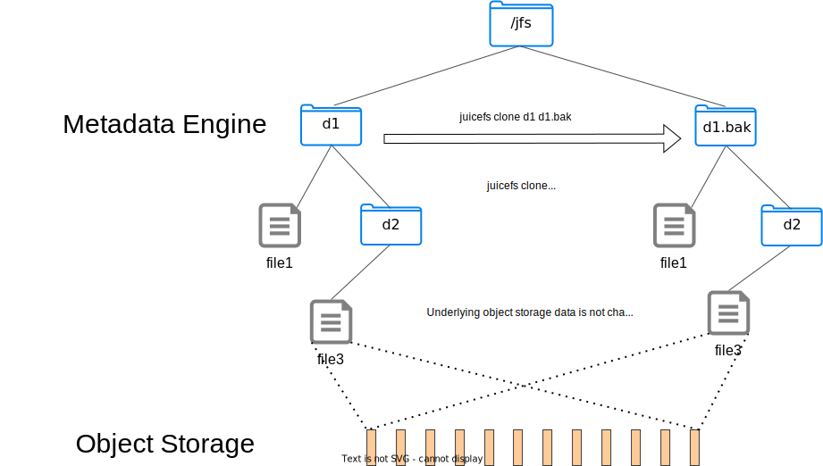

Cloning specific data does not involve copying the actual object storage data but only copies metadata. Therefore, cloning is very fast regardless of the size of the file or directory. For JuiceFS, this command is a better alternative to `cp`. Moreover, for Linux clients using kernels with [`copy_file_range`](https://man7.org/linux/man-pages/man2/copy_file_range.2.html) support, using `cp` effectively performs the same metadata copy and is very fast.



The clone result is purely a metadata copy, meaning all files still refer to the same underlying object storage blocks. Therefore, a clone behaves exactly like the original. When either the original or the clone is modified, the affected data blocks are copied on write, resulting in new blocks while the unchanged parts remain the same, still referencing the original blocks.

Note that system tools like disk-free or disk-usage (`df`, `du`) show the space used by the cloned data, but the underlying object storage space remains unchanged since the blocks are not duplicated. Cloning replicates metadata, so it will occupy the same metadata engine storage space as the original.

**Cloning impacts file system storage space, inodes, and metadata engine storage space.** Be cautious when cloning large directories.

```shell
juicefs clone SRC DST

# Clone a file
juicefs clone /mnt/jfs/file1 /mnt/jfs/file2

# Clone a directory
juicefs clone /mnt/jfs/dir1 /mnt/jfs/dir2
```

## Consistency {#consistency}

In terms of transaction consistency, cloning behaves as follows:

- The destination file is not visible until the `clone` command completes.
- For files: The `clone` command ensures atomicity, meaning that the cloned file will always be in a correct and consistent state.
- For directories: The `clone` command does not guarantee atomicity for directories. In other words, if the source directory changes during the cloning process, the target directory may be different from the source directory.
- Only one `clone` operation can succeed from the same source at the same time. Any failed clones will clean up the temporarily created directory tree.

The cloning operation is performed by the mount process. It will be interrupted, if the `clone` command is terminated. If a cloning operation fails or is interrupted, the `mount` process will clean up any created inodes. If this cleanup fails, it may lead to metadata leaks and potential object storage leaks, because the dangling tree continues to reference the underlying data blocks. They could be cleaned up by the [`juicefs gc --delete`](../reference/command_reference.mdx#gc) command.
