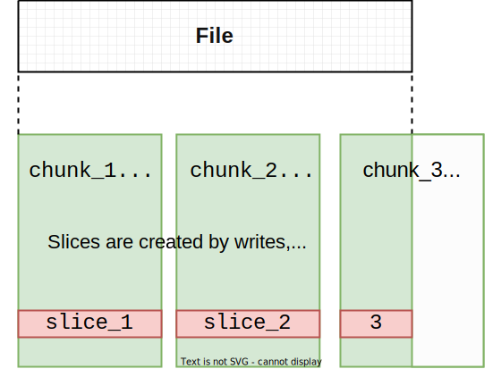
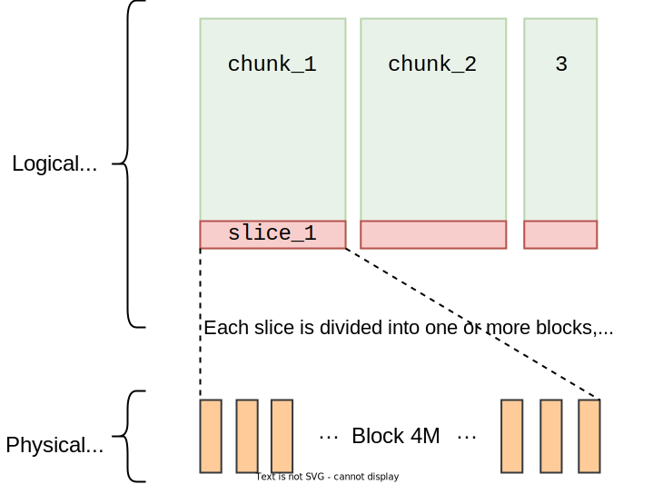
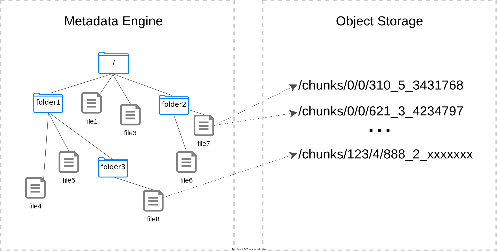
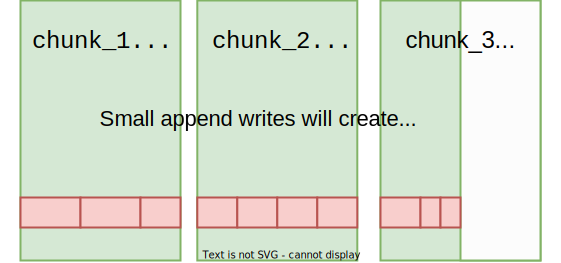
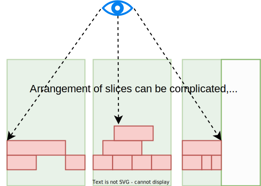
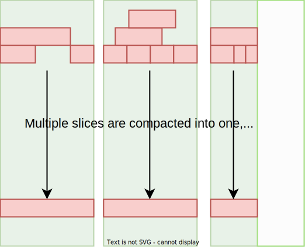

The JuiceFS file system consists of three parts:

**JuiceFS Client**: The JuiceFS client handles all file I/O operations, including background tasks like data compaction and trash file expiration. It communicates with both the object storage and metadata engine. The client supports multiple access methods:

- **FUSE**: JuiceFS file system can be mounted on a host in a POSIX-compatible manner, allowing the massive cloud storage to be used as local storage.
- **Hadoop Java SDK**: JuiceFS can replace HDFS, providing Hadoop with cost-effective and abundant storage capacity.
- **Kubernetes CSI Driver**: JuiceFS provides shared storage for containers in Kubernetes through its CSI Driver.
- **S3 Gateway**: Applications using S3 as the storage layer can directly access the JuiceFS file system, and tools such as AWS CLI, s3cmd, and MinIO client can be used to access the JuiceFS file system at the same time.
- **WebDAV Server**: Files in JuiceFS can be operated directly using the HTTP protocol.

**Data Storage**: File data is split and stored in object storage. JuiceFS supports virtually all types of object storage, including typical self-hosted solutions like OpenStack Swift, Ceph, and MinIO.

**Metadata Engine**: The Metadata Engine stores file metadata, which contains:

- Common file system metadata: file name, size, permission information, creation and modification time, directory structure, file attribute, symbolic link, file lock.
- JuiceFS-specific metadata: file data mapping, reference counting, client session, etc.

JuiceFS supports a variety of common databases as the metadata engine, like Redis, TiKV, MySQL/MariaDB, PostgreSQL, and SQLite, and the list is still expanding. [Submit an issue](https://github.com/juicedata/juicefs/issues) if your favorite database is not supported.

## How JuiceFS stores files {#how-juicefs-store-files}

Traditional file systems use local disks to store both file data and metadata. However, JuiceFS formats data first and then stores it in the object storage, with the corresponding metadata being stored in the metadata engine.

In JuiceFS, each file is composed of one or more *chunks*. Each chunk has a maximum size of 64 MB. Regardless of the file's size, all reads and writes are located based on their offsets (the position in the file where the read or write operation occurs) to the corresponding chunk. This design enables JuiceFS to achieve excellent performance even with large files. As long as the total length of the file remains unchanged, the chunk division of the file remains fixed, regardless of how many modifications or writes the file undergoes.

Chunks exist to optimize lookup and positioning, while the actual file writing is performed on *slices*. In JuiceFS, each slice represents a single continuous write, belongs to a specific chunk, and cannot overlap between adjacent chunks. This ensures that the slice length never exceeds 64 MB.

For example, if a file is generated through a continuous sequential write, each chunk contains only one slice. The figure above illustrates this scenario: a 160 MB file is sequentially written, resulting in three chunks, each containing only one slice.

File writing generates slices, and invoking `flush` persists these slices. `flush` can be explicitly called by the user, and even if not invoked, the JuiceFS client automatically performs `flush` at the appropriate time to prevent buffer overflow (refer to [buffer-size](../guide/cache.md#buffer-size)). When persisting to the object storage, slices are further split into individual *blocks* (default maximum size of 4 MB) to enable multi-threaded concurrent writes, thereby enhancing write performance. The previously mentioned chunks and slices are logical data structures, while blocks represent the final physical storage form and serve as the smallest storage unit for the object storage and disk cache.

After writing a file to JuiceFS, you cannot find the original file directly in the object storage. Instead, the storage bucket contains a `chunks` folder and a series of numbered directories and files. These numerically named object storage files are the blocks split and stored by JuiceFS. The mapping between these blocks, chunks, slices, and other metadata information (such as file names and sizes) is stored in the metadata engine. This decoupled design makes JuiceFS a high-performance file system.

Regarding logical data structures, if a file is not generated through continuous sequential writes but through multiple append writes, each append write triggers a `flush` to initiate the upload, resulting in multiple slices. If the data size for each append write is less than 4 MB, the data blocks eventually stored in the object storage are smaller than 4 MB blocks.

Depending on the writing pattern, the arrangement of slices can be diverse:

- If a file is repeatedly modified in the same part, it results in multiple overlapping slices.
- If writes occur in non-overlapping parts, there will be gaps between slices.

However complex the arrangement of slices may be, when reading a file, the most recent written slice is read for each file position. The figure below illustrates this concept: while slices may overlap, reading the file always occurs "from top to bottom." This ensures that you see the latest state of the file.

Due to the potential overlapping of slices, JuiceFS [marks the valid data offset range for each slice](../development/internals.md#sliceref) in the reference relationship between chunks and slices. This approach informs the file system of the valid data in each slice.

However, it is not difficult to imagine that looking up the "most recently written slice within the current read range" during file reading, especially with a large number of overlapping slices as shown in the figure, can significantly impact read performance. This leads to what we call "file fragmentation." File fragmentation not only affects read performance but also increases space usage at various levels (object storage, metadata). Hence, whenever a write occurs, the client evaluates the file's fragmentation and runs the fragmentation compaction asynchronously, merging all slices within the same chunk into one.

Additional technical aspects of JuiceFS storage design:

* Irrespective of the file size, JuiceFS avoids storage merging to prevent read amplification and ensure optimal performance.
* JuiceFS provides strong consistency guarantees while allowing tuning options with caching mechanisms tailored to specific use cases. For example, by configuring more aggressive metadata caching, a certain level of consistency can be traded for enhanced performance. For more details, see [Metadata cache](../guide/cache.md#metadata-cache).
* JuiceFS supports the ["Trash"](../security/trash.md) functionality and enables it by default. After a file is deleted, it is retained for a certain period before being permanently cleared. This helps you avoid data loss caused by accidental deletion.
