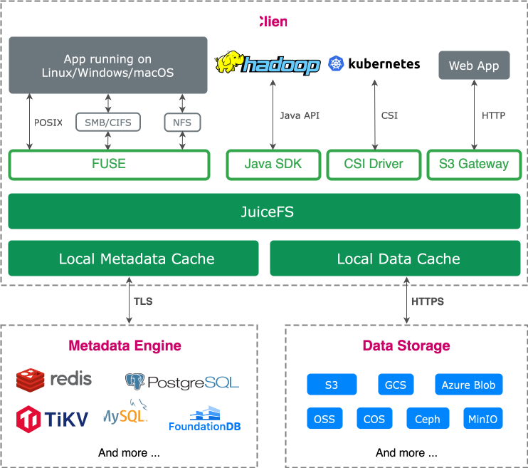
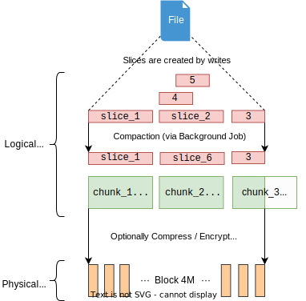

The JuiceFS file system consists of three parts:

**JuiceFS Client**: The JuiceFS client handles all file I/O operations, including background tasks like data compaction and trash file expiration. It communicates with both the object storage and metadata engine. The client supports multiple access methods:

- **FUSE**: JuiceFS file system can be mounted on a host in a POSIX-compatible manner, allowing the massive cloud storage to be used as local storage.
- **Hadoop Java SDK**: JuiceFS can replace HDFS, providing Hadoop with cost-effective and abundant storage capacity.
- **Kubernetes CSI Driver**: JuiceFS provides shared storage for containers in Kubernetes through its CSI Driver.
- **S3 Gateway**: Applications using S3 as the storage layer can directly access the JuiceFS file system, and tools such as AWS CLI, s3cmd, and MinIO client can be used to access the JuiceFS file system at the same time.
- **WebDAV Server**: Files in JuiceFS can be operated directly using the HTTP protocol.

**Data Storage**: File data is split and stored in object storage. JuiceFS supports virtually all types of object storage, including typical self-hosted solutions like OpenStack Swift, Ceph, and MinIO.

**Metadata Engine**: The Metadata Engine stores file metadata, which contains:

- Common file system metadata: file name, size, permission information, creation and modification time, directory structure, file attribute, symbolic link, file lock.
- JuiceFS-specific metadata: file data mapping, reference counting, client session, etc.

JuiceFS supports a variety of common databases as the metadata engine, like Redis, TiKV, MySQL/MariaDB, PostgreSQL, and SQLite, and the list is still expanding. [Submit an issue](https://github.com/juicedata/juicefs/issues) if your favorite database is not supported.

## How JuiceFS stores files {#how-juicefs-store-files}

Traditional file systems use local disks to store both file data and metadata. However, JuiceFS formats data first and then stores it in the object storage, with the corresponding metadata being stored in the metadata engine.

Files are divided into 64 MB *chunks*. This allows for fast lookup using offsets, bringing better performance for large files. The division of chunks remains consistent as long as the file size remains unchanged, regardless of the number of writes. But note that chunks are invented to speed up data lookups, while writes are executed on the *slice* data structure.

A slice represents a single continuous write and has a maximum size of 64 MB. Each slice belongs to a chunk and cannot overlap between adjacent chunks. Continuous writes produce a single slice, while random writes or slow append writes can result in multiple slices inside a chunk. The arrangement of these slices is controlled by write patterns, which may be close to each other, overlap, or have empty space between them. Slices are persisted after `flush` calls. `flush` can be explicitly invoked by the user. If not, the JuiceFS client automatically performs `flush` to prevent buffer overflow.

When a file is repeatedly modified in the same part, it results in multiple overlapping slices (like Slices 2, 4, and 5 in the figure below). That is why [the valid data offsets of each slice is marked in the reference relationship](../development/internals.md#sliceref). When the JuiceFS client reads a file, it searches for "every slice that contains the latest file data" to perform a correct read. To improve read performance, JuiceFS performs compaction in the background, which merges overlapping slices into one.

Although chunks and slices are logical data structures, they are further divided into *blocks* (default max size of 4 MB) for faster concurrent uploading. This enhances write performance. Blocks is the basic storage unit in the system, both in object storage and in disk cache.

Hence, you cannot find the original files directly in the object storage. Instead, Instead, the bucket contains a `chunks` folder and a series of numbered directories and files. This is exactly how JuiceFS formats and stores data. File relationships with chunks, slices, and blocks are stored in the metadata engine. This decoupled design is what makes JuiceFS a high-performance file system.

Additional technical aspects of JuiceFS storage design:

* Irrespective of the file size, JuiceFS avoids storage merging to prevent read amplification and ensure optimal performance.
* JuiceFS provides strong consistency guarantees while allowing tuning options with caching mechanisms tailored to specific use cases. For example, by configuring more aggressive metadata caching, a certain level of consistency can be traded for enhanced performance. For more details, see [Metadata cache](../guide/cache_management.md#metadata-cache).
* JuiceFS supports the ["Trash"](../security/trash.md) functionality and enables it by default. After a file is deleted, it is retained for a certain period before being permanently cleared. This helps you avoid data loss caused by accidental deletion.
