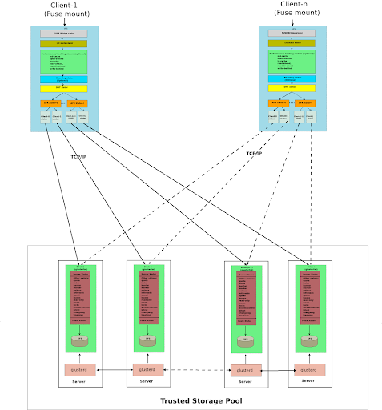

[GlusterFS](https://github.com/gluster/glusterfs) is an open-source software-defined distributed storage solution. It can support data storage of PiB levels within a single cluster.

JuiceFS is an open-source, high-performance distributed file system designed for the cloud. It delivers massive, elastic, and high-performance storage at low cost.

This document compares the key attributes of JuiceFS and GlusterFS in a table and then explores them in detail, offering insights to aid your team in the technology selection process. You can easily see their main differences in the table below and delve into specific topics you're interested in within this article.

## A quick summary of GlusterFS vs. JuiceFS {#a-quick-summary-of-glusterfs-vs-juicefs}

The table below provides a quick overview of the differences between GlusterFS and JuiceFS:

| **Comparison basis** | **GlusterFS** | **JuiceFS** |
| :--- | :--- | :--- |
| Metadata | Purely distributed | Independent database |
| Data storage | Self-managed | Relies on object storage |
| Large file handling | Doesn't split files | Splits large files |
| Redundancy protection | Replication, erasure coding | Relies on object storage |
| Data compression | Partial support | Supported |
| Data encryption | Partial support | Supported |
| POSIX compatibility | Full | Full |
| NFS protocol | Not directly supported | Not directly supported |
| CIFS protocol | Not directly supported | Not directly supported |
| S3 protocol | Supported (but not updated) | Supported |
| HDFS compatibility | Supported (but not updated) | Supported |
| CSI Driver | Supported | Supported |
| POSIX ACLs | Supported | Supported |
| Cross-cluster replication | Supported | Relies on external service |
| Directory quotas | Supported | Supported |
| Snapshots | Supported | Not supported (but supports cloning) |
| Trash | Supported | Supported |
| Primary maintainer | Red Hat, Inc | Juicedata, Inc |
| Development language | C | Go |
| Open source license | GPLv2 and LGPLv3+ | Apache License 2.0 |

## System architecture comparison {#system-architecture-comparison}

### GlusterFS' architecture {#glusterfs-architectire}

GlusterFS employs a fully distributed architecture without centralized nodes. A GlusterFS cluster consists of the server and the client. The server side manages and stores data, often referred to as the Trusted Storage Pool. This pool comprises a set of server nodes, each running two types of processes:

* glusterd: One per node, which manages and distributes configuration.
* glusterfsd: One per [brick](https://docs.gluster.org/en/latest/glossary/#Brick) (storage unit), which handles data requests and interfaces with the underlying file system.

All files on each brick can be considered a subset of GlusterFS. File content accessed directly through the brick or via GlusterFS clients is typically consistent. If GlusterFS experiences an exception, users can partially recover original data by integrating content from multiple bricks. Additionally, for fault tolerance during deployment, data is often redundantly protected. In GlusterFS, multiple bricks form a redundancy group, protecting data through replication or erasure coding. When a node experiences a failure, recovery can only be performed within the redundancy group, which may result in longer recovery times. When scaling a GlusterFS cluster, the scaling is typically performed on a redundancy group basis.

The client side, which mounts GlusterFS, presents a unified namespace to applications. The architecture diagram is as follows (source: [GlusterFS Architecture](https://docs.gluster.org/en/latest/Quick-Start-Guide/Architecture)):

### JuiceFS' architecture {#juicefs-architecture}

JuiceFS adopts an architecture that separates its data and metadata storage. File data is split and stored in object storage systems like Amazon S3, while metadata is stored in a user-selected database like Redis or MySQL. By sharing the same database and object storage, JuiceFS achieves a strongly consistent distributed file system with features like full POSIX compatibility and high performance. For a more detailed introduction, see [the documentation](../architecture.md).

## Metadata management comparison {#metadata-management-comparison}

### GlusterFS {#glusterfs}

Metadata in GlusterFS is purely distributed, lacking a centralized metadata service. Clients use file name hashing to determine the associated brick. When requests require access across multiple bricks, for example, `mv` and `ls`, the client is responsible for coordination. While this design is simple, it can lead to performance bottlenecks as the system scales. For instance, listing a large directory might require accessing multiple bricks, and any latency in one brick can slow down the entire request. Additionally, ensuring metadata consistency when performing cross-brick modifications in the event of failures can be challenging, and severe failures may lead to split-brain scenarios, requiring [manual data recovery](https://docs.gluster.org/en/latest/Troubleshooting/resolving-splitbrain) to achieve a consistent version.

### JuiceFS {#juicefs}

JuiceFS metadata is stored in an independent database, which is called the metadata engine. Clients transform file metadata operations into transactions within this database, leveraging its transactional capabilities to ensure operation atomicity. This design simplifies JuiceFS implementation but places higher demands on the metadata engine. JuiceFS currently supports three categories of transactional databases. For details, see the [metadata engine document](../../reference/how_to_set_up_metadata_engine.md).

## Data management comparison {#data-management-comparison}

GlusterFS stores data by integrating multiple server nodes' bricks (typically built on local file systems like XFS). Therefore, it provides certain data management features, including distribution management, redundancy protection, fault switching, and silent error detection.

JuiceFS, on the other hand, does not use physical disks directly but manages data through integration with various object storage systems. Most of its features rely on the capabilities of its object storage.

### Large file splitting {#large-file-splitting}

In distributed systems, splitting large files into smaller chunks and storing them on different nodes is a common optimization technique. This often leads to higher concurrency and bandwidth when applications access such files.

* GlusterFS does not split large files (although it used to support Striped Volumes for large files, this feature is no longer supported).
* JuiceFS splits files into 64 MiB chunks by default, and each chunk is further divided into 4 MiB blocks based on the write pattern. For details, see [How JuiceFS stores files](../architecture.md#how-juicefs-store-files).

### Redundancy protection {#redundancy-protection}

GlusterFS supports both replication (Replicated Volume) and erasure coding (Dispersed Volume).

JuiceFS relies on the redundancy capabilities of the underlying object storage it uses.

### Data compression {#data-compression}

GlusterFS:

* Supports only transport-layer compression. Files are compressed by clients, transmitted to the server, and decompressed by the bricks.
* Does not implement storage-layer compression but depends on the underlying file system used by the bricks, such as [ZFS](https://docs.gluster.org/en/latest/Administrator-Guide/Gluster-On-ZFS).

JuiceFS supports both transport-layer and storage-layer compression. Data compression and decompression are performed on the client side.

### Data encryption {#data-encryption}

GlusterFS:

* Supports only [transport-layer encryption](https://docs.gluster.org/en/latest/Administrator-Guide/SSL), relying on SSL/TLS.
* Previously supported [storage-layer encryption](https://github.com/gluster/glusterfs-specs/blob/master/done/GlusterFS%203.5/Disk%20Encryption.md), but it is no longer supported.

JuiceFS supports both [transport-layer and storage-layer encryption](../../security/encryption.md). Data encryption and decryption are performed on the client side.

## Access protocols {#access-protocols}

### POSIX compatibility {#posix-compatibility}

Both [GlusterFS](https://docs.gluster.org/en/latest/glossary) and [JuiceFS](../../reference/posix_compatibility.md) offer POSIX compatibility.

### NFS protocol {#nfs-protocol}

GlusterFS previously had embedded support for NFSv3 but now it is [no longer recommended](https://github.com/gluster/glusterfs-specs/blob/master/done/GlusterFS%203.8/gluster-nfs-off.md). Instead, it is suggested to export the mount point using an NFS server.

JuiceFS does not provide direct support for NFS and requires mounting followed by [export via another NFS server](../../deployment/nfs.md).

### CIFS protocol {#cifs-protocol}

GlusterFS embeds support for Windows, Linux Samba clients, and macOS CLI access (excluding macOS Finder). However, it is recommended to [use Samba for exporting mount points](https://docs.gluster.org/en/latest/Administrator-Guide/Setting-Up-Clients/#testing-mounted-volumes).

JuiceFS does not offer direct support for CIFS and requires mounting followed by [export via Samba](../../deployment/samba.md).

### S3 protocol {#s3-protocol}

GlusterFS supports S3 through the [`gluster-swift`](https://github.com/gluster/gluster-swift) project, but the project hasn't seen recent updates since November 2017.

JuiceFS supports S3 through the [S3 gateway](../../guide/gateway.md).

### HDFS compatibility {#hdfs-compatibility}

GlusterFS offers HDFS compatibility through the [`glusterfs-hadoop`](https://github.com/gluster/glusterfs-hadoop) project, but the project hasn't seen recent updates since May 2015.

JuiceFS provides [full compatibility with the HDFS API](../../deployment/hadoop_java_sdk.md).

### CSI Driver {#csi-driver}

GlusterFS [previously supported CSI Driver](https://github.com/gluster/gluster-csi-driver) but the latest version was released in November 2018, and the repository is marked as DEPRECATED.

JuiceFS supports CSI Driver. For details, see the [document](https://juicefs.com/docs/csi/introduction).

## Extended features {#extended-features}

### POSIX ACLs {#posix-acls}

In Linux, file access permissions are typically controlled by three entities: the file owner, the group owner, and others. However, when more complex requirements arise, such as the need to assign specific permissions to a particular user within the others category, this standard mechanism does not work. POSIX Access Control Lists (ACLs) offer enhanced permission management capabilities, allowing you to assign permissions to any user or user group as needed.

GlusterFS [supports ACLs](https://docs.gluster.org/en/main/Administrator-Guide/Access-Control-Lists), including access ACLs and default ACLs.

JuiceFS supports the [POSIX ACLs](../../security/posix_acl.md) feature starting from v1.2.

### Cross-cluster replication {#cross-cluster-replication}

Cross-cluster replication indicates replicating data between two independent clusters, often used for geographically distributed disaster recovery.

GlusterFS [supports one-way asynchronous incremental replication](https://docs.gluster.org/en/main/Administrator-Guide/Geo-Replication) but requires both sides to use the same version of Gluster cluster.

JuiceFS depends on the capabilities of the metadata engine and the object storage, allowing one-way replication.

### Directory quotas {#directory-quotas}

Both [GlusterFS](https://docs.gluster.org/en/main/Administrator-Guide/Directory-Quota) and [JuiceFS](../../guide/quota.md#directory-quota) support directory quotas, including capacity and/or file count limits.

### Snapshots {#snapshots}

GlusterFS supports [volume-level snapshots](https://docs.gluster.org/en/main/Administrator-Guide/Managing-Snapshots) and requires all bricks to be deployed on LVM thinly provisioned volumes.

JuiceFS does not support snapshots but offers [directory-level cloning](../../guide/clone.md).

### Trash {#trash}

GlusterFS [supports the trash functionality](https://docs.gluster.org/en/main/Administrator-Guide/Trash), which is disabled by default.

JuiceFS [supports the trash functionality](../../security/trash.md), which is enabled by default.
