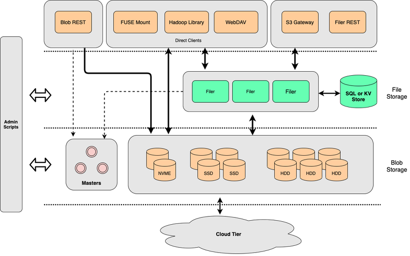
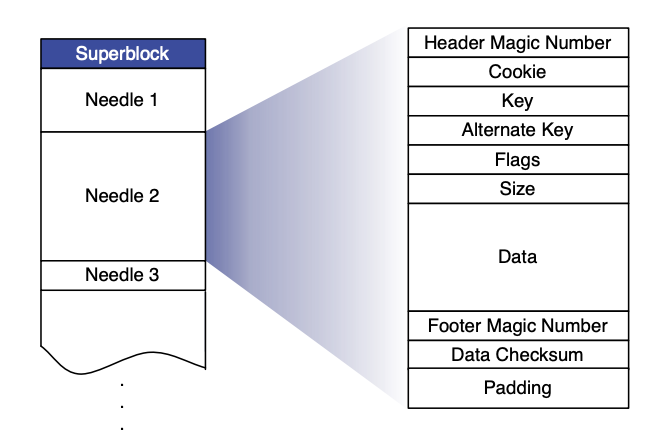
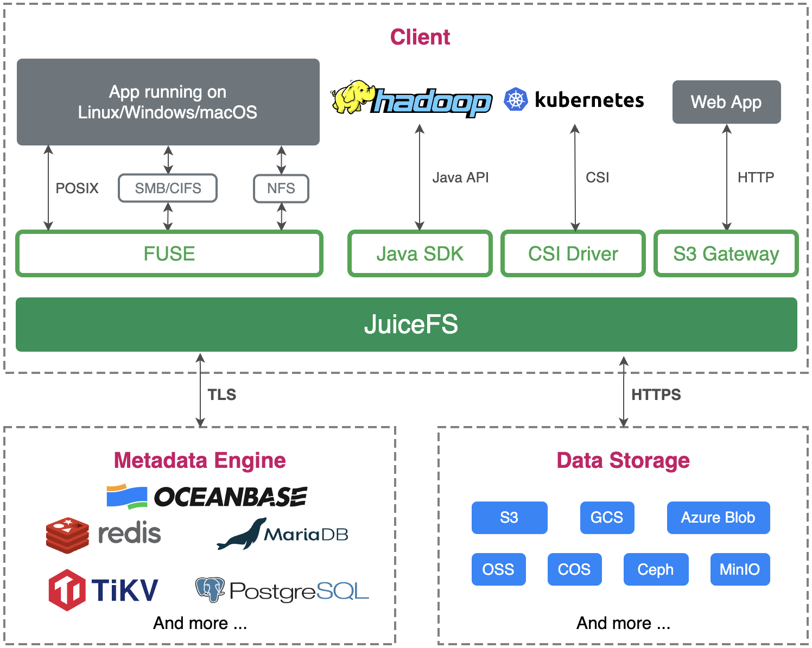

[SeaweedFS](https://github.com/seaweedfs/seaweedfs) and [JuiceFS](https://github.com/juicedata/juicefs) are both open-source high-performance distributed file storage systems. They operate under the business-friendly Apache License 2.0. However, JuiceFS comes in two versions: a [Community Edition](https://juicefs.com/docs/community/introduction) and an [Enterprise Edition](https://juicefs.com/en/blog/solutions/juicefs-enterprise-edition-features-vs-community-edition), you can use JuiceFS Enterprise Edition as on-premises deployment, or [use Cloud Service](https://juicefs.com/docs/cloud) directly. The Enterprise Edition uses a proprietary metadata engine, while its client shares code extensively with the [Community Edition](https://github.com/juicedata/juicefs).

This document compares the key attributes of JuiceFS and SeaweedFS in a table and then explores them in detail. You can easily see their main differences in the table below and delve into specific topics you're interested in within this article. By highlighting their contrasts and evaluating their suitability for different use cases, this document aims to help you make informed decisions.

## A quick summary of SeaweedFS vs. JuiceFS

| Comparison basis | SeaweedFS | JuiceFS |
| :--- | :--- | :--- |
| Metadata engine | Supports multiple databases | The Community Edition supports various databases; the Enterprise Edition uses an in-house, high-performance metadata engine. |
| Metadata operation atomicity | Not guaranteed | The Community Edition ensures atomicity through database transactions; the Enterprise Edition ensures atomicity within the metadata engine. |
| Changelog | Supported | Exclusive to the Enterprise Edition |
| Data storage | Self-contained | Relies on object storage |
| Erasure coding | Supported | Relies on object storage |
| Data consolidation | Supported | Relies on object storage |
| File splitting | 8MB | 64MB logical blocks + 4MB physical storage blocks |
| Tiered storage | Supported | Relies on object storage |
| Data compression | Supported (based on file extensions) | Supported (configured globally) |
| Storage encryption | Supported | Supported |
| POSIX compatibility | Basic | Full |
| S3 protocol | Basic | Basic |
| WebDAV protocol | Supported | Supported |
| HDFS compatibility | Basic | Full |
| CSI Driver | Supported | Supported |
| Client cache | Supported | Supported |
| Cluster data replication | Unidirectional and bidirectional replication is supported | Exclusive to the Enterprise Edition, only unidirectional replication is supported |
| Cloud data cache | Supported (manual synchronization) | Exclusive to the Enterprise Edition |
| Trash | Unsupported | Supported |
| Operations and monitoring | Supported | Supported |
| Release date | April 2015 | January 2021 |
| Primary maintainer | Individual (Chris Lu) | Company (Juicedata Inc.) |
| Programming language | Go | Go |
| Open source license | Apache License 2.0 | Apache License 2.0 |

## The SeaweedFS architecture

The system consists of three components:

- The volume servers, which store files in the underlying layer
- The master servers, which manage the cluster
- An optional component, filer, which provides additional features to the upper layer

In the system operation, both the volume server and the master server are used for file storage:

- The volume server focuses on data read and write operations.
- The master server primarily functions as a management service for the cluster and volumes.

In terms of data access, SeaweedFS implements a similar approach to Haystack. A user-created volume in SeaweedFS corresponds to a large disk file ("Superblock" in the diagram below). Within this volume, all files written by the user ("Needles" in the diagram) are merged into the large disk file.

Data write and read process in SeaweedFS:

1. Before a write operation, the client initiates a write request to the master server.
2. SeaweedFS returns a File ID based on the current data volume. This ID is composed of three parts: \<volume id, file key, file cookie\>. During the writing process, basic metadata information such as file length and chunk details is also written together with the data.
3. After the write is completed, the caller needs to associate the file with the returned File ID and store this mapping in an external system such as MySQL.
4. When reading data, since the volume index is already loaded in memory, the system can use the File ID to quickly retrieve all necessary information about the file's location (offset). This enables efficient file reading.

On top of the underlying storage services, SeaweedFS offers a component called filer, which interfaces with the volume server and the master server. It provides features like POSIX support, WebDAV, and the S3 API. Like JuiceFS, the filer needs to connect to an external database to store metadata information.

## The JuiceFS architecture

JuiceFS adopts an architecture that separates data and metadata storage:

- File data is split and stored in object storage systems such as Amazon S3.
- Metadata is stored in a user-selected database such as Redis or MySQL.

The client connects to the metadata engine for metadata services and writes actual data to object storage, achieving distributed file systems with strong consistency .

For details about JuiceFS' architecture, see the [Architecture](../architecture.md) document.

## Architecture comparison

### Metadata

Both SeaweedFS and JuiceFS support storing file system metadata in external databases:

- SeaweedFS supports up to [24 databases](https://github.com/seaweedfs/seaweedfs/wiki/Filer-Stores).
- JuiceFS has a high requirement for database transaction capabilities and currently supports [10 transactional databases across 3 categories](../../reference/how_to_set_up_metadata_engine.md).

### Atomic operations

JuiceFS ensures strict atomicity for every operation, which requires strong transaction capabilities from the metadata engine like Redis and MySQL. As a result, JuiceFS supports fewer databases.

SeaweedFS provides weaker atomicity guarantees for operations. It only uses transactions of some databases (SQL, ArangoDB, and TiKV) during rename operations, with a lower requirement for database transaction capabilities. Additionally, during the rename operation, SeaweedFS does not lock the original directory or file during the metadata copying process. This may result in data loss under high loads.

### Changelog and related features

SeaweedFS generates changelog for all metadata operations. The changelog can be transmitted and replayed. This ensures data safety and enables features like file system data replication and operation auditing.

SeaweedFS supports file system data replication between multiple clusters. It offers two asynchronous data replication modes:

- Active-Active. In this mode, both clusters participate in read and write operations and they synchronize data bidirectionally. When there are more than two nodes in the cluster, certain operations such as renaming directories are subject to certain restrictions.
- Active-Passive. In this mode, a primary-secondary relationship is established, and the passive side is read-only.

Both modes achieve consistency between different cluster data by transmitting and applying changelog. Each changelog has a signature to ensure that the same message is applied only once.

The JuiceFS Community Edition does not implement a changelog, but it can use its inherent data replication capabilities from the metadata engine and object storage to achieve file system mirroring. For example, both [MySQL](https://dev.mysql.com/doc/refman/8.0/en/replication.html) and [Redis](https://redis.io/docs/management/replication) only support data replication. When combined with [S3's object replication feature](https://docs.aws.amazon.com/AmazonS3/latest/userguide/replication.html), either of them can enable a setup similar to SeaweedFS' Active-Passive mode without relying on JuiceFS.

It's worth noting that the JuiceFS Enterprise Edition implements the metadata engine based on changelog. It supports [data replication](https://juicefs.com/docs/cloud/guide/replication) and [mirror file system](https://juicefs.com/docs/cloud/guide/mirror).

## Storage comparison

As mentioned earlier, SeaweedFS' data storage is achieved through volume servers + master servers, supporting features like merging small data blocks and erasure coding.

JuiceFS' data storage relies on object storage services, and relevant features are provided by the object storage.

### File splitting

Both SeaweedFS and JuiceFS split files into smaller chunks before persisting them in the underlying data system:

- SeaweedFS splits files into 8MB blocks. For extremely large files (over 8GB), it also stores the chunk index in the underlying data system.
- JuiceFS uses 64MB logical data blocks (chunks), which are further divided into 4MB blocks to be uploaded to object storage. For details, see [How JuiceFS stores files](../architecture.md#how-juicefs-store-files).

### Tiered storage

For newly created volumes, SeaweedFS stores data locally. For older volumes, SeaweedFS supports uploading them to the cloud to achieve [hot-cold data separation](https://github.com/seaweedfs/seaweedfs/wiki/Tiered-Storage).

JuiceFS does not implement tiered storage but directly uses object storage's tiered management services, such as [Amazon S3 Glacier storage classes](https://aws.amazon.com/s3/storage-classes/glacier/?nc1=h_ls).

### Data compression

JuiceFS supports compressing all written data using LZ4 or Zstandard.
SeaweedFS determines whether to compress data based on factors such as the file extension and file type.

### Encryption

Both support encryption, including encryption during transmission and at rest:

- SeaweedFS supports encryption both in transit and at rest. When data encryption is enabled, all data written to the volume server is encrypted using random keys. The corresponding key information is managed by the filer that maintains the file metadata. For details, see the  [Wiki](https://github.com/seaweedfs/seaweedfs/wiki/Filer-Data-Encryption).
- For details about JuiceFS' encryption feature, see [Data Encryption](../../security/encryption.md).

## Client protocol comparison

### POSIX

JuiceFS is [fully POSIX-compatible](../../reference/posix_compatibility.md), while SeaweedFS currently [partially implements POSIX compatibility](https://github.com/seaweedfs/seaweedfs/wiki/FUSE-Mount), with ongoing feature enhancements.

### S3

JuiceFS implements an [S3 gateway](https://juicefs.com/docs/community/s3_gateway), enabling direct access to the file system through the S3 API. It supports tools like s3cmd, AWS CLI, and MinIO Client (mc) for file system management.

SeaweedFS currently [supports a subset of the S3 API](https://github.com/seaweedfs/seaweedfs/wiki/Amazon-S3-API), covering common read, write, list, and delete requests, with some extensions for specific requests like reads.

### WebDAV

Both support the WebDAV protocol. For details, see:

- [SeaweedFS Wiki](https://github.com/seaweedfs/seaweedfs/wiki/WebDAV)
- [JuiceFS documentation](../../deployment/webdav.md)

### HDFS

JuiceFS is [fully compatible with the HDFS API](../../deployment/hadoop_java_sdk.md), including Hadoop 2.x, Hadoop 3.x, and various components within the Hadoop ecosystem.

SeaweedFS offers [basic HDFS compatibility](https://github.com/seaweedfs/seaweedfs/wiki/Hadoop-Compatible-File-System). It lacks support for advanced operations like truncate, concat, checksum, and set attributes.

### CSI Driver

Both support a CSI Driver. For details, see:

- [SeaweedFS CSI Driver](https://github.com/seaweedfs/seaweedfs-csi-driver)
- [JuiceFS CSI Driver](https://github.com/juicedata/juicefs-csi-driver)

## Other advanced features

### Client cache

SeaweedFS client is equipped with [basic cache capabilities](https://github.com/seaweedfs/seaweedfs/wiki/FUSE-Mount), but its documentation weren't located at the time of writing, you can search for `cache` in the [source code](https://github.com/seaweedfs/seaweedfs/blob/master/weed/command/mount.go).

JuiceFS' client supports [metadata and data caching](../../guide/cache.md), allowing users to optimize based on their application's needs.

### Object storage gateway

SeaweedFS can be used as an [object storage gateway](https://github.com/seaweedfs/seaweedfs/wiki/Gateway-to-Remote-Object-Storage), you can manually warm up specified data to local cache directory, while local modification is asynchronously uploaded to object storage.

JuiceFS stores files in split form. Due to its architecture, it does not support serving as a cache for object storage or a cache layer. However, the JuiceFS Enterprise Edition has a standalone feature to provide caching services for existing data in object storage, which is similar to SeaweedFS' object storage gateway.

### Trash

By default, JuiceFS enables the [Trash](../../security/trash.md) feature. To prevent accidental data loss and ensure data safety, deleted files are retained for a specified time.
However, SeaweedFS does not support this feature.

### Operations and maintenance

Both offer comprehensive maintenance and troubleshooting solutions:

- JuiceFS provides [`juicefs stats`](../../administration/fault_diagnosis_and_analysis.md#stats) and [`juicefs profile`](../../administration/fault_diagnosis_and_analysis.md#profile) to let users view real-time performance metrics. It offers a [`metrics`](../../administration/monitoring.md#collect-metrics) API to integrate monitoring data into Prometheus for visualization and monitoring alerts in Grafana.
- SeaweedFS uses [`weed shell`](https://github.com/seaweedfs/seaweedfs/wiki/weed-shell) to interactively execute maintenance tasks, such as checking the current cluster status and listing file directories. It also supports [push and pull](https://github.com/seaweedfs/seaweedfs/wiki/System-Metrics) approaches to integrate with Prometheus.
