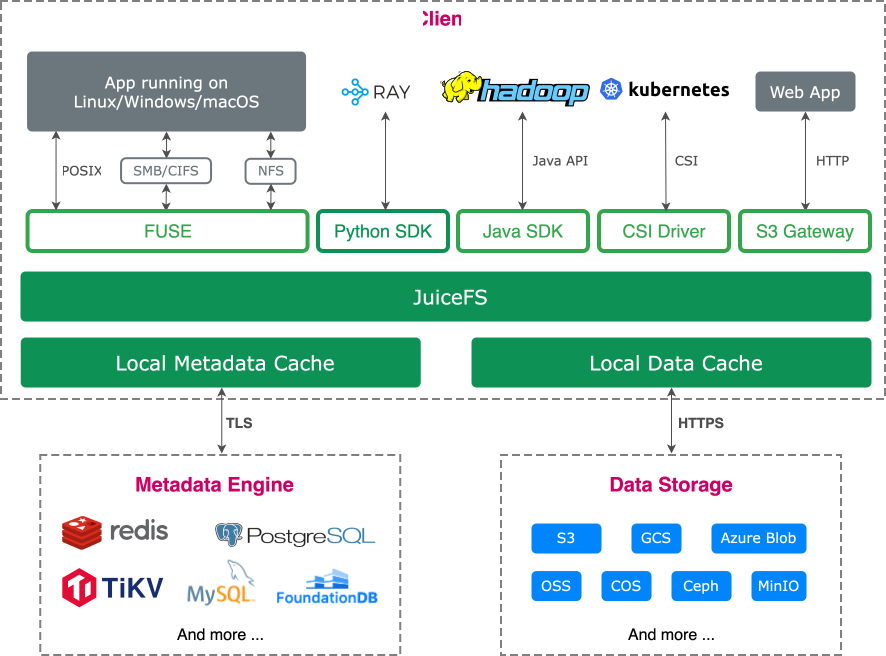

# JuiceFS vs. ZeroFS

[ZeroFS](https://github.com/Barre/ZeroFS) is an open-source log-structured file system that turns S3-compatible buckets
into POSIX file systems, exposed over NFS and 9P, or as raw block devices over NBD. It keeps both file data and metadata
in the object store itself and relies on a local disk/memory cache for performance. ZeroFS is dual-licensed under AGPLv3
and a commercial license.

Both ZeroFS and [JuiceFS](https://github.com/juicedata/juicefs) turn object storage into a POSIX file system without
mapping one file to one object, but they differ substantially in metadata architecture, concurrency model, encryption
defaults, and licensing.

## Product positioning

**ZeroFS** is a self-hosted, encrypted-by-default file system for putting POSIX semantics (or a ZFS pool, or a block
device) on top of an S3-compatible bucket. A single ZeroFS core service handles metadata, data, and every protocol
endpoint, so there's no separate metadata database to run alongside it. It targets teams that want to self-host
object-storage-backed file access with a reasonable operational footprint rather than teams that need to scale massive
throughput horizontally. See [Architecture](#architecture) below for how its single-leader design and mandatory
encryption shape that trade-off.

**JuiceFS** is a cloud-native distributed file system designed for demanding AI/ML training, high-performance computing,
and big data analytics across multiple clouds. By using a data-metadata-separation design with a pluggable,
independently scalable metadata engine, JuiceFS supports concurrent access from massive numbers of clients, which is
necessary for large-scale, performance-driven, POSIX-compliant workloads.

## Architecture

**ZeroFS** splits files into 32 KiB extents, which are compressed (Zstd by default, or LZ4) and encrypted
(XChaCha20-Poly1305, without an unencrypted mode), then packed into immutable 256 MiB segments uploaded as individual
objects. ZeroFS stores file system metadata in an object-backed LSM tree and stores file contents separately in
immutable segment objects in the same object store, so it has no external database dependency. Because files are packed
into opaque segments rather than mapped 1:1 to objects, ZeroFS files are not individually accessible through the S3 API,
which is similar to JuiceFS' approach in this regard.

Key architectural characteristics:

- No separate metadata database: metadata (inodes, directory entries, extent pointers, manifests) lives in an
  object-backed LSM tree, while file contents live separately in immutable segment objects, both managed by the ZeroFS
  server. When working with ZeroFS, this server (and its standby for HA and read replicas for read scaling) is the main
  service you deploy and operate.
- One server process (the leader) is the sole writer to the backing object store. It accepts connections from concurrent
  clients and arbitrates their writes and POSIX locks internally, but every mutation is funneled through that single
  process. See [Concurrency and write scalability](#concurrency-and-write-scalability) below.
- Encryption and compression are mandatory on every block, with no option to disable them.
- A dual-tier local cache (encrypted raw-parts cache for object bytes, plaintext decoded-block cache for metadata, plus
  an in-memory tail cache for each inode's most recent extent) reduces round trips to object storage.
- For High availability, ZeroFS supports a leader/standby replication design with a single active writer and writer
  fencing. Read-replica behavior, failover orchestration, and staleness depend on the configured replication
  implementation and version.

**JuiceFS** adopts a decoupled architecture that separates metadata management from data storage. Files are split into
chunks (default up to 64 MiB, further divided into 4 MiB blocks) before being uploaded to object storage, with
corresponding metadata stored in a separate, pluggable database engine.

Key architectural characteristics:

- JuiceFS supports pluggable metadata engines (Redis, TiKV, MySQL, PostgreSQL, SQLite, etcd, FoundationDB, etc.), each
  with its own operational and HA characteristics.
- JuiceFS stores files using data chunking, which enables efficient partial updates, appends, and high-throughput
  operations. For more details, see [Architecture](../../introduction/architecture.md).
- No dependency on any proprietary intermediate storage format. JuiceFS supports a flexible caching mechanism to
  decrease latency and improve performance.
- Multi-cloud and hybrid cloud support
  with [all mainstream object storage backends](../../reference/how_to_set_up_object_storage.md).

### Data path

**ZeroFS** relays all file data through its server node. Neither the NFS and 9P protocol clients nor the native Linux
kernel client talk to object storage directly, only the ZeroFS server holds the storage credentials and issues the
GET/PUT calls. So reads and writes are proxied through that one process on its way to or from the bucket.

**JuiceFS** clients, on the other hand, directly issue GET/PUT calls to the object store themselves. Metadata operations
go through the metadata engine, but file data always travels directly between the client mounting machines and the
object store, without an intermediate relay.

This distinction carries considerations in cloud deployments. Because ZeroFS clients never reach the object store
themselves, file data effectively crosses the network twice: once between the object store and the ZeroFS server, and
again between the server and the client. When the server, its clients, and the object store don't all sit in the same
network zone, that extra hop can add meaningful data-transfer charges and consumes the server's bandwidth, on top of
whatever the object store would have charged for direct client access. JuiceFS clients talk to object storage directly,
so aside from metadata-engine traffic, there is no equivalent relay hop or its associated data transfer cost to budget
for.

### Concurrency and write scalability

**ZeroFS** does allow many concurrent clients to write: the Kubernetes CSI Driver presents genuine `ReadWriteMany`
volumes, and any number of pods on any number of nodes can mount over 9P and have their POSIX byte-range locks
arbitrated by the leader. The constraint is at the server layer, not the client layer: every one of those clients'
writes is funneled through a single leader process before it reaches object storage, and that process cannot be
horizontally scaled; the HA pair exists to provide failover, not write scale-out. If the leader becomes a bottleneck,
the fix is a bigger leader, not more leaders; the standby stays synchronized as a hot backup, and read replicas serve
reads with bounded staleness (the writer's flush interval, default 30 seconds, plus up to a 10-second replica poll
window) rather than adding write capacity.

**JuiceFS** avoids a single file system server data relay. Clients perform file I/O and communicate with both the
metadata engine and object storage. Metadata engines bring their own scale-out story: Redis Cluster/Sentinel, TiKV's
Raft-replicated cluster, and the JuiceFS Enterprise Edition's proprietary distributed metadata engine (horizontally
scalable and Raft-replicated across at least 3 copies). This design lets both metadata throughput and the number of
concurrent writers grow with the workload.

### Durability and consistency

**ZeroFS** buffers writes in memory: an open data segment (sealed and uploaded once it reaches 256 MiB) plus an LSM
memtable for metadata. It only guarantees durability to object storage when a specific trigger fires: an explicit
`fsync`, an NFS `COMMIT`, an NBD `FLUSH`/`FUA`, a `sync_writes = true` batch, the periodic flush timer
(`flush_interval_secs`, default 30 seconds), garbage collection starting, or a graceful shutdown. Plain `close()` is
notably absent from that list, so closing a file descriptor does not by itself force a flush. An application that writes
and closes a file without calling `fsync()` can lose up to a flush interval's worth of writes if the leader crashes
before the next periodic flush, even though its `write()`/`close()` calls already returned successfully. ZeroFS does add
a safety net for the case where an application does call `fsync()`: a "verified fsync" mechanism returns `ESTALE`
instead of falsely reporting success if the server restarted before flushing acknowledged writes. Once data is flushed,
recovery is strongly consistent: a crash recovers to an atomic prefix of the mutations that were visible before it,
never a partial or torn write.

**JuiceFS** also buffers writes, in the client's read/write buffer (default 300 MiB), but ties the durability boundary
directly to `close()`: `close()`, `fsync()`, and `fdatasync()` (as well as filling a 4 MiB block) all trigger a flush,
and the client will not commit a write to the metadata engine until the corresponding data has actually been uploaded to
object storage. This is what its default "close-to-open" consistency guarantee is built on: a successful `close()`
already means the write is both durable in object storage and visible to any other client that opens the file afterward,
without the application ever having to call `fsync()` itself. For more details,
see [Cache](../../guide/cache.md#consistency) and
[POSIX compatibility](../../reference/posix_compatibility.md). JuiceFS does offer an opt-in `--writeback` mode with a
risk profile similar to ZeroFS's default: writes are committed to metadata immediately and uploaded from local disk
asynchronously. However, the docs flag it explicitly ("if write cache data suffers loss before upload is complete, file
data is lost forever") and it is off by default.

### Caching

**ZeroFS** implements a dual-tier local cache split between disk and memory budgets (`disk_size_gb` / `memory_size_gb`
in its configuration). A raw-parts cache stores object bytes exactly as fetched — still compressed and encrypted — at
128 KiB granularity, while a separate decoded-block cache holds plaintext metadata blocks, and an in-memory tail cache
keeps each inode's most recently written extent. An adaptive readahead layer tracks up to 4 concurrent sequential
streams per file, doubling its fetch window (up to 8 MiB) as sequential access continues.

**JuiceFS** implements client-side caching on local SSDs or memory. It defines a default limit for the disk cache of 100
GiB, which users can freely adjust. When cache usage reaches the limit, JuiceFS automatically cleans up using an
LRU-like algorithm, ensuring cache space remains available for subsequent operations. For more details,
see [Cache](../../guide/cache.md).

### Security

**ZeroFS** makes encryption mandatory: every block is compressed and then encrypted with XChaCha20-Poly1305 before it
leaves the client, with no unencrypted mode available. Keys are derived from a user-supplied password (via Argon2id)
that wraps a data-encryption key; losing the password makes the data permanently unrecoverable. This is a strong default
for security-sensitive deployments, but it is not optional and adds a mandatory encrypt/decrypt step on every I/O path.

**JuiceFS** supports encryption as an optional, configurable feature rather than a mandatory default, so users can
choose the trade-off between security overhead and raw performance that fits their workload.

### Multi-cloud support

**ZeroFS** connects to AWS S3 and S3-compatible endpoints (such as MinIO and Cloudflare R2), Google Cloud Storage, and
Azure Blob Storage. **JuiceFS** offers a consistent file system interface across a broader set of storage providers —
including HDFS and local disk — and works with any mainstream object storage backend across AWS, Azure, GCP, or private
clouds. See the table below for more details.

## Feature comparison

| Features                 | ZeroFS                                                                 | JuiceFS Community Edition                                | JuiceFS Enterprise Edition                                         |
|--------------------------|------------------------------------------------------------------------|----------------------------------------------------------|--------------------------------------------------------------------|
| Clients                  | NFS, 9P, NBD (block device)                                            | POSIX (FUSE), Java SDK, Python SDK, S3 Gateway           | POSIX (FUSE), Java SDK, Python SDK, S3 Gateway                     |
| Metadata storage         | Embedded LSM tree, persisted in the same object store (no external DB) | External database (Redis, TiKV, MySQL, PostgreSQL, etc.) | Horizontally-scalable high-performance distributed metadata engine |
| Metadata redundancy      | Leader/standby pair with automatic failover                            | Depends on the database used                             | At least 3 copies (based on the Raft consensus algorithm)          |
| Concurrent writers       | Many clients, all writes funneled through one leader process           | Many clients, each writing directly to storage           | Many clients, each writing directly to storage                     |
| Data storage             | AWS S3, S3-compatible, Google Cloud Storage, Azure Blob                | Any mainstream object storage                            | Any mainstream object storage                                      |
| Data redundancy          | Provided by object storage                                             | Provided by object storage                               | Provided by object storage                                         |
| Data caching             | Local disk + memory (dual-tier cache)                                  | Local cache                                              | Distributed cache                                                  |
| Encryption               | ✓ Mandatory, always on (XChaCha20-Poly1305)                           | ✓ Supported (optional)                                  | ✓ Supported (optional)                                            |
| Compression              | ✓ Mandatory (Zstd or LZ4)                                             | ✓ Supported                                             | ✓ Supported                                                       |
| Quota management         | ◐ Configurable file system size limits                                 | ✓ Supported                                             | ✓ Supported                                                       |
| POSIX compliance         | ✓ Fully compatible                                                    | ✓ Fully compatible                                      | ✓ Fully compatible                                                |
| POSIX ACL                | Not publicly documented                                                | ✓ Supported                                             | ✓ Supported                                                       |
| Kubernetes CSI           | ✓ Supported (RWO/ROX/RWX)                                             | ✓ Supported                                             | ✓ Supported                                                       |
| Cross-region replication | ◐ Relies on external service                                           | ◐ Relies on external service                             | ✓ Supported                                                       |
| Multi-cloud mirroring    | ✕ Not supported                                                       | ✕ Not supported                                         | ✓ Supported                                                       |
| Pricing                  | AGPLv3, or commercial license                                          | Open source and free (Apache License 2.0)                | Commercial license, volume pricing                                 |

## Licensing implications

**ZeroFS** is dual-licensed under the GNU AGPLv3 and a commercial license. The AGPLv3 can impose source-offering and
corresponding-source obligations when modified software is conveyed or made available for network interaction, subject
to the license's precise terms. Organizations should obtain legal advice for hosted, embedded, or distributed offerings.

**JuiceFS Community Edition** is released under the Apache License 2.0, a permissive license with no copyleft or
source-disclosure obligations for internal use, distribution, or hosted services. JuiceFS Enterprise Edition is
available under a separate commercial license for teams that need its distributed metadata engine, distributed cache,
and multi-cloud mirroring.

## Summary

**ZeroFS** is a security-first file system that folds metadata storage into its own server process instead of requiring
a separate database, encrypts and compresses every block by default, and can be mounted over NFS, 9P, or a native Linux
kernel client, or consumed as an NBD block device. It's still a service you deploy and operate. You just don't operate a
second, separate metadata database alongside it. Clients can connect and write concurrently, but every one of those
writes is funneled through a single leader process before it reaches object storage, and that write path is not
horizontally scalable. Its high-availability design (a leader/standby pair plus unlimited read-only replicas) is built
for failover and read scaling, not for adding write throughput. That makes it a good fit for self-hosted deployments
such as CI build caches, kernel builds, home labs, and small-to-medium services, especially where mandatory encryption
and having a single service to operate matter more than scaling the write path itself.

**JuiceFS** is built for large-scale, high-concurrency, multi-writer workloads. By decoupling metadata from data and
supporting pluggable, independently scalable metadata engines (Redis, TiKV, MySQL, PostgreSQL, SQLite, and more, or the
JuiceFS Enterprise Edition proprietary distributed metadata engine), JuiceFS lets any number of clients read and write
the same file system concurrently with strong consistency, across the broadest range of object storage backends and
multiple clouds. It provides a standard POSIX interface through FUSE, a Java API for Hadoop ecosystems, an S3 Gateway,
and a Kubernetes CSI Driver. The JuiceFS Community Edition is released under the permissive Apache License 2.0. JuiceFS
is widely used in big data analytics, AI/ML training, agentic AI tools, multi-cloud and hybrid cloud deployments,
container shared storage, and high-performance computing.
