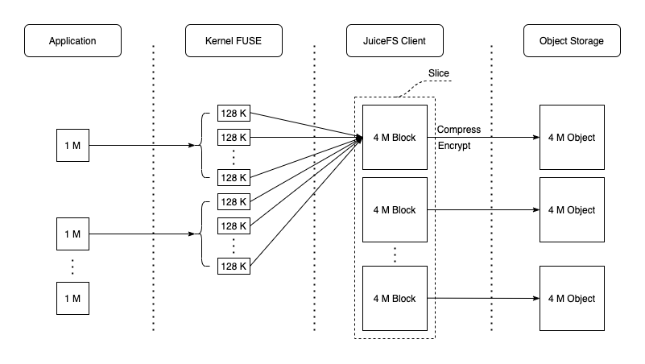
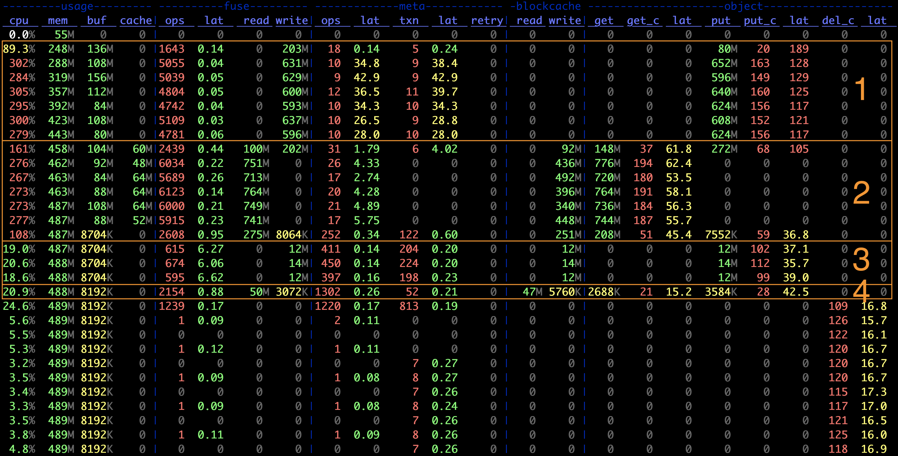
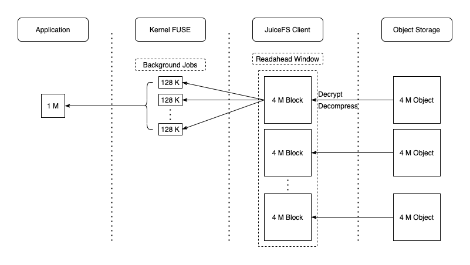

## Data writing process {#workflow-of-write}

JuiceFS splits large files at multiple levels to improve I/O performance. See [how JuiceFS stores files](./architecture.md#how-juicefs-store-files). Files are initially divided into logical chunks (64 MiB each), which are isolated from each other and further broken down into slices. Slices are the data units for persistence. During a write request, data is stored in the client buffer as chunks/slices. A new slice is created if it does not overlap or adjoin any existing slices; otherwise, the affected existing slices are updated. On a flush operation, a slice is divided into blocks (4 MiB by default) and uploaded to the object storage. Metadata is updated upon successful upload.

Sequential writes are optimized, requiring only one continuously growing slice and one final flush. This maximizes object storage write performance. A simple [JuiceFS benchmark](../benchmark/performance_evaluation_guide.md) below shows sequentially writing a 1 GiB file with a 1 MiB I/O size at its first stage. The following figure shows the data flow in each component of the system.

Use [`juicefs stats`](../reference/command_reference.mdx#stats) to obtain real-time performance monitoring metrics.

The first highlighted section in the above figure shows:

- The average I/O size for writing to the object storage is `object.put / object.put_c = 4 MiB`. It is the same as the default block size.
- The ratio of metadata transactions to object storage transactions is `meta.txn : object.put_c -= 1 : 16`. It means that a single slice flush requires 1 metadata update and 16 uploads to the object storage. Each flush operation transmits 64 MiB of data (4 MiB * 16), equivalent to the default chunk size.
- The average request size in the FUSE layer approximately equals to `fuse.write / fuse.ops ~= 128 KiB`, matching the default request size limitation.

Generally, when JuiceFS writes a small file, the file is uploaded to the object storage upon file closure, and the I/O size is equal to the file size. In the third stage of the figure above, where 128 KiB small files are created, we can see that:

- The size of data written to the object storage during PUT operations is 128 KiB, calculated by `object.put / object.put_c`.
- The number of metadata transactions is approximately twice the number of PUT operations, since each file requires one create and one write.

When JuiceFS uploads objects smaller than the block size, it simultaneously writes them into the [local cache](../guide/cache.md) to improve future performance. As shown in the third stage of the figure above, the write bandwidth of the `blockcache` is the same as that of the object storage. Since small files are cached, reading these files is extremely fast, as demonstrated in the fourth stage.

Write operations are immediately committed to the client buffer, resulting in very low write latency (typically just a few microseconds). The actual upload to the object storage is automatically triggered internally when certain conditions are met, such as when the size or number of slices exceeds their limit, or data stays in the buffer for too long. Explicit calls, such as closing a file or invoking `fsync`, can also trigger uploading.

The client buffer is only released after the data stored inside is uploaded. In scenarios with high write concurrency, if the buffer size (configured using [`--buffer-size`](../reference/command_reference.mdx#mount-data-cache-options)) is not big enough, or the object storage's performance insufficient, write blocking may occur, because the buffer cannot be released timely. The real-time buffer usage is shown in the `usage.buf` field in the metrics figure. To slow things down, The JuiceFS client introduces a 10 ms delay to every write when the buffer usage exceeds the threshold. If the buffer usage is over twice the threshold, new writes are completely suspended until the buffer is released. Therefore, if the write latency keeps increasing or the buffer usage has exceeded the threshold for a long while, you should increase `--buffer-size`. Also consider increasing the maximum number of upload concurrency ([`--max-uploads`](../reference/command_reference.mdx#mount-data-storage-options), defaults to 20), which improves the upload bandwidth, thus boosting buffer release.

### Random writes {#random-write}

JuiceFS supports random writes, including mmap-based random writes.

Note that a block is an immutable object, because most object storage services don't support edit in blocks; they can only be re-uploaded and overwritten. Thus, when overwrites or random writes occur, JuiceFS avoids downloading the block for editing and re-uploading, which could cause serious I/O amplifications. Instead, writes are performed on new or existing slices. Relevant new blocks are uploaded to the object storage, and the new slice is appended to the slice list under the chunk. When a file is read, what the client sees is actually a consolidated view of all the slices.

Compared to sequential writes, random writes in large files are more complicated. There could be a number of intermittent slices in a chunk, possibly all smaller than 4 MiB. Frequent random writes require frequent metadata updates, which in turn further impact performance. To improve read performance, JuiceFS schedules compaction tasks when the number of slices under a chunk exceeds the limit. You can also manually trigger compaction by running [`juicefs gc`](../administration/status_check_and_maintenance.md#gc).

### Client write cache {#client-write-cache}

Client write cache is also referred to as "Writeback mode" throughout the docs.

For scenarios that does not deem consistency and data security as top priorities, enabling client write cache is also an option to further improve performance. When client write cache is enabled, flush operations return immediately after writing data to the local cache directory. Then, local data is uploaded asynchronously to the object storage. In other words, the local cache directory is a cache layer for the object storage.

Learn more in [Client Write Cache](../guide/cache.md#client-write-cache).

## Data reading process {#workflow-of-read}

JuiceFS supports sequential reads and random reads (including mmap-based random reads). During read requests, the object corresponding to the block is completely read through the `GetObject` API of the object storage, or only a certain range of data in the object may be read (e.g., the read range is limited by the `Range` parameter of [S3 API](https://docs.aws.amazon.com/AmazonS3/latest/API/API_GetObject.html)). Meanwhile, prefetching is performed (controlled by the [`--prefetch`](../reference/command_reference.mdx#mount) option) to download the complete data block into the local cache directory, as shown in the `blockcache` write speed in the second stage of the above metrics figure. This is very good for sequential reads as all cached data is utilized, maximizing the object storage access efficiency. The dataflow is illustrated in the figure below:

Although prefetching works well for sequential reads, it might not be so effective for random reads on large files. It can cause read amplification and frequent cache eviction. Consider disabling prefetching using `--prefetch=0`. It is always hard to design cache strategy for random read scenarios. Two possible solutions are increasing the cache size to store all data locally or completely disabling the cache (`--cache-size=0`) and relying on a high-performance object storage service.

Reading small files (smaller than the block size) is much easier because the entire file can be read in a single request. Since small files are cached locally during the write process, future reads are fast.
