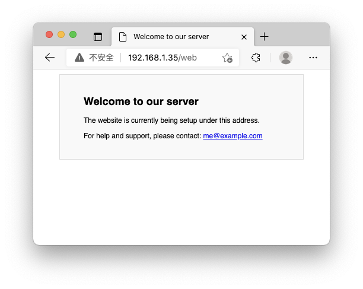

# Use JuiceFS on K3s

[K3s](https://k3s.io/) is a functionally optimized lightweight Kubernetes distribution that is fully compatible with Kubernetes, that is, almost all operations on Kubernetes can be performed on K3s. K3s has packaged the entire container orchestration system into a binary program with a capacity of less than 100MB, which greatly reduces the environment dependency and installation of deploying Kubernetes production clusters. In contrast, K3s has lower performance requirements for the operating system, and ARM devices such as Raspberry Pi can be used to form a cluster.

In this article, we will build a K3s cluster with two nodes, install and configure [JuiceFS CSI Driver](https://github.com/juicedata/juicefs-csi-driver) for the cluster, and finally create a Nginx Pod for verification.

## Deploy a K3s cluster

K3s has very low **minimum requirements** for hardware:

- **Memory**：512MB+（recommend 1GB+）
- **CPU**：1 core

When deploying a production cluster, you can usually use the Raspberry Pi 4B (4 CPU cores, 8G memory) as the starting point for the hardware of a node. For details, see [Hardware Requirements](https://rancher.com/docs/k3s/latest/en/installation/installation-requirements/#hardware).

### K3s server node

The IP address of the server node is: `192.168.1.35`

Use the script officially provided by K3s to deploy the server node on a regular Linux distribution.

```shell
$ curl -sfL https://get.k3s.io | sh -
```

After the deployment is successful, the K3s service will automatically start, and kubectl and other tools will also be installed.

Execute the command to view the status of the node:

```shell
$ sudo kubectl get nodes
NAME     STATUS   ROLES                  AGE   VERSION
k3s-s1   Ready    control-plane,master   28h   v1.21.4+k3s1
```

Get the `node-token`：

```shell
$ sudo -u root cat /var/lib/rancher/k3s/server/node-token
K1041f7c4fabcdefghijklmnopqrste2ec338b7300674f::server:3d0ab12800000000000000006328bbd80
```

### K3s worker node

The IP address of the worker node is: `192.168.1.36`

Execute the following command and change the value of `K3S_URL` to the IP or domain name of the server node, the default port is `6443`. Replace the value of `K3S_TOKEN` with the `node-token` obtained from the server node.

```shell
$ curl -sfL https://get.k3s.io | K3S_URL=http://192.168.1.35:6443 K3S_TOKEN=K1041f7c4fabcdefghijklmnopqrste2ec338b7300674f::server:3d0ab12800000000000000006328bbd80 sh -
```

After the deployment is successful, go back to the server node to check the node status:

```shell
$ sudo kubectl get nodes
NAME     STATUS   ROLES                  AGE   VERSION
k3s-s1   Ready    control-plane,master   28h   v1.21.4+k3s1
k3s-n1   Ready    <none>                 28h   v1.21.4+k3s1
```

## Install CSI Driver

It is consistent with the method of [Use JuiceFS on Kubernetes](how_to_use_on_kubernetes.md), you can install it through Helm or kubectl.

Here we use kubectl, execute the following command to install the CSI Driver:

```shell
$ kubectl apply -f https://raw.githubusercontent.com/juicedata/juicefs-csi-driver/master/deploy/k8s.yaml
```

### Create Storage Class

Copy and modify the following code to create a configuration file, for example: `juicefs-sc.yaml`

```yaml
apiVersion: v1
kind: Secret
metadata:
  name: juicefs-sc-secret
  namespace: kube-system
type: Opaque
stringData:
  name: "test"
  metaurl: "redis://juicefs.afyq4z.0001.use1.cache.amazonaws.com/3"
  storage: "s3"
  bucket: "https://juicefs-test.s3.us-east-1.amazonaws.com"
  access-key: "<your-access-key-id>"
  secret-key: "<your-access-key-secret>"
---
apiVersion: storage.k8s.io/v1
kind: StorageClass
metadata:
  name: juicefs-sc
provisioner: csi.juicefs.com
reclaimPolicy: Retain
volumeBindingMode: Immediate
parameters:
  csi.storage.k8s.io/node-publish-secret-name: juicefs-sc-secret
  csi.storage.k8s.io/node-publish-secret-namespace: kube-system
  csi.storage.k8s.io/provisioner-secret-name: juicefs-sc-secret
  csi.storage.k8s.io/provisioner-secret-namespace: kube-system
```

The `stringData` part of the configuration file is used to set the information related to the JuiceFS file system. It will create the file system based on the information you specify. When you need to use the pre-created file system in the storage class, you only need to fill in the `name` and `metaurl`, and the other items can be deleted or the value can be left blank.

Execute the command to deploy the storage class:

```shell
$ kubectl apply -f juicefs-sc.yaml
```

View storage class status:

```shell
$ sudo kubectl get sc
NAME                   PROVISIONER             RECLAIMPOLICY   VOLUMEBINDINGMODE      ALLOWVOLUMEEXPANSION   AGE
local-path (default)   rancher.io/local-path   Delete          WaitForFirstConsumer   false                  28h
juicefs-sc             csi.juicefs.com         Retain          Immediate              false                  28h
```

> **Note**: A storage class is associated with a JuiceFS file system. You can create as many storage classes as you need. But you need to pay attention to modifying the storage class name in the configuration file to avoid conflicts with the same name.

## Use JuiceFS to persist Nginx data

Next, deploy an Nginx Pod, using the persistent storage declared by the JuiceFS storage class.

### Depolyment

Create a configuration file, for example: `depolyment.yaml`

```yaml
apiVersion: v1
kind: PersistentVolumeClaim
metadata:
  name: web-pvc
spec:
  accessModes:
    - ReadWriteMany
  resources:
    requests:
      storage: 10Pi
  storageClassName: juicefs-sc
---
apiVersion: apps/v1
kind: Deployment
metadata:
  name: nginx-run
  labels:
    app: nginx
spec:
  replicas: 2
  selector:
    matchLabels:
      app: nginx
  template:
    metadata:
      labels:
        app: nginx
    spec:
      containers:
        - name: nginx
          image: linuxserver/nginx
          ports:
            - containerPort: 80
          volumeMounts:
            - mountPath: /config
              name: web-data
      volumes:
        - name: web-data
          persistentVolumeClaim:
            claimName: web-pvc
```

Depoly it:

```
$ sudo kubectl apply -f depolyment.yaml
```

### Service

Create a configuration file, for example: `service.yaml`

```yaml
apiVersion: v1
kind: Service
metadata:
  name: nginx-run-service
spec:
  selector:
    app: nginx
  ports:
    - name: http
      port: 80
```

Depoly it:

```shell
$ sudo kubectl apply -f service.yaml
```

### Ingress

K3s is pre-installed with traefik-ingress by default. Create an ingress for Nginx through the following configuration. For example: `ingress.yaml`

```yaml
apiVersion: networking.k8s.io/v1
kind: Ingress
metadata:
  name: nginx-run-ingress
  annotations:
    traefik.ingress.kubernetes.io/router.entrypoints: web
spec:
  rules:
    - http:
        paths:
          - pathType: Prefix
            path: "/web"
            backend:
              service:
                name: nginx-run-service
                port:
                  number: 80
```

Depoly it:

```shell
$ sudo kubectl apply -f ingress.yaml
```

### Visit

After the deployment is complete, use the host on the same LAN to access any cluster node, and you can see the Nginx welcome page.



Next, check whether the container has successfully mounted JuiceFS, and execute the command to check the pod status:

```shell
$ sudo kubectl get pods
NAME                         READY   STATUS    RESTARTS   AGE
nginx-run-7d6fb7d6df-qhr2m   1/1     Running   0          28h
nginx-run-7d6fb7d6df-5hpv7   1/1     Running   0          24h
```

Execute the command to view the file system mount status of any pods:

```shell
$ sudo kubectl exec nginx-run-7d6fb7d6df-qhr2m -- df -Th
Filesystem     Type          Size  Used Avail Use% Mounted on
overlay        overlay        20G  3.2G   17G  17% /
tmpfs          tmpfs          64M     0   64M   0% /dev
tmpfs          tmpfs         2.0G     0  2.0G   0% /sys/fs/cgroup
JuiceFS:jfs    fuse.juicefs  1.0P  174M  1.0P   1% /config
/dev/sda1      ext4           20G  3.2G   17G  17% /etc/hosts
shm            tmpfs          64M     0   64M   0% /dev/shm
tmpfs          tmpfs         2.0G   12K  2.0G   1% /run/secrets/kubernetes.io/serviceaccount
tmpfs          tmpfs         2.0G     0  2.0G   0% /proc/acpi
tmpfs          tmpfs         2.0G     0  2.0G   0% /proc/scsi
tmpfs          tmpfs         2.0G     0  2.0G   0% /sys/firmware
```

As you can see, the file system named `jfs` has been mounted to the `/config` directory of the container, and the used space is 174M.

This indicates that the Pods in the cluster have been successfully configured and used JuiceFS to persist data.
