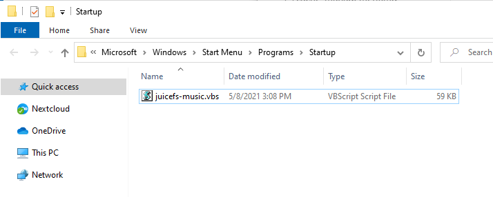

# JuiceFS on Windows

## 1. Requirement

JuiceFS supports creating and mounting file systems in Windows. But you need to install [WinFsp] (http://www.secfs.net/winfsp/) to be able to mount the JuiceFS file system.

> **[WinFsp](https://github.com/billziss-gh/winfsp)** is an open source Windows file system agent, it provides a FUSE emulation layer, so that the JuiceFS client can mount the file system to Windows.

## 2. Install JuiceFS on Windows

You can download the latest pre-compiled binary program from [here](https://github.com/juicedata/juicefs/releases/latest), take Windows 10 system as an example, the download file name contains `windows-amd64`, decompress and `juicefs.exe` is JuiceFS client.

For ease of use, you can create a folder named `juicefs` in the root directory of `C:\`, and extract the `juicefs.exe` into this folder. Then add the path `C:\juicefs` to the environment variables of the system. After restarting the system to make the settings take effect, you can directly use the system's built-in `Command Prompt` or `PowerShell` to execute the `juicefs` command.


## 3. Mount JuiceFS file system

It is assumed that you have prepared object storage, Redis database, and created JuiceFS file system. If you have not prepared these necessary resources, please refer to the previous section of [Quick Start](#Quick Start).

Suppose that the MinIO object storage and Redis database are deployed on the Linux host with the IP address of `192.168.1.8` in LAN, and then the following commands are executed to create a JuiceFS file system named `music`.

```shell
$ juicefs format --storage minio --bucket http://192.168.1.8:9000/music --access-key minioadmin --secret-key minioadmin redis://192.168.1.8:6379/1 music
```

> **Note**: JuiceFS client on Windows is a command line program, you need to use it in `Command Prompt`, `PowerShell` or `Windows Terminal`.

Execute the following command to mount the `music` file system to `Z` drive:

```power
> juicefs.exe mount redis://192.168.1.8:6379/1 Z:
```


As shown in the figure above, JuiceFS client will mount the file system as a network drive as the specified system drive letter. You can change to another drive letter according to actual needs, but be careful not to use the drive letter that is already occupied.

## 4. Automatically mount JuiceFS on boot

> **Tip**: The method provided here is only verified on Windows 10. Welcome to verify other Windows versions and provide feedback.

### 1. Create a VBS Script

Create a VBS script, for example: `juicefs-music.vbs`. Modify the following content according to the actual situation:

```vbscript
set ws=WScript.CreateObject("WScript.Shell")
ws.Run "C:\juicefs\juicefs.exe mount redis://192.168.1.8:6379/1 Z:",0
```

> **Note**: The content of the script varies from person to person, please modify the commands and parameters according to the actual situation!

### 2. Set boot up

Use the keyboard combination <kbd>Windows + R</kbd> to call up the running window


Enter `shell:startup` to open the Windows startup folder, and drag the edited vbs script into the folder.



### 3. Cancel the boot mount

If you need to cancel the boot mount, please refer to [step 2](#2-set-boot-up) to open the Windows startup folder and delete the VBS script.

## 5. Unmount a JuiceFS

## Go further

- [JuiceFS on Linux](juicefs_on_linux.md)
- [JuiceFS on macOS](juicefs_on_macos.md)
