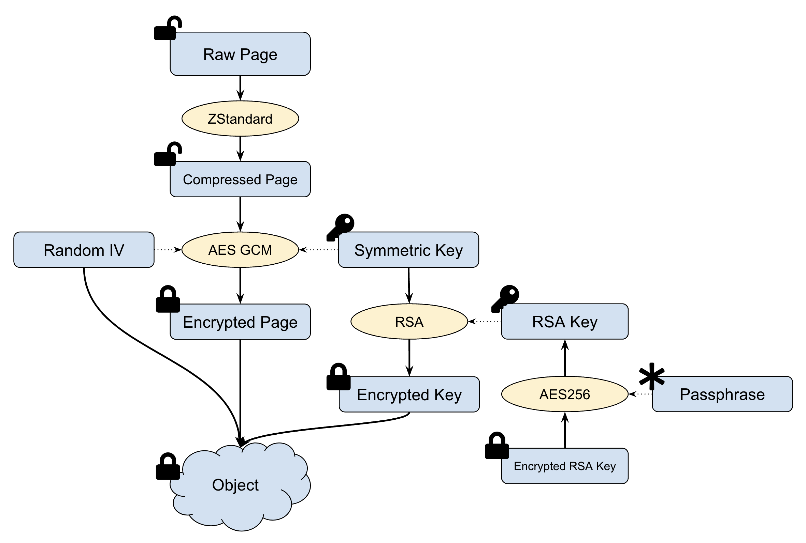

# Data Encryption

## Data Encryption In Transit

JuiceFS encrypts data when transmitted across networks to protect against
eavesdropping of network traffic by unauthorized users.

For the data uploaded to object storage services, JuiceFS client will always
use HTTPS except for the following scenarios:

- Uploading to Alibaba Cloud OSS using internal endpoint
- Uploading to UCloud US3 using internal endpoint


## Data Encryption At Rest

JuiceFS supports data encryption at rest, i.e. data is encrypted before
uploading to object storage. In this case, the data stored in object storage
will be encrypted which prevents data breach effectively when object storage
itself is compromised.

Industry standard encryption (AES-GCM and RSA) is leveraged by JuiceFS in
client side encryption. The encryption and decryption are carried out in
JuiceFS client. The only thing users need to do is to provide a private key or
passphrase during JuiceFS mount and use it like an ordinary file system. It is
completedly transparent to the applications.

> **Note**: The data cached in the client side is **NOT** encrypted. Nevertheless, it is only accessible by root or the owner. If you want to encrypt the cached data as well, you can put the cache directory in an encrypted file system or block storage.


### Encryption and Decryption Method

A global RSA key M must be created for each encrypted file system.
Every object stored in the object storage will have its own random symmetric
key S. The data is encrypted using AES-GCM with the symmetric key S, S is
encrypted using the global RSA key M, and the RSA key is encrypted with the
passphrase specified by the user.



The detailed procedure for data encryption is as following:

- Data block are compressed using LZ4 or ZStandard before writing to object storage.
- A random 256-bit symmetric key S and a random seed N are generated for each block.
- Each block is encrypted with S and N using AES-GCM.
- The symmetric key S is encrypted with RSA key M as cipher K.
- The encrypted data is combined with cypher K and random seed N into object, then written to object storage.

The steps for data decryption are as following:

- Read the whole encrypted object (it could be a bit larger than 4MB).
- Parse the cypher K of symmetric key K, random seed N and encrypted data.
- Decrypt K with RSA key to get symmetric key S.
- Decrypt data with S and N using AES-GCM into plain formats.
- Uncompress the data block.


### Key Management

The safety of RSA key is extremely important when encryption is enabled. If
the key is leaked, it may result in data leakage. If the key is lost, then
**all** encrypted data will be lost and it is unrecoverable.

When a new volume is created using `juicefs format`, encryption at-rest can be
enabled by specifying a RSA private key using `--encrypt-rsa-key`, then the
private key will be saved into Redis. When the private key is protected by a
passphrase, it could be specified using enviroment virable `JFS_RSA_PASSPHRASE`.

Usage:

1. Generate RSA key

```shell
$ openssl genrsa -out my-priv-key.pem -aes256 2048
```

2. Provide the key during format:

```shell
$ juicefs format --encrypt-rsa-key my-priv-key.pem META-URL NAME
```

> **Note**: If the private key is protected by a passphrase, it should be specified using `JFS_RSA_PASSPHRASE` for `juicefs mount`.


### Performance

TLS, HTTPS and AES-256 are implemented very efficiently in modern
CPU. Therefore, enabling encryption has little influence to the performance of
the file system. RSA algorithm is relatively slow, especially the decryption
procedure. It is recommended to use 2048 bit RSA key in storage encryption.
Using 4096 bit key may have significant affect in read performance.
