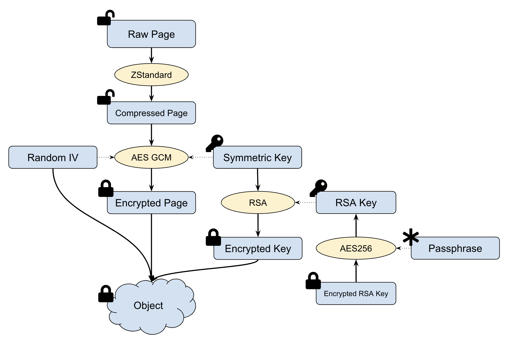

# Data Encryption

JuiceFS provides data encryption from two aspects:

1. Data Encryption In Transit
2. Data Encryption At Rest

## Data Encryption In Transit {#in-transit}

Running JuiceFS generally involves the network connection between database and object storage, which is determined by the architecture of JuiceFS. As long as the servers support encryption connections, JuiceFS can be accessed through the encrypted channel.

### Connect to object storage via HTTPS

Public cloud object storage generally supports both HTTP and HTTPS. If no scheme is specified, JuiceFS uses HTTPS by default. For example, the client will identify the bucket in following command as `https://myjfs.s3.ap-southeast-1.amazonaws.com`.

```shell {2}
juicefs format --storage s3 \
  --bucket myjfs.s3.ap-southeast-1.amazonaws.com \
  ...
```

With the above command, the client will recognize the bucket as `https://myjfs.s3.ap-southeast-1.amazonaws.com`.

In the case where server and object storage run on the same VPC network, explicitly set the URL scheme to `http` if you don't need an encrypted connection, e.g., `--bucket http://myjfs.s3.ap-southeast-1.amazonaws.com`.

### Connect to database via TLS/SSL

For [all the supported metadata engines](../reference/how_to_set_up_metadata_engine.md), as long as the database supports encryption and has been configured with encryption such as TLS/SSL, JuiceFS can connect to the database through its encrypted channel. For instance, a Redis database configured with TLS can use `rediss://` for connecting.

```shell {3}
juicefs format --storage s3 \
  --bucket myjfs.s3.ap-southeast-1.amazonaws.com \
  "rediss://myredis.ap-southeast-1.amazonaws.com:6379/1" myjfs
```

## Data Encryption At Rest {#at-rest}

JuiceFS supports Data Encryption At Rest. All data will be encrypted first before being uploaded to object storage. This allows JuiceFS to effectively prevent data leakage.

Data Encryption At Rest of JuiceFS adopts industry-standard encryption methods (AES-GCM and RSA). User only needs to provide a private key with a password while creating the file system, and the private key can be provided by setting the environment variable `JFS_RSA_PASSPHRASE`. For use, mount point is totally transparent to the client, i.e., access to file system will not be affected by encryption and decryption processes.

:::caution
The cached data on the client-side is **NOT** encrypted. Only the root user or owner can access this data. To encrypt the cached data, you can put the cached directory in an encrypted file system or block storage.
:::

### Encryption algorithm

Data Encryption At Rest of JuiceFS combines symmetric encryption and asymmetric encryption, which requires user to create a global RSA private key `M` for the file system. Each object stored in the object storage will have its own random symmetric key `S`. The stored data is encrypted using AES-GCM algorithm with the symmetric key `S`, while `S` is encrypted with the global RSA private key `M`. At last, the RSA key is encrypted using a user-specified passphrase.

Symbol explanation:

- `M` represents private RSA key created by user
- `S` represents 256-bit symmetric key generated by the JuiceFS for each file object
- `N` represents random seed generated by the JuiceFS for each file object
- `K` represents the cipher text of `S` encrypted with private key `M`



The detailed process of data encryption is as follows:

- Before writing to an object storage, data blocks are compressed using LZ4 or Zstandard.
- A random 256-bit symmetric key `S` and a random seed `N` are generated for each data block.
- Each data block is encrypted into `encrypted_data` using AES-GCM algorithm with key `S` and seed `N`.
- To avoid the symmetric key `S` from being transmitted in clear text over the network, the symmetric key `S` is encrypted into the cipher text `K` with the RSA key `M`.
- The encrypted data `encrypted_data`, the ciphertext `K`, and the random seed `N` are combined into an object and then written to the object storage.

The steps for decrypting the data are as follows:

- Read the entire encrypted object (it may be a bit larger than 4MB).
- Parse the object data to get the ciphertext `K`, the random seed `N`, and the encrypted data `encrypted_data`.
- Decrypt `K` with RSA key to get symmetric key `S`.
- Decrypt the data `encrypted_data` based on AES-GCM using `S` and `N` to get the data block plaintext.
- Decompress the data block.

### Enable Data Encryption At Rest

:::note
Data Encryption At Rest must be enabled when creating file system. The file system that was created without Data Encryption At Rest enabled cannot enable it later.
:::

There are following steps to enable Data Encryption At Rest:

1. Create a RSA private key
2. Run the encrypted file system that is created by the RSA private key
3. Mount the file system

#### Step 1: create a RSA private key

The RSA private key, usually manually generated by OpenSSL, plays a critical role in Data Encryption At Rest. The following command generates a 2048-bit RSA private key with a file name of `my-priv-key.pem` in the current directory using aes256 algorithm.

```shell
openssl genrsa -out my-priv-key.pem -aes256 2048
```

Since the aes256 algorithm is in use, you will be prompted to enter a passphrase (at least 4 bits) to protect your private key. The passphrase can be considered as a password for encrypting the file of the RSA private key, which is also the last layer of security assurance for the RSA private key.

:::caution
The security of RSA private key is crucial when Data Encryption At Rest encryption is enabled. The leak of the key will put the data into a serious security risk. If the key is lost, **all the encrypted data will be lost and cannot be recovered**!
:::

#### Step 2: create an encrypted file system

The option `--encrypt-rsa-key` is required to specify RSA private key when creating an encrypted file system. The provided private key content will be written to the metadata engine. Since passphrase is mandatory in the ase256-encrypted RSA private key, the environment variable `JFS_RSA_PASSPHRASE` is required to specify the passphrase of the private key before creating and mounting file system.

1. Set passphrase using environment variable

    ```shell
    export JFS_RSA_PASSPHRASE=the-passwd-for-rsa
    ```

2. Create file system

    ```shell
    juicefs format --storage s3 \
    --encrypt-rsa-key my-priv-key.pem \
    ...
    ```

#### Step 3: mount file system

There is no need to specify extra options while mounting an encrypted file system. However, the passphrase of the private key needs to be set before mounting using environment variable.

1. Set passphrase using environment variable

    ```shell
    export JFS_RSA_PASSPHRASE=the-passwd-for-rsa
    ```

2. Mount file system

    ```shell
    juicefs mount redis://127.0.0.1:6379/1 /mnt/myjfs
    ```

When creating a new volume using `juicefs format`, static encryption can be enabled by specifying the RSA private key with the `-encrypt-rsa-key` parameter, which will be saved on the Metadata service. When the private key is password-protected, the password must be specified using the environment variable `JFS_RSA_PASSPHRASE`.

Usage:

1. Generate RSA key

   ```shell
   openssl genrsa -out my-priv-key.pem -aes256 2048
   ```

   or

   ```shell
   openssl genpkey -algorithm RSA -out my-priv-key.pem -pkeyopt rsa_keygen_bits:2048 -aes-256-cbc
   ```

2. Provide the key when formatting

   ```shell
   juicefs format --encrypt-rsa-key my-priv-key.pem META-URL NAME
   ```

   :::note
   If the private key is password-protected, an environment variable `JFS_RSA_PASSPHRASE` should be exported first before executing `juicefs mount`.
   :::

### Performance

TLS, HTTPS, and AES-256 are implemented very efficiently in modern CPUs. Therefore, enabling encryption does not have a significant impact on file system performance. Because of the relatively low performance of RSA algorithm, it is recommended to use 2048-bit RSA keys for storage encryption, and using 4096-bit keys may have a significant impact on reading performance.
