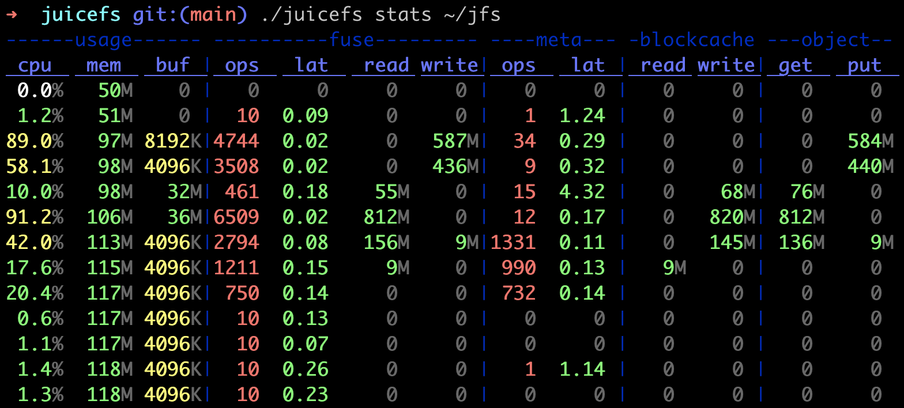

# Performance Statistics Watcher

JuiceFS pre-defined a lot of monitoring items to show internal performance statistics when the system is running. These items are [exposed](./p8s_metrics.md) by Prometheus API. However, when diagnosing performace issues, users may want a real-time monitorig tool to know what is actually going on within a certain time. Thus, the `stats` command is developed to display selected items every second, similar to the Linux tool `dstat`. The output is like:

By default, this command will monitor the JuiceFS process corresponding to the specified mount point, showing the following items:

#### usage

- cpu：CPU usage of the process
- mem：physical memory used by the process
- buf：current buffer size of JuiceFS; its limit can be adjusted by the mount argument `--buffer-size`

#### fuse

- ops/lat：number of operations handled by FUSE per second, and the average latency of them
- read/write：read/write bandwidth handled by FUSE

#### meta

- ops/lat：number of metadata operations and the average latency of them; please note operations returned directly in cache are not counted, so that the result is closer to real performance of metadata engines

#### blockcache

- read/write：read/write bandwidth of client local data cache

#### object

- get/put：Get/Put bandwidth between client and object storage

Moreover, users can acquire verbose statistics (like read/write ops and the average latency) by setting `--verbosity 1`, or customize displayed items by changing `--schema`. For more information, please check `juicefs stats -h`.

