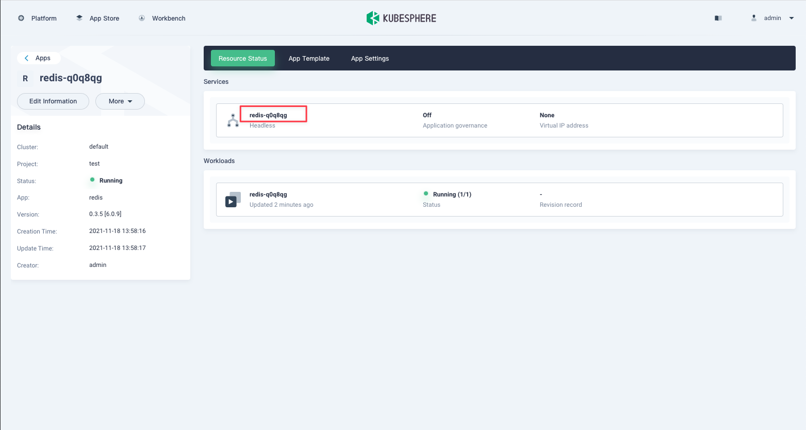

[KubeSphere](https://kubesphere.com.cn) is an application-centric multi-tenant container platform built on Kubernetes. It provides full-stack IT automated operation and maintenance capabilities and simplifies the DevOps workflow of the enterprise.

KubeSphere provides a friendly wizard-style operation interface for operation and maintenance, even users who are not experienced in Kubernetes can start management and use relatively easily. It provides a Helm-based application market that can easily install various Kubernetes applications under a graphical interface.

This article will introduce how to deploy JuiceFS CSI Driver in KubeSphere with one click to provide data persistence for various applications on the cluster.

## Prerequisites

1. **Install KubeSphere**

   There are two ways to install KubeSphere. One is installing in Linux, you can refer to the document: [All-in-One Installation of Kubernetes and KubeSphere on Linux](https://kubesphere.com.cn/en/docs/quick-start/all-in-one-on-linux) , One is installing in Kubernetes, you can refer to the document: [Minimal KubeSphere on Kubernetes](https://kubesphere.com.cn/en/docs/quick-start/minimal-kubesphere-on-k8s)

2. **Enable app store in KubeSphere**

   You can refer to the documentation for enabling the app store in KubeSphere: [KubeSphere App Store](https://kubesphere.com.cn/en/docs/pluggable-components/app-store)

## Install JuiceFS CSI Driver

If the version of KubeSphere is v3.2.0 and above, you can install CSI Driver directly in the app store, skip the "Configure Application Template/Application Repository" step, and go directly to the "Install" step; if the KubeSphere version is lower than v3.2.0, follow the steps below to configure application templates/application repository.

### Configure of Application Template/Application Repository

To install JuiceFS CSI Driver, you first need to create an application template. There are two methods.

#### Method one: Application Repository

Click in the workspace to enter the application management, select "App Repositories", click the create button to add JuiceFS CSI Repository, fill in:

- Repository name: `juicefs-csi-driver`
- Index URL: `https://juicedata.github.io/charts/`

#### Method two: Application Template

Download the chart compressed package from the JuiceFS CSI Driver warehouse: [https://github.com/juicedata/juicefs-csi-driver/releases](https://github.com/juicedata/juicefs-csi-driver/releases).

In the "Workspace", click to enter the "App Management", select "App Templates", click "create", upload the chart compression package:

### Install

Select "Project" where you want to deploy in the "Workspace" (the project in KubeSphere is the namespace in K8s), select "Apps", click the "create" button, select "From App Store", and then Select `juicefs`:

If KubeSphere version is lower than v3.2.0, select button "From App Template" according to the application template configured in the previous step:

It's the same after entering the configuration modification page, modify the following two places:

- namespace: Change to the corresponding project name
- storageClass.backend:
  The `backend` part is used to define the backend database and object storage of the file system. Refer to ["Create a File System"](../getting-started/standalone.md#juicefs-format) for related content.

You can also quickly create databases (such as Redis) and object storage (such as MinIO) by KubeSphere's app store. For example, build on the KubeSphere platform Redis: Select "Apps" in the current project, click the "create" button, select "From App Store", select "Redis", and then quickly deploy. The access URL of Redis can be the service name of the deployed application, as follows:

Deploying MinIO on the KubeSphere platform is a similar process, but you can modify the accessKey and secretKey of MinIO before deploying MinIO, and you need to remember the configured values. As shown below:

> Attention: If there are permissions error when deploying MinIO, you can set the `securityContext.enables` in the configuration to false.

MinIO's access URL can be the service name of the deployed application, as follows:

After both Redis and MinIO are set up, you can fill in the `backend` value of JuiceFS CSI Driver.

1. `metaurl` is the database address of Redis just created, the access address of Redis can be the service name corresponding to the Redis application, such as `redis://redis-rzxoz6:6379/1`
2. `storage` is type of storage for the object, such as `minio`
3. `bucket` is the available bucket of MinIO just created (JuiceFS will automatically create it, no need to create it manually), the access address of MinIO can be the service name corresponding to the MinIO application, such as `http://minio-qkp9my:9000/minio/test`
4. `accessKey` and `secretKey` are the accessKey and secretKey of MinIO just created

After the configuration is modified, click "Install".

## Usage

### Deploy application

The JuiceFS CSI Driver installed above has created a `StorageClass`, for example, the `StorageClass` created above is `juicefs-sc` , Can be used directly.

Then you need to create a PVC. In "Project", select "Storage Management", then select "Storage Volume", click the " Create" button to create a PVC, and select `juicefs-sc` for the "StorageClass", as follows:

After the PVC is created, in the "Apps" of "Project", select "Workloads", click "Create" button to deploy the workload, and fill in your favorite name on the "Basic Information" page; the "Container Image" page can fill in the mirror image `centos`; Start command `sh,-c,while true; do echo $(date -u) >> /data/out.txt; sleep 5; done`; "Mount Volume" select "Existing Volume", and then select PVC created in one step, fill in the path in the container with `/data` as follows:

After the deployment completed, you can see the running pod:

### Create StorageClass

If you did not create a `StorageClass` when installing JuiceFS CSI Driver, or you need to create a new one, you can follow the steps below:

After preparing the metadata service and object storage service, create a new `Secret`. On the "Platform Management" page, select "Configuration", select "Secret", and click the "Create" button to create a new one:

Fill in the metadata service and object storage information in "Data Settings", as follows:

After creating `Secret`, create `StorageClass`, select "Storage" on the "Platform Management" page, select "Storage Classes", click the "Create" button to create a new one, and select "Custom" for "Storage Class":

The setting page information is as follows, where "Storage System" fills in `csi.juicefs.com`, and 4 more parameters are set:

- `csi.storage.k8s.io/provisioner-secret-name`: secret name
- `csi.storage.k8s.io/provisioner-secret-namespace`: project of secret
- `csi.storage.k8s.io/node-publish-secret-name`: secret name
- `csi.storage.k8s.io/node-publish-secret-namespace`: project of secret

After clicking the "Create" button, the `StorageClass` is created.
