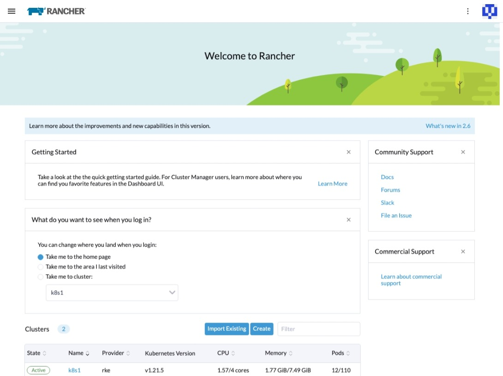
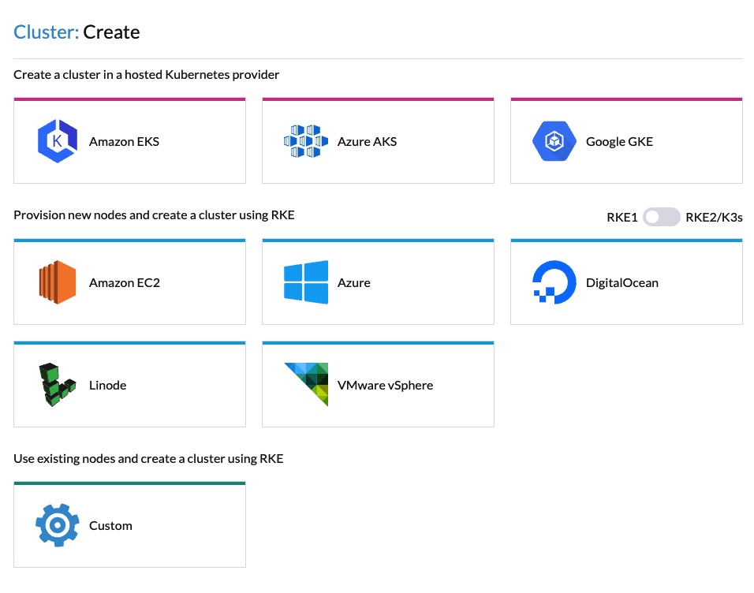
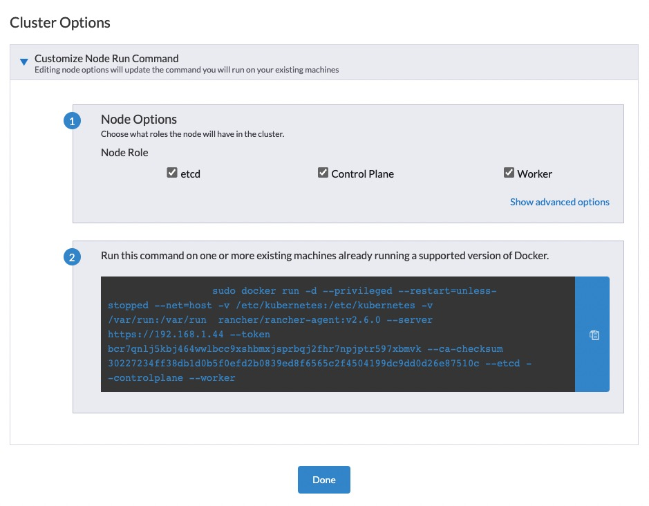
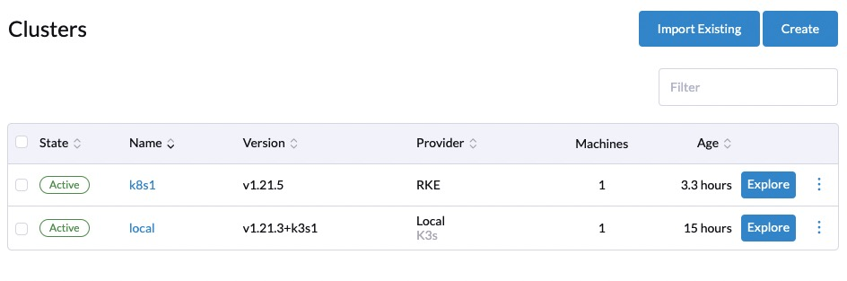
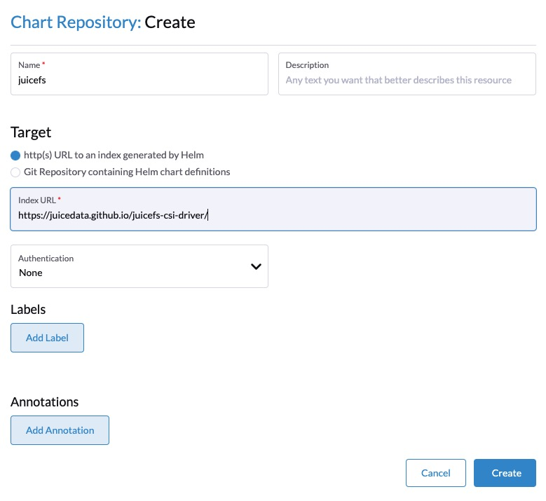
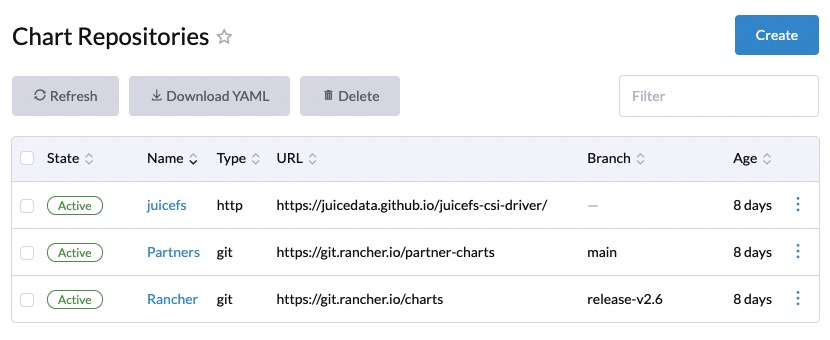
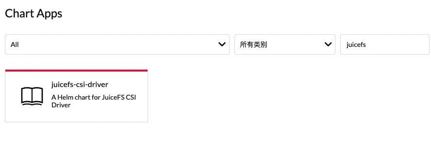
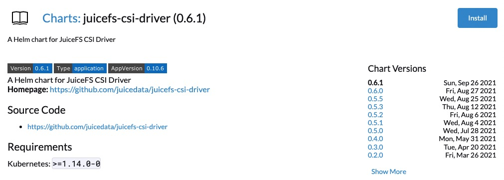
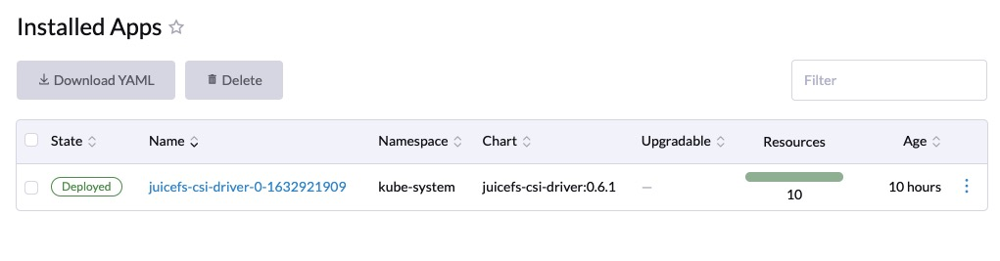
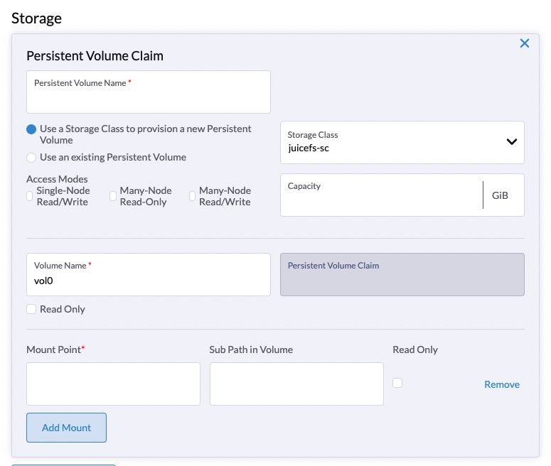

[Rancher](https://rancher.com) is an enterprise-level Kubernetes cluster management system, which can be used to quickly complete the deployment of Kubernetes clusters on various cloud computing platforms.

Rancher provides a browser-based management interface, even users who are not experienced in Kubernetes can start to manage and use easily. It is preset with Helm-based application market by default, and various Kubernetes applications can be installed very easy under the graphical interface.

This article will introduce how to deploy Rancher on a Linux system and create a Kubernetes cluster with it, and then deploy JuiceFS CSI Driver with one click through the application market, thereby providing data persistence for various applications on the cluster.

## Install Rancher

Rancher can be installed on almost all modern Linux distributions. It can be installed directly on the operating system, or on Docker, Kubernetes, K3s or RKE. The installation is "Product-Ready" no matter which environment it is installed in.

Here we choose to install Rancher on Docker, with the following requirements:

- **Operating System**: Linux system with x86-64 architecture
- **Memory**: 4GB or more
- **Docker**: 19.03+

Run the following command to install Rancher:

```shell
sudo docker run --privileged -d --restart=unless-stopped -p 80:80 -p 443:443 rancher/rancher
```

After the container is created, Rancher's management interface can be opened by accessing the IP address of the host.



## Create a Kubernetes cluster

After Rancher is installed, you can see that it has deployed a K3s cluster in the current container, and Rancher related resources are running in this internal K3s cluster, but we don't need to pay attention to this cluster now.

Next, start to create a Kubernetes cluster. In the Cluster section of the welcome page, click `Create` to create a cluster. Rancher supports the creation of Kubernetes clusters on major cloud computing platforms. Here we need to create a cluster directly on Rancher's host, so choose `Custom`. Then fill in the cluster name according to the wizard and select the Kubernetes version.



In the `Cluster Options` page, select the node role to be created, then copy the generated command and execute it on the target host.



After the cluster is created, it will be displayed in Rancher's cluster list.



## One-click installation of JuiceFS CSI Driver

In the cluster list, click to enter the Kubernetes cluster, click on the left navigation menu to expand `Apps & Marketplace` -> `Chart Repositories`, click the `Create` button to add JuiceFS CSI repository, fill in:

- **Name**: `juicefs`
- **Index URL**: `https://juicedata.github.io/charts/`



And then, you can see the new repository in the list.



Then click to open the `Apps & Marketplace` → `Charts` from the left menu, type `juicefs` in the search bar, and then click to open `juicefs-csi-driver`.



Click the "Install" button on the application details page, the latest version will be installed by default, or you can click to switch to the historical version to install.



The installation wizard has two steps:

### Step 1: Set up the `Namespace`

The JuiceFS CSI Driver defaults to `kube-system`, and there is no need to set this step.

### Step 2: Adjust configuration parameters

This page provides a YAML editor, you can adjust JuiceFS-related information according to your needs. Usually you only need to modify the `storageClasses` part, where the `backend` part is used to define the backend database and object storage of the file system. If you are using an existing file system, you only need to fill in the two items `metaurl` and `name`, for example:

```yaml
...
storageClasses:
  - backend:
      accessKey: ''
      bucket: ''
      metaurl: 'redis://:mypasswd@efgh123.redis.rds.aliyuncs.com/1'
      name: myjfs
      secretKey: ''
      storage: ''
    enabled: true
    name: juicefs-sc
    reclaimPolicy: Retain
...
```

> **Tip**: If you have multiple JuiceFS file systems that need to be associated with different storageClasses in the Kubernetes cluster, you can add storageClass configuration items after the `storageClasses` array. Pay attention to modify the name of the storage class to avoid conflicts.

Click "Install" and wait for the application installation to complete.



## Use JuiceFS to persist data

When deploying an application, specify `juicefs-sc` in the storage configuration.


