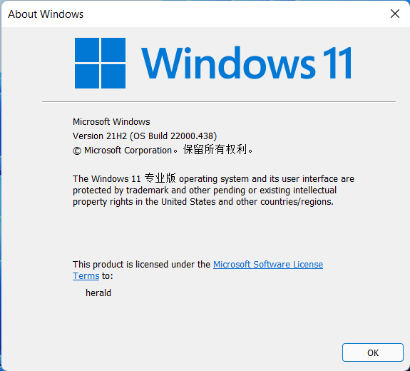
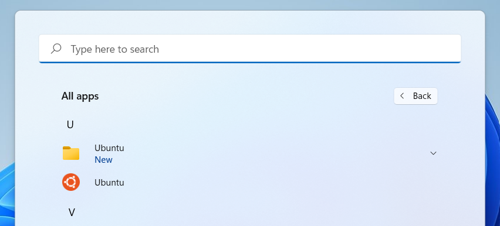
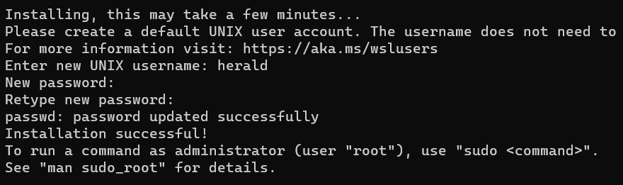
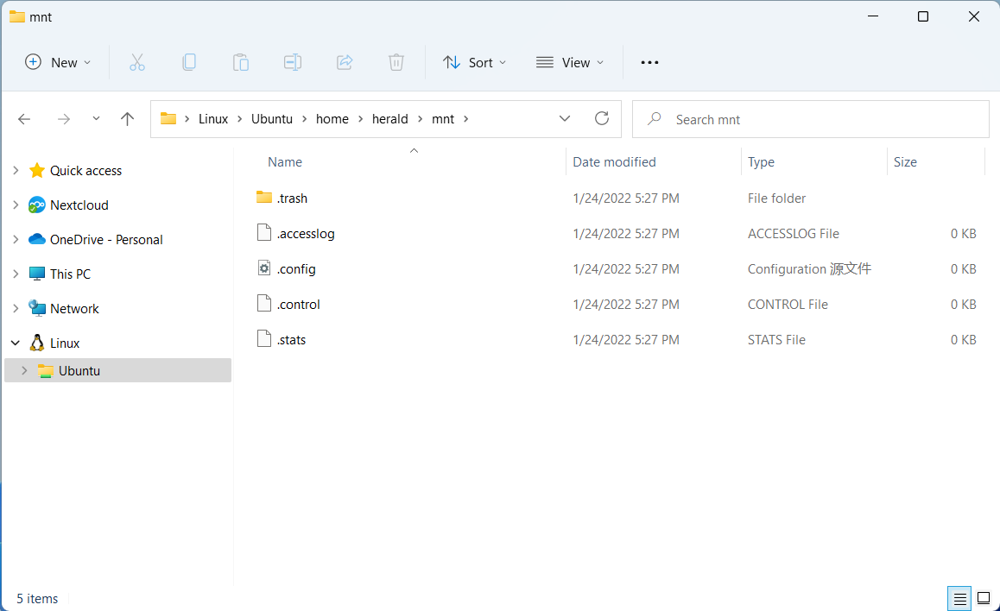
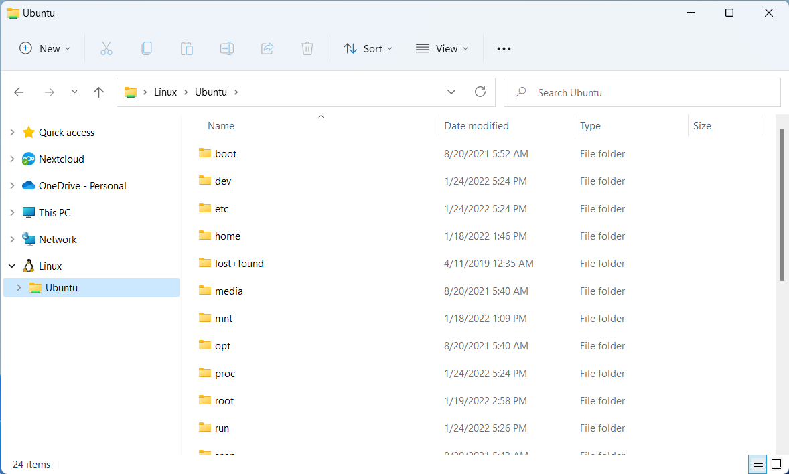
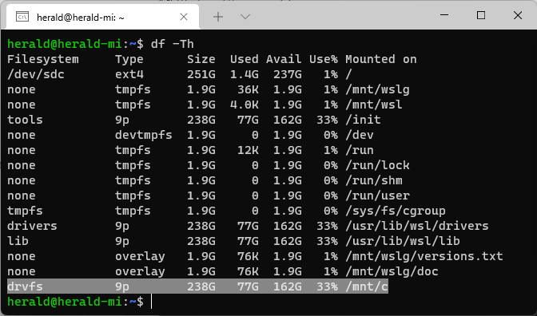
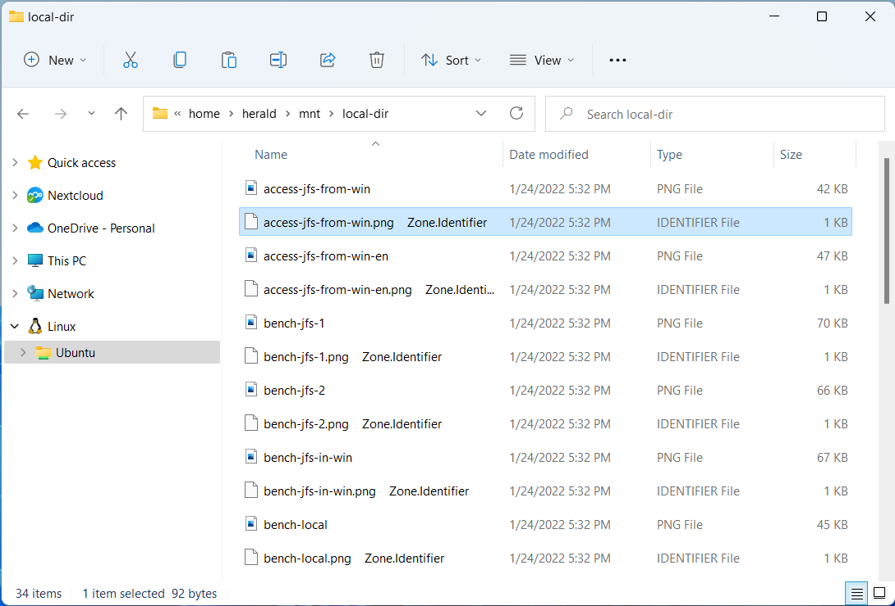

WSL is called Windows Subsystem for Linux, which means Windows subsystem for Linux. It allows you to run most GNU/Linux native commands, tools, and programs in a Windows environment without the additional hardware overhead of using a virtual machine or dual system.

## Installing WSL

Using WSL requires Windows 10 2004 or higher or Windows 11.

To check the current system version, you can call up the Run program by pressing <kbd>Win</kbd> + <kbd>R</kbd>. Type and run `winver`.



After confirming the Windows version, open PowerShell or Windows Command Prompt as an administrator and run the installation command.

```powershell
wsl --install
```

This command will download the latest Linux kernel, install and set WSL 2 as the default version, and install the Linux distribution (Ubuntu by default).

You can also specify the distribution to be installed directly at:

```powershell
wsl --install -d ubuntu
```

:::tip
`wsl --list --online` to view all available distributions.
:::

## Setting up Linux users and passwords

Once the WSL installation is complete, you can find the newly installed Linux distribution in the Start menu.



By clicking on the Ubuntu subsystem shortcut, WSL will open the terminal of the Linux subsystem. The first time you run it, you will be asked to set the user and password for managing the Linux subsystem, just follow the prompts.



There are several points to note about the username and password set here:

- This user is dedicated to the administration of this Linux subsystem and is not related to the users on the Windows system.
- This user will be the default user of the Linux subsystem and will be automatically logged in at boot time.
- this user will be considered as the administrator of the Linux subsystem and will be allowed to execute `sudo` commands.
- Multiple Linux subsystems are allowed to run at the same time in WSL, and each subsystem needs to have an administrative user.

## Using JuiceFS in WSL

Using JuiceFS in WSL means using JuiceFS on a Linux system, and here is an example of the Community Edition.

### Install the client

Install the JuiceFS client on the Linux subsystem by executing the following command.

   ```shell
   curl -sSL https://d.juicefs.com/install | sh -
   ```

### Creating a file system

JuiceFS is a distributed file system with data and metadata separated, usually using object storage as data storage and Redis, PostgreSQL or MySQL as metadata storage. It is assumed here that the following materials have been prepared.

#### Object Storage

View "[JuiceFS Supported Object Storage](../reference/how_to_set_up_object_storage.md)"

- **Bucket Endpoint**: `https://myjfs.oss-cn-shanghai.aliyuncs.com`
- **Access Key ID**: `ABCDEFGHIJKLMNopqXYZ`
- **Access Key Secret**: `ZYXwvutsrqpoNMLkJiHgfeDCBA`

#### Database

View "[JuiceFS Supported Metadata Engines](../reference/how_to_set_up_metadata_engine.md)"

- **Database URL**: `myjfs-sh-abc.redis.rds.aliyuncs.com:6379`
- **Database Password**: `mypassword`

Write private information to environment variables:

```shell
export ACCESS_KEY=ABCDEFGHIJKLMNopqXYZ
export SECRET_KEY=ZYXwvutsrqpoNMLkJiHgfeDCBA
export REDIS_PASSWORD=mypassword
```

Create a file system named `myjfs`:

```shell
juicefs format \
    --storage oss \
    --bucket https://myjfs.oss-cn-shanghai.aliyuncs.com \
    redis://myjfs-sh-abc.redis.rds.aliyuncs.com:6379/1 \
    myjfs
```

### Mount and use

Write the database password to the environment variable:

```shell
export REDIS_PASSWORD=mypassword
```

:::note
Once the file system is created successfully, the corresponding key information will be written to the database and the JuiceFS client will automatically read it from the database when the file system is mounted, so there is no need to set it again.
:::

Mount the file system to `mnt` in the user's home directory:

```shell
sudo juicefs mount -d redis://myjfs-sh-abc.redis.rds.aliyuncs.com:6379/1 $HOME/mnt
```

If you need to access the JuiceFS file system mounted on a Linux subsystem from a Windows system, find the Linux subsystem in the list on the left side of Explorer, then find and open the mount point path.



For more information on the use of JuiceFS, please refer to the official documentation.

## WSL Storage Performance

WSL bridges the Windows and Linux subsystems, allowing them to access each other's files stored on each other's systems.



Note, however, that accessing the Linux subsystem from Windows or accessing Windows from the Linux subsystem is bound to incur some performance overhead due to switching between systems. Therefore, the recommended practice is to decide where to store the files depending on the system where the program is located, and for programs in the Linux subsystem, the files it will be processing should also be stored in the Linux subsystem for better performance.

In the Linux subsystem, WSL mounts each Windows drive to `/mnt`, for example, the mount point for the C: drive in the Linux subsystem is `/mnt/c`.



To ensure optimal performance, when using JuiceFS in WSL, both the storage and cache paths should be set in the Linux subsystem. In other words, you should avoid setting the storage or cache on a Windows partition mount point like `/mnt/c`.

Using the `bench` benchmarking tool that comes with JuiceFS, the results show that mounting a file system to Windows (e.g. `/mnt/c`) has about 30% lower performance than mounting it inside a Linux subsystem (e.g. `$HOME/mnt`).

## Known Issues

When copying files to a Linux subsystem via Windows Explorer, WSL automatically appends a file of the same name with the `Zone.Identifier` identifier to each file. This is an NTFS file system security mechanism intended to track the origin of external files, but it is a bug for WSL and has been reported to the Microsoft development team on GitHub [#7456](https://github.com/microsoft/WSL/issues/7456).

This issue also affects the same problem when saving files to a mounted JuiceFS file system in the Linux subsystem via Windows Explorer. However, reading and writing JuiceFS file systems inside the Linux subsystem is not affected by this bug.


