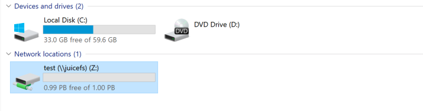

# Use JuiceFS on Windows


> **WARNING**: JuiceFS on Windows is **NOT** production ready!


## Install dependencies

JuiceFS on Windows depend on [WinFsp](http://www.secfs.net/winfsp/rel/) , install it first.


## Build JuiceFS from source

We can cross compile JuiceFS for Windows platform on Linux and macOS.

1. Install [mingw-w64](http://mingw-w64.org) on Linux or macOS. 

   On Linux, it can be installed using the distro's package manager like `yum` or `apt`.

   On macOS, use [brew](https://brew.sh/) to install: `brew install mingw-w64`

2. Build JuiceFS for Windows

    ```
git clone https://github.com/juicedata/juicefs.git && cd juicefs && make juicefs.exe
    ```


## Use JuiceFS

### Format JuiceFS

```
PS C:\> .\juicefs.exe format --storage=s3 --access-key=minioadmin --secret-key=minioadmin --bucket=http://juicefs-test.s3.juicefs.local:9000 redis://:password@redis.juicefs.local/7 test
2021/03/22 15:11:27.730642 juicefs[2928] <INFO>: Meta address: redis://:password@redis.juicefs.local/7
2021/03/22 15:11:27.747637 juicefs[2928] <WARNING>: AOF is not enabled, you may lose data if Redis is not shutdown properly.
2021/03/22 15:11:27.748684 juicefs[2928] <INFO>: Data uses s3://juicefs-test/test/
2021/03/22 15:11:27.774640 juicefs[2928] <INFO>: Volume is formatted as {Name:test UUID:7088b6fa-ef2b-4792-b6c9-98fcdd6d45fb Storage:s3 Bucket:http://juicefs-test.s3.juicefs.local:9000 AccessKey:minioadmin SecretKey:removed BlockSize:4096 Compression:lz4 Partitions:0 EncryptKey:}
```


### Mount JuiceFS

Select an unused drive letter, such as `Z:`

```
PS C:\> .\juicefs.exe mount redis://:password@redis.juicefs.local/7 Z:
2021/03/22 15:16:18.003547 juicefs[7064] <INFO>: Meta address: redis://:password@redis.juicefs.local/7
2021/03/22 15:16:18.022972 juicefs[7064] <WARNING>: AOF is not enabled, you may lose data if Redis is not shutdown properly.
2021/03/22 15:16:18.024710 juicefs[7064] <INFO>: Data use s3://juicefs-test/test/
2021/03/22 15:16:18.024710 juicefs[7064] <INFO>: Cache: C:\Users\bob\.juicefs\cache\7088b6fa-ef2b-4792-b6c9-98fcdd6d45fb capacity: 1024 MB
The service juicefs has been started.
```


Then we can use JuiceFS as a local disk drive `Z:`

