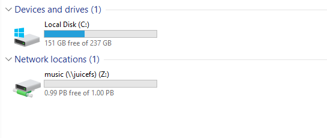

# JuiceFS 快速上手指南

[](https://github.com/juicedata/juicefs/blob/main/LICENSE) [](https://goreportcard.com/badge/github.com/juicedata/juicefs) [](https://join.slack.com/t/juicefs/shared_invite/zt-n9h5qdxh-0bJojPaql8cfFgwerDQJgA)


JuiceFS 是一款高性能 [POSIX](https://en.wikipedia.org/wiki/POSIX) 文件系统，针对云原生环境特别优化设计，在 GNU Affero General Public License v3.0 开源协议下发布。使用 JuiceFS 文件系统存储数据，数据本身会被持久化在对象存储（例如，AWS S3），而数据所对应的元数据会被持久化在 Redis 等高性能的数据库中。 JuiceFS 可以简单便捷的将海量云存储直接接入已投入生产环境的大数据、机器学习、人工智能以及各种应用平台，无需修改代码即可像使用本地存储一样高效使用海量云端存储。

## JuiceFS 的核心特性

1. **POSIX 兼容**：像本地文件系统一样使用，无缝对接已有应用，无业务侵入性；
2. **HDFS 兼容**：完整兼容 HDFS API，提供更强的元数据性能；
3. **S3 兼容**：提供与 S3 协议兼容的访问接口；
4. **云原生**：通过 [Kubernetes CSI driver](https://github.com/juicedata/juicefs/blob/main/docs/en/how_to_use_on_kubernetes.md) 可以很便捷地在 Kubernetes 中使用 JuiceFS；
5. **多端共享**：同一文件系统可在上千台服务器同时挂载，高性能并发读写，共享数据；
6. **强一致性**：确认的修改会在所有挂载了同一文件系统的服务器上立即可见，保证强一致性；
7. **强悍性能**：毫秒级的延迟，近乎无限的吞吐量（取决于对象存储规模），查看[性能测试结果](#性能测试)；
8. **数据安全**：支持传输中加密（encryption in transit）以及静态加密（encryption at rest）；
9. **文件锁**：支持 BSD 锁（flock）及 POSIX 锁（fcntl）；
10. **数据压缩**：支持使用 [LZ4](https://lz4.github.io/lz4) 或 [Zstandard](https://facebook.github.io/zstd) 压缩数据，节省存储空间；

## JuiceFS 的技术架构

JuiceFS 文件系统由三个部分组成：

1. **JuiceFS 客户端**：协调对象存储和元数据存储引擎，以及 POSIX、Hadoop、Kubernetes、S3 等文件系统接口的实现；
2. **数据存储**：存储数据本身，支持本地磁盘、对象存储；
3. **元数据存储**：存储数据对应的元数据，支持 Redis 等多种引擎；


作为文件系统，JuiceFS 会分别处理数据及其对应的元数据，数据会被存储在对象存储中，元数据会被存储在元数据服务引擎中。

在**数据存储**方面，JuiceFS 支持几乎所有的公有云对象存储，同时也支持 OpenStack Swift、Ceph、MinIO 等私有化的对象存储。

在**元数据存储**方面，JuiceFS 采用多引擎设计，目前已支持 [Redis](https://redis.io/) 作为元数据服务引擎，也将陆续实现对 TiKV、PostgreSQL、MariaDB、MySQL、Oracle 等更多数据引擎的支持。

在**文件系统接口**实现方面：

- 通过 **FUSE** ，JuiceFS 文件系统能够以 POSIX 兼容的方式挂载到服务器，将海量云端存储直接当做本地存储来使用。
- 通过 **Hadoop Java SDK**，JuiceFS 文件系统能够直接替代 HDFS，为 Hadoop 提供低成本的海量存储。
- 通过 **Kubernetes CSI driver**，JuiceFS 文件系统能够直接为 Kubernetes 提供海量存储。
- 通过 **S3 Gateway**，使用 S3 作为存储层的应用可直接接入，同时可使用 AWS CLI、s3cmd、MinIO client 等工具访问 JuiceFS 文件系统。

## JuiceFS 如何存储文件

`文件系统` 作为用户和硬盘之间交互的媒介，它让文件可以妥善的被存储在硬盘上。如你所知，Windows  常用的文件系统有 FAT32、NTFS，Linux 常用的文件系统有 Ext4、XFS、BTRFS 等，每一种文件系统都有其独特的组织和管理文件的方式，它决定了文件系统的存储能力和性能等特征。

JuiceFS 作为一个文件系统也不例外，它的强一致性、高性能等特征离不开它独特的文件管理模式。

与传统文件系统只能使用本地磁盘存储数据和对应的元数据的模式不同，JuiceFS 会将数据格式化以后存储在对象存储（云存储），同时会将数据对应的元数据存储在 Redis 等数据库中。

任何存入 JuiceFS 的文件都会被拆分成固定大小的 **"Chunk"**，默认的容量上限是 64 MiB。每个 Chunk 由一个或多个 **“Slice”** 组成，Slice 的长度不固定，取决于文件写入的方式。每个 Slice 又会被进一步拆分成固定大小的 **"Block"**，默认为 4 MiB。最后，这些 Block 会被存储到对象存储。与此同时，JuiceFS 会将每个文件以及它的 Chunks、Slices、Blocks 等元数据信息存储在元数据引擎中。


使用 JuiceFS，文件最终会被拆分成 Chunks、Slices 和 Blocks 存储在对象存储。因此，你会发现在对象存储平台的文件浏览器中找不到存入 JuiceFS 的源文件，存储桶中只有一个 chunks 目录和一堆数字编号的目录和文件。不要惊慌，这正是 JuiceFS 文件系统高性能运作的秘诀！


## 快速上手

使用 JuiceFS 创建文件系统，需要以下 3 个方面准备：

1. 准备 Redis 数据库
2. 准备对象存储
3. 下载安装 JuiceFS 客户端

### 一、准备 Redis 数据库

你可以很容易的在云计算平台购买到各种配置的云 Redis 数据库，但如果你只是想要快速评估 JuiceFS，可以使用 Docker 快速的在本地电脑上运行一个 Redis 数据库实例：

```shell
$ sudo docker run -d --name redis \
	-v redis-data:/data \
	-p 6379:6379 \
	--restart unless-stopped \
	redis redis-server --appendonly yes
```

容器创建成功以后，可使用 `redis://127.0.0.1:6379` 访问 redis 数据库。

> **注意**：以上命令将 redis 的数据持久化在 docker 的 redis-data 数据卷当中，你可以按需修改数据持久化的存储位置。

> **安全提示**：以上命令创建的 redis 数据库实例没有启用身份认证，且暴露了主机的 `6379` 端口，如果你要通过互联网访问这个数据库实例，强烈建议参照 [Redis 官方文档](https://redis.io/topics/security) 启用保护模式。

### 二、准备对象存储

和 Redis 数据库一样，几乎所有的公有云计算平台都提供对象存储服务。因为 JuiceFS 支持几乎所有主流平台的对象存储服务，因此你可以根据个人偏好自由选择。你可以查看我们的 [对象存储支持列表和设置指南]()，其中列出了 JuiceFS 目前支持的所有对象存储服务，以及具体的使用方法。

当然，如果你只是想要快速评估 JuiceFS，可以使用 Docker 快速的在本地电脑上运行一个 MinIO 对象存储实例：

```shell
$ sudo docker run -d --name minio \
	-v $PWD/minio-data:/data \
	-p 9000:9000 \
	--restart unless-stopped \
	minio/minio server /data
```

容器创建成功以后，使用 `http://127.0.0.1:9000` 访问 minio 管理界面，root 用户初始的 Access Key 和 Secret Key 均为 `minioadmin`。

> **注意**：以上命令将 minio 对象存储的数据路径映射到了当前目录下的 `minio-data` 文件夹中，你可以按需修改数据持久化存储的位置。

### 三、安装 JuiceFS 客户端

JuiceFS 同时支持 Linux、Windows、MacOS 三大操作系统平台，你可以在 [这里下载](https://github.com/juicedata/juicefs/releases/latest) 最新的预编译的二进制程序，请根据实际使用的系统和架构选择对应的版本。

以 x86 架构的 Linux 系统为例，下载文件名包含 `linux-amd64` 的压缩包：

```shell
$ wget https://github.com/juicedata/juicefs/releases/download/v0.12.1/juicefs-0.12.1-linux-amd64.tar.gz
```

解压并安装：

```shell
$ tar -zxf juicefs-0.12.1-linux-amd64.tar.gz
$ sudo install juicefs /usr/local/bin
```

### 四、创建  JuiceFS 文件系统

创建 JuiceFS 文件系统时，需要同时指定用来存储元数据的 Redis 数据库和用来存储实际数据的对象存储。

以下命令将创建一个名为 `pics` 的 JuiceFS 文件系统，使用 redis 中的 `1` 号数据库存储元数据，使用 minio 中创建的 `pics` 存储桶存储实际数据。

```shell
$ juicefs format \
	--storage minio \
	--bucket http://127.0.0.1:9000/pics \
	--access-key minioadmin \
	--secret-key minioadmin \
	redis://127.0.0.1:6379/1 \
	pics
```

执行命令后，会看到类似下面的内容输出，说明 JuiceFS 文件系统创建成功了。

```shell
2021/04/29 23:01:18.352256 juicefs[34223] <INFO>: Meta address: redis://127.0.0.1:6379/1
2021/04/29 23:01:18.354252 juicefs[34223] <INFO>: Ping redis: 132.185µs
2021/04/29 23:01:18.354758 juicefs[34223] <INFO>: Data uses 127.0.0.1:9000/pics/
2021/04/29 23:01:18.361674 juicefs[34223] <INFO>: Volume is formatted as {Name:pics UUID:9c0fab76-efd0-43fd-a81e-ae0916e2fc90 Storage:minio Bucket:http://127.0.0.1:9000/pics AccessKey:minioadmin SecretKey:removed BlockSize:4096 Compression:none Partitions:0 EncryptKey:}
```

> **注意**：你可以根据需要，创建无限多个 JuiceFS 文件系统。但需要注意的是，每个 Redis 数据库中只能创建一个文件系统。比如要再创建一个名为 `memory` 的文件系统时，可以使用 Redis 中的 2 号数据库，即 `redis://127.0.0.1:6379/2` 。

### 五、挂载 JuiceFS 文件系统

JuiceFS 文件系统创建完成以后，接下来就可以把它挂载到操作系统上使用了。以下命令将 `pics` 文件系统挂载到 `/mnt/jfs` 目录中。

```shell
$ sudo juicefs mount -d redis://127.0.0.1:6379/1 /mnt/jfs
```
> **注意**：挂载 JuiceFS 文件系统时，不需要显式指定文件系统的名称，只要填写正确的 Redis 服务器地址和数据库编号即可。

执行命令后，会看到类似下面的内容输出，说明 JuiceFS 文件系统已经成功挂载到系统上了。

```shell
2021/04/29 23:22:25.838419 juicefs[37999] <INFO>: Meta address: redis://127.0.0.1:6379/1
2021/04/29 23:22:25.839184 juicefs[37999] <INFO>: Ping redis: 67.625µs
2021/04/29 23:22:25.839399 juicefs[37999] <INFO>: Data use 127.0.0.1:9000/pics/
2021/04/29 23:22:25.839554 juicefs[37999] <INFO>: Cache: /var/jfsCache/9c0fab76-efd0-43fd-a81e-ae0916e2fc90 capacity: 1024 MB
2021/04/29 23:22:26.340509 juicefs[37999] <INFO>: OK, pics is ready at /mnt/jfs
```

挂载完成以后就可以在 `/mnt/jfs` 目录中存取文件了，你可以执行 `df` 命令查看 JuiceFS 文件系统的挂载情况：

```shell
$ df -Th
文件系统       类型          容量  已用  可用 已用% 挂载点
JuiceFS:pics   fuse.juicefs  1.0P   64K  1.0P    1% /mnt/jfs
```

> **注意**：默认情况下， juicefs 的缓存位于 `/var/jfsCache` 目录，为了获得该目录的读写权限，这里使用了 sudo 命令，以管理员权限挂载的 JuiceFS 文件系统。普通用户在读写 `/mnt/jfs` 时，需要为用户赋予该目录的操作权限。

## Windows 系统

### 一、安装依赖工具

JuiceFS 支持在 Windows 环境中创建和挂载文件系统。但你需要先安装  [WinFsp](http://www.secfs.net/winfsp/) 才能在 Windows 系统中挂载 JuiceFS 文件系统。

> **[WinFsp](https://github.com/billziss-gh/winfsp)** 是一个开源的 Windows 文件系统代理，它提供了一个 FUSE 仿真层，使得 JuiceFS 客户端可以将文件系统挂载到 Windows 系统中使用。

### 二、Windows 上安装 JuiceFS

你可以在 [这里下载](https://github.com/juicedata/juicefs/releases/latest) 最新的预编译的二进制程序，以 Windows 10 系统为例，下载文件名包含 `windows-amd64` 的压缩包，解压后得到 `juicefs.exe` 即是 JuiceFS 的客户端程序。

为了便于使用，可以在 `C：\` 盘根目录创建一个名为 `juicefs` 的文件夹，把 `juicefs.exe` 解压到该文件夹中。然后将 `C:\juicefs` 文件夹路径添加到系统的环境变量，重启系统让设置生效以后，可直接使用使用系统自带的 `命令提示符` 或 `PowerShell` 等程序执行 `juicefs` 命令。


### 三、挂载 JuiceFS 文件系统

这里假设你已经准备好了对象存储、Redis 数据库，并且已经创建好了 JuiceFS 文件系统。如果你还没有准备好这些必须的资源，请参考前面的 [快速上手](#快速上手) 部分内容。

这里，我们假设在当前局域网中 IP 地址为 `192.168.1.8` 的 Linux 主机上部署了 MinIO 对象存储和 Redis 数据库，然后执行了以下命令，创建了名为 `music` 的 JuiceFS 文件系统。

```shell
$ juicefs format --storage minio --bucket http://192.168.1.8:9000/music --access-key minioadmin --secret-key minioadmin redis://192.168.1.8:6379/1 music
```

> **注意**：Windows 系统上的 JuiceFS 客户端是命令行程序，你需要在 `命令提示符`、`PowerShell` 或 `Windows 终端` 中使用。

执行以下命令，将 `music` 文件系统挂载到 Z 盘。

```power
> juicefs.exe mount redis://192.168.1.8:6379/1 Z:
```



如上图，JuiceFS 客户端会把文件系统以网络驱动器的形式挂载为指定的系统盘符，你可以根据实际需要改用其他的盘符，但注意不要使用已经被占用的盘符。

## macOS 系统

### 一、安装依赖工具

JuiceFS 支持在 macOS 系统中创建和挂载文件系统。但你需要先安装 [macFUSE](https://osxfuse.github.io/) 才能在 macOS 系统中挂载 JuiceFS 文件系统。

> [macFUSE](https://github.com/osxfuse/osxfuse) 是一个开源的文件系统增强工具，它让 macOS 可以挂载第三方的文件系统，使得 JuiceFS 客户端可以将文件系统挂载到 macOS 系统中使用。

### 二、macOS 上安装 JuiceFS

你可以在 [这里下载](https://github.com/juicedata/juicefs/releases/latest) 最新的预编译的二进制程序，下载文件名包含 `darwin-amd64` 的压缩包，例如：

```shell
$ curl -fsSL https://github.com/juicedata/juicefs/releases/download/v0.12.1/juicefs-0.12.1-darwin-amd64.tar.gz -o juicefs-0.12.1-darwin-amd64.tar.gz
```

解压并安装：

```shell
$ tar -zxf juicefs-0.12.1-darwin-amd64.tar.gz
$ sudo install juicefs /usr/local/bin
```

### 三、挂载 JuiceFS 文件系统

这里假设你已经准备好了对象存储、Redis 数据库，并且已经创建好了 JuiceFS 文件系统。如果你还没有准备好这些必须的资源，请参考前面的 [快速上手](#快速上手) 部分内容。

这里，我们假设在当前局域网中 IP 地址为 `192.168.1.8` 的 Linux 主机上部署了 MinIO 对象存储和 Redis 数据库，然后执行了以下命令，创建了名为 `music` 的 JuiceFS 文件系统。

```shell
$ juicefs format --storage minio --bucket http://192.168.1.8:9000/music --access-key minioadmin --secret-key minioadmin redis://192.168.1.8:6379/1 music
```

执行以下命令，将 `music` 文件系统挂载到当前用户家目录下的 `~/music` 文件夹。

```shell
$ juicefs mount redis://192.168.1.8:6379/1 ~/music
```

> **提示**：在本指南中，Windows 和 macOS 挂载的是同一个文件系统，JuiceFS 支持上千台客户端同时挂载同一个文件系统，提供便捷的海量数据共享能力。

## POSIX 兼容性

JuiceFS 通过了 [pjdfstest](https://github.com/pjd/pjdfstest) 最新的 8813 项 POSIX 文件系统兼容性测试。

```
All tests successful.

Test Summary Report
-------------------
/root/soft/pjdfstest/tests/chown/00.t          (Wstat: 0 Tests: 1323 Failed: 0)
  TODO passed:   693, 697, 708-709, 714-715, 729, 733
Files=235, Tests=8813, 233 wallclock secs ( 2.77 usr  0.38 sys +  2.57 cusr  3.93 csys =  9.65 CPU)
Result: PASS
```

此外，JuiceFS 还提供：

- Close-to-open consistency. Once a file is closed, the following open and read can see the data written before close. Within same mount point, read can see all data written before it.
- Rename and all other metadata operations are atomic guaranteed by Redis transaction.
- Open files remain accessible after unlink from same mount point.
- Mmap is supported (tested with FSx).
- Fallocate with punch hole support.
- Extended attributes (xattr).
- BSD locks (flock).
- POSIX record locks (fcntl).

## 性能测试

### 基础测试

JuiceFS 提供了一个子命令来运行一些基本的基准测试，用以评估 JuiceFS 在当前环境的运行情况：

```
$ ./juicefs bench /jfs
Written a big file (1024.00 MiB): (113.67 MiB/s)
Read a big file (1024.00 MiB): (127.12 MiB/s)
Written 100 small files (102.40 KiB): 151.7 files/s, 6.6 ms for each file
Read 100 small files (102.40 KiB): 692.1 files/s, 1.4 ms for each file
Stated 100 files: 584.2 files/s, 1.7 ms for each file
FUSE operation: 19333, avg: 0.3 ms
Update meta: 436, avg: 1.4 ms
Put object: 356, avg: 4.8 ms
Get object first byte: 308, avg: 0.2 ms
Delete object: 356, avg: 0.2 ms
Used: 23.4s, CPU: 69.1%, MEM: 147.0 MiB
```

### 吞吐量

使用 [fio](https://github.com/axboe/fio) 在 JuiceFS、[EFS](https://aws.amazon.com/efs) 和 [S3FS](https://github.com/s3fs-fuse/s3fs-fuse) 上执行连续读写测试，结果如下：

[](https://github.com/juicedata/juicefs/blob/main/docs/images/sequential-read-write-benchmark.svg)

结果表明，JuiceFS 可以提供比另外两个工具大10倍的吞吐量，[了解更多](../en/fio.md)。

### 元数据 IOPS

使用 [mdtest](https://github.com/hpc/ior) 在 JuiceFS、[EFS](https://aws.amazon.com/efs) 和 [S3FS](https://github.com/s3fs-fuse/s3fs-fuse) 上执行简易的 mdtest  基准测试，结果如下：

[](../images/metadata-benchmark.svg)

结果表明，JuiceFS 可以提供比另外两个工具更高的元数据 IOPS，[了解更多](../en/mdtest.md)。

### 性能分析

JuiceFS 的根目录中有一个名为`.accesslog` 的虚拟文件，它记录了文件系统上的所有操作及其花费的时间，例如：

```
$ cat /jfs/.accesslog
2021.01.15 08:26:11.003330 [uid:0,gid:0,pid:4403] write (17669,8666,4993160): OK <0.000010>
2021.01.15 08:26:11.003473 [uid:0,gid:0,pid:4403] write (17675,198,997439): OK <0.000014>
2021.01.15 08:26:11.003616 [uid:0,gid:0,pid:4403] write (17666,390,951582): OK <0.000006>
```

每行的最后一个数字是当前操作花费的时间（以秒为单位）。 您可以用它调试和分析性能问题，或者尝试使用`./juicefs profile / jfs` 查看实时统计信息。运行 `./juicefs profile -h` 或 [点此](../en/operations_profiling.md)了解该命令的更多信息。

## 用量统计

JuiceFS 默认会收集 **匿名** 用量数据。它仅收集核心指标（例如版本号），不会收集任何用户信息或任何敏感数据。您可以在[此处](https://github.com/juicedata/juicefs/blob/main/pkg/usage/usage.go)查看相关代码。

这些数据有助于我们了解社区如何使用此项目。您可以通过命令行选项 `--no-usage-report` 禁用该功能：

```
$ ./juicefs mount --no-usage-report
```

## License

JuiceFS is open-sourced under GNU AGPL v3.0, see [LICENSE](https://github.com/juicedata/juicefs/blob/main/LICENSE).

## Credits

The design of JuiceFS was inspired by [Google File System](https://research.google/pubs/pub51), [HDFS](https://hadoop.apache.org/) and [MooseFS](https://moosefs.com/), thanks to their great work.

