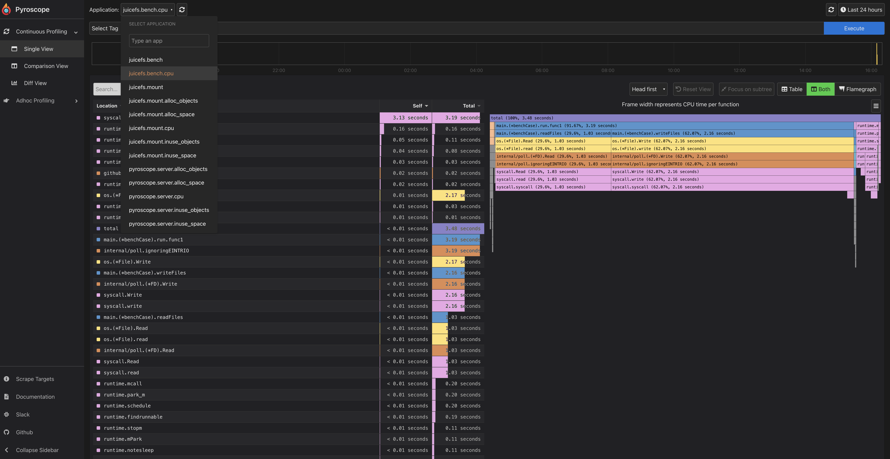

import Tabs from '@theme/Tabs';
import TabItem from '@theme/TabItem';

# 故障诊断和分析

## 客户端日志

JuiceFS 客户端在运行过程中会输出日志用于故障诊断，日志等级从低到高分别是：DEBUG、INFO、WARNING、ERROR、FATAL，默认只输出 INFO 级别以上的日志。如果需要输出 DEBUG 级别的日志，需要在运行 JuiceFS 客户端时显式开启，如加上 `--debug` 选项。

不同 JuiceFS 客户端获取日志的方式不同，以下分别介绍。

### 挂载点

当挂载 JuiceFS 文件系统时加上了 [`-d` 选项](../reference/command_reference.md#juicefs-mount)（表示后台运行），日志会同时输出到系统日志和本地日志文件，取决于挂载文件系统时的运行用户，本地日志文件的路径稍有区别。root 用户对应的日志文件路径是 `/var/log/juicefs.log`，非 root 用户的日志文件路径是 `$HOME/.juicefs/juicefs.log`，具体请参见 [`--log` 选项](../reference/command_reference.md#juicefs-mount)。

取决于你使用的操作系统，你可以通过不同的命令获取系统日志或直接读取本地日志文件：

<Tabs>
  <TabItem value="local-log-file" label="本地日志文件">

```bash
tail -n 100 /var/log/juicefs.log
```

  </TabItem>
  <TabItem value="macos-syslog" label="macOS 系统日志">

```bash
syslog | grep 'juicefs'
```

  </TabItem>
  <TabItem value="debian-syslog" label="Debian 系统日志">

```bash
cat /var/log/syslog | grep 'juicefs'
```

  </TabItem>
  <TabItem value="centos-syslog" label="CentOS 系统日志">

```bash
cat /var/log/messages | grep 'juicefs'
```

  </TabItem>
</Tabs>

你可以使用 `grep` 命令过滤显示不同等级的日志信息，从而进行性能统计和故障追踪，例如：

```shell
cat /var/log/syslog | grep 'juicefs' | grep '<ERROR>'
```

### Kubernetes CSI 驱动

根据你使用的 JuiceFS CSI 驱动版本会有不同的获取日志的方式，具体请参考 [CSI 驱动文档](https://juicefs.com/docs/zh/csi/troubleshooting)。

### S3 网关

S3 网关仅支持在前台运行，因此客户端日志会直接输出到终端。如果你是在 Kubernetes 中部署 S3 网关，需要查看对应 pod 的日志。

### Hadoop Java SDK

使用 JuiceFS Hadoop Java SDK 的应用进程（如 Spark executor）的日志中会包含 JuiceFS 客户端日志，因为和应用自身产生的日志混杂在一起，需要通过特定关键词来过滤筛选（如 `juicefs`，注意这里忽略了大小写）。


## 访问日志

每个 JuiceFS 客户端都有一个访问日志，其中详细记录了文件系统上的所有操作，如操作类型、用户 ID、用户组 ID、文件 inode 及其花费的时间。访问日志可以有多种用途，如性能分析、审计、故障诊断。

### 访问日志格式

访问日志的示例格式如下：

```
2021.01.15 08:26:11.003330 [uid:0,gid:0,pid:4403] write (17669,8666,4993160): OK <0.000010>
```

其中每一列的含义为：

- `2021.01.15 08:26:11.003330`：当前操作的时间
- `[uid:0,gid:0,pid:4403]`：当前操作的用户 ID、用户组 ID、进程 ID
- `write`：操作类型
- `(17669,8666,4993160)`：当前操作类型的输入参数，如示例中的 `write` 操作的输入参数分别为写入文件的 inode、写入数据的大小、写入文件的偏移。不同操作类型的参数不同，具体请参考 [`vfs.go`](https://github.com/juicedata/juicefs/blob/main/pkg/vfs/vfs.go) 文件。
- `OK`：当前操作是否成功，如果不成功会输出具体的失败信息。
- `<0.000010>`：当前操作花费的时间（以秒为单位）

你可以通过访问日志调试和分析性能问题，或者尝试使用 `juicefs profile <mount-point>` 查看实时统计信息。运行 `juicefs profile -h` 或[点此](../benchmark/operations_profiling.md)了解该子命令的更多信息。

不同 JuiceFS 客户端获取访问日志的方式不同，以下分别介绍。

### 挂载点

在 JuiceFS 文件系统挂载点的根目录中有一个名为 `.accesslog` 的虚拟文件，通过 `cat` 命令可以查看其中的内容（命令不会退出），例如（假设挂载点根目录为 `/jfs`）：

```bash
cat /jfs/.accesslog
```

```output
2021.01.15 08:26:11.003330 [uid:0,gid:0,pid:4403] write (17669,8666,4993160): OK <0.000010>
2021.01.15 08:26:11.003473 [uid:0,gid:0,pid:4403] write (17675,198,997439): OK <0.000014>
2021.01.15 08:26:11.003616 [uid:0,gid:0,pid:4403] write (17666,390,951582): OK <0.000006>
```

### Kubernetes CSI 驱动

请参考 [CSI 驱动文档](https://juicefs.com/docs/zh/csi/troubleshooting)及根据你使用的 JuiceFS CSI 驱动版本来找到 mount pod 或者 CSI 驱动 pod，在 pod 内的 JuiceFS 文件系统挂载点根目录查看 `.accesslog` 文件即可。Pod 内的挂载点路径为 `/jfs/<pv_volumeHandle>`，假设 mount pod 的名称叫 `juicefs-1.2.3.4-pvc-d4b8fb4f-2c0b-48e8-a2dc-530799435373`，`<pv_volumeHandle>` 为 `pvc-d4b8fb4f-2c0b-48e8-a2dc-530799435373`，可以使用如下命令查看：

```bash
kubectl -n kube-system exec juicefs-1.2.3.4-pvc-d4b8fb4f-2c0b-48e8-a2dc-530799435373 -- cat /jfs/pvc-d4b8fb4f-2c0b-48e8-a2dc-530799435373/.accesslog
```

### S3 网关

需要在启动 S3 网关时新增 [`--access-log` 选项](../reference/command_reference.md#juicefs-gateway)，指定访问日志输出的路径，默认 S3 网关不输出访问日志。

### Hadoop Java SDK

需要在 JuiceFS Hadoop Java SDK 的[客户端配置](../deployment/hadoop_java_sdk.md#其它配置)中新增 `juicefs.access-log` 配置项，指定访问日志输出的路径，默认不输出访问日志。


## 运行时信息

JuiceFS 客户端默认会通过 [pprof](https://pkg.go.dev/net/http/pprof) 在本地监听一个 TCP 端口用以获取运行时信息，如 Goroutine 堆栈信息、CPU 性能统计、内存分配统计。你可以通过系统命令（如 `lsof`）查看当前 JuiceFS 客户端监听的具体端口号：

:::note 注意
如果 JuiceFS 是通过 root 用户挂载，那么需要在 `lsof` 命令前加上 `sudo`。
:::

```bash
lsof -i -nP | grep LISTEN | grep juicefs
```

```output
juicefs   32666 user    8u  IPv4 0x44992f0610d9870b      0t0  TCP 127.0.0.1:6061 (LISTEN)
juicefs   32666 user    9u  IPv4 0x44992f0619bf91cb      0t0  TCP 127.0.0.1:6071 (LISTEN)
juicefs   32666 user   15u  IPv4 0x44992f062886fc5b      0t0  TCP 127.0.0.1:9567 (LISTEN)
```

默认 pprof 监听的端口号范围是从 6060 开始至 6099 结束，因此上面示例中对应的实际端口号是 6061。在获取到监听端口号以后就可以通过 `http://localhost:<port>/debug/pprof` 地址查看所有可供查询的运行时信息，一些重要的运行时信息如下：

- Goroutine 堆栈信息：`http://localhost:<port>/debug/pprof/goroutine?debug=1`
- CPU 性能统计：`http://localhost:<port>/debug/pprof/profile?seconds=30`
- 内存分配统计：`http://localhost:<port>/debug/pprof/heap`

为了便于分析这些运行时信息，可以将它们保存到本地，例如：

```bash
curl 'http://localhost:<port>/debug/pprof/goroutine?debug=1' > juicefs.goroutine.txt
```
```bash
curl 'http://localhost:<port>/debug/pprof/profile?seconds=30' > juicefs.cpu.pb.gz
```
```bash
curl 'http://localhost:<port>/debug/pprof/heap' > juicefs.heap.pb.gz
```

:::tip 建议
你也可以使用 juicefs debug 命令自动收集这些运行时信息并保存到本地，默认保存到当前目录下的 debug 目录中，例如：
```bash
juicefs debug --collect-pprof /mnt/jfs
```
关于 juicefs debug 命令的更多信息，请查看[命令参考](https://juicefs.com/docs/zh/community/command_reference#juicefs-debug)
:::

如果你安装了 `go` 命令，那么可以通过 `go tool pprof` 命令直接分析，例如分析 CPU 性能统计：

```bash
$ go tool pprof 'http://localhost:<port>/debug/pprof/profile?seconds=30'
Fetching profile over HTTP from http://localhost:<port>/debug/pprof/profile?seconds=30
Saved profile in /Users/xxx/pprof/pprof.samples.cpu.001.pb.gz
Type: cpu
Time: Dec 17, 2021 at 1:41pm (CST)
Duration: 30.12s, Total samples = 32.06s (106.42%)
Entering interactive mode (type "help" for commands, "o" for options)
(pprof) top
Showing nodes accounting for 30.57s, 95.35% of 32.06s total
Dropped 285 nodes (cum <= 0.16s)
Showing top 10 nodes out of 192
      flat  flat%   sum%        cum   cum%
    14.73s 45.95% 45.95%     14.74s 45.98%  runtime.cgocall
     7.39s 23.05% 69.00%      7.41s 23.11%  syscall.syscall
     2.92s  9.11% 78.10%      2.92s  9.11%  runtime.pthread_cond_wait
     2.35s  7.33% 85.43%      2.35s  7.33%  runtime.pthread_cond_signal
     1.13s  3.52% 88.96%      1.14s  3.56%  runtime.nanotime1
     0.77s  2.40% 91.36%      0.77s  2.40%  syscall.Syscall
     0.49s  1.53% 92.89%      0.49s  1.53%  runtime.memmove
     0.31s  0.97% 93.86%      0.31s  0.97%  runtime.kevent
     0.27s  0.84% 94.70%      0.27s  0.84%  runtime.usleep
     0.21s  0.66% 95.35%      0.21s  0.66%  runtime.madvise
```

也可以将运行时信息导出为可视化图表，以更加直观的方式进行分析。可视化图表支持导出为多种格式，如 HTML、PDF、SVG、PNG 等。例如导出内存分配统计信息为 PDF 文件的命令如下：

:::note 注意
导出为可视化图表功能依赖 [Graphviz](https://graphviz.org)，请先将它安装好。
:::

```bash
go tool pprof -pdf 'http://localhost:<port>/debug/pprof/heap' > juicefs.heap.pdf
```

关于 pprof 的更多信息，请查看[官方文档](https://github.com/google/pprof/blob/master/doc/README.md)。

### 使用 Pyroscope 进行性能剖析



[Pyroscope](https://github.com/pyroscope-io/pyroscope) 是一个开源的持续性能剖析平台。它能够帮你：

+ 找出源代码中的性能问题和瓶颈
+ 解决 CPU 利用率高的问题
+ 理解应用程序的调用树（call tree）
+ 追踪随一段时间内变化的情况

JuiceFS 支持使用 `--pyroscope` 选项传入 Pyroscope 服务端地址，指标以每隔 10 秒的频率推送到服务端。如果服务端开启了权限校验，校验信息 API Key 可以通过环境变量 `PYROSCOPE_AUTH_TOKEN` 传入：

```bash
$ export PYROSCOPE_AUTH_TOKEN=xxxxxxxxxxxxxxxx
$ juicefs mount --pyroscope http://localhost:4040 redis://localhost /mnt/jfs
$ juicefs dump --pyroscope http://localhost:4040 redis://localhost dump.json
```
