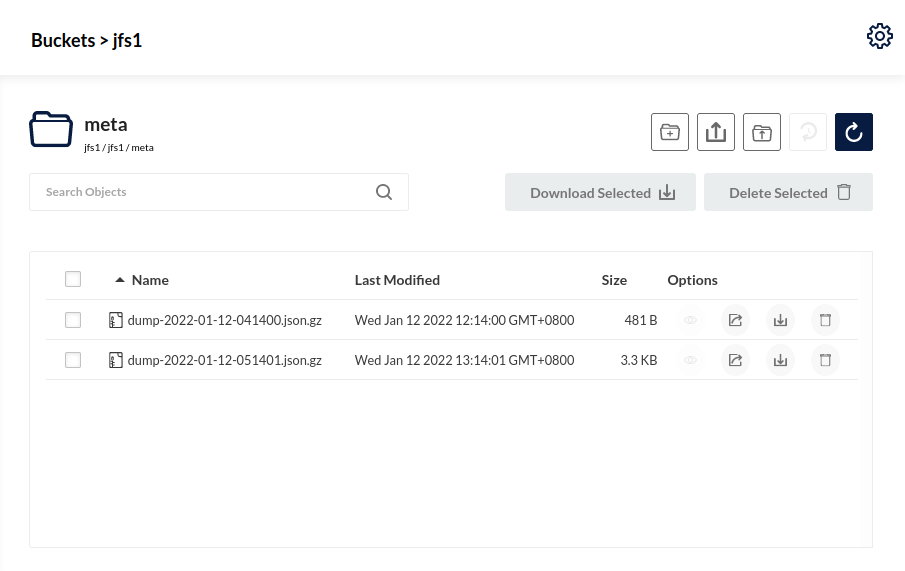

:::tip 提示

- JuiceFS v1.0.0 开始支持元数据自动备份
- JuiceFS v1.0.4 开始支持通过 `load` 命令恢复加密的元数据备份
:::

JuiceFS 支持[多种元数据引擎](../reference/how_to_set_up_metadata_engine.md)，且各引擎内部的数据管理格式各有不同。为了便于管理，JuiceFS 提供了 [`dump`](../reference/command_reference.mdx#dump) 命令允许将所有元数据以统一格式写入到 JSON 文件进行备份。同时，JuiceFS 也提供了 [`load`](../reference/command_reference.mdx#load) 命令，允许将备份恢复或迁移到任意元数据存储引擎。这个导出导入流程也可以用来将 JuiceFS 社区版文件系统迁移到企业版（参考[企业版文档](https://juicefs.com/docs/zh/cloud/administration/metadata_dump_load)），反之亦然。

## 元数据备份 {#backup}

:::note 注意

* `juicefs dump` 不提供全局时间点快照的功能，如果在导出过程中业务仍在写入，最终结果会包含不同时间点的信息，对于特定应用（比如数据库），这可能意味着导出文件不可用。如果对一致性有更高要求，可能需要在导出前确保应用停写。
* 对大规模文件系统，如果直接在线上环境进行导出，可能影响业务稳定性。
:::

### 手动备份 {#backup-manually}

使用 JuiceFS 客户端提供的 `dump` 命令可以将元数据导出到 JSON 文件，例如：

```shell
juicefs dump redis://192.168.1.6:6379/1 meta-dump.json
```

上例中 `meta-dump.json` 是导出的 JSON 文件，你可以随意调整它的文件名和扩展名。特别地，如果文件的扩展名为 `.gz`（如 `meta-dump.json.gz`），将会使用 Gzip 算法对导出的数据进行压缩。

`dump` 命令默认从根目录 `/` 开始，深度遍历目录树下所有文件，将每个文件的元数据信息按 JSON 格式进行输出。出于数据安全的考虑，对象存储的认证信息不会被导出，但可以通过 `--keep-secret-key` 选项保留。

`juicefs dump` 的价值在于它能将完整的元数据信息以统一的 JSON 格式导出，便于管理和保存，而且不同的元数据存储引擎都可以识别并导入。

在实际应用中，`dump` 命令与数据库自带的备份工具应该共同使用，相辅相成。比如，Redis 有 [Redis RDB](https://redis.io/topics/persistence#backing-up-redis-data)，MySQL 有 [`mysqldump`](https://dev.mysql.com/doc/mysql-backup-excerpt/5.7/en/mysqldump-sql-format.html) 等。

### 自动备份 {#backup-automatically}

从 JuiceFS v1.0.0 开始，不论文件系统通过 `mount` 命令挂载，还是通过 JuiceFS S3 网关及 Hadoop Java SDK 访问，客户端每小时都会自动备份元数据并拷贝到对象存储。

备份的文件存储在对象存储的 `meta` 目录中，它是一个独立于数据存储的目录，在挂载点中不可见，也不会与数据存储之间产生影响，用对象存储的文件浏览器即可查看和管理。



默认情况下，JuiceFS 客户端每小时备份一次元数据，自动备份的频率可以在挂载文件系统时通过 `--backup-meta` 选项进行调整，例如，要设置为每 8 个小时执行一次自动备份：

```shell
juicefs mount -d --backup-meta 8h redis://127.0.0.1:6379/1 /mnt
```

备份频率可以精确到秒，支持的单位如下：

- `h`：精确到小时，如 `1h`；
- `m`：精确到分钟，如 `30m`、`1h30m`；
- `s`：精确到秒，如 `50s`、`30m50s`、`1h30m50s`;

值得一提的是，备份操作耗时会随着文件系统内文件数的增多而增加，因此当文件数较多（默认为达到一百万）且自动备份频率为默认值 1 小时的情况下 JuiceFS 会自动跳过元数据备份，并打印相应的告警日志。此时可以选择挂载一个新客户端并设置较大的 `--backup-meta` 参数来重新启用自动备份。

作为参考，当使用 Redis 作为元数据引擎时，备份一百万文件的元数据大约需要 1 分钟，消耗约 1GB 内存。

:::caution 注意
使用 `--read-only` 只读挂载时，元数据不会自动备份。
:::

#### 自动备份策略

虽然自动备份元数据成为了客户端的默认动作，但在多主机共享挂载同一个文件系统时并不会发生备份冲突。

JuiceFS 维护了一个全局的时间戳，确保同一时刻只有一个客户端执行备份操作。当客户端之间设置了不同的备份周期，那么就会以周期最短的设置为准进行备份。

#### 备份清理策略

JuiceFS 会按照以下规则定期清理备份：

- 保留 2 天以内全部的备份；
- 超过 2 天不足 2 周的，保留每天中的 1 个备份；
- 超过 2 周不足 2 月的，保留每周中的 1 个备份；
- 超过 2 个月的，保留每个月中的 1 个备份。

## 元数据恢复与迁移 {#recovery-and-migration}

使用 [`load`](../reference/command_reference.mdx#load) 命令可以将 `dump` 命令导出的元数据恢复到一个空数据库中，比如：

```shell
juicefs load redis://192.168.1.6:6379/1 meta-dump.json
```

导入元数据时，JuiceFS 会重新计算文件系统的统计信息，包括空间使用量、inode 计数器等，最后在数据库中生成一份全局一致的元数据。如果你对 JuiceFS 的元数据设计有深入理解，还可以在恢复前对元数据备份文件进行修改，以此来进行调试。

`dump` 命令导出的 JSON 格式数据是统一且通用的，所有元数据引擎都能识别和导入。因此，你不但可以把备份恢复到原有类型的数据库中，还可以恢复到其它数据库，从而实现元数据引擎的迁移。

例如将元数据从 Redis 迁移到 MySQL：

1. 从 Redis 导出元数据备份：

   ```shell
   juicefs dump redis://192.168.1.6:6379/1 meta-dump.json
   ```

1. 将元数据恢复到一个全新的 MySQL 数据库：

   ```shell
   juicefs load mysql://user:password@(192.168.1.6:3306)/juicefs meta-dump.json
   ```

另外，也可以通过系统的管道直接迁移：

```shell
juicefs dump redis://192.168.1.6:6379/1 | juicefs load mysql://user:password@(192.168.1.6:3306)/juicefs
```

需要注意的是，由于 `dump` 导出的备份中默认排除了对象存储的 API 访问密钥，不论恢复还是迁移元数据，完成操作后都需要使用 [`juicefs config`](../reference/command_reference.mdx#config) 命令把文件系统关联的对象存储的认证信息再添加回去，例如：

```shell
juicefs config --secret-key xxxxx mysql://user:password@(192.168.1.6:3306)/juicefs
```

### 加密文件系统 {#encrypted-file-system}

对于[加密的文件系统](../security/encryption.md)，所有文件都会在本地加密后才上传到后端对象存储，包括元数据自动备份文件，也会加密后才上传至对象存储。这与 `dump` 命令不同，`dump` 导出的元数据永远是明文的。

对于加密文件系统，在恢复自动备份的元数据时需要额外设置 `JFS_RSA_PASSPHRASE` 环境变量，以及指定 RSA 私钥和加密算法：

```shell
export JFS_RSA_PASSPHRASE=xxxxxx
juicefs load \
  --encrypt-rsa-key my-private.pem \
  --encrypt-algo aes256gcm-rsa \
  redis://192.168.1.6:6379/1 \
  dump-2023-03-16-090750.json.gz
```

## 元数据检视 {#inspection}

除了可以导出完整的元数据信息，`dump` 命令还支持导出特定子目录中的元数据。可以直观地查看到指定目录树下所有文件的内部信息，因此常被用来辅助排查问题。

```shell
juicefs dump redis://192.168.1.6:6379/1 meta-dump.json --subdir /path/in/juicefs
```

另外，也可以使用 `jq` 等工具对导出文件进行分析。
