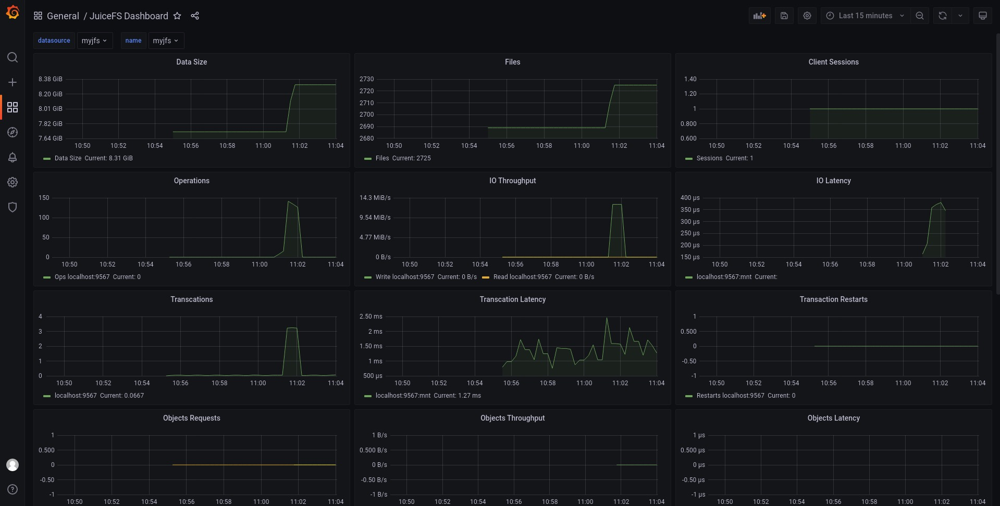

# 监控与数据可视化

作为承载海量数据存储的分布式文件系统，用户通常需要直观地了解整个系统的容量、文件数量、CPU 负载、磁盘 IO、缓存等指标的变化。JuiceFS 通过 Prometheus 兼容的 API 对外提供实时的状态数据，只需将其添加到用户自建的 Prometheus Server 建立时序数据，然后通过 Grafana 等工具即可轻松实现 JucieFS 文件系统的可视化监控。

## 快速上手

这里假设你搭建的 Prometheus Server、Grafana 与 JuiceFS 客户端都运行在相同的主机上。其中：

- **Prometheus Server**：用于收集并保存各种指标的时序数据，安装方法请参考[官方文档](https://prometheus.io/docs/introduction/first_steps/)。
- **Grafana**：用于从 Prometheus 读取并可视化展现时序数据，安装方法请参考[官方文档](https://grafana.com/docs/grafana/latest/installation/)。

### Ⅰ. 获得实时数据

JuiceFS 通过 [Prometheus](https://prometheus.io) 类型的 API 对外提供数据。文件系统挂载后，默认可以通过 `http://localhost:9567/metrics` 地址获得客户端输出的实时监控数据。


### Ⅱ. 添加 API 到 Prometheus Server

编辑 Prometheus 的[配置文件](https://prometheus.io/docs/prometheus/latest/configuration/configuration)，添加一个新 job 并指向 JuiceFS 的 API 地址，例如：

```yaml {20-22}
global:
  scrape_interval: 15s
  evaluation_interval: 15s

alerting:
  alertmanagers:
    - static_configs:
        - targets:
          # - alertmanager:9093

rule_files:
  # - "first_rules.yml"
  # - "second_rules.yml"

scrape_configs:
  - job_name: "prometheus"
    static_configs:
      - targets: ["localhost:9090"]

  - job_name: "juicefs"
    static_configs:
      - targets: ["localhost:9567"]
```

假设配置文件名为 `prometheus.yml`，加载该配置启动服务：

```shell
./prometheus --config.file=prometheus.yml
```

访问 `http://localhost:9090` 即可看到 Prometheus 的界面。

### Ⅲ. 通过 Grafana 展现 Prometheus 的数据

如下图所示，新建 Data Source：

- **Name**: 为了便于识别，可以填写文件系统的名称。
- **URL**: Prometheus 的数据接口，默认为 `http://localhost:9090`


然后，使用 [`grafana_template.json`](https://github.com/juicedata/juicefs/blob/main/docs/en/grafana_template.json) 创建一个仪表盘。进入新建的仪表盘即可看到文件系统的可视化图表了：



## 收集监控指标

根据部署 JuiceFS 的方式不同可以有不同的收集监控指标的方法，下面分别介绍。

### 挂载点

当通过 [`juicefs mount`](../reference/command_reference.md#juicefs-mount) 命令挂载 JuiceFS 文件系统后，可以通过 `http://localhost:9567/metrics` 这个地址收集监控指标，你也可以通过 `--metrics` 选项自定义。如：

```shell
juicefs mount --metrics localhost:9567 ...
```

你可以使用命令行工具查看这些监控指标：

```shell
curl http://localhost:9567/metrics
```

除此之外，每个 JuiceFS 文件系统的根目录还有一个叫做 `.stats` 的隐藏文件，通过这个文件也可以查看监控指标。例如（这里假设挂载点的路径是 `/jfs`）：

```shell
cat /jfs/.stats
```

### Kubernetes

[JuiceFS CSI 驱动](../deployment/how_to_use_on_kubernetes.md)默认会在 mount pod 的 `9567` 端口提供监控指标，也可以通过在 `mountOptions` 中添加 `metrics` 选项自定义（关于如何修改 `mountOptions` 请参考 [CSI 驱动文档](https://juicefs.com/docs/zh/csi/examples/mount-options)），如：

```yaml
apiVersion: v1
kind: PersistentVolume
metadata:
  name: juicefs-pv
  labels:
    juicefs-name: ten-pb-fs
spec:
  ...
  mountOptions:
    - metrics=0.0.0.0:9567
```

新增一个抓取任务到 `prometheus.yml` 来收集监控指标：

```yaml
scrape_configs:
  - job_name: 'juicefs'
    kubernetes_sd_configs:
    - role: pod
    relabel_configs:
    - source_labels: [__meta_kubernetes_pod_label_app_kubernetes_io_name]
      action: keep
      regex: juicefs-mount
    - source_labels: [__address__]
      action: replace
      regex: ([^:]+)(:\d+)?
      replacement: $1:9567
      target_label: __address__
    - source_labels: [__meta_kubernetes_pod_node_name]
      target_label: node
      action: replace
```

这里假设 Prometheus 服务运行在 Kubernetes 集群中，如果你的 Prometheus 服务运行在 Kubernetes 集群之外，请确保 Prometheus 服务可以访问 Kubernetes 节点，请参考[这个 issue](https://github.com/prometheus/prometheus/issues/4633) 添加 `api_server` 和 `tls_config` 配置到以上文件：

```yaml
scrape_configs:
  - job_name: 'juicefs'
    kubernetes_sd_configs:
    - api_server: <Kubernetes API Server>
      role: pod
      tls_config:
        ca_file: <...>
        cert_file: <...>
        key_file: <...>
        insecure_skip_verify: false
    relabel_configs:
    ...
```

### S3 网关

:::note 注意
该特性需要运行 0.17.1 及以上版本 JuiceFS 客户端
:::

[JuiceFS S3 网关](../deployment/s3_gateway.md)默认会在 `http://localhost:9567/metrics` 这个地址提供监控指标，你也可以通过 `--metrics` 选项自定义。如：

```shell
juicefs gateway --metrics localhost:9567 ...
```

如果你是在 Kubernetes 中部署 JuiceFS S3 网关，可以参考 [Kubernetes](#kubernetes) 小节的 Prometheus 配置来收集监控指标（区别主要在于 `__meta_kubernetes_pod_label_app_kubernetes_io_name` 这个标签的正则表达式），例如：

```yaml
scrape_configs:
  - job_name: 'juicefs-s3-gateway'
    kubernetes_sd_configs:
      - role: pod
    relabel_configs:
      - source_labels: [__meta_kubernetes_pod_label_app_kubernetes_io_name]
        action: keep
        regex: juicefs-s3-gateway
      - source_labels: [__address__]
        action: replace
        regex: ([^:]+)(:\d+)?
        replacement: $1:9567
        target_label: __address__
      - source_labels: [__meta_kubernetes_pod_node_name]
        target_label: node
        action: replace
```

#### 通过 Prometheus Operator 收集

[Prometheus Operator](https://github.com/prometheus-operator/prometheus-operator) 让用户在 Kubernetes 环境中能够快速部署和管理 Prometheus，借助 Prometheus Operator 提供的 `ServiceMonitor` CRD 可以自动生成抓取配置。例如（假设 JuiceFS S3 网关的 `Service` 部署在 `kube-system` 名字空间）：

```yaml
apiVersion: monitoring.coreos.com/v1
kind: ServiceMonitor
metadata:
  name: juicefs-s3-gateway
spec:
  namespaceSelector:
    matchNames:
      - kube-system
  selector:
    matchLabels:
      app.kubernetes.io/name: juicefs-s3-gateway
  endpoints:
    - port: metrics
```

有关 Prometheus Operator 的更多信息，请查看[官方文档](https://github.com/prometheus-operator/prometheus-operator/blob/main/Documentation/user-guides/getting-started.md)。

### Hadoop

[JuiceFS Hadoop Java SDK](../deployment/hadoop_java_sdk.md) 支持把监控指标上报到 [Pushgateway](https://github.com/prometheus/pushgateway) 或者 [Graphite](https://graphiteapp.org)。

#### Pushgateway

启用指标上报到 Pushgateway：

```xml
<property>
  <name>juicefs.push-gateway</name>
  <value>host:port</value>
</property>
```

同时可以通过 `juicefs.push-interval` 配置修改上报指标的频率，默认为 10 秒上报一次。

:::info 说明
根据 [Pushgateway 官方文档](https://github.com/prometheus/pushgateway/blob/master/README.md#configure-the-pushgateway-as-a-target-to-scrape)的建议，Prometheus 的[抓取配置](https://prometheus.io/docs/prometheus/latest/configuration/configuration/#scrape_config)中需要设置 `honor_labels: true`。

需要特别注意，Prometheus 从 Pushgateway 抓取的指标的时间戳不是 JuiceFS Hadoop Java SDK 上报时的时间，而是抓取时的时间，具体请参考 [Pushgateway 官方文档](https://github.com/prometheus/pushgateway/blob/master/README.md#about-timestamps)。

默认情况下 Pushgateway 只会在内存中保存指标，如果需要持久化到磁盘上，可以通过 `--persistence.file` 选项指定保存的文件路径以及 `--persistence.interval` 选项指定保存到文件的频率（默认 5 分钟保存一次）。
:::

:::note 注意
每一个使用 JuiceFS Hadoop Java SDK 的进程会有唯一的指标，而 Pushgateway 会一直记住所有收集到的指标，导致指标数持续积累占用过多内存，也会使得 Prometheus 抓取指标时变慢，建议定期清理 Pushgateway 上的指标。

定期使用下面的命令清理 Pushgateway 的指标数据，清空指标不影响运行中的 JuiceFS Hadoop Java SDK 持续上报数据。**注意 Pushgateway 启动时必须指定 `--web.enable-admin-api` 选项，同时以下命令会清空 Pushgateway 中的所有监控指标。**

```bash
curl -X PUT http://host:9091/api/v1/admin/wipe
```
:::

有关 Pushgateway 的更多信息，请查看[官方文档](https://github.com/prometheus/pushgateway/blob/master/README.md)。

#### Graphite

启用指标上报到 Graphite：

```xml
<property>
  <name>juicefs.push-graphite</name>
  <value>host:port</value>
</property>
```

同时可以通过 `juicefs.push-interval` 配置修改上报指标的频率，默认为 10 秒上报一次。

JuiceFS Hadoop Java SDK 支持的所有配置参数请参考[文档](../deployment/hadoop_java_sdk.md#客户端配置参数)。

### 使用 Consul 作为注册中心

:::note 注意
该特性需要运行 1.0.0 及以上版本 JuiceFS 客户端
:::

JuiceFS 支持使用 Consul 作为监控指标 API 的注册中心，默认的 Consul 地址是 `127.0.0.1:8500`，你也可以通过 `--consul` 选项自定义。如：

```shell
juicefs mount --consul 1.2.3.4:8500 ...
```

当配置了 Consul 地址以后，`--metrics` 选项不再需要配置，JuiceFS 将会根据自身网络与端口情况自动配置监控指标 URL。如果同时设置了 `--metrics`，则会优先尝试监听配置的 URL。

注册到 Consul 上的每个实例，其 `serviceName` 都为 `juicefs`，`serviceId` 的格式为 `<IP>:<mount-point>`，例如：`127.0.0.1:/tmp/jfs`。

每个 instance 的 meta 都包含了 `hostname` 与 `mountpoint` 两个维度，其中 `mountpoint` 为 `s3gateway` 代表该实例为 S3 网关。

## 可视化监控指标

### Grafana 仪表盘模板

JuiceFS 提供一些 Grafana 的仪表盘模板，将模板导入以后就可以展示收集上来的监控指标。目前提供的仪表盘模板有：

| 模板名称                                                                                                        | 说明                                                   |
| ----                                                                                                            | ----                                                   |
| [`grafana_template.json`](https://github.com/juicedata/juicefs/blob/main/docs/en/grafana_template.json)         | 用于展示自挂载点、S3 网关（非 Kubernetes 部署）及 Hadoop Java SDK 收集的指标 |
| [`grafana_template_k8s.json`](https://github.com/juicedata/juicefs/blob/main/docs/en/grafana_template_k8s.json) | 用于展示自 Kubernetes CSI 驱动、S3 网关（Kubernetes 部署）收集的指标               |

Grafana 仪表盘示例效果如下图：


## 监控指标索引

请参考[「JuiceFS 监控指标」](../reference/p8s_metrics.md)文档
