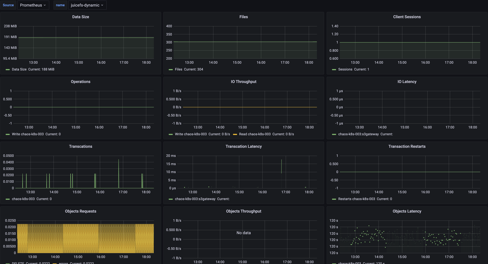
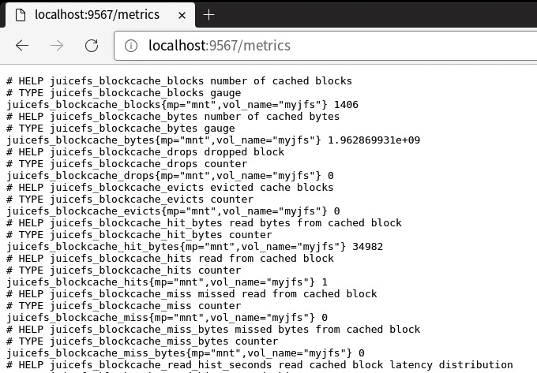
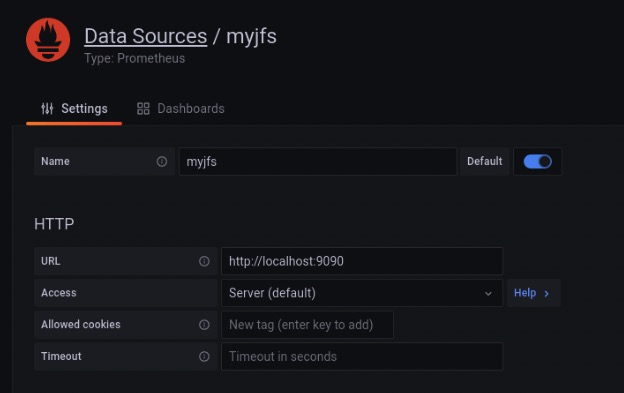

JuiceFS 提供了丰富的监控指标，本文介绍如何收集这些指标，并通过 Prometheus 和 Grafana 实现类似下图的可视化监控系统。



搭建流程大致如下：

1. 配置 Prometheus 抓取 JuiceFS 监控指标
2. 让 Grafana 读取 Prometheus 中的监控数据
3. 用 JuiceFS 官方的 Grafana 仪表盘模板展现监控指标

:::tip 提示
本文使用开源版的 Grafana 和 Prometheus 作为例子，如果你想使用 Grafana Cloud 来构建可视化监控系统，可以参考这篇文章 [「如何使用 Grafana 监控文件系统状态」](https://juicefs.com/zh-cn/blog/usage-tips/use-grafana-monitor-file-system-status)。
:::

## 1. 配置 Prometheus 抓取 JuiceFS 监控指标 {#add-scrape-config}

JuiceFS 挂载后，默认会通过 `http://localhost:9567/metrics` 地址实时输出 Prometheus 格式的指标数据。为了查看各项指标在一个时间范围内的状态变化，需要搭建 Prometheus 并配置定时抓取和保存这些指标数据。



不同挂载或访问方式（如 FUSE 挂载、CSI 驱动、S3 网关、Hadoop SDK 等）收集指标数据的方式略有区别，详见[「收集监控指标」](#collect-metrics)。

这里以最常见的 FUSE 挂载方式为例介绍，如果还没安装 Prometheus，可以参考[官方文档](https://prometheus.io/docs/prometheus/latest/installation)。

编辑 [`prometheus.yml`](https://prometheus.io/docs/prometheus/latest/configuration/configuration) 配置文件，在抓取配置部分（`scrape_configs`）添加新的任务，定义 JuiceFS 客户端输出监控指标的地址：

```yaml {20-22}
global:
  scrape_interval: 15s
  evaluation_interval: 15s

alerting:
  alertmanagers:
    - static_configs:
        - targets:
          # - alertmanager:9093

rule_files:
  # - "first_rules.yml"
  # - "second_rules.yml"

scrape_configs:
  - job_name: "prometheus"
    static_configs:
      - targets: ["localhost:9090"]

  - job_name: "juicefs"
    static_configs:
      - targets: ["localhost:9567"]
```

启动 Prometheus 服务：

```shell
./prometheus --config.file=prometheus.yml
```

访问 `http://localhost:9090` 即可看到 Prometheus 的界面。

## 2. 让 Grafana 读取 Prometheus 中的监控数据 {#grafana}

Prometheus 开始抓取 JuiceFS 的监控指标后，接下来要配置 Grafana 读取 Prometheus 中的数据。

如果还没安装 Grafana，可以参考[官方文档](https://grafana.com/docs/grafana/latest/installation)。

在 Grafana 中新建 Prometheus 类型的数据源：

- **Name**：为了便于识别，可以填写文件系统的名称。
- **URL**：Prometheus 的数据接口，默认为 `http://localhost:9090`。



## 3. 用 JuiceFS 官方的 Grafana 仪表盘模板展现监控指标 {#grafana-dashboard}

在 Grafana Dashboard 仓库中可以找到 JuiceFS 官方维护的仪表盘模板，可以直接在 Grafana 中通过 `https://grafana.com/grafana/dashboards/20794/` 链接导入，也可以通过 ID `20794` 导入。

Grafana 仪表盘如下图：


## 收集监控指标 {#collect-metrics}

根据部署 JuiceFS 方式的不同可以有不同的收集监控指标的方法，下面分别介绍。

### FUSE 挂载 {#mount-point}

当通过 [`juicefs mount`](../reference/command_reference.mdx#mount) 命令挂载 JuiceFS 文件系统后，可以通过 `http://localhost:9567/metrics` 这个地址收集监控指标，你也可以通过 `--metrics` 选项自定义。如：

```shell
juicefs mount --metrics localhost:9567 ...
```

你可以使用命令行工具查看这些监控指标：

```shell
curl http://localhost:9567/metrics
```

除此之外，每个 JuiceFS 文件系统的根目录还有一个叫做 `.stats` 的隐藏文件，通过这个文件也可以查看监控指标。例如（这里假设挂载点的路径是 `/jfs`）：

```shell
cat /jfs/.stats
```

:::tip 提示
如果想要实时查看监控指标，可以使用 [`juicefs stats`](../administration/fault_diagnosis_and_analysis.md#stats) 命令。
:::

### Kubernetes {#kubernetes}

参考 [CSI 驱动文档](https://juicefs.com/docs/zh/csi/administration/going-production#monitoring)。

### S3 网关 {#s3-gateway}

:::note 注意
该特性需要运行 0.17.1 及以上版本 JuiceFS 客户端
:::

[JuiceFS S3 网关](../guide/gateway.md)默认会在 `http://localhost:9567/metrics` 这个地址提供监控指标，你也可以通过 `--metrics` 选项自定义。如：

```shell
juicefs gateway --metrics localhost:9567 ...
```

如果你是[在 Kubernetes 中部署](../guide/gateway.md#deploy-in-kubernetes) JuiceFS S3 网关，可以参考 [Kubernetes](#kubernetes) 小节的 Prometheus 配置来收集监控指标（区别主要在于 `__meta_kubernetes_pod_label_app_kubernetes_io_name` 这个标签的正则表达式），例如：

```yaml {6-8}
scrape_configs:
  - job_name: 'juicefs-s3-gateway'
    kubernetes_sd_configs:
      - role: pod
    relabel_configs:
      - source_labels: [__meta_kubernetes_pod_label_app_kubernetes_io_name]
        action: keep
        regex: juicefs-s3-gateway
      - source_labels: [__address__]
        action: replace
        regex: ([^:]+)(:\d+)?
        replacement: $1:9567
        target_label: __address__
      - source_labels: [__meta_kubernetes_pod_node_name]
        target_label: node
        action: replace
```

#### 通过 Prometheus Operator 收集 {#prometheus-operator}

[Prometheus Operator](https://github.com/prometheus-operator/prometheus-operator) 让用户在 Kubernetes 环境中能够快速部署和管理 Prometheus，借助 Prometheus Operator 提供的 `ServiceMonitor` CRD 可以自动生成抓取配置。例如（假设 JuiceFS S3 网关的 `Service` 部署在 `kube-system` 名字空间）：

```yaml
apiVersion: monitoring.coreos.com/v1
kind: ServiceMonitor
metadata:
  name: juicefs-s3-gateway
spec:
  namespaceSelector:
    matchNames:
      - kube-system
  selector:
    matchLabels:
      app.kubernetes.io/name: juicefs-s3-gateway
  endpoints:
    - port: metrics
```

有关 Prometheus Operator 的更多信息，请查看[官方文档](https://prometheus-operator.dev/docs/user-guides/getting-started)。

### Hadoop Java SDK {#hadoop}

[JuiceFS Hadoop Java SDK](../deployment/hadoop_java_sdk.md) 支持把监控指标上报到 [Pushgateway](https://github.com/prometheus/pushgateway) 或者 [Graphite](https://graphiteapp.org)。

#### Pushgateway

启用指标上报到 Pushgateway：

```xml
<property>
  <name>juicefs.push-gateway</name>
  <value>host:port</value>
</property>
```

同时可以通过 `juicefs.push-interval` 配置修改上报指标的频率，默认为 10 秒上报一次。

:::info 说明
根据 [Pushgateway 官方文档](https://github.com/prometheus/pushgateway/blob/master/README.md#configure-the-pushgateway-as-a-target-to-scrape)的建议，Prometheus 的[抓取配置](https://prometheus.io/docs/prometheus/latest/configuration/configuration/#scrape_config)中需要设置 `honor_labels: true`。

需要特别注意，Prometheus 从 Pushgateway 抓取的指标的时间戳不是 JuiceFS Hadoop Java SDK 上报时的时间，而是抓取时的时间，具体请参考 [Pushgateway 官方文档](https://github.com/prometheus/pushgateway/blob/master/README.md#about-timestamps)。

默认情况下 Pushgateway 只会在内存中保存指标，如果需要持久化到磁盘上，可以通过 `--persistence.file` 选项指定保存的文件路径以及 `--persistence.interval` 选项指定保存到文件的频率（默认 5 分钟保存一次）。
:::

:::note 注意
每一个使用 JuiceFS Hadoop Java SDK 的进程会有唯一的指标，而 Pushgateway 会一直记住所有收集到的指标，导致指标数持续积累占用过多内存，也会使得 Prometheus 抓取指标时变慢，建议定期清理 Pushgateway 上的指标。

定期使用下面的命令清理 Pushgateway 的指标数据，清空指标不影响运行中的 JuiceFS Hadoop Java SDK 持续上报数据。**注意 Pushgateway 启动时必须指定 `--web.enable-admin-api` 选项，同时以下命令会清空 Pushgateway 中的所有监控指标。**

```bash
curl -X PUT http://host:9091/api/v1/admin/wipe
```

:::

有关 Pushgateway 的更多信息，请查看[官方文档](https://github.com/prometheus/pushgateway/blob/master/README.md)。

#### Graphite

启用指标上报到 Graphite：

```xml
<property>
  <name>juicefs.push-graphite</name>
  <value>host:port</value>
</property>
```

同时可以通过 `juicefs.push-interval` 配置修改上报指标的频率，默认为 10 秒上报一次。

JuiceFS Hadoop Java SDK 支持的所有配置参数请参考[文档](../deployment/hadoop_java_sdk.md#客户端配置参数)。

### 使用 Consul 作为注册中心 {#use-consul}

:::note 注意
该特性需要运行 1.0.0 及以上版本 JuiceFS 客户端
:::

JuiceFS 支持使用 Consul 作为监控指标 API 的注册中心，默认的 Consul 地址是 `127.0.0.1:8500`，你也可以通过 `--consul` 选项自定义。如：

```shell
juicefs mount --consul 1.2.3.4:8500 ...
```

当配置了 Consul 地址以后，`--metrics` 选项不再需要配置，JuiceFS 将会根据自身网络与端口情况自动配置监控指标 URL。如果同时设置了 `--metrics`，则会优先尝试监听配置的 URL。

注册到 Consul 上的每个服务，其[服务名](https://developer.hashicorp.com/consul/docs/services/configuration/services-configuration-reference#name)都为 `juicefs`，[服务 ID](https://developer.hashicorp.com/consul/docs/services/configuration/services-configuration-reference#id) 的格式为 `<IP>:<mount-point>`，例如：`127.0.0.1:/tmp/jfs`。

每个服务的 [`meta`](https://developer.hashicorp.com/consul/docs/services/configuration/services-configuration-reference#meta) 都包含 `hostname` 与 `mountpoint` 两个 key，对应的值分别表示挂载点所在的主机名和挂载点路径。特别地，S3 网关的 `mountpoint` 值总是为 `s3gateway`。

成功注册到 Consul 上以后，需要在 `prometheus.yml` 中新增 [`consul_sd_config`](https://prometheus.io/docs/prometheus/latest/configuration/configuration/#consul_sd_config) 配置，在 `services` 中填写 `juicefs`。

## 监控指标索引 {#metrics-reference}

参考[「JuiceFS 监控指标」](../reference/p8s_metrics.md)。
