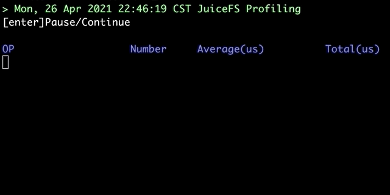

## 介绍

JuiceFS 文件系统挂载以后，在文件系统的根目录中有一个名为 [`.accesslog`](../administration/fault_diagnosis_and_analysis.md#access-log) 的特殊虚拟文件，用于跟踪其客户端中发生的每个操作。在负载压力较大的情况下，此文件每秒可能会生成数千个日志记录，很难确定特定时间的实际情况。因此，我们制作了一个名为 [`juicefs profile`](../reference/command_reference.md#juicefs-profile) 的简单工具，可以显示最近完成操作的概述。目的是汇总过去某个时间的所有日志并定期显示统计信息，例如：



## 诊断模式

目前有两种诊断模式：`实时模式` 和 `回放模式`。

### 实时模式

通过执行以下命令，您可以观察挂载点上的实时操作：

```bash
juicefs profile MOUNTPOINT
```

> **提示**：输出结果按总时间降序排列。

### 回放模式

在现有的日志文件上运行 `profile` 命令将启用「回放模式」：

```bash
juicefs profile LOGFILE
```

在调试或分析性能问题时，更实用的做法通常是先记录访问日志，然后重放（多次）。例如：

```bash
cat /jfs/.accesslog > /tmp/jfs-oplog
```

later

```bash
juicefs profile /tmp/jfs-oplog
```

> **提示 1**：可以随时按键盘上的 <kbd>Enter/Return</kbd> 暂停/继续回放。
>
> **提示 2**：如果设置 `--interval 0`，将立即回放完整个日志文件并显示整体统计结果。

## 过滤

有时我们只对某个用户或进程感兴趣，可以通过指定其 ID 来过滤掉其他用户或进程。例如：

```bash
juicefs profile /tmp/jfs-oplog --uid 12345
```

更多信息，请运行 `juicefs profile -h` 命令查看。
