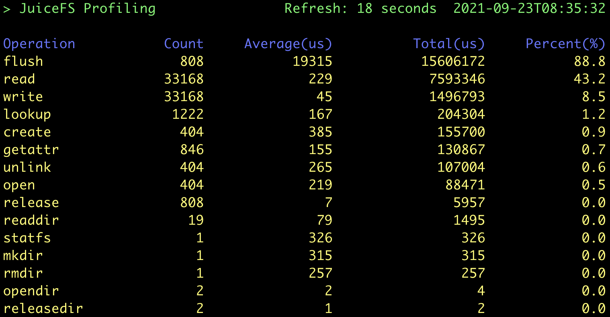

在进行性能测试之前，最好写下该使用场景的大致描述，包括：

1. 对接的应用是什么？比如 Apache Spark、PyTorch 或者是自己写的程序等
2. 应用运行的资源配置，包括 CPU、内存、网络，以及节点规模
3. 预计的数据规模，包括文件数量和容量
4. 文件的大小和访问模式（大文件或者小文件，顺序读写或者随机读写）
5. 对性能的要求，比如每秒要写入或者读取的数据量、访问的 QPS 或者操作的延迟等

以上这些内容越清晰、越详细，就越容易制定合适的测试计划，以及需要关注的性能指标，来判断应用对存储系统各方面的需求，包括 JuiceFS 元数据配置、网络带宽要求、配置参数等。当然，在一开始就清晰地写出上面所有的内容并不容易，有些内容可以在测试过程中逐渐明确，**但是在一次完整的测试结束时，以上使用场景描述以及相对应的测试方法、测试数据、测试结果都应该是完整的**。

如果上面的内容还不明确，不要紧，JuiceFS 内置的测试工具可以一行命令得到单机基准性能的核心指标。同时本文还会介绍两个 JuiceFS 内置的性能分析工具，在做更复杂的测试时，这两个工具能帮你简单清晰的分析出 JuiceFS 性能表现背后的原因。

## 性能测试快速上手

以下示例介绍 JuiceFS 内置的 bench 工具的基本用法。

### 环境配置

- 测试主机：Amazon EC2 c5.xlarge 一台
- 操作系统：Ubuntu 20.04.1 LTS (Kernel `5.4.0-1029-aws`)
- 元数据引擎：Redis 6.2.3, 存储（dir）配置在系统盘
- 对象存储：Amazon S3
- JuiceFS version：0.17-dev (2021-09-23 2ec2badf)

### 注意事项

JuiceFS v1.0+ 默认启用了回收站，基准测试会在文件系统中创建和删除临时文件，这些文件最终会被转存到回收站 `.trash` 占用存储空间，为了避免这种情况，可以在基准测试之前关闭回收站 `juicefs config META-URL --trash-days 0`，详情参考[回收站](../security/trash.md)。

### `juicefs bench`

[`juicefs bench`](../reference/command_reference.mdx#bench) 命令可以帮助你快速完成单机性能测试，通过测试结果判断环境配置和性能表现是否正常。假设你已经把 JuiceFS 挂载到了测试机器的 `/mnt/jfs` 位置（如果在 JuiceFS 初始化、挂载方面需要帮助，请参考[创建文件系统](../getting-started/standalone.md#juicefs-format)），执行以下命令即可（推荐 `-p` 参数设置为测试机器的 CPU 核数）：

```bash
juicefs bench /mnt/jfs -p 4
```

测试结果以表格形式呈现，其中 `ITEM` 代表测试的项目，`VALUE` 代表每秒的处理能力（吞吐量、文件数、操作数等），`COST` 代表每个文件或操作所需的时间。

各项性能指标会显示为绿色、黄色或红色区分性能表现。若您的结果中有红色指标，请先检查相关配置，需要帮助可以在 [GitHub Discussions](https://github.com/juicedata/juicefs/discussions) 详细描述你的问题。


`juicefs bench` 基准性能测试的具体流程如下（它的实现逻辑非常简单，有兴趣了解细节的可以直接看[源码](https://github.com/juicedata/juicefs/blob/main/cmd/bench.go))：

1. N 并发各写 1 个 1 GiB 的大文件，IO 大小为 1 MiB
2. N 并发各读 1 个之前写的 1 GiB 的大文件，IO 大小为 1 MiB
3. N 并发各写 100 个 128 KiB 的小文件，IO 大小为 128 KiB
4. N 并发各读 100 个之前写的 128 KiB 的小文件，IO 大小为 128 KiB
5. N 并发各 stat 100 个之前写的 128 KiB 的小文件
6. 清理测试用的临时目录

并发数 N 的值即由 `bench` 命令中的 `-p` 参数指定。

在这用 AWS 提供的几种常用存储类型做个性能比较：

- EFS 1TiB 容量时，读 150MiB/s，写 50MiB/s，价格是 $0.08/GB-month
- EBS st1 是吞吐优化型 HDD，最大吞吐 500MiB/s，最大 IOPS（1MiB I/O）500，最大容量 16TiB，价格是 $0.045/GB-month
- EBS gp2 是通用型 SSD，最大吞吐 250MiB/s，最大 IOPS（16KiB I/O）16000，最大容量 16TiB，价格是 $0.10/GB-month

不难看出，在上面的测试中，JuiceFS 的顺序读写能力明显优于 AWS EFS，吞吐能力也超过了常用的 EBS。但是写小文件的速度不算快，因为每写一个文件都需要将数据持久化到 S3 中，调用对象存储 API 通常有 10~30ms 的固定开销。

:::note 注
Amazon EFS 的性能与容量线性相关（[参考官方文档](https://docs.aws.amazon.com/efs/latest/ug/performance.html#performancemodes)），这样就不适合用在小数据量高吞吐的场景中。
:::

:::note 注
价格参考 [AWS 美东区（US East, Ohio Region）](https://aws.amazon.com/ebs/pricing/?nc1=h_ls)，不同 Region 的价格有细微差异。
:::

:::note 注
以上数据来自 [AWS 官方文档](https://docs.aws.amazon.com/AWSEC2/latest/UserGuide/ebs-volume-types.html)，性能指标为最大值，EBS 的实际性能与卷容量和挂载 EC2 实例类型相关，总的来说是越大容量，搭配约高配置的 EC2，得到的 EBS 性能越好，但不超过上面提到的最大值。
:::

### `juicefs objbench`

[`juicefs objbench`](../reference/command_reference.mdx#objbench) 命令可以运行一些关于对象存储的测试，用以评估其作为 JuiceFS 的后端存储时的运行情况。以测试 Amazon S3 为例：

```bash
juicefs objbench \
    --storage s3 \
    --access-key myAccessKey \
    --secret-key mySecretKey \
    https://mybucket.s3.us-east-2.amazonaws.com
```

测试结果如下图所示：


其中，结果显示为 `not support` 代表所测试的对象存储不支持该项功能。

#### 测试流程

首先会对对象存储的接口进行功能测试，以下为测试用例：

1. 创建 bucket
2. 上传对象
3. 下载对象
4. 下载不存在的对象
5. 获取对象部分内容
6. 获取对象元信息
7. 删除对象
8. 删除不存在对象
9. 列举对象
10. 上传大对象
11. 上传空对象
12. 分块上传
13. 更改文件拥有者与所属组（需要 `root` 权限运行）
14. 更改文件权限
15. 更改文件的 mtime（最后修改时间）

然后进行性能测试：

1. 将 `--small-objects` 个 `--small-object-size` 大小的对象，以 `--threads` 个并发上传
2. 下载步骤 1 中上传的对象并检查内容
3. 将 `--big-object-size` 大小的对象按照 `--block-size` 的大小拆分后以 `--threads` 并发度上传
4. 下载步骤 3 中上传的对象并检查内容，然后清理步骤 3 上传到对象存储的所有对象
5. 以 `--threads` 并发度列举对象存储中所有的对象 100 次
6. 以 `--threads` 并发度获取步骤 1 中上传的所有对象的元信息
7. 以 `--threads` 并发度更改步骤 1 中上传的所有对象的 mtime（最后修改时间）
8. 以 `--threads` 并发度更改步骤 1 中上传的所有对象的权限
9. 以 `--threads` 并发度更改步骤 1 中上传的所有对象的拥有者与所属组（需要 `root` 权限运行）
10. 以 `--threads` 并发度删除步骤 1 中上传的所有对象

最后清理测试的文件。

## 性能观测和分析工具

接下来介绍两个性能观测和分析工具，是 JuiceFS 测试、使用、调优过程中必备的利器。

### `juicefs stats`

[`juicefs stats`](../administration/fault_diagnosis_and_analysis.md#stats) 命令是一个实时统计 JuiceFS 性能指标的工具，类似 Linux 系统的 `dstat` 命令，可以实时显示 JuiceFS 客户端的指标变化。执行 `juicefs bench` 时，在另一个会话中执行以下命令：

```bash
juicefs stats /mnt/jfs --verbosity 1
```

结果如下，可以将其与上述基准测试流程对照来看，更易理解：


其中各项指标具体含义参考 [`juicefs stats`](../administration/fault_diagnosis_and_analysis.md#stats)。

### `juicefs profile`

[`juicefs profile`](../administration/fault_diagnosis_and_analysis.md#profile) 命令可以基于[访问日志](../administration/fault_diagnosis_and_analysis.md#access-log)进行性能数据统计，来直观了解 JuiceFS 的运行情况。执行 `juicefs bench` 时，在另一个会话中执行以下命令：

```bash
cat /mnt/jfs/.accesslog > juicefs.accesslog
```

其中 `.accesslog` 是一个虚拟文件，它平时不会产生任何数据，只有在读取（如执行 `cat`）时才会有 JuiceFS 的访问日志输出。结束后使用 <kbd>Ctrl</kbd> + <kbd>C</kbd> 结束 `cat` 命令，并运行：

```bash
juicefs profile juicefs.accesslog --interval 0
```

其中 `--interval` 参数设置访问日志的采样间隔，设为 0 时用于快速重放一个指定的日志文件，生成统计信息，如下图所示：



从之前基准测试流程描述可知，本次测试过程一共创建了 `(1 + 100) * 4 = 404` 个文件，每个文件都经历了「创建 → 写入 → 关闭 → 打开 → 读取 → 关闭 → 删除」的过程，因此一共有：

- 404 次 `create`，`open` 和 `unlink` 请求
- 808 次 `flush` 请求：每当文件关闭时会自动调用一次 `flush`
- 33168 次 `write`/`read` 请求：每个大文件写入了 1024 个 1 MiB IO，而在 FUSE 层请求的默认最大值为 128 KiB，也就是说每个应用 IO 会被拆分成 8 个 FUSE 请求，因此一共有 `(1024 * 8 + 100) * 4 = 33168` 个请求。读 IO 与之类似，计数也相同。

以上这些值均能与 `profile` 的结果完全对应上。另外，结果中还显示 `write` 的平均时延非常小（45 微秒），而主要耗时点在 `flush`。这是因为 JuiceFS 的 `write` 默认先写入内存缓冲区，在文件关闭时再调用 `flush` 上传数据到对象存储，与预期吻合。

## 其他测试工具配置示例

:::tip 提示
JuiceFS v1.0+ 默认启用了回收站，基准测试会在文件系统中创建和删除临时文件，这些文件最终会被转存到回收站 `.trash` 占用存储空间，为了避免这种情况，可以在基准测试之前关闭回收站 `juicefs config META-URL --trash-days 0`，详情参考[回收站](../security/trash.md)。
:::

### Fio 单机性能测试

Fio 是业界常用的一个性能测试工具，完成 JuiceFS bench 后可以用它来做更复杂的性能测试。

#### 环境配置

与 [JuiceFS Bench](#环境配置) 测试环境一致。

#### 测试任务

执行下面四个 Fio 任务，分别进行顺序写、顺序读、随机写、随机读测试。

顺序写

```shell
fio --name=jfs-test --directory=/mnt/jfs --ioengine=libaio --rw=write --bs=1m --size=1g --numjobs=4 --direct=1 --group_reporting
```

顺序读

```bash
fio --name=jfs-test --directory=/mnt/jfs --ioengine=libaio --rw=read --bs=1m --size=1g --numjobs=4 --direct=1 --group_reporting
```

随机写

```shell
fio --name=jfs-test --directory=/mnt/jfs --ioengine=libaio --rw=randwrite --bs=1m --size=1g --numjobs=4 --direct=1 --group_reporting
```

随机读

```shell
fio --name=jfs-test --directory=/mnt/jfs --ioengine=libaio --rw=randread --bs=1m --size=1g --numjobs=4 --direct=1 --group_reporting
```

参数说明：

- `--name`：用户指定的测试名称，会影响测试文件名
- `--directory`：测试目录
- `--ioengine`：测试时下发 IO 的方式；通常用 libaio 即可
- `--rw`：常用的有 read，write，randread，randwrite，分别代表顺序读写和随机读写
- `--bs`：每次 IO 的大小
- `--size`：每个线程的 IO 总大小；通常就等于测试文件的大小
- `--numjobs`：测试并发线程数；默认每个线程单独跑一个测试文件
- `--direct`：在打开文件时添加 `O_DIRECT` 标记位，不使用系统缓冲，可以使测试结果更稳定准确

结果如下：

```bash
# Sequential
WRITE: bw=703MiB/s (737MB/s), 703MiB/s-703MiB/s (737MB/s-737MB/s), io=4096MiB (4295MB), run=5825-5825msec
READ: bw=817MiB/s (856MB/s), 817MiB/s-817MiB/s (856MB/s-856MB/s), io=4096MiB (4295MB), run=5015-5015msec

# Random
WRITE: bw=285MiB/s (298MB/s), 285MiB/s-285MiB/s (298MB/s-298MB/s), io=4096MiB (4295MB), run=14395-14395msec
READ: bw=93.6MiB/s (98.1MB/s), 93.6MiB/s-93.6MiB/s (98.1MB/s-98.1MB/s), io=4096MiB (4295MB), run=43773-43773msec
```

### Vdbench 多机性能测试

Vdbench 也是业界常见的文件系统评测工具，且很好地支持了多机并发测试。

#### 测试环境

与 [JuiceFS Bench](#环境配置) 测试环境类似，只是多开了两台同配置主机，一共三台。

#### 准备工作

需要在每个节点相同路径下安装 vdbench：

1. [官网](https://www.oracle.com/downloads/server-storage/vdbench-downloads.html)下载 50406 版本
2. 安装 Java：`apt-get install openjdk-8-jre`
3. 测试 vdbench 安装成功：`./vdbench -t`

然后，假设三个节点名称分别为 node0，node1 和 node2，则需在 node0 上创建配置文件，如下（测试大量小文件读写）：

```bash
$ cat jfs-test
hd=default,vdbench=/root/vdbench50406,user=root
hd=h0,system=node0
hd=h1,system=node1
hd=h2,system=node2

fsd=fsd1,anchor=/mnt/jfs/vdbench,depth=1,width=100,files=3000,size=128k,shared=yes

fwd=default,fsd=fsd1,operation=read,xfersize=128k,fileio=random,fileselect=random,threads=4
fwd=fwd1,host=h0
fwd=fwd2,host=h1
fwd=fwd3,host=h2

rd=rd1,fwd=fwd*,fwdrate=max,format=yes,elapsed=300,interval=1
```

参数说明：

- `vdbench=/root/vdbench50406`：指定了 vdbench 工具的安装路径
- `anchor=/mnt/jfs/vdbench`：指定了每个节点上运行测试任务的路径
- `depth=1,width=100,files=3000,size=128k`：定义了测试任务文件树结构，即测试目录下再创建 100 个目录，每个目录内包含 3000 个 128 KiB 大小的文件，一共 30 万个文件
- `operation=read,xfersize=128k,fileio=random,fileselect=random`：定义了实际的测试任务，即随机选择文件下发 128 KiB 大小的读请求

结果如下：

```
FILE_CREATES        Files created:                              300,000        498/sec
READ_OPENS          Files opened for read activity:             188,317        627/sec
```

系统整体创建 128 KiB 文件速度为每秒 498 个，读取文件速度为每秒 627 个。

#### 其他参考示例

以下是一些本地简单评估文件系统性能时可用的配置文件，以供参考；具体测试集规模和并发数可根据实际情况调整。

##### 顺序读写大文件

文件大小均为 1GiB，其中 `fwd1` 是顺序写大文件，`fwd2` 是顺序读大文件。

```bash
$ cat local-big
fsd=fsd1,anchor=/mnt/jfs/local-big,depth=1,width=1,files=4,size=1g,openflags=o_direct

fwd=fwd1,fsd=fsd1,operation=write,xfersize=1m,fileio=sequential,fileselect=sequential,threads=4
fwd=fwd2,fsd=fsd1,operation=read,xfersize=1m,fileio=sequential,fileselect=sequential,threads=4

rd=rd1,fwd=fwd1,fwdrate=max,format=restart,elapsed=120,interval=1
rd=rd2,fwd=fwd2,fwdrate=max,format=restart,elapsed=120,interval=1
```

##### 随机读写小文件

文件大小均为 128KiB，其中 `fwd1` 是随机写小文件，`fwd2` 是随机读小文件，`fwd3` 是混合读写小文件（读写比 = 7:3）。

```bash
$ cat local-small
fsd=fsd1,anchor=/mnt/jfs/local-small,depth=1,width=20,files=2000,size=128k,openflags=o_direct

fwd=fwd1,fsd=fsd1,operation=write,xfersize=128k,fileio=random,fileselect=random,threads=4
fwd=fwd2,fsd=fsd1,operation=read,xfersize=128k,fileio=random,fileselect=random,threads=4
fwd=fwd3,fsd=fsd1,rdpct=70,xfersize=128k,fileio=random,fileselect=random,threads=4

rd=rd1,fwd=fwd1,fwdrate=max,format=restart,elapsed=120,interval=1
rd=rd2,fwd=fwd2,fwdrate=max,format=restart,elapsed=120,interval=1
rd=rd3,fwd=fwd3,fwdrate=max,format=restart,elapsed=120,interval=1
```
