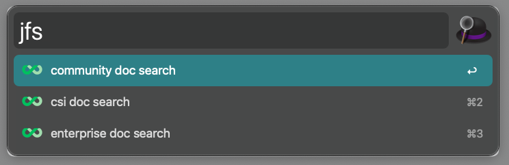
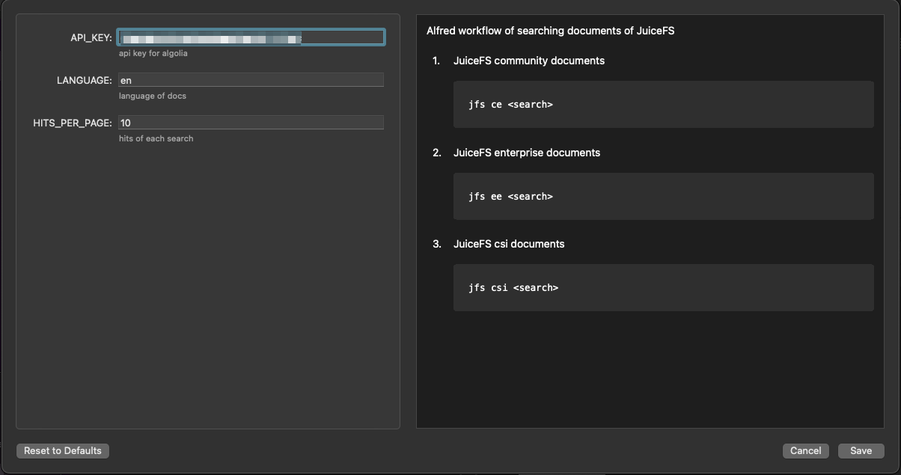

## SDK

- [旷视科技](https://megvii.com) 团队贡献了 [Python SDK](https://github.com/megvii-research/juicefs-python)。

## AI

- [云知声](https://www.unisound.com) 团队参与开发 [Fluid](https://github.com/fluid-cloudnative/fluid) JuiceFSRuntime 缓存引擎，具体请参考[文档](https://github.com/fluid-cloudnative/fluid/blob/master/docs/zh/samples/juicefs_runtime.md) 。
- [PaddlePaddle](https://github.com/paddlepaddle/paddle) 团队已将 JuiceFS 缓存加速特性集成到 [Paddle Operator](https://github.com/PaddleFlow/paddle-operator) 中，具体请参考[文档](https://github.com/PaddleFlow/paddle-operator/blob/sampleset/docs/zh_CN/ext-overview.md)。
- 通过 JuiceFS 可以轻松搭建一个 [Milvus](https://milvus.io) 向量搜索引擎，Milvus 团队已经撰写了官方 [案例](https://zilliz.com/blog/building-a-milvus-cluster-based-on-juicefs) 与 [教程](https://tutorials.milvus.io/en-juicefs/index.html?index=..%2F..index#0)。

## 大数据

- 大数据 OLAP 分析引擎 [Apache Kylin 4.0](http://kylin.apache.org) 可以使用 JuiceFS 在所有公有云上轻松部署存储计算分离架构的集群，请看 [视频分享](https://www.bilibili.com/video/BV1c54y1W72S) 和 [案例文章](https://juicefs.com/zh-cn/blog/optimize-kylin-on-juicefs)。
- [Apache Hudi](https://hudi.apache.org) 自 v0.10.0 版本开始支持 JuiceFS，你可以参考[官方文档](https://hudi.apache.org/docs/jfs_hoodie)了解如何配置 JuiceFS。

## DevOps

- [Terraform Provider for JuiceFS](https://github.com/toowoxx/terraform-provider-juicefs) 由 Toowoxx IT GmbH 贡献，他们是一家来自德国的 IT 服务公司。

## Alfred

JuiceFS 文档站集成了 Alfred，可以快速搜索 JuiceFS 文档。



只需在 Alfred 中输入关键字（默认：jfs）并提供查询即可查看 JuiceFS 文档的即时搜索结果。

### 安装

安装 Alfred 5 的 JuiceFS workflow： [下载最新版本](https://github.com/zwwhdls/juicefs-alfred-workflow/releases/download/v0.1.0/JuiceFS.Search.alfredworkflow)

### 使用

可以搜索 JuiceFS 的所有文档，包括社区、企业和 CSI：

```
# 查询 JuiceFS 社区版文档
jfs ce <search>
# 查询 JuiceFS 企业版文档
jfs ee <search>
# 查询 JuiceFS CSI 文档
jfs csi <search>
```


## Workflow 可配置的变量

- `API_KEY`：JuiceFS 文档使用的 algolia 的 API 密钥，使用默认值就可以。
- `LANGUAGE`：要搜索的 JuiceFS 文档的语言（en/zh），默认为 en。
- `HITS_PER_PAGE`：每次搜索的点击量，默认值为 10。


