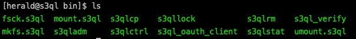

# JuiceFS 对比 S3QL

与 JuiceFS 类似，[S3QL](https://github.com/s3ql/s3ql) 也是一款由对象存储和数据库组合驱动的开源网络文件系统，所有存入的数据会被分块后存储到亚马逊 S3、Backblaze B2、OpenStack Swift 等主流的对象存储中，相应的元数据会存储在数据库中。

## 共同点

- 都是通过 FUSE 模块实现对标准 POSIX 文件系统接口的支持，从而可以将海量的云端存储挂载到本地，像本地存储一样使用。
- 都能提供标准的文件系统功能：硬链接、符号链接、扩展属性、文件权限。
- 都支持数据压缩和加密，但二者采用的算法各有不同。

## 不同点

- S3QL 仅支持 SQLite 一种数据库，而 JuiceFS 除了支持 SQLite 以外还支持 Redis、TiKV、MySQL、PostgreSQL 等数据库。
- S3QL 没有分布式能力，**不支持**多主机同时挂载。JuiceFS 是典型的分布式文件系统，在使用基于网络的数据库时，支持多主机分布式挂载读写。
- S3QL 在一个数据块几秒内未被访问时将其上传到对象存储。文件被关闭甚者 fsync 后其仍仅保证在系统内存中，节点故障时可能丢失数据。JuiceFS 确保了数据的高可靠性，在文件关闭时会将其同步上传到对象存储。
- S3QL 提供数据去重，相同数据只存储一份，可以降低对象存储的用量，但也会加重系统的性能开销。相比之下，JuiceFS 更注重性能，对大规模数据去重代价过高，暂不提供该功能。
- S3QL 提供了元数据远程同步备份功能，存有元数据的 SQLite 数据库会异步备份到对象存储。JuiceFS 以使用 Redis、MySQL 等网络数据库为主，并未直接提供 SQLite 数据库同步备份功能，但 JuiceFS 支持元数据的导入导出，以及各种存储后端的同步功能，用户可以很容易将元数据备份到对象存储，也支持在不同数据库之间迁移。

|                       | **S3QL**           | **JuiceFS**                |
| :-------------------- | :----------------- | :------------------------- |
| 元数据引擎            | SQLite             | Redis、MySQL、SQLite、TiKV |
| 存储引擎              | 对象存储、本地磁盘 | 对象存储、WebDAV、本地磁盘 |
| 操作系统              | Unix-like          | Linux、macOS、Windows      |
| 压缩算法              | LZMA, bzip2, gzip  | lz4, zstd                  |
| 加密算法              | AES-256            | AES-GCM, RSA               |
| POSIX 兼容            | ✓                  | ✓                          |
| 硬链接                | ✓                  | ✓                          |
| 符号链接              | ✓                  | ✓                          |
| 扩展属性              | ✓                  | ✓                          |
| 标准 Unix 权限        | ✓                  | ✓                          |
| 数据分块              | ✓                  | ✓                          |
| 本地缓存              | ✓                  | ✓                          |
| 空间弹性伸缩          | ✓                  | ✓                          |
| 元数据备份            | ✓                  | ✓                          |
| 数据去重              | ✓                  | ✕                          |
| 只读目录              | ✓                  | ✕                          |
| 快照                  | ✓                  | ✕                          |
| 共享挂载              | ✕                  | ✓                          |
| Hadoop SDK            | ✕                  | ✓                          |
| Kubernetes CSI Driver | ✕                  | ✓                          |
| S3 网关               | ✕                  | ✓                          |
| 开发语言              | Python             | Go                         |
| 开源协议              | GPLv3              | AGPLv3                     |
| 开源时间              | 2011               | 2021.1                     |

## 易用性

这部分主要评估两个产品在安装和使用上的的易用程度。

### 安装

在安装过程中，我们使用 Rocky Linux 8.4 操作系统（内核版本 4.18.0-305.12.1.el8_4.x86_64）。

#### S3QL

S3QL 采用 Python 开发，在安装时需要依赖 python-devel 3.7 及以上版本。另外，还需要至少满足以下依赖：fuse3-devel、gcc、pyfuse3、sqlite-devel、cryptography、defusedxml、apsw、dugong。另外，需要特别注意 Python 的包依赖和位置问题。

S3QL 会在系统中安装 12 个二进制程序，每个程序都提供一个独立的功能，如下图。



#### JuiceFS

JuiceFS 客户端采用 Go 语言开发，直接下载预编译的二进制文件即可直接使用。JuiceFS 客户端只有一个二进制程序 `juicefs`，将其拷贝到系统的任何一个可执行路径下即可，比如：`/usr/local/bin`。

### 使用

S3QL 和 JuiceFS 都使用数据库保存元数据，S3QL 仅支持 SQLite 数据库，JuiceFS 支持 Redis、TiKV、MySQL、MariaDB、PostgreSQL 和 SQLite 等数据库。

这里使用本地创建的 Minio 对象存储，使用两款工具分别创建文件系统：

#### S3QL

S3QL 使用 `mkfs.s3ql` 工具创建文件系统：

```shell
$ mkfs.s3ql --plain --backend-options no-ssl -L s3ql s3c://127.0.0.1:9000/s3ql/
```

挂载文件系统使用 `mount.s3ql`：

```shell
$ mount.s3ql --compress none --backend-options no-ssl s3c://127.0.0.1:9000/s3ql/ mnt-s3ql
```

S3QL 在创建和挂载文件系统时都需要通过命令行交互式的提供对象存储 API 的访问密钥。

#### JuiceFS

JuiceFS 使用 `format` 子命令创建文件系统：

```shell
$ juicefs format --storage minio \
    --bucket http://127.0.0.1:9000/myjfs \
    --access-key minioadmin \
    --secret-key minioadmin \
    sqlite3://myjfs.db \
    myjfs
```

挂载文件系统使用 `mount` 子命令：

```shell
$ sudo juicefs mount -d sqlite3://myjfs.db mnt-juicefs
```

JuiceFS 只在创建文件系统时设置对象存储 API 访问密钥，相关信息会写入元数据引擎，之后挂载使用无需重复提供对象存储地址、密钥等信息。

## 对比总结

**S3QL** 采用对象存储 + SQLite 的存储结构，数据分块存储既能提高文件的读写效率，也能降低文件修改时的资源开销。贴心的提供了快照、数据去重、数据保持等高级功能，加之默认的数据压缩和数据加密，让 S3QL 非常适合个人在云存储上用较低的成本、更安全的存储文件。

**JuiceFS** 支持对象存储、HDFS、WebDAV、本地磁盘作为数据存储引擎，支持 Redis、TiKV、MySQL、MariaDB、PostgreSQL、SQLite 等流行的数据作为元数据存储引擎。除了通过 FUSE 提供标准的 POSIX 文件系统接口以外，JuiceFS 还提供 Java API，可以直接替代 HDFS 为 Hadoop 提供存储。同时还提供 [Kubernetes CSI Driver](https://github.com/juicedata/juicefs-csi-driver)，可以作为 Kubernetes 的存储层做数据持久化存储。JucieFS 是为企业级分布式数据存储场景设计的文件系统，广泛应用于大数据分析、机器学习、容器共享存储、数据共享及备份等多种场景。
