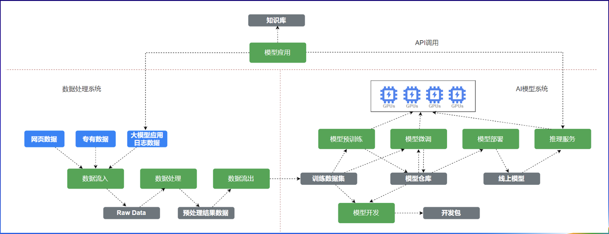

# 贝壳找房：OceanBase 在 AI 存储底座上的实践

作者简介：王天庆，贝壳计算存储方向容器引擎团队负责人，目前工作聚焦于云原生和AI基础设施的架构设计和建设实施，为公司提供高效可靠的基础设施并帮助大模型在企业内部快速落地。

> 导语：从AI大模型爆火到成为技术领域新的应用方向，许多企业将AI列入战略规划。贝壳找房作为国内领先的居住产业数字化服务平台，也加大了对AI技术设施的投入。而其底层的数据库产品选用蚂蚁集团自主研发的单机分布式一体化数据库OceanBase，那么，数据库在AI基础设施建设过程中能起到什么样的核心作用？本文通过分享贝壳找房在AI存储底座的实践，展开这一话题的讨论。

## 贝壳找房AI基础设施建设背景

贝壳找房是中国最大的居住服务平台，业务包括二手房交易、新房交易、租赁、家装、家居、家服等，作为居住产业数字化服务平台，贝壳是最早将VR、AI等新技术应用于居住服务的企业，其致力于推进居住服务的产业数字化、智能化进程。

自AI大模型爆火后，贝壳找房很快加大了对AI的投入。目前我们团队有三大模块致力于AI的发展：一是机器学习平台，帮助算法工程师做模型训练和模型推理；二是在机器学习平台下层有两套内部的基础设施提供高性能存储服务；三是内部的云原生基础设施。

在AI基础设施建设的过程中，由于数据的快速增长和对算力的不断调整，存储架构不断演化，在各阶段面临不同的挑战。

## 分层存储架构演化

贝壳找房AI基础设施建设始于几年前，受AI技术发展态势迅速变化的影响，至今已历经四个阶段的演化。

在非大模型时代，算法工程师训练模型特别简单，只需要一台GPU和一块硬盘，即单机单卡。训练模型逐渐变大，超出了一台机器能够承载的范围。随即便出现了多机多卡的场景，其本质上不会脱离机房，但该场景下无法再使用一块磁盘解决问题，需要网络共享存储。彼时，常用的共享存储开源方案是基于NFS。

2023年大模型的出现促使模型训练对GPU算力需求及资源使用方式发生巨大变化，我们也从多机多卡单机房结构变成平台化的交付方式，完全云原生化。底层也使用统一文件系统存储成百上千亿级别的小文件，并统一数据中心。

随着算力资源因供不应求导致的稀缺，我们不得不将现有算力资源调整为多地区、多机房、多集群的应用架构。我们的算力部署在北京、天津、上海等地，同时GPU算力的形式越来越多样，算力供给还存在多云、多Region的场景，给数据集和模型管理带来了更多的挑战。

从大体层面来看，存储底座的挑战可以归纳为两类。一类是模型训练的性能瓶颈，随着AI模型的参数量越来越大，要求CPU处理数据的速度极快，要求存储底座具备高并发、高吞吐的能力。另一类是跨地域的数据管理。数据集对于大模型工程体系来说，贯穿了整个生命周期。在传统场景中，不同的场景都存在独立的存储介质来满足业务场景，但在大模型的迭代过程中，数据的流转对存储方案带来了巨大的技术挑战。

数据流转周期牵涉整个贝壳找房AI工程，从用户端的数据采集到数据处理，再到转化成数据集，最后流转到GPU支撑模型训练。该流程最理想的形式是以文件系统的形式挂载，举个例子，用户将数据流入时，挂载在一块网络盘中，以便进行数据处理、数据集流入CPU等操作。这样一来，在一块网络盘完成数据的闭环能够极大地提升AI工程的效率。

## 分层存储技术选型

分层存储架构分为存储架构和存储底座。我们选择了开源的Fluid作为存储架构，其具备云原生的数据编排能力。

底层的文件存储选用开源分布式文件系统JuiceFS，如下图所示，这是贝壳找房最终的分层存储架构。

第一层也就是最底层的训练任务多模态是接入层，接入形式包括云原生、混合云、跨云，以及文件系统，都能够以多协议的形式接入。
第二层是数据编排层，解决跨地域的数据流转，因为数据可能在京津区域产生，在上海消费，所以需要把数据传输到算力最近的地方，这就要用到数据编排的能力。
第三层即最上层是真正的数据处理中心，基于JuiceFS。JuiceFS依赖元数据和对象存储，需要我们配置一个高效的元数据引擎，以及自研的高性能对象存储，做数据持有化。
然而，元数据引擎的技术选型是非常艰难的，如果基于高性能的Redis，存在数据丢失的风险，可能是文件系统的灾难，我们无法容忍。如果是全靠自研，周期和成本非常高，解决跨地域的元数据同步问题，对我们团队甚至整个公司来说都意味着过高的成本。综合考虑下，我们确定首要需求是稳定且不丢数据，其次是承载我们数据流转、跨地域的需求。

## 将OceanBase作为AI基础设施存储底座

在调研了目前市面上的大数据、数据库等存储系统后，我们最终选择将OceanBase作为元数据引擎的技术方案和存储底座。主要原因如下：
1. 对于整个数据流转系统而言，OceanBase可以提供高可用和容灾能力，解决数据流转中跨地域数据同步的问题。\
   * OceanBase的每个数据分片都有多个副本，分布在不同的物理节点上，当某个节点出现故障时，系统可以自动切换到其他副本，保证服务的连续性。\
   * 通过配置数据副本的存储位置，可实现机架级、机房级、城市级容灾，帮助金融机构应对容灾挑战。
2. 我们有很多机房，算力分散在不同区域，我们需要把数据充分地利用起来，就需要元数据能够在各区域飘来飘去，在离算力最近的地方读到元数据可以保证文件系统的读取效率。OceanBase的多活能力可以解决这个问题。
3. 我们是云原生和AI基础设施建设的团队，不太擅长数据库运维，上文也提到数据流转涉及整个企业的多个业务模块，因此我们需要存储底座具备资源隔离能力和较高的可运维、可管理能力。OceanBase提供了强大的运维管理平台OCP对数据库进行7*24小时监控，安全可靠。
4. OceanBase的原生多租户架构和租户级资源隔离能力，可以满足我们的需求。同时，其性能均衡，能支持百亿到千亿量级数据。

举个例子，下图是京津区算力中心和上海区算力中心的元数据传输的架构解决方案。可以看到整体的算力资源分为IDC和公有云，且拥有多家公有云供应商。我们在IDC内尤其是同区的机房内，使用OceanBase多zone的能力，通过OBProxy分别转化到不同的副本中。针对跨云甚至跨区的场景，以腾讯云为例，我们巧妙借助了腾讯云MySQL的能力，当 IDC的数据飘在上海时，先把数据基于OMS同步到京津区腾讯云的数据库，再通过云上的DTS工具同步到上海区的数据库，由上海区的数据库提供元数据的处理能力。

为什么出现这么复杂的架构，而非利用OceanBase在上海区整体做同步？

这是出于物理限制，我们测试过一些场景，如果让OceanBase在上海区同步数据，受限于云联网和带宽会出现极高的同步延迟。而目前的方案可以保证最低的数据延迟，我们只需解决数据流转在2w TPS时从京津区写入上海区在秒级内完成，这个速度在整体数据生产过程中可以满足大部分业务场景需求。另外，IDC和其他算力中心基本都在OceanBase的多zone管理模式下，数据流转速度更快。
在文件系统侧，因为此前把JuiceFS作为元数据引擎，导致文件系统性能衰减，所以采用单线程的形式。下图是文件数2000万左右时JuiceFS在单机单客户端进程下的性能表现，可以看到明显抖动。

换成OceanBase后，整个响应时间可以控制在1ms~2ms间，只有在大量小文件场景会出现抖动，耗时在2ms~10ms间。

针对这个现象，我们做了第二个技术架构升级。贝壳找房内部自研了一套对象存储服务，其原本是为JuiceFS做底层数据加速的。由于数据跨区读取非常慢，但很难避免像数据在京津区，从上海区读取的需求，因此，我们期望能够做一个跨地域甚至跨云的对象存储服务，以满足文件系统间数据读取速度快的诉求。
贝壳内部自研的对象存储服务不是一个真正地做持久化的服务，而是代理层，因为数据都在腾讯云上，对象存储系统只解决一个问题——加速。对象存储系统的部署形式是在京津区和上海区部署我们KOS服务，通过跨区复制能力，保证上海区、京津区之间KOS文件复制的实时同步。

对象存储本身是有元数据的，如果只加速数据库而不加速元数据，那么这样的加速毫无意义，尤其在文件系统出现大量的list的情况，性能仍会严重衰减。因此，我们使用OceanBase作为元数据的底座，以推动整个对象存储服务加速。如下图所示，对象存储系统分三个组件，

* KOS-Proxy 协议代理层：主要用于实现S3接口协议，该组件是完全无状态服务，元数据主要从KOS控制面中获取。
* KOS-Cache 数据缓存层：主要功能是从底层真实的对象存储中缓存数据到本地磁盘中，并且可以分布式部署形成缓存集群来提高对象存储的吞吐能力。
* KOS-Meta元数据层：主要对对象存储服务提供元数据能力，以OceanBase为底层元数据引擎，提供就近获取到对象存储元数据信息的能力。

在这个流程中，对于文件的读取，会优先判断文件是否启用了数据缓存，如果存在缓存的话会优先从缓存节点KOS-Cache读取数据，否则降级到远端的对象存储读取。为了保证数据一致性，所有归属于同一组的缓存节点都会以哈希环的形式分布好，每个cache服务通过etcd对外分享自己在环中持有的Token信息和位置信息。数据的读写都会通过一致性hash算法写入到指定节点，保证数据的一致性。最终元数据加速的原理是通过S3协议在对象存储文件生命周期过程中，生成文件对应的元信息并写入OceanBase中，同时OceanBase做好多AZ和多地域的同步支持，此时就可以通过OceanBase实现支持海量数据的对象存储服务。

拥有对象存储能力后，我们访问云上的对象存储都会转化为本地机房访问的对象存储，实现了加速。访问文件系统时非常高效。下图展示了本地访问与云上访问的性能对比数据。

从图中可见，对于大量小文件加速效果比较明显，强依赖OceanBase提供的强大性能。在跨机房场景下，性能提升比较明显，有效提升读场景下的吞吐上限。不过，该方案对于对象存储的写场景提升效果不明显。

对象存储服务优化后，我们考虑怎么把JuiceFS用起来。在用户侧，数据要先在京津区计算后再拷贝到上海区，然后从上海区拉取数据进行训练。这个流程中要么存在带宽小、专线贵的问题，要么会遇到部分小文件场景难以优化吞吐导致延迟较高的问题。

一种优化思路是做镜像文件系统。首先用户在京津区创建一个普通卷，该卷的自动接入会连接到京津区的元数据引擎和对象存储服务。然后用户在上海区创建一个京津区卷的镜像卷，用户使用该卷的时候，自动接入会自动识别并接入到上海区的元数据引擎和对象存储服务。该思路减少了数据流转的时间，从传统的数据生产到数据清洗、数据复制、训练，到优化为数据生产、进行数据清洗、再训练，可以降低数据复制的时间成本。数据量较小时可秒级完成。对于不需要所有的数据都多地区多写的情况，还可以通过镜像文件系统的能力，进行跨地区预热，将数据同步到其他地区，JuiceFS的文件块大小对于公有云对象存储的数据同步比较友好，同步效率会更高。进而还能帮助省钱，因为在AI领域有一个共识——CPU很贵，闲着就是烧钱，所以一定要保证数据同步效率跟得上算力的速度。

## OceanBase应用场景探索

除了将OceanBase作为AI基础设施的存储底座外，我们在其他的场景中，也对OceanBase的应用进行了探索。

### 场景一：可观测运维

在维护数千台服务器和KOS集群时，我们面临的最大挑战是观测性。传统的客观测运维系统，如日志采集、Prometheus等，对运维人员而言是一种困扰，因为每天都会收到成百上千条报警，关键在于报警准确率极低，而且很多报警内容无关紧要，不去处理也没问题。所以我们基于云原生标准，结合OceanBase的能力搭建了一套可观测的运维系统。

这套系统的核心是将数据经过过滤、分组、提取、转化及路由，汇聚到廉价的存储系统中，经过清洗数据和指标流入OceanBase以定位异常。以域名类场景为例，当出现报警时，我们会面临额外的风险，比如外部攻击、爬虫等，我们需要尽快排查风险的IP来源，以及每一个IP的增长趋势。OceanBase的OLAP能力能够帮助我们快速定位异常，增加报警解决的效率。

### 场景二：探索OBKV作为元数据引擎

最后简单分享一下，也算是贝壳后续对OB的探索，这个比较简单，因为这个也是最近开始尝试，基于OBKV在文件系统层面的尝试，我们内部现在只是做了第一版的基于OBKV的数据引擎的实践，整体从引擎切到OBKV上，因为我们的文件系统本质并不需要整个解析过程，我们表结构特别简单，文件系统的表结构特别简单，文件元数据不是很复杂，所以我们对于文件整个性能要求反而更高，对于KV形式，对我们最友好，所以我们做了一些尝试和探索。

近期我们针对该探索进行压测发现整体效果非常理想，OBKV 场景下，百万级的文件读写的响应时间提升2~4倍，原来的2~10ms变为1ms甚至更低，偶尔在抖动情况下也会稳定在5ms左右。OBKV少一层SQL解析，理论性能更高。另外，由于OceanBase具备多模KV能力，支持HBase和Redis协议，且拥有丰富的工具体系，我们可以直接复用OceanBase的运维能力。

以上就是贝壳找房AI方向对OceanBase的应用与经验，后续我们将持续探索OceanBase的其他能力，欢迎留言交流。
