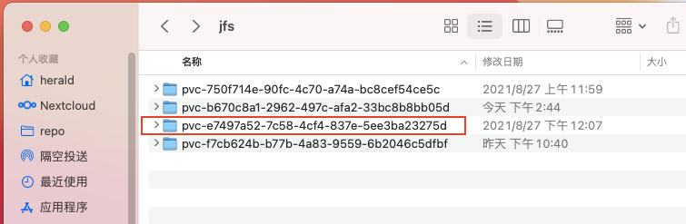

# Kubernetes 使用 JuiceFS 持久化数据

JuiceFS 非常适合用作 Kubernetes 集群的存储层，目前有两种常见的用法。

## JuiceFS CSI Driver

[JuiceFS CSI Driver](https://github.com/juicedata/juicefs-csi-driver) 遵循 [CSI](https://github.com/container-storage-interface/spec/blob/master/spec.md) 规范，实现了容器编排系统与 JuiceFS 文件系统之间的接口，支持动态配置 JuiceFS 卷提供给 Pod 使用。

### 版本要求

- Kubernetes 1.14+

### 安装

JuiceFS CSI Driver 有以下两种安装的方式。

#### 通过 Helm 安装

Helm 是 Kubernetes 的包管理器，Chart 是 Helm 管理的包。你可以把它看作是 Homebrew formula，APT dpkg，或 YUM RPM 在 Kubernetes 中的等价物。

该安装方式要求 Helm **3.1.0** 及以上版本，具体安装方法请参考[「Helm 安装指南」](https://github.com/helm/helm#install)。

1. 准备一个设置存储类基本信息的配置文件，例如：`values.yaml`，复制并完善下列配置信息。其中，`backend` 部分是 JuiceFS 文件系统相关的信息，你可以参照 [JuiceFS 快速上手指南](../getting-started/for_local.md)了解相关内容。如果使用的是已经提前创建好的 JuiceFS 卷，则只需填写 `name` 和 `metaurl` 这两项即可。`mountPod` 部分可以对使用此驱动的 Pod 设置 CPU 和内存的资源配置。不需要的项可以删除，或者将它的值留空。

```yaml
storageClasses:
- name: juicefs-sc
  enabled: true
  reclaimPolicy: Retain
  backend:
    name: "test"
    metaurl: "redis://juicefs.afyq4z.0001.use1.cache.amazonaws.com/3"
    storage: "s3"
    accessKey: ""
    secretKey: ""
    bucket: "https://juicefs-test.s3.us-east-1.amazonaws.com"
  mountPod:
    resources:
      limits:
        cpu: "<cpu-limit>"
        memory: "<memory-limit>"
      requests:
        cpu: "<cpu-request>"
        memory: "<memory-request>"
```

在支持「角色管理」的云平台，可以通过为 Kubernetes 节点分配「服务角色」，实现对象存储 API 免密钥访问。这种情况下无需设置配置文件中的 `accessKey` 和 `secretKey`。

2. 依次执行以下三条命令，通过 Helm 部署 JuiceFS CSI Driver。

```shell
$ helm repo add juicefs-csi-driver https://juicedata.github.io/juicefs-csi-driver/
$ helm repo update
$ helm install juicefs-csi-driver juicefs-csi-driver/juicefs-csi-driver -n kube-system -f ./values.yaml
```

3. 检查部署状态

- **检查 Pods**：部署过程会启动一个名为 `juicefs-csi-controller` 的 `StatefulSet` 及一个 replica，以及一个名为 `juicefs-csi-node` 的 `DaemonSet`。执行命令 `kubectl -n kube-system get pods -l app.kubernetes.io/name=juicefs-csi-driver` 会看到有 `n+1` 个 pod 在运行，例如：

```sh
$ kubectl -n kube-system get pods -l app.kubernetes.io/name=juicefs-csi-driver
NAME                       READY   STATUS    RESTARTS   AGE
juicefs-csi-controller-0   3/3     Running   0          22m
juicefs-csi-node-v9tzb     3/3     Running   0          14m
```

- **检查 secret**：通过命令 `kubectl -n kube-system describe secret juicefs-sc-secret` 可以看到前面 `values.yaml` 配置文件中 `backend` 部分的 secret 信息。

```sh
$ kubectl -n kube-system describe secret juicefs-sc-secret
Name:         juicefs-sc-secret
Namespace:    kube-system
Labels:       app.kubernetes.io/instance=juicefs-csi-driver
              app.kubernetes.io/managed-by=Helm
              app.kubernetes.io/name=juicefs-csi-driver
              app.kubernetes.io/version=0.7.0
              helm.sh/chart=juicefs-csi-driver-0.1.0
Annotations:  meta.helm.sh/release-name: juicefs-csi-driver
              meta.helm.sh/release-namespace: default

Type:  Opaque

Data
====
access-key:  0 bytes
bucket:      47 bytes
metaurl:     54 bytes
name:        4 bytes
secret-key:  0 bytes
storage:     2 bytes
```

- **检查存储类（storage class）**：`kubectl get sc juicefs-sc` 命令将会显示类如下面的存储类：

```sh
$ kubectl get sc juicefs-sc
NAME         PROVISIONER       RECLAIMPOLICY   VOLUMEBINDINGMODE   ALLOWVOLUMEEXPANSION   AGE
juicefs-sc   csi.juicefs.com   Retain          Immediate           false                  69m
```

#### 通过 kubectl 安装

由于 Kubernetes 在版本变更过程中会废弃部分旧的 API，因此需要根据你使用 Kubernetes 版本选择适用的部署文件：

**Kubernetes v1.18 及以上版本**

```shell
$ kubectl apply -f https://raw.githubusercontent.com/juicedata/juicefs-csi-driver/master/deploy/k8s.yaml
```

**Kubernetes v1.18 以下版本**

```shell
$ kubectl apply -f https://raw.githubusercontent.com/juicedata/juicefs-csi-driver/master/deploy/k8s_before_v1_18.yaml
```

**创建存储类**

参考以下内容创建一个配置文件，例如：`juicefs-sc.yaml`，在 `stringData` 部分填写 JuiceFS 文件系统的配置信息：

```yaml
apiVersion: v1
kind: Secret
metadata:
  name: juicefs-sc-secret
  namespace: kube-system
type: Opaque
stringData:
  name: "test"
  metaurl: "redis://juicefs.afyq4z.0001.use1.cache.amazonaws.com/3"
  storage: "s3"
  bucket: "https://juicefs-test.s3.us-east-1.amazonaws.com"
  access-key: ""
  secret-key: ""
---
apiVersion: storage.k8s.io/v1
kind: StorageClass
metadata:
  name: juicefs-sc
provisioner: csi.juicefs.com
reclaimPolicy: Retain
volumeBindingMode: Immediate
parameters:
  csi.storage.k8s.io/node-publish-secret-name: juicefs-sc-secret
  csi.storage.k8s.io/node-publish-secret-namespace: kube-system
  csi.storage.k8s.io/provisioner-secret-name: juicefs-sc-secret
  csi.storage.k8s.io/provisioner-secret-namespace: kube-system
```

执行命令，部署存储类：

```shell
$ kubectl apply -f ./juicefs-sc.yaml
```

另外，你也可以将上述配置文件中 Secret 部分抽离出来，通过 `kubectl` 在命令行上创建：

```shell
$ kubectl -n kube-system create secret generic juicefs-sc-secret \
  --from-literal=name=test \
  --from-literal=metaurl=redis://juicefs.afyq4z.0001.use1.cache.amazonaws.com/3 \
  --from-literal=storage=s3 \
  --from-literal=bucket=https://juicefs-test.s3.us-east-1.amazonaws.com \
  --from-literal=access-key="" \
  --from-literal=secret-key=""
```

这样一来，存储类的配置文件 `juicefs-sc.yaml` 应该像下面这样：

```yaml
apiVersion: storage.k8s.io/v1
kind: StorageClass
metadata:
  name: juicefs-sc
provisioner: csi.juicefs.com
reclaimPolicy: Retain
parameters:
  csi.storage.k8s.io/node-publish-secret-name: juicefs-sc-secret
  csi.storage.k8s.io/node-publish-secret-namespace: kube-system
  csi.storage.k8s.io/provisioner-secret-name: juicefs-sc-secret
  csi.storage.k8s.io/provisioner-secret-namespace: kube-system
```

然后通过 `kubectl apply` 部署存储类：

```shell
$ kubectl apply -f ./juicefs-sc.yaml
```

### 使用 JuiceFS 为 Pod 提供存储

JuiceFS CSI Driver 同时支持静态和动态 PV，你既可以将提前创建的 PV 手动分配给 Pods，也可以在部署 Pods 时通过 PVC 动态的创建卷。

例如，可以使用下面的配置创建一个名为 `development.yaml` 的配置文件，它通过 PVC 为 Nginx 容器创建持久化卷，并挂载到了容器的 `/config` 目录：

```yaml
apiVersion: v1
kind: PersistentVolumeClaim
metadata:
  name: web-pvc
spec:
  accessModes:
    - ReadWriteMany
  resources:
    requests:
      storage: 10Pi
  storageClassName: juicefs-sc
---
apiVersion: apps/v1
kind: Deployment
metadata:
  name: nginx-run
spec:
  selector:
    matchLabels:
      app: nginx
  template:
    metadata:
      labels:
        app: nginx
    spec:
      containers:
        - name: nginx
          image: linuxserver/nginx
          ports:
            - containerPort: 80
          volumeMounts:
            - mountPath: /config
              name: web-data
      volumes:
        - name: web-data
          persistentVolumeClaim:
            claimName: web-pvc
```

通过 `kubectl apply` 部署 Pods：

```
$ kubectl apply -f ./development.yaml
```

部署成功以后，查看 pods 状态：

```shell
$ kubectl get pods
NAME                         READY   STATUS    RESTARTS   AGE
nginx-run-7d6fb7d6df-cfsvp   1/1     Running   0          21m
```

我们可以简单的通过 `kubectl exec` 命令查看容器中的文件系统挂载情况：

```shell
$ kubectl exec nginx-run-7d6fb7d6df-cfsvp -- df -Th
Filesystem     Type          Size  Used Avail Use% Mounted on
overlay        overlay        40G  7.0G   34G  18% /
tmpfs          tmpfs          64M     0   64M   0% /dev
tmpfs          tmpfs         3.8G     0  3.8G   0% /sys/fs/cgroup
JuiceFS:jfs    fuse.juicefs  1.0P  180M  1.0P   1% /config
...
```

从容器中返回的结果可以看到，完全符合预期，JuiceFS 卷已经挂载到了我们指定的 `/config` 目录。

像上面这样通过 PVC 动态创建 PV 时，JuiceFS 会在文件系统根目录创建与 PV 同名的目录并挂载到容器中。执行下列命令，可以查看集群中所有 PV：

```shell
$ kubectl get pv -A
NAME                                       CAPACITY   ACCESS MODES   RECLAIM POLICY   STATUS   CLAIM             STORAGECLASS   REASON   AGE
pvc-b670c8a1-2962-497c-afa2-33bc8b8bb05d   10Pi       RWX            Retain           Bound    default/web-pvc   juicefs-sc              34m
```

通过外部主机挂载同一个 JuiceFS 存储，可以看到当前正在使用的 PV 以及曾经创建的 PV。



如果想了解更多关于 JuiceFS CSI Driver 的信息，请参考[项目主页](https://github.com/juicedata/juicefs-csi-driver)。

### 创建更多 JuiceFS 存储类

你可以根据实际需要重复前面的步骤，通过 JuiceFS CSI Driver 创建任意数量的存储类。但要注意修改存储类的名称以及 JuiceFS 文件系统的配置信息，避免与已创建的存储类冲突。例如，使用 Helm 时可以创建一个名为 `jfs2.yaml` 的配置文件：

```yaml
storageClasses:
- name: jfs-sc2
  enabled: true
  reclaimPolicy: Retain
  backend:
    name: "jfs-2"
    metaurl: "redis://example.abc.0001.use1.cache.amazonaws.com/3"
    storage: "s3"
    accessKey: ""
    secretKey: ""
    bucket: "https://jfs2.s3.us-east-1.amazonaws.com"
```

执行 Helm 命令进行部署：

```shell
$ helm repo add juicefs-csi-driver https://juicedata.github.io/juicefs-csi-driver/
$ helm repo update
$ helm upgrade juicefs-csi-driver juicefs-csi-driver/juicefs-csi-driver --install -f ./jfs2.yaml
```

查看集群中存储类的情况：

```shell
$ kubectl get sc
NAME                 PROVISIONER                RECLAIMPOLICY   VOLUMEBINDINGMODE   ALLOWVOLUMEEXPANSION   AGE
juicefs-sc           csi.juicefs.com            Retain          Immediate           false                  88m
juicefs-sc2          csi.juicefs.com            Retain          Immediate           false                  13m
standard (default)   k8s.io/minikube-hostpath   Delete          Immediate           false                  128m
```

### 监控

请查看[「监控」](../administration/monitoring.md)文档了解如何收集及展示 JuiceFS 监控指标

## 在容器中挂载 JuiceFS

某些情况下，你可能需要在容器中直接挂载 JuiceFS 存储，这需要在容器中使用 JuiceFS 客户端，你可以参考以下 `Dockerfile` 样本将 JuiceFS 客户端集成到应用镜像：

```dockerfile
FROM alpine:latest
LABEL maintainer="Juicedata <https://juicefs.com>"

# Install JuiceFS client
RUN apk add --no-cache curl && \
  JFS_LATEST_TAG=$(curl -s https://api.github.com/repos/juicedata/juicefs/releases/latest | grep 'tag_name' | cut -d '"' -f 4 | tr -d 'v') && \
  wget "https://github.com/juicedata/juicefs/releases/download/v${JFS_LATEST_TAG}/juicefs-${JFS_LATEST_TAG}-linux-amd64.tar.gz" && \
  tar -zxf "juicefs-${JFS_LATEST_TAG}-linux-amd64.tar.gz" && \
  install juicefs /usr/bin && \
  rm juicefs "juicefs-${JFS_LATEST_TAG}-linux-amd64.tar.gz" && \
  rm -rf /var/cache/apk/* && \
  apk del curl

ENTRYPOINT ["/usr/bin/juicefs", "mount"]
```

由于 JuiceFS 需要使用 FUSE 设备挂载文件系统，因此在创建 Pod 时需要允许容器在特权模式下运行：

```yaml
apiVersion: apps/v1
kind: Deployment
metadata:
  name: nginx-run
spec:
  selector:
    matchLabels:
      app: nginx
  template:
    metadata:
      labels:
        app: nginx
    spec:
      containers:
        - name: nginx
          image: linuxserver/nginx
          ports:
            - containerPort: 80
          securityContext:
            privileged: true
```

> ⚠️ **风险提示**：容器启用 `privileged: true` 特权模式以后，就具备了访问宿主机所有设备的权限，即拥有了对宿主机内核的完全控制权限。使用不当会带来严重的安全隐患，请您在使用此方式之前进行充分的安全评估。
